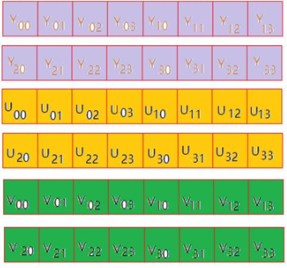

# 1. 图像基础概念

* 像素 : 像素是一个图片的基本单位 , pix是英语单词picture的简写 , 加上英语单词 “元素element” ,  就得到了 “pixel”， 简称px , 所以“像素”有“图像元素”之意。
* 分辨率 : 是指图像的大小或尺寸。 比如 1920x1080。
* 位深 : 是指在记录数字图像的颜色时 , 计算机实际上是用每个像素需要的位深来表示的。 比如红色分量用8bit。
* 帧率 : 在1秒钟时间里传输的图片的帧数 , 也可以理解为图形处理器每秒钟能够刷新几次。 比如25fps表示一秒有25张片
* 码率 : 视频文件在单位时间内使用的数据流量。 比如1Mbps。
* Stride : 指在内存中每行像素所占的空间。 为了实现内存对齐每行像素在内存中所占的空间 **$\color{red}{并不一定}$** 是图像的宽度。

## 1.1 像素

**$\color{red}{像素是一个图片的基本单位}$** , pix是英语单词picture的简写 , 加上英语单词“元素element” , 就得到了“pixel” , 简称 px , 所以“像素”有“图像元素”之意。

例如 2500×2000 的照片就是指横向有 2500 个像素点 , 竖向有2000个像素点 , 总共是500万个像素 , 也俗称500万像素照片。

  

## 1.2 分辨率

图像（或视频）的分辨率是指图像的大小或尺寸 , 我们通常用像素表示图像的尺寸。

例如2500×2000的照片就是指横向(宽)有2500个像素点，竖向(高)有2000个像素点。
常见的分辨率：360P(640x360)、 720P(1280x720)、 1080P(1920x1080)、 4K(3840x2160)、 8K(7680x4320)

### 1.2.1 不同分辨率之间的区别

常说的 1080 和 720 其实是指 **$\color{red}{垂直像素数}$** , 分辨率除去垂直像素 , 还需要考虑到 **$\color{red}{水平像素数}$** 。

按照 16:9 (宽 : 高) 的比例计算，720p 的水平像素数为 720 ÷ 9 × 16 = 1280 , 总计像素为921600像素即大约为 92 万像素。 

1080p  具有 1080 ÷ 9 × 16  = 1920 个水平像素，总计2073600像素即约 200 万像素 , 是 720p 的两倍多。

像素越多视频就越清晰 , 所以 1080p 比 720p 的视频更加清晰。

**$\color{red}{图像的分辨率越高 , 图像就越清晰}$**

 

## 1.3 位深

我们看到的彩色图片 , 都有三个通道 , 分别为 红(R)、 绿(G)、蓝(B) 通道 (如果需要透明度则还有alpha分量)

通常每个通道用 8bit 表示, 8bit 能表示 256 种颜色 , 所以可以组成256 * 256 * 256 = 16,777,216 = 1677万种颜色 , **$\color{red}{这里的8bit就是我们讲的位深}$** 。

**$\color{red}{每个通道的位深越大，能够表示的颜色值就越大}$** ，比如现在高端电视说的10bit色彩，即是每个通道用10bit表示，每个通道有1024种颜色。 1024 * 1024 * 1024 约为 10,7374万色 = 10亿色 , 是8bit的64倍 , 常见的颜色还是8bit居多。

 

## 1.4 帧率

帧率即 FPS（每秒有多少帧画面），经常玩游戏的同学应该会对这个词很熟悉。我们玩游
戏时， FPS 帧率越高就代表游戏画面越流畅，越低则越卡顿。视频也是如此。

由于视觉图像在视网膜的暂时停留，一般图像帧率能达到24帧，我们就认为图像是连续动态的。

* 电影帧率一般是 24fps (帧每秒)
* 电视剧一般是 25fps;
* 监控行业常用 25fps;
* 音视频通话常用15fps;

**$\color{red}{帧率越高 , 画面越流畅 , 需要的设备性能也越高}$** 

## 1.5 码率

* 视频文件在单位时间内使用的数据流量。比如 1Mbps。
* 大多数情况下码率越高 分辨率越高 , 也就越清晰。但模糊的视频文件大小 (码率) 也可以很大 , 分辨率小的视频文件可能也比分辨率大的视频文件清晰。
* 对于同一个原始图像源的时候 , 同样的编码算法 , 则码率越高 , 图像的失真就会越小 , 视频画面就会越清晰

## 1.6 Stride跨距

* Stride : 指在内存中每行像素所占的空间。为了实现内存对齐每行像素在内存中所占的空间并不一定是图像的宽度。
* Stride 就是这些扩展内容的名称， Stride 也被称作 Pitch，如果图像的每一行像素末尾拥
  有扩展内容， Stride 的值一定大于图像的宽度值，就像下图所示：
  * 比如分辨率 638x480 的 RGB24 图像 , 我们在内存处理的时候如果要以16字节对齐 , 则 63 * 3 / 16 = 119.625不能整除 , 因此不能16字节对齐 , 我们需要在每行尾部填充6个字节。就是 (638+2->640) , 640 * 3 / 16 = 120。此时该图片的stride为1920字节。

 

# 2. RGB / YUV深入讲解

RGB :  红R 、绿G、 蓝B 三基色。
YUV :  “Y”表示明亮度 Luminance或Luma 也就是灰阶值 , "U" 和 "V" 表示的则是色度 (Chrominance或Chroma) 

## 2.1 RGB

我们前面已经讲过RGB色彩表示 , 这里我们重点讲RGB的排列。 通常的图像像素是按RGB顺序进行排列 , 但有些图像处理要转成其他顺序 , 比如OpenCV经常转成BGR的排列方式。

  

 

 

## 2.2 YUV

* 与我们熟知 RGB 类似 , YUV也是一种颜色编码方法 , 它是指将 **$\color{red}{亮度}$** 参量 (Y : Luminance或Luma ) 和 **$\color{red}{色度参量}$** (UV : Chrominance或Chroma) 分开进行表示的像素编码格式。
* 这样分开的好处就是不但可以避免相互干扰 , 没有UV信息一样可以显示完整的图像 , 因而解决了 **$\color{red}{彩色电视与黑白电视的兼容问题}$** ；还可以降低色度的采样率而不会对图像质量影响太大 , 降低了视屏信号传输时对频宽 (带宽) 的要求。
* Y Y共用一组UV分量

 

* YUV是一个比较笼统地说法 , 针对它的具体排列方式 , 可以分为很多种具体的格式 : 
  * 打包 (packed) 格式 : **$\color{red}{将每个像素点的 Y、 U、 V 分量交叉排列}$** 并以像素点为单元连续的存放在同一数组中 , 通常几个相邻的像素组成一个 **宏像素 (macro-pixel)**
  * 平面 (planar) 格式 : **$\color{red}{使用三个数组分开连续的存放Y、 U、 V三个分量}$** , 即 Y、 U、 V分别存放在各自的数组中。

1. YUV444 packed格式  

 

2. YUV444 planar格式

 

### 2.2.1 YUV采样表示法

YUV采用A : B : C表示法来描述 **$\color{red}{Y,U,V采样频率比例}$** , 下图中黑点表示采样像素点Y分量 , **$\color{red}{空心圆表示采样像素点的UV分量}$** 。 主要分为 YUV 4 : 4 : 4、 YUV 4 : 2 : 2、 YUV 4 : 2 : 0 这几种常用的类型

 

* 4 : 4 : 4 表示色度频道没有下采样 , 即 **$\color{red}{一个Y分量对应着一个U分量和一个V分量}$**
* 4 : 2 : 2 表示 2 : 1 的水平下采样 , 没有垂直下采样 , 即 **$\color{red}{每两个Y分量共用一个U分量和一个V分量}$**
* 4 : 2 : 0 表示 2 : 1 的水平下采样 , 2 : 1 的垂直下采样 , 即 **$\color{red}{每四个Y分量共用一个U分量和一个V分量}$**

### 2.2.2 YUV数据存储

下面以每个分量数据存储在一个char（或byte） 中为例描述YUV的数据存储方式。

* 4 : 4 : 4 格式
* 4 : 2 : 2 格式
* 4 : 2 : 0 格式

#### 2.2.2.1 YUV数据存储 - 4 : 4 : 4 格式 - `YUV444P`

* 比如 I444(YUV444P)格式 , 对应 FFmpeg 像素表示 `AV_PIX_FMT_YUV444P` 
  * ///< planar YUV4:4:4, 24bpp, (1 Cr & Cb sample per 1 x 1 Y samples)

 

> I444(YUV444P)格式

#### 2.2.2.2 YUV数据存储 - 4 : 2 : 2 格式 - `YUV422P`

* 对应Ffmpeg像素表示 `AV_PIX_FMT_YUV422P` 
  * ///< planar YUV 4:2:2, 16bpp, (1 Cr& Cb sample per 2 x 1 Y samples)
* 该类型为planar格式

 

> I422(YUV422P)格式

#### 2.2.2.3 YUV数据存储 - 4 : 2 : 0 格式- `YUV420P`

* 对应FFmpeg像素表示 `AV_PIX_FMT_YUV420P` 
  * /// < planar YUV 4:2:0, 12bpp, (1 Cr& Cb sample per 2 x 2 Y samples)
* 该类型为 planar 格式
* ( 4bytes + 1byte + 1byte ) / 4 = 1.5byte ( Y占4个字节 + U占1个字节 + V占1个字节) / 4个像素 = 1.5byte一个像素
  * (4bytes * 8bit  + 1byte * 8bit + 1byte * 8bit) / 4个像素 = 12bit

 

> I420(YUV420P)格式 

#### 2.2.2.4 YUV数据存储 - 4 : 2 : 0 格式- `NV12`

* 对应FFmpeg像素表示 `AV_PIX_FMT_NV12` 
  * /// < planar YUV 4:2:0, 12bpp, 1 plane for Y and 1 plane for the UV components, which are interleaved (first byte U and the following byte V)

  

> I420 (YUV420P) 格式  				NV12 (YUV420SP) 格式

#### 2.2.2.5 YUV数据存储 - 4 : 2 : 0 格式 - 参考

 

  

* YUV420p : 
  * YV12 : YYYYYYYY VV UU
  * I420 : YYYYYYYY UU VV
* YUV420sp : 
  * NV12 : YYYYYYYY UV UV
  * NV21 : YYYYYYYY VU VU

# 3. RGB 和 YUV的转换

* 通常情况下RGB和YUV直接的相互转换都是调用接口实现 , 比如Ffmpeg的swscale或者libyuv等库。
* 主要转换标准是 BT601 和 BT709。
* 8bit位深的情况下
  * TV range是16-235(Y)、 16-240(UV) , 也叫Limited Range
  * PC range是0-255，也叫Full Range
  * 而RGB没有range之分，全是0-255

* BT601 TV Range转换公式

   

* 从YUV 转到 RGB 如果值小于0要取0 , 如果大于255要取255

## 3.1 RGB 和 YUV的转换 - 为什么解码出错

因为解码失败时YUV分量都填为0值 , 然后根据公式 : 
R = 1.402 * (-128) = -126.598
G = -0.34414 * (-128) - 0.71414 * (-128) = 44.04992 + 91.40992 = 135.45984
B = 1.772 * (-128) = -126.228
RGB 值范围为[0， 255]， 所以最终的值为：
R = 0
G = 135.45984
B = 0
此时只有G分量有值所以为绿色。
YUV -> RGB

# 4. YUV Stride对齐问题

比如分辨率 638 x 480 的 YUV420P 图像 , 我们在内存处理的时候如果要以16字节对齐 , 则638不能被16整除 , 我们需要在每行尾部填充2个字节。就是640。此时该图片的Y stride为640字节。

 