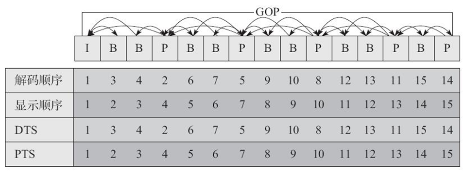
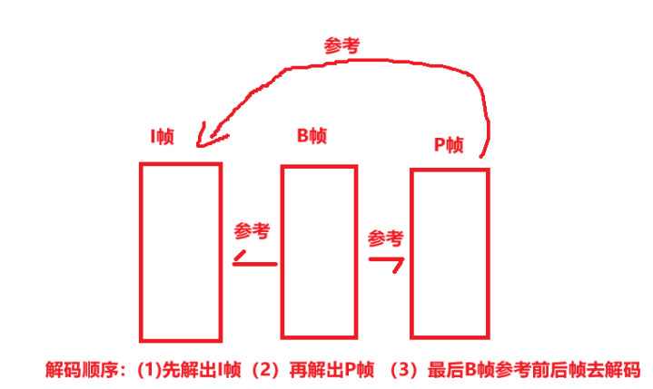

# 1. 概念1

* 视频码率 : kb/s , 是指视频文件在单位时间内使用的数据流量 , 也叫码流率。码率越大 , 说明单位时间内取样率越大 , 数据流精度就越高。
* 视频帧率 : fps , 通常说一个视频的25帧 , 指的就是这个视频帧率 , 即1秒中会显示25帧。帧率越高 , 给人的视觉就越流畅。
* 视频分辨率 : 分辨率就是我们常说的 640 x 480分辨率、1920 x 1080分辨率 , 分辨率影响视频图像的大小。

# 2. 概念2 - I帧、P帧、B帧

* **I 帧**  **(Intra coded frames)**  : I帧 不需要参考其他画面而生成 , 解码时仅靠自己就重构完整图像;
  * I帧图像采用帧内编码方式;
  * I帧所占数据的信息量比较大;
  * I帧图像是周期性出现在图像序列中的 , 出现频率可由编码器选择;
  * I帧是P帧和B帧的参考帧 (其质量直接影响到同组中以后各帧的质量)
  * I帧是帧组GOP的基础帧(第一帧) , 在一组中只有一个I帧;
  * I帧不需要考虑运动矢量;

* P 帧 (Predicted frames) : 根据本帧与相邻的前一帧 (I帧或P帧) 的不同点来压缩本帧数据 , 同时利用了空间和时间上的相关性。
  * P帧属于前向预测的帧间编码。它需要参考前面最靠近它的 **I帧** 或 **P帧** 来解码。
* B 帧 ( Bi-directional predicted frames ) : B帧图像采用双向时间预测 , 可以大大提高压缩倍数。

 

 

# 3. 常用视频压缩算法

* **MPEG2 MPEG 阵营**
* **H264 MPEG 阵营**
* **H265 MPEG阵营**
* **AVS  中国阵营**
* **VP8   Google 阵营**
* **VP9   Google 阵营**

