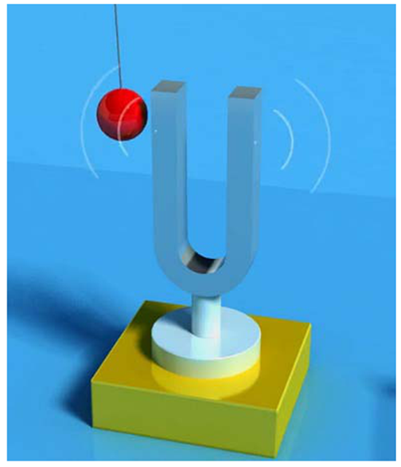

# 1. 声音的物理性质 

## 1.1 振动

声音是一种由物体振动引发的物理现象 , 如小提琴的弦声等。物体的振动使其四周空气的压强产生变化 , 这种忽强忽弱变化以波的形式向四周传播 , 当被人耳所接收时 , 我们就听见了声音。

 

## 1.2 波形

声音是由物体的振动产生的 , 这种振动引起了周围空气压强的振荡 , 我们称这种振荡的函数表现形式为波形.

 

## 1.3 频率

声音的频率是周期的倒数 , 它表示的是声音在1秒钟内的周期数 , 单位是赫兹(Hz)。千赫(kHz) , 即1000Hz , 表示每秒振动1000次。声音按频率可作如下划分:

* 次声 0～20Hz
* 人耳能听见的声音 20Hz～20KHz
* 超声 20KHz～1GHz
* 特超声 1GHz～10THz 

## 1.4 振幅

声音有振幅 , 振幅的主观感觉是声音的大小。声音的振幅大小取决于空气压力波距平均值(也称平衡态)的最大偏移量。

 

# 2. 数字音频

为了将模拟信号数字化 , 本节将分为3个概念进行讲解 : **$\color{red}{采样频率、采样量化、编码}$**

计算机并不直接使用连续平滑的波形来表示声音 , 它是每隔固定的时间对波形的幅值进行采样 , 用得到的一系列数字量来表示声音。右图 是经过数字采样的波形示意图。

**PCM 脉冲编码调制** PCM(Pulse Code Modulation) , 脉冲编码调制。人耳听到的是模拟信号 , PCM是把声音从模拟信号转化为数字信号的技术。

 

## 2.1 采样频率

根据Nyguist采样定律 , 要从采样中完全恢复原始信号波形 , 采样频率必须至少是信号中最高频率的两倍。

前面提到人耳能听到的频率范围是[20H~20kHz] , 所以采样频率一般为44.1Khz , 这样就能保证声音到达20Khz也能被数字化 , 从而使得经过数字化处理之后 , 人耳听到的声音质量不会被降低。

> ```tex
> 采样频率 : 每秒钟采样的点的个数。
> 常用的采样频率有:
> 22000（22kHz）：	无线广播。
> 44100（44.1kHz）：	CD音质。
> 48000（48kHz）：	数字电视，DVD。
> 96000（96kHz）：	蓝光，高清DVD。
> 192000(192kHz):		蓝光，高清DVD。
> 
> ```

## 2.2 采样量化

采样是在离散的时间点上进行的，而采样值本身在计算机中也是离散的。
采样值的精度取决于它用多少位来表示 , 这就是量化。例如8位量化可以表示256个不同值 , 而CD质量的16位量化可以表示65 536个值 , 范围为[-32768, 32767]

下图是一个3位量化的示意图 , 可以看出3位量化只能表示8个值:0.75 , 0.5 , 0.25 , 0 , ─0.25 ,─0.5 ,─0.75 和 ─1 , 因而量化位数越少 , 波形就越难辨认 , 还原后的声音质量也就越差(可能除了一片嗡嗡声之外什么都没有)

 

# 3. 音频常见名词

* **$\color{red}{采样频率}$** : 每秒钟采样的点的个数。
  * 常用的采样频率有 : 
    22000 (22kHz): 无线广播
    44100 (44.1kHz) : CD音质
    48000 (48kHz) : 数字电视 , DVD
    96000 (96kHz) : 蓝光 , 高清 DVD
    192000 (192kHz) : 蓝光 , 高清DVD

* **$\color{red}{采样精度 (采样深度) }$** : 每个“样本点”的大小 , 常用的大小为 8bit , 16bit , 24bit。

* **$\color{red}{通道数}$** : 单声道 , 双声道 , 四声道 , 5.1声道

* **$\color{red}{比特率}$** : 每秒传输的bit数 , 单位为 : bps (Bit Per Second) 间接衡量声音质量的一个标准
  * 没有压缩的音频数据的比特率 = 采样频率 × 采样精度 × 通道数

* **$\color{red}{码率}$** : 压缩后的音频数据的比特率
  * 常见的码率：
    96kbps : FM质量
    128-160kbps : 一般质量音频
    192kbps : CD质量。
    256-320Kbps : 高质量音频

> ```
> 码率越大,压缩效率越低,音质越好,压缩后数据越大
> 
> 码率 = 音频文件大小 ÷ 时长
> ```

