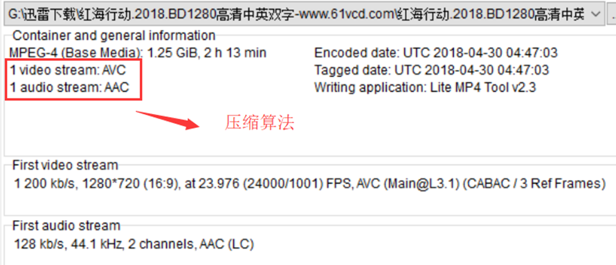

# 1. 封装格式的概念

封装格式 (也叫容器) 就是将已经编码压缩好的视频流、音频流及字幕按照一定的方案放到一个文件中 , 便于播放软件播放。
一般来说 , 视频文件的后缀名就是它的封装格式。

封装的格式不一样 , 后缀名也就不一样。

比如：同样的陷可以做成饺子也可以做成包子。对于视频也是一个道理 , 同样的音视频流可以用不同容器来承载。

 

# 2. 封装格式的示例

 

这里的压缩算法 : 
视频Video : 使用了H264/AVC压缩算法
音频Audio : 使用了AAC压缩算法

封装则使用MP4封装格式

# 3. 常见的视频封装格式

> ```tex
> AVI、MKV、MPE、MPG、MPEG
> MP4、WMV、MOV、3GP
> M2V、M1V、M4V、OGM
> RM、RMS、RMM、RMVB、IFO
> SWF、FLV、F4V、
> ASF、PMF、XMB、DIVX、PART
> DAT、VOB、M2TS、TS、PS
> ```

**$\color{red}{H264+AAC 封装为FLV 或 MP4是最为流行的模式}$**

# 4. 音视频同步概念 : 

* DTS (Decoding Time Stamp) : 即解码时间戳 , 这个时间戳的意义在于告诉播放器该在什么时候解码这一帧的数据。
* PTS (Presentation Time Stamp) : 即显示时间戳 , 这个时间戳用来告诉播放器该在什么时候显示这一帧的数据。

# 5. 音视频同步方式

* Audio Master : 同步视频到音频
* Video Master : 同步音频到视频
* External Clock Master : 同步音频和视频到外部时钟。

一般情况下 Audio Master > External Clock Master > Video Master 

