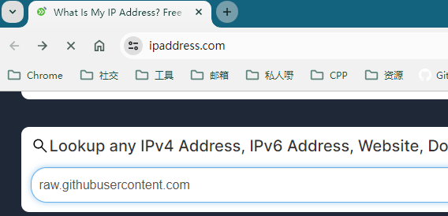

# 1.MAC 安装 brew

> ```bash
> /bin/zsh -c "$(curl -fsSL https://gitee.com/cunkai/HomebrewCN/raw/master/Homebrew.sh)"
> ```

> ```tex
> 根据提示，输⼊密码就可以⼀步⼀步装成功。
> 如果之前没有安装xcode，则会提示安装xcode，安装完xcode后，我们需要再次安装brew
> ```

# 2. Homebrew使用

> ```tex
> 安装：brew install 软件名，例：brew install git
> 搜索：brew search 软件名，例：brew search git
> 卸载：brew uninstall 软件名，例：brew uninstall git
> 更新所有：brew update
> 注意：因为brew update会通过git命令来更新，所以必须先安装git
> 更新具体软件：brew upgrade 软件名 ，例：brew upgrade git
> ```

> ```bash
> brew install git
> brew upgrade
> brew search git
> brew uninstall git
> ```

# 3. ffmpeg 下载 编译

## 3.1 下载与选择版本

**建议下载到Download这里**

> ```bash
> git clone git://source.ffmpeg.org/ffmpeg.git
> #或者码云的链接
> git clone https://gitee.com/mirrors/ffmpeg.git
> cd ffmpeg
> #查看版本
> git branch -a
> # 选择4.2版本
> git checkout remotes/origin/release/4.2
> ```

## 3.2 安装第三方库

> ```tex
> 最好⼀次只安装⼀个库⽂件,多个安装的时候可能存在冲突
> ```

> ```bash
> brew install --build-from-source automake
> brew install fdk-aac
> brew install lame
> brew install libass
> brew install libtool
> brew install libvorbis
> brew install libvpx
> brew install libvo-aacenc
> brew install opencore-amr
> brew install openjpeg
> brew install opus
> brew install speex
> brew install texi2html
> brew install x264
> brew install --build-from-source x265
> brew install xvid
> brew install yasm
> brew install freetype
> brew install pkg-config
> 
> #brew install celt
> brew install schroedinger
> brew install shtool
> brew install --build-from-source theora
> brew install --build-from-source wget
> ```

编解码库

> ```bash
> brew install x264
> brew install --build-from-source x265
> brew install libass
> #由于ffplay需要sdl2的⽀持,所以我们提前安装
> brew install --build-from-source sdl2
> ```

下载编解码库出现的错误

> ```tex
> curl: (7) Failed to connect to raw.githubusercontent.com port 443: Connection
> refused的⼏种解决⽅式
> ```

解决办法

1. 打开⽹站https://www.ipaddress.com/
2. 查询⼀下 `raw.githubusercontent.com` 对应的IP 地址

 


3. 修改host

> ```
> 前往etc文件,拷贝host文件到别的地方,修改拷贝后的host文件,修改完成后再拷贝到etc目录下,需要加上sudo命令操作
> ```


 

 


## 3.3 编译

1. 在ffmpeg 源码文件下 , 新建一个build_ffmpeg.sh文件

> ```bash
> #export LDFLAGS="-L/opt/homebrew/lib"
> #export CPPFLAGS="-I/opt/homebrew/include"
> 
> ./configure --prefix=/usr/local/ffmpeg \
>  --enable-gpl \
>  --enable-version3 \
>  --enable-nonfree \
>  --enable-postproc \
>  --disable-libass \
>  --enable-libfdk-aac \
>  --enable-libfreetype \
>  --enable-libmp3lame \
>  --enable-libopencore-amrnb \
>  --enable-libopencore-amrwb \
>  --enable-libopenjpeg\
>  --enable-libopus \
>  --enable-libspeex \
>  --enable-libtheora \
>  --enable-libvorbis \
>  --enable-libvpx \
>  --enable-libx264 \
>  --enable-libxvid \
>  --enable-static \
>  --enable-shared \
>  --enable-openssl && \
>  make && sudo make install
> ```

## 3.4 编辑环境变量

编辑 ~/.base_profile,并添加ffmpeg到环境变量中 , 如果没有就在 `~` (HOME) 目录下创建一个 ` .base_profile` 文件

命令 : `touch .base_profile ` (如果存在这个文件 , 就不需要创建)

`~` 是指代HOME目录 

在 `.base_profile` 文件下添加

> ```bash
> export PATH="$PATH:/usr/local/ffmpeg/bin"
> ```

立即生效语句

> ```bash
> source ~/.base_profile
> ```

⼀般环境变量更改后 , 重启后⽣效

## 3.5 简单测试

> ```bash
> ffplay rtmp://r.ossrs.net/live/livestream
> ffplay rtmp://58.200.131.2:1935/livetv/hunantv
> ```

如果出现相关的ffplay版本出现,基本上代表编译之后能用

# 4.QT测试编译后的库

安装过程与新建工程跟ubuntu类似 , 可参考 ubuntu16环境搭建 的 QT安装 与 新建工程

测试过程跟ubuntu下类似,下面只给出 `*.pro` 文件的修改版

[[mac安装QT教程]](https://zhuanlan.zhihu.com/p/112284398)

[[QT源码地址]](https://download.qt.io/archive/qt/)

[[QT安装包下载地址]](https://download.qt.io/archive/qt/5.12/5.12.10/)

 

## 4.1 ffmpeg版本打印工程

1. 测试代码main.cpp

> ```c++
> #include <iostram>
> 
> extern "C" {
> #include "libavutil/avutil.h"
> }
> 
> using namespace std;
> 
> int main()
> {
> 	cout << "Hello FFmpeg %s\n" <<  av_version_info() << "\n";
> 	return 0;
> }
> ```

2. 修改后的 `*.pro` 文件

> ```bash
> TEMPLATE = app
> CONFIG += console c++17
> CONFIG -= app_bundle
> CONFIG -= qt
> 
> SOURCES += \
>         main.cpp
> 
> INCLUDEPATH += /usr/local/ffmpeg/include
> 
> #默认情况建议使用动态库
> LIBS += -L/usr/local/ffmpeg/lib -lavcodec -lavdevice -lavfilter \
> -lavformat -lavutil -lpostproc -lswscale
> 
> # 明确使⽤静态库
> #LIBS += /usr/local/ffmpeg/lib/libavcodec.a \
>     # /usr/local/ffmpeg/lib/libavdevice.a \
>     # /usr/local/ffmpeg/lib/libavfilter.a \
>     # /usr/local/ffmpeg/lib/libavformat.a \
>     # /usr/local/ffmpeg/lib/libavutil.a \
>     # /usr/local/ffmpeg/lib/libswresample.a \
>     # /usr/local/ffmpeg/lib/libswscale.a
> 
> # 明确使⽤动态库
> #LIBS += /usr/local/ffmpeg/lib/libavcodec.dylib \
>     # /usr/local/ffmpeg/lib/libavdevice.dylib \
>     # /usr/local/ffmpeg/lib/libavfilter.dylib \
>     # /usr/local/ffmpeg/lib/libavformat.dylib \
>     # /usr/local/ffmpeg/lib/libavutil.dylib \
>     # /usr/local/ffmpeg/lib/libswresample.dylib \
>     # /usr/local/ffmpeg/lib/libswscale.dylib
> 
> ```

## 4.2 SDL工程

1. 编写测试代码

> ```c++
> #include <iostream>
> 
> using namespace std;
> 
> #include "SDL2/SDL.h"
> 
> //自定义消息类型
> #define REFRESH_EVENT   (SDL_USEREVENT + 1)     // 请求画面刷新事件
> #define QUIT_EVENT      (SDL_USEREVENT + 2)     // 退出事件
> 
> //定义分辨率
> // YUV像素分辨率
> #define YUV_WIDTH   320
> #define YUV_HEIGHT  240
> //定义YUV格式
> #define YUV_FORMAT  SDL_PIXELFORMAT_IYUV
> 
> int s_thread_exit = 0;  // 退出标志 = 1则退出
> 
> int refresh_video_timer(void *data)
> {
>     (void)(data);
>     while (!s_thread_exit)
>     {
>         SDL_Event event;
>         event.type = REFRESH_EVENT;
>         SDL_PushEvent(&event);
>         SDL_Delay(40);
>     }
> 
>     s_thread_exit = 0;
> 
>     //push quit event
>     SDL_Event event;
>     event.type = QUIT_EVENT;
>     SDL_PushEvent(&event);
> 
>     return 0;
> }
> 
> #undef main
> int main(int argc, char* argv[])
> {
>     (void)argc,(void)argv;
>     //初始化 SDL
>     if(SDL_Init(SDL_INIT_VIDEO))
>     {
>         fprintf( stderr, "Could not initialize SDL - %s\n", SDL_GetError());
>         return -1;
>     }
> 
>     // SDL
>     SDL_Event event;                            // 事件
>     SDL_Rect rect;                              // 矩形
>     SDL_Window *window = NULL;                  // 窗口
>     SDL_Renderer *renderer = NULL;              // 渲染
>     SDL_Texture *texture = NULL;                // 纹理
>     SDL_Thread *timer_thread = NULL;            // 请求刷新线程
>     uint32_t pixformat = YUV_FORMAT;            // YUV420P，即是SDL_PIXELFORMAT_IYUV
> 
>     // 分辨率
>     // 1. YUV的分辨率
>     int video_width = YUV_WIDTH;
>     int video_height = YUV_HEIGHT;
>     // 2.显示窗口的分辨率
>     int win_width = YUV_WIDTH;
>     int win_height = YUV_WIDTH;
> 
>     // YUV文件句柄
>     FILE *video_fd = NULL;
>     const char *yuv_path = "yuv420p_320x240.yuv";
> 
>     size_t video_buff_len = 0;
> 
>     uint8_t *video_buf = NULL; //读取数据后先把放到buffer里面
> 
>     // 我们测试的文件是YUV420P格式
>     uint32_t y_frame_len = video_width * video_height;
>     uint32_t u_frame_len = video_width * video_height / 4;
>     uint32_t v_frame_len = video_width * video_height / 4;
>     uint32_t yuv_frame_len = y_frame_len + u_frame_len + v_frame_len;
> 
>     //创建窗口
>     window = SDL_CreateWindow("Simplest YUV Player",
>                               SDL_WINDOWPOS_UNDEFINED,
>                               SDL_WINDOWPOS_UNDEFINED,
>                               video_width, video_height,
>                               SDL_WINDOW_OPENGL|SDL_WINDOW_RESIZABLE);
>     if(!window)
>     {
>         fprintf(stderr, "SDL: could not create window, err:%s\n",SDL_GetError());
>         goto _FAIL;
>     }
>     // 基于窗口创建渲染器
>     renderer = SDL_CreateRenderer(window, -1, 0);
>     // 基于渲染器创建纹理
>     texture = SDL_CreateTexture(renderer,
>                                 pixformat,
>                                 SDL_TEXTUREACCESS_STREAMING,
>                                 video_width,
>                                 video_height);
> 
>     // 分配空间
>     video_buf = (uint8_t*)malloc(yuv_frame_len);
>     if(!video_buf)
>     {
>         fprintf(stderr, "Failed to alloce yuv frame space!\n");
>         goto _FAIL;
>     }
> 
>     // 打开YUV文件
>     video_fd = fopen(yuv_path, "rb");
>     if( !video_fd )
>     {
>         fprintf(stderr, "Failed to open yuv file\n");
>         goto _FAIL;
>     }
>     // 创建请求刷新线程
>     timer_thread = SDL_CreateThread(refresh_video_timer,
>                                     NULL,
>                                     NULL);
> 
>     while (true)
>     {
>         // 收取SDL系统里面的事件
>         SDL_WaitEvent(&event);
> 
>         if(event.type == REFRESH_EVENT) // 画面刷新事件
>         {
>             video_buff_len = fread(video_buf, 1, yuv_frame_len, video_fd);
>             if(video_buff_len <= 0)
>             {
>                 fprintf(stderr, "Failed to read data from yuv file!\n");
>                 goto _FAIL;
>             }
>             // 设置纹理的数据 video_width = 320， plane
>             SDL_UpdateTexture(texture, NULL, video_buf, video_width);
> 
>             // 显示区域，可以通过修改w和h进行缩放
>             rect.x = 0;
>             rect.y = 0;
>             float w_ratio = win_width * 1.0 /video_width;
>             float h_ratio = win_height * 1.0 /video_height;
>             // 320x240 怎么保持原视频的宽高比例
>             rect.w = video_width * w_ratio;
>             rect.h = video_height * h_ratio;
>             //            rect.w = video_width * 0.5;
>             //            rect.h = video_height * 0.5;
> 
>             // 清除当前显示
>             SDL_RenderClear(renderer);
>             // 将纹理的数据拷贝给渲染器
>             SDL_RenderCopy(renderer, texture, NULL, &rect);
>             // 显示
>             SDL_RenderPresent(renderer);
>         }
>         else if(event.type == SDL_WINDOWEVENT)
>         {
>             //If Resize
>             SDL_GetWindowSize(window, &win_width, &win_height);
>             printf("SDL_WINDOWEVENT win_width:%d, win_height:%d\n",win_width,
>                    win_height );
>         }
>         else if(event.type == SDL_QUIT) //退出事件
>         {
>             s_thread_exit = 1;
>         }
>         else if(event.type == QUIT_EVENT)
>         {
>             break;
>         }
>     }
> 
> _FAIL:
>     s_thread_exit = 1;      // 保证线程能够退出
>     // 释放资源
>     if(timer_thread)
>         SDL_WaitThread(timer_thread, NULL); // 等待线程退出
>     if(video_buf)
>         free(video_buf);
>     if(video_fd)
>         fclose(video_fd);
>     if(texture)
>         SDL_DestroyTexture(texture);
>     if(renderer)
>         SDL_DestroyRenderer(renderer);
>     if(window)
>         SDL_DestroyWindow(window);
> 
>     SDL_Quit();
> 
>     return 0;
> }
> 
> ```

2. 修改 pro 文件

> ```bash
> TEMPLATE = app
> CONFIG += console c++17
> CONFIG -= app_bundle
> CONFIG -= qt
> 
> SOURCES += \
>         main.cpp
> 
> INCLUDEPATH += "/opt/homebrew/Cellar/sdl2/2.28.5/include"
> LIBS += -L/opt/homebrew/Cellar/sdl2/2.28.5/lib -lSDL2
> ```

3. 编译成功 后 并拷贝 `yuv420p_320x240.yuv` 文件到QT编译输出的可执行文件的目录下
4. 测试结果可参考Ubuntu16 下的结果

## 4.3 ffmpeg-extract-aac工程(音频提取)

1. 编写测试代码

> ```c++
> #include <iostream>
> 
> extern "C"{
> #include "libavutil/log.h"
> #include "libavformat/avio.h"
> #include "libavformat/avformat.h"
> }
> 
> using namespace std;
> 
> #define ADTS_HEADER_LEN  7;
> 
> const int sampling_frequencies[] = {
>     96000,  // 0x0
>     88200,  // 0x1
>     64000,  // 0x2
>     48000,  // 0x3
>     44100,  // 0x4
>     32000,  // 0x5
>     24000,  // 0x6
>     22050,  // 0x7
>     16000,  // 0x8
>     12000,  // 0x9
>     11025,  // 0xa
>     8000   // 0xb
>     // 0xc d e f是保留的
> };
> 
> int adts_header(char * const p_adts_header, const int data_length,
>                 const int profile, const int samplerate,
>                 const int channels)
> {
> 
>     int sampling_frequency_index = 3; // 默认使用48000hz
>     int adtsLen = data_length + 7;
> 
>     int frequencies_size = sizeof(sampling_frequencies) / sizeof(sampling_frequencies[0]);
>     int i = 0;
>     for(i = 0; i < frequencies_size; i++)
>     {
>         if(sampling_frequencies[i] == samplerate)
>         {
>             sampling_frequency_index = i;
>             break;
>         }
>     }
>     if(i >= frequencies_size)
>     {
>         printf("unsupport samplerate:%d\n", samplerate);
>         return -1;
>     }
> 
>     p_adts_header[0] = 0xff;         //syncword:0xfff                          高8bits
>     p_adts_header[1] = 0xf0;         //syncword:0xfff                          低4bits
>     p_adts_header[1] |= (0 << 3);    //MPEG Version:0 for MPEG-4,1 for MPEG-2  1bit
>     p_adts_header[1] |= (0 << 1);    //Layer:0                                 2bits
>     p_adts_header[1] |= 1;           //protection absent:1                     1bit
> 
>     p_adts_header[2] = (profile)<<6;            //profile:profile               2bits
>     p_adts_header[2] |= (sampling_frequency_index & 0x0f)<<2; //sampling frequency index:sampling_frequency_index  4bits
>     p_adts_header[2] |= (0 << 1);             //private bit:0                   1bit
>     p_adts_header[2] |= (channels & 0x04)>>2; //channel configuration:channels  高1bit
> 
>     p_adts_header[3] = (channels & 0x03)<<6; //channel configuration:channels 低2bits
>     p_adts_header[3] |= (0 << 5);               //original：0                1bit
>     p_adts_header[3] |= (0 << 4);               //home：0                    1bit
>     p_adts_header[3] |= (0 << 3);               //copyright id bit：0        1bit
>     p_adts_header[3] |= (0 << 2);               //copyright id start：0      1bit
>     p_adts_header[3] |= ((adtsLen & 0x1800) >> 11);           //frame length：value   高2bits
> 
>     p_adts_header[4] = (uint8_t)((adtsLen & 0x7f8) >> 3);     //frame length:value    中间8bits
>     p_adts_header[5] = (uint8_t)((adtsLen & 0x7) << 5);       //frame length:value    低3bits
>     p_adts_header[5] |= 0x1f;                                 //buffer fullness:0x7ff 高5bits
>     p_adts_header[6] = 0xfc;      //‭11111100‬       //buffer fullness:0x7ff 低6bits
>     // number_of_raw_data_blocks_in_frame：
>     //    表示ADTS帧中有number_of_raw_data_blocks_in_frame + 1个AAC原始帧。
> 
>     return 0;
> }
> 
> int main(int argc, char *argv[])
> {
>     int ret = -1;
>     char errors[1024];
> 
>     char *in_filename = NULL;
>     char *aac_filename = NULL;
> 
>     FILE *aac_fd = NULL;
> 
>     int audio_index = -1;
>     int len = 0;
> 
> 
>     AVFormatContext *ifmt_ctx = NULL;
>     AVPacket pkt;
> 
>     // 设置打印级别
>     av_log_set_level(AV_LOG_DEBUG);
> 
>     if(argc < 3)
>     {
>         av_log(NULL, AV_LOG_DEBUG, "the count of parameters should be more than three!\n");
>         return -1;
>     }
> 
>     in_filename = argv[1];      // 输入文件
>     aac_filename = argv[2];     // 输出文件
> 
>     if(in_filename == NULL || aac_filename == NULL)
>     {
>         av_log(NULL, AV_LOG_DEBUG, "src or dts file is null, plz check them!\n");
>         return -1;
>     }
> 
>     aac_fd = fopen(aac_filename, "wb");
>     if (!aac_fd)
>     {
>         av_log(NULL, AV_LOG_DEBUG, "Could not open destination file %s\n", aac_filename);
>         return -1;
>     }
> 
>     // 打开输入文件
>     if((ret = avformat_open_input(&ifmt_ctx, in_filename, NULL, NULL)) < 0)
>     {
>         av_strerror(ret, errors, 1024);
>         av_log(NULL, AV_LOG_DEBUG, "Could not open source file: %s, %d(%s)\n",
>                in_filename,
>                ret,
>                errors);
>         return -1;
>     }
> 
>     // 获取解码器信息
>     if((ret = avformat_find_stream_info(ifmt_ctx, NULL)) < 0)
>     {
>         av_strerror(ret, errors, 1024);
>         av_log(NULL, AV_LOG_DEBUG, "failed to find stream information: %s, %d(%s)\n",
>                in_filename,
>                ret,
>                errors);
>         return -1;
>     }
> 
>     // dump媒体信息
>     av_dump_format(ifmt_ctx, 0, in_filename, 0);
> 
>     // 初始化packet
>     av_init_packet(&pkt);
> 
>     // 查找audio对应的steam index
>     audio_index = av_find_best_stream(ifmt_ctx, AVMEDIA_TYPE_AUDIO, -1, -1, NULL, 0);
>     if(audio_index < 0)
>     {
>         av_log(NULL, AV_LOG_DEBUG, "Could not find %s stream in input file %s\n",
>                av_get_media_type_string(AVMEDIA_TYPE_AUDIO),
>                in_filename);
>         return AVERROR(EINVAL);
>     }
> 
>     // 打印AAC级别
>     printf("audio profile:%d, FF_PROFILE_AAC_LOW:%d\n",
>            ifmt_ctx->streams[audio_index]->codecpar->profile,
>            FF_PROFILE_AAC_LOW);
> 
>     if(ifmt_ctx->streams[audio_index]->codecpar->codec_id != AV_CODEC_ID_AAC)
>     {
>         printf("the media file no contain AAC stream, it's codec_id is %d\n",
>                ifmt_ctx->streams[audio_index]->codecpar->codec_id);
>         goto failed;
>     }
>     // 读取媒体文件，并把aac数据帧写入到本地文件
>     while(av_read_frame(ifmt_ctx, &pkt) >=0 )
>     {
>         if(pkt.stream_index == audio_index)
>         {
>             char adts_header_buf[7] = {0};
>             adts_header(adts_header_buf, pkt.size,
>                         ifmt_ctx->streams[audio_index]->codecpar->profile,
>                         ifmt_ctx->streams[audio_index]->codecpar->sample_rate,
>                         ifmt_ctx->streams[audio_index]->codecpar->channels);
>             fwrite(adts_header_buf, 1, 7, aac_fd);  // 写adts header , ts流不适用，ts流分离出来的packet带了adts header
>             len = fwrite( pkt.data, 1, pkt.size, aac_fd);   // 写adts data
>             if(len != pkt.size)
>             {
>                 av_log(NULL, AV_LOG_DEBUG, "warning, length of writed data isn't equal pkt.size(%d, %d)\n",
>                        len,
>                        pkt.size);
>             }
>         }
>         av_packet_unref(&pkt);
>     }
> 
> failed:
>     // 关闭输入文件
>     if(ifmt_ctx)
>     {
>         avformat_close_input(&ifmt_ctx);
>     }
>     if(aac_fd)
>     {
>         fclose(aac_fd);
>     }
> 
>     return 0;
> }
> ```

2. 修改 pro 文件 

> ```bash
> TEMPLATE = app
> CONFIG += console c++17
> CONFIG -= app_bundle
> CONFIG -= qt
> 
> SOURCES += \
>         main.cpp
> 
> INCLUDEPATH += "/usr/local/ffmpeg/include"
> 
> LIBS += -L/usr/local/ffmpeg/lib -lavcodec -lavdevice -lavfilter -lavformat -lavutil -lpostproc -lswscale
> ```

3. 编译成功后 , 把 `believe.mp4` 拷贝到 QT编译输出可执行文件的目录下 
4. 在可执行文件的目录下打开终端 , 输入 `./xxx believe.mp4 believe.aac` 如果生成的不是0字节的 `believe.acc` 文件 , 代表生成成功 (believe.mp4 believe.aac两个参数可在qt creator填写 , 具体参考 Ubuntu 16的操作)
5. 在终端 输入 `ffplay believe.aac` , 能听到音乐代表提取成功 (参考ubuntu 16 环境搭建)

