# 1.创建目录

在home目录下创建
ffmpeg_sources : 用于下载源文件
ffmpeg_build : 存储编译后的库文件
bin：存储二进制文件 (ffmpeg，ffplay，ffprobe，X264，X265等)  

> ```bash
> cd ~
> mkdir fmpeg_sources ffmpeg_build bin  
> ```

# 2. 安装依赖

> ```bash
> sudo apt-get update
> sudo apt-get -y install \
> autoconf \
> automake \
> build-essential \
> cmake \
> git-core \
> libass-dev \
> libfreetype6-dev \
> libsdl2-dev \
> libtool \
> libva-dev \
> libvdpau-dev \
> libvorbis-dev \
> libxcb1-dev \
> libxcb-shm0-dev \
> libxcb-xfixes0-dev \
> pkg-config \
> texinfo \
> wget \
> zlib1g-dev
> ```

# 3. 编译与安装

## 3.1 NASM

部分库使用到汇编程序,使用源码进行安装

> ```bash
> cd ~/ffmpeg_sources && \
> wget https://www.nasm.us/pub/nasm/releasebuilds/2.14.02/nasm-2.14.02.tar.bz2 && \
> tar xjvf nasm-2.14.02.tar.bz2 && \
> cd nasm-2.14.02 && \
> ./autogen.sh && \
> PATH="$HOME/bin:$PATH" ./configure --prefix="$HOME/ffmpeg_build" --bindir="$HOME/bin" && \
> make && \
> sudo make install
> ```

## 3.2 Yasm

部分库使用到该汇编库,使用源码进行安装 : 

> ```bash
> cd ~/ffmpeg_sources && \
> wget -O yasm-1.3.0.tar.gz https://www.tortall.net/projects/yasm/releases/yasm-1.3.0.tar.gz && \
> tar xzvf yasm-1.3.0.tar.gz && \
> cd yasm-1.3.0 && \
> ./configure --prefix="$HOME/ffmpeg_build" --bindir="$HOME/bin" && \
> make && \
> sudo make install
> ```

## 3.3 libx264

H.264 视频编码器 , 更多信息和使用范例参考H.264 Encoding Guide
要求编译 ffmpeg 时配置 : `--enable-gpl --enable-libx264`
使用源码进行编译 : 

> ```bash
> cd ~/ffmpeg_sources && \
> git -C x264 pull 2> /dev/null || git clone --depth 1 https://gitee.com/mirrors_addons/x264.git && \
> cd x264 && \
> PATH="$HOME/bin:$PATH" PKG_CONFIG_PATH="$HOME/ffmpeg_build/lib/pkgconfig" \
> ./configure --prefix="$HOME/ffmpeg_build" --bindir="$HOME/bin" --enable-static --enable-pic && \
> PATH="$HOME/bin:$PATH" && \
> make && \
> sudo make install
> ```

## 3.4 libx265

H.265/HEVC 视频编码器， 更多信息和使用范例参考H.265 Encoding Guide。
要求编译ffmpeg时配置 : `--enable-gpl --enable-libx265`
使用源码进行编译 : 

> ```bash
> sudo apt-get install mercurial libnuma-dev && \
> cd ~/ffmpeg_sources && \
> if cd x265 2> /dev/null; then git pull && cd ..; else git clone https://gitee.com/mirrors_videolan/x26
> 5.git; fi && \
> cd x265/build/linux && \
> PATH="$HOME/bin:$PATH" cmake -G "Unix Makefiles" -DCMAKE_INSTALL_PREFIX="$HOME/ffmpeg_build" \
> -DENABLE_SHARED=off ../../source && \
> PATH="$HOME/bin:$PATH" make && \
> sudo make install
> ```

## 3.5 libvpx

VP8/VP9视频编解码器 , 更多信息和使用范例参考VP9 Video Encoding Guide 。
要求编译ffmpeg时配置 :  `--enable-libvpx`
使用源码进行编译 : 

> ```bash
> cd ~/ffmpeg_sources && \
> git -C libvpx pull 2> /dev/null || git clone --depth 1 https://github.com/webmproject/libvpx.git && \
> cd libvpx && \
> PATH="$HOME/bin:$PATH" && \
> ./configure --prefix="$HOME/ffmpeg_build" --disable-examples --disable-unit-tests \
>  --enable-vp9-highbitdepth --as=yasm --enable-pic && \
> PATH="$HOME/bin:$PATH" && \
> make && \
> sudo make install
> ```

## 3.6 libfdk-aac

AAC音频编码器 , 更多信息和使用范例参考AAC Audio Encoding Guide。
要求编译 ffmpeg 时配置 : `--enable-libfdk-aac` ( 如果你已经配置了 `--enable-gpl` 则需要加上 `--enablenonfree` )
使用源码进行编译 : 

> ```bash
> cd ~/ffmpeg_sources && \
> git -C fdk-aac pull 2> /dev/null || git clone --depth 1 https://github.com/mstorsjo/fdk-aac && \
> cd fdk-aac && \
> autoreconf -fiv && \
> ./configure CFLAGS=-fPIC --prefix="$HOME/ffmpeg_build" && \
> make && \
> sudo make install
> ```

## 3.7 libmp3lame

MP3音频编码器 , 要求编译ffmpeg时配置 : `--enable-libmp3lame`

使用源码进行编译 : 

> ```bash
> cd ~/ffmpeg_sources && \
> git clone --depth 1 https://gitee.com/hqiu/lame.git && \
> cd lame && \
> PATH="$HOME/bin:$PATH" && \
> ./configure --prefix="$HOME/ffmpeg_build" --bindir="$HOME/bin" --enable-nasm --with-pic && \
> PATH="$HOME/bin:$PATH" make && \
> sudo make install
> ```

## 3.8 libopus

Opus音频编解码器 , 要求编译ffmpeg时配置 : `--enable-libopus`
使用源码进行编译 : 

> ```bash
> cd ~/ffmpeg_sources && \
> git -C opus pull 2> /dev/null || git clone --depth 1 https://github.com/xiph/opus.git && \
> cd opus && \
> ./autogen.sh && \
> ./configure --prefix="$HOME/ffmpeg_build" -with-pic && \
> make && \
> sudo make install
> ```

## 3.9 FFmpeg

> ```bash
> cd ~/ffmpeg_sources && \
> wget -O ffmpeg-4.2.1.tar.bz2 https://ffmpeg.org/releases/ffmpeg-4.2.1.tar.bz2 && \
> tar xjvf ffmpeg-4.2.1.tar.bz2 && \
> cd ffmpeg-4.2.1 && \
> PATH="$HOME/bin:$PATH" PKG_CONFIG_PATH="$HOME/ffmpeg_build/lib/pkgconfig" CFLAGS="-O3 -fPIC"
> ```

新建一个 `build_ffmpeg.sh` : 

> ```bash
> ./configure \
>     --prefix="$HOME/ffmpeg_build" \
>     --pkg-config-flags="--static" \
>     --extra-cflags="-I$HOME/ffmpeg_build/include" \
>     --extra-ldflags="-L$HOME/ffmpeg_build/lib" \
>     --extra-libs="-lpthread -lm" \
>     --bindir="$HOME/bin" \
>     --enable-gpl \
>     --enable-libass \
>     --enable-libfdk-aac \
>     --enable-libfreetype \
>     --enable-libmp3lame \
>     --enable-libopus \
>     --enable-libvorbis \
>     --enable-libvpx \
>     --enable-libx264 \
>     --enable-libx265 \
>     --enable-pic \
>     --enable-shared \
>     --enable-nonfree && \
>     PATH="$HOME/bin:$PATH" && \
> make && \
> sudo make install && \
> hash -r
> ```

然后重新登录系统或者在当前shell会话执行如下命令以识别新安装ffmpeg的位置 : 
`source ~/.profile`

# 4. 使用

现在 , 您可以打开一个终端 , 输入ffmpeg命令 , 它应该执行新的ffmpeg。
如果你需要多个用户能同时使用你新编译的ffmpeg , 则可以移动或者拷贝ffmpeg二进制文件从~/bin
到/usr/local/bin。测试ffplay是否可以使用 (需要在图形方式进行测试) 

* `ffplay rtmp://media3.scctv.net/live/scctv_800`

如果能够正常播放则说明 ffplay能够编译成功使用。播放的时候要等等画面。

# 5. 文档  

> ```tex
> 你可以使用 man ffmpeg 以本地的方式访问文档:
> echo"MANPATH_MAP $HOME/bin $HOME/ffmpeg_build/share/man" >> ~/.manpath
> 你可能必须注销系统然后重新登录man ffmpeg才生效。
> HTML 格式的文档位于 ~/ffmpeg_build/share/doc/ffmpeg.
> 你也可以参考在线文档 online FFmpeg documentation 
> ```

# 6. 支持FFmpeg代码 Debug

刚才的工程可以运行 , 但不能debug , 解决此问题 , 首先认定一点 , 生成的可执行程序中 , ffmpeg 不包
含调试信息 , 调试信息在 ffmpeg_g 中 , debug 要选择 ffmpeg_g

另外 , ./config选项也是确定包含调试信息的核心 , 需要在config中添加 : 

* `-–enable-debug=3` : 开启debug调试
* `-–disable-asm` : 禁用 asm 优化
* `--disable-optimizations` : 禁用优化 , 以便调试时按函数顺序执行。
* `–-disable-stripping` : 禁用剥离可执行程序和共享库 , 即调试时可以进入到某个函数进行单独调试。

采用以下命令重新 `config` : 

1. 先clean

> ```bash
> make clean
> ```

2. 再重新config 

> ```bash
> ./configure \
>     --prefix="$HOME/ffmpeg_build" \
>     --pkg-config-flags="--static" \
>     --extra-cflags="-I$HOME/ffmpeg_build/include" \
>     --extra-ldflags="-L$HOME/ffmpeg_build/lib" \
>     --extra-libs="-lpthread -lm" \
>     --bindir="$HOME/bin" \
>     --enable-gpl \
>     --enable-libass \
>     --enable-libfdk-aac \
>     --enable-libfreetype \
>     --enable-libmp3lame \
>     --enable-libopus \
>     --enable-libvorbis \
>     --enable-libvpx \
>     --enable-libx264 \
>     --enable-libx265 \
>     --enable-pic \
>     --enable-shared \
>     --enable-nonfree \
>     --enable-debug=3 \
>     --disable-optimizations \
>     --disable-asm \
>     --disable-stripping && \
>     PATH="$HOME/bin:$PATH" make && \
>     make install && \
>     hash -r
> ```

# 7. 注意事项

> ```tex
> 在使用 ffplay 播放生成 h264 格式的视频时,播放速度会加快,解决方式:不要使用 FFmpeg 转码生成纯 h264 格式的视频,要使用一种容器包含 h264 视频,即生成一种音视频流格式,也就是不要生成纯粹的 h264 码流,而是生成诸如 mkv 等格式的文件
> ```

# 8.安装QT测试

## 8.1 安装与注意相关问题

ubuntu16 建议安装qt5.12.10

[[QT源码下载]](https://download.qt.io/archive/qt/)

[[QT下载地址]](https://download.qt.io/archive/qt/5.12/5.12.10/ )

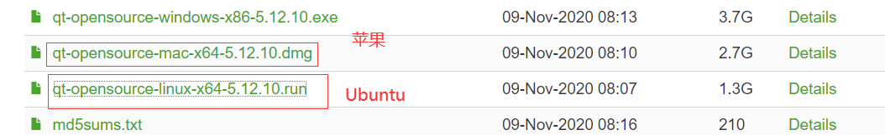 

安装命令

> ```bash
> chmod u+x qt_opensource-linux-x64-512.10.run
> ./qt_opensource-linux-x64-512.10.run
> ```

安装完成执行报错 , 如下图

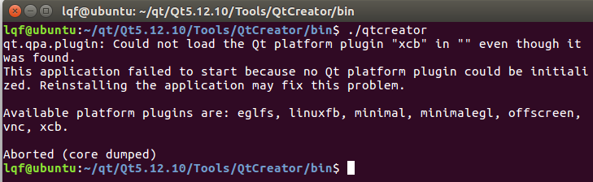 

[[参考链接]](https://blog.csdn.net/u012768805/article/details/98756925)

解决办法 : 

> ```bash
> sudo apt install --reinstall libxcb-xinerama0
> ```

如果显示如下的错误 , 属于权限不足

> ```tex
> Ubuntu16.04打开Qt显示/home/user/.config/QtProject/qtcreator/qtversion.xml : Permission denied
> ```

执行命令 : 

> ```bash
> sudo chown -R user:user ~/.config/
> ```

不是sudo权限也能启动则需要修改权限

语法 : 

> ```bash
> sudo chown -R username:username ~/.config/
> #username替换成自己系统的用户名,例如
> sudo chown -R wong:wong ~/.config/
> ```

## 8.2 编译测试

1. 把编译好的 ffmpeg_build 拷贝到带 `*.pro` 目录下

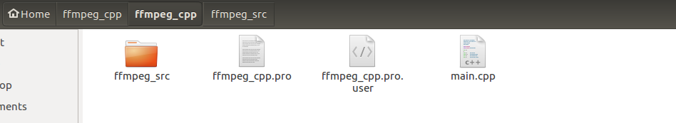  

2. 修改 `*.pro` 文件

> ```bash
> TEMPLATE = app
> CONFIG += console c++11
> CONFIG -= app_bundle
> CONFIG -= qt
> 
> #===========================================================================#
> #关注下面的部分
> #头文件路径与库路径、库名字不能错
> SOURCES += \
>         main.cpp
> INCLUDEPATH += /home/wong/ffmpeg_cpp/ffmpeg_cpp/ffmpeg_src/include
> 
> LIBS += /home/wong/ffmpeg_cpp/ffmpeg_cpp/ffmpeg_src/lib/libavcodec.a \
>         /home/wong/ffmpeg_cpp/ffmpeg_cpp/ffmpeg_src/lib/libavdevice.a \
>         /home/wong/ffmpeg_cpp/ffmpeg_cpp/ffmpeg_src/lib/libavfilter.a \
>         /home/wong/ffmpeg_cpp/ffmpeg_cpp/ffmpeg_src/lib/libavformat.a \
>         /home/wong/ffmpeg_cpp/ffmpeg_cpp/ffmpeg_src/lib/libavutil.a \
>         /home/wong/ffmpeg_cpp/ffmpeg_cpp/ffmpeg_src/lib/libswresample.a \
>         /home/wong/ffmpeg_cpp/ffmpeg_cpp/ffmpeg_src/lib/libswscale.a
> ```

3. 编写main.cpp文件

> ```c++
> #include <iostream>
> extern "C"{
> #include "libavutil/avutil.h"
> }
> 
> #include <SDL2/SDL.h>
> 
> using namespace std;
> 
> char str[]{"123456789ABCDE"};
> 
> int main()
> {
>     cout << "Hello FFMPEG, version is " << av_version_info() << "\n";
> 
>     return 0;
> }
> ```

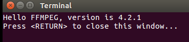 

# 9. 安装SDL2并用qt测试

## 9.1 安装

版本一直在更新...

> ```bash
> wget -O SDL2-2.0.10.tar.gz https://github.com/libsdl-org/SDL/releases/download/release-2.28.5/SDL2-2.28.5.tar.gz && \
> tar -xvf SDL2-2.0.10.tar.gz && \
> cd SDL2-2.28.5 && \
> ./autogen.sh && \
> ./configure --prefix=/home/wong/ffmpeg_build --bindir=/home/lqf/bin && \
> make && sudo make install
> ```

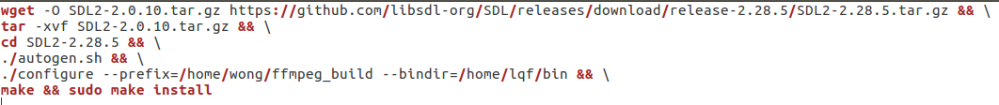 

## 9.2 用QT进行测试

### 9.2.1 新建一个QT C++工程 , 选择Non-Qt-Project

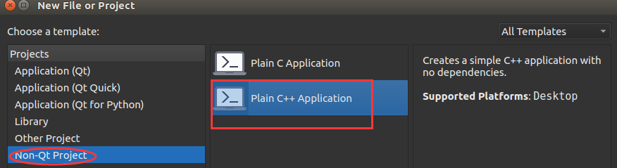 

### 9.2.2修改 `*.pro` 文件

> ```
> TEMPLATE = app
> CONFIG += console c++11
> CONFIG -= app_bundle
> CONFIG -= qt
> 
> SOURCES += \
>         main.cpp
>         
> #添加SDL头文件路径,库路径以及库名
> #INCLUDEPATH += /home/lqf/ffmpeg_build/include/SDL2
> 
> INCLUDEPATH += /home/wong/ffmpeg_build/include
> LIBS += /home/wong/ffmpeg_build/lib/libSDL2.so
> ```

c. 编写main.cpp

> ```bash
> #include <iostream>
> 
> using namespace std;
> 
> #include "SDL2/SDL.h"
> 
> //自定义消息类型
> #define REFRESH_EVENT   (SDL_USEREVENT + 1)     // 请求画面刷新事件
> #define QUIT_EVENT      (SDL_USEREVENT + 2)     // 退出事件
> 
> //定义分辨率
> // YUV像素分辨率
> #define YUV_WIDTH   320
> #define YUV_HEIGHT  240
> //定义YUV格式
> #define YUV_FORMAT  SDL_PIXELFORMAT_IYUV
> 
> int s_thread_exit = 0;  // 退出标志 = 1则退出
> 
> int refresh_video_timer(void *data)
> {
>     (void)data;
>     while (!s_thread_exit)
>     {
>         SDL_Event event;
>         event.type = REFRESH_EVENT;
>         SDL_PushEvent(&event);
>         SDL_Delay(40);
>     }
> 
>     s_thread_exit = 0;
> 
>     //push quit event
>     SDL_Event event;
>     event.type = QUIT_EVENT;
>     SDL_PushEvent(&event);
> 
>     return 0;
> }
> #undef main
> int main(int argc, char* argv[])
> {
>     (void)argc,(void)argv;
>     //初始化 SDL
>     if(SDL_Init(SDL_INIT_VIDEO))
>     {
>         fprintf( stderr, "Could not initialize SDL - %s\n", SDL_GetError());
>         return -1;
>     }
> 
>     // SDL
>     SDL_Event event;                            // 事件
>     SDL_Rect rect;                              // 矩形
>     SDL_Window *window = NULL;                  // 窗口
>     SDL_Renderer *renderer = NULL;              // 渲染
>     SDL_Texture *texture = NULL;                // 纹理
>     SDL_Thread *timer_thread = NULL;            // 请求刷新线程
>     uint32_t pixformat = YUV_FORMAT;            // YUV420P，即是SDL_PIXELFORMAT_IYUV
> 
>     // 分辨率
>     // 1. YUV的分辨率
>     int video_width = YUV_WIDTH;
>     int video_height = YUV_HEIGHT;
>     // 2.显示窗口的分辨率
>     int win_width = YUV_WIDTH;
>     int win_height = YUV_WIDTH;
> 
>     // YUV文件句柄
>     FILE *video_fd = NULL;
>     const char *yuv_path = "yuv420p_320x240.yuv";
> 
>     size_t video_buff_len = 0;
> 
>     uint8_t *video_buf = NULL; //读取数据后先把放到buffer里面
> 
>     // 我们测试的文件是YUV420P格式
>     uint32_t y_frame_len = video_width * video_height;
>     uint32_t u_frame_len = video_width * video_height / 4;
>     uint32_t v_frame_len = video_width * video_height / 4;
>     uint32_t yuv_frame_len = y_frame_len + u_frame_len + v_frame_len;
> 
>     //创建窗口
>     window = SDL_CreateWindow("Simplest YUV Player",
>                            SDL_WINDOWPOS_UNDEFINED,
>                            SDL_WINDOWPOS_UNDEFINED,
>                            video_width, video_height,
>                            SDL_WINDOW_OPENGL|SDL_WINDOW_RESIZABLE);
>     if(!window)
>     {
>         fprintf(stderr, "SDL: could not create window, err:%s\n",SDL_GetError());
>         goto _FAIL;
>     }
>     // 基于窗口创建渲染器
>     renderer = SDL_CreateRenderer(window, -1, 0);
>     // 基于渲染器创建纹理
>     texture = SDL_CreateTexture(renderer,
>                                 pixformat,
>                                 SDL_TEXTUREACCESS_STREAMING,
>                                 video_width,
>                                 video_height);
> 
>     // 分配空间
>     video_buf = (uint8_t*)malloc(yuv_frame_len);
>     if(!video_buf)
>     {
>         fprintf(stderr, "Failed to alloce yuv frame space!\n");
>         goto _FAIL;
>     }
> 
>     // 打开YUV文件
>     video_fd = fopen(yuv_path, "rb");
>     if( !video_fd )
>     {
>         fprintf(stderr, "Failed to open yuv file\n");
>         goto _FAIL;
>     }
>     // 创建请求刷新线程
>     timer_thread = SDL_CreateThread(refresh_video_timer,
>                                     NULL,
>                                     NULL);
> 
>     while (1)
>     {
>         // 收取SDL系统里面的事件
>         SDL_WaitEvent(&event);
> 
>         if(event.type == REFRESH_EVENT) // 画面刷新事件
>         {
>             video_buff_len = fread(video_buf, 1, yuv_frame_len, video_fd);
>             if(video_buff_len <= 0)
>             {
>                 fprintf(stderr, "Failed to read data from yuv file!\n");
>                 goto _FAIL;
>             }
>             // 设置纹理的数据 video_width = 320， plane
>             SDL_UpdateTexture(texture, NULL, video_buf, video_width);
> 
>             // 显示区域，可以通过修改w和h进行缩放
>             rect.x = 0;
>             rect.y = 0;
>             float w_ratio = win_width * 1.0 /video_width;
>             float h_ratio = win_height * 1.0 /video_height;
>             // 320x240 怎么保持原视频的宽高比例
>             rect.w = video_width * w_ratio;
>             rect.h = video_height * h_ratio;
> //            rect.w = video_width * 0.5;
> //            rect.h = video_height * 0.5;
> 
>             // 清除当前显示
>             SDL_RenderClear(renderer);
>             // 将纹理的数据拷贝给渲染器
>             SDL_RenderCopy(renderer, texture, NULL, &rect);
>             // 显示
>             SDL_RenderPresent(renderer);
>         }
>         else if(event.type == SDL_WINDOWEVENT)
>         {
>             //If Resize
>             SDL_GetWindowSize(window, &win_width, &win_height);
>             printf("SDL_WINDOWEVENT win_width:%d, win_height:%d\n",win_width,
>                    win_height );
>         }
>         else if(event.type == SDL_QUIT) //退出事件
>         {
>             s_thread_exit = 1;
>         }
>         else if(event.type == QUIT_EVENT)
>         {
>             break;
>         }
>     }
> 
> _FAIL:
>     s_thread_exit = 1;      // 保证线程能够退出
>     // 释放资源
>     if(timer_thread)
>         SDL_WaitThread(timer_thread, NULL); // 等待线程退出
>     if(video_buf)
>         free(video_buf);
>     if(video_fd)
>         fclose(video_fd);
>     if(texture)
>         SDL_DestroyTexture(texture);
>     if(renderer)
>         SDL_DestroyRenderer(renderer);
>     if(window)
>         SDL_DestroyWindow(window);
> 
>     SDL_Quit();
> 
>     return 0;
> 
> }
> 
> ```


d. 把 `yuv420p_320x240.yuv` 文件放到qt的输出目录,例如 : 

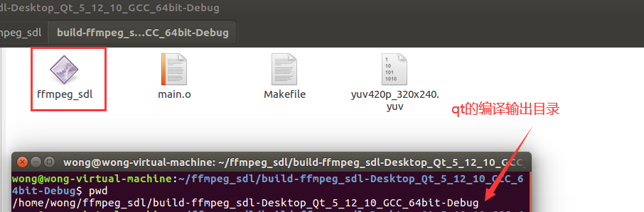 

e. 测试结果

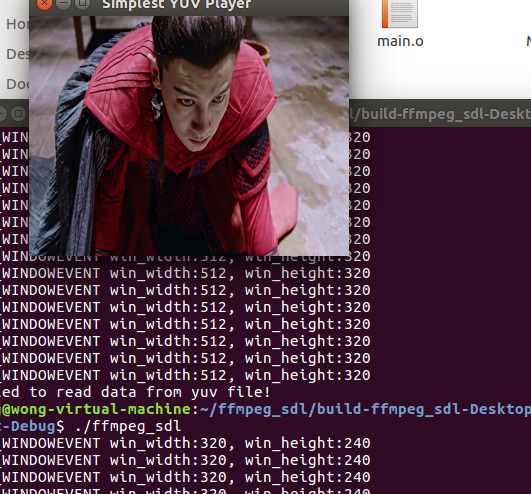  

# 10. 提取视频的aac音频

ffmpeg_extract_aac

## 10.1 新建QT工程

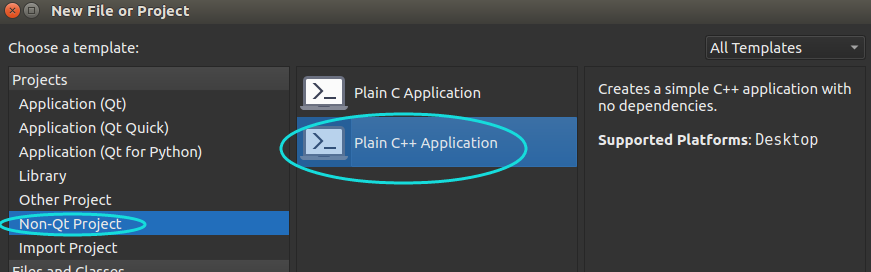 

## 10.2 修改 `*.pro` 文件

> ```bash
> TEMPLATE = app
> CONFIG += console c++11
> CONFIG -= app_bundle
> CONFIG -= qt
> 
> SOURCES += \
>         main.cpp
> 
> #==========================================================================
> INCLUDEPATH += /home/wong/ffmpeg_build/include
> 
> LIBS +=     \
>     /home/wong/ffmpeg_build/lib/libavformat.a \
>     /home/wong/ffmpeg_build/lib/libavcodec.a \
>     /home/wong/ffmpeg_build/lib/libavdevice.a \
>     /home/wong/ffmpeg_build/lib/libavfilter.a \
>     /home/wong/ffmpeg_build/lib/libavutil.a \
>     /home/wong/ffmpeg_build/lib/libswresample.a \
>     /home/wong/ffmpeg_build/lib/libswscale.a \
>     /home/wong/ffmpeg_build/lib/libmp3lame.a \
>     /home/wong/ffmpeg_build/lib/libfdk-aac.a \
>     /home/wong/ffmpeg_build/lib/libopus.a \
>     /home/wong/ffmpeg_build/lib/libvpx.a \
>     /home/wong/ffmpeg_build/lib/libx264.a \
>     /home/wong/ffmpeg_build/lib/libx265.a
> 
> LIBS += -lpthread -lnuma -lz -lm  -lva-drm -lva -lva-x11 -lvdpau -lX11 -lXext -ldl -lvorbisenc -lvorbis
> 
> ```

## 10.3 编写测试代码

>```c++
>#include <iostream>
>
>extern "C" {
>#include "libavutil/log.h"
>#include "libavformat/avio.h"
>#include "libavformat/avformat.h"
>}
>
>using namespace std;
>
>#define ADTS_HEADER_LEN  7;
>
>const int sampling_frequencies[] = {
>    96000,  // 0x0
>    88200,  // 0x1
>    64000,  // 0x2
>    48000,  // 0x3
>    44100,  // 0x4
>    32000,  // 0x5
>    24000,  // 0x6
>    22050,  // 0x7
>    16000,  // 0x8
>    12000,  // 0x9
>    11025,  // 0xa
>    8000   // 0xb
>    // 0xc d e f是保留的
>};
>
>int adts_header(char * const p_adts_header, const int data_length,
>                const int profile, const int samplerate,
>                const int channels)
>{
>
>    int sampling_frequency_index = 3; // 默认使用48000hz
>    int adtsLen = data_length + 7;
>
>    int frequencies_size = sizeof(sampling_frequencies) / sizeof(sampling_frequencies[0]);
>    int i = 0;
>    for(i = 0; i < frequencies_size; i++)
>    {
>        if(sampling_frequencies[i] == samplerate)
>        {
>            sampling_frequency_index = i;
>            break;
>        }
>    }
>    if(i >= frequencies_size)
>    {
>        printf("unsupport samplerate:%d\n", samplerate);
>        return -1;
>    }
>
>    p_adts_header[0] = 0xff;         //syncword:0xfff                          高8bits
>    p_adts_header[1] = 0xf0;         //syncword:0xfff                          低4bits
>    p_adts_header[1] |= (0 << 3);    //MPEG Version:0 for MPEG-4,1 for MPEG-2  1bit
>    p_adts_header[1] |= (0 << 1);    //Layer:0                                 2bits
>    p_adts_header[1] |= 1;           //protection absent:1                     1bit
>
>    p_adts_header[2] = (profile)<<6;            //profile:profile               2bits
>    p_adts_header[2] |= (sampling_frequency_index & 0x0f)<<2; //sampling frequency index:sampling_frequency_index  4bits
>    p_adts_header[2] |= (0 << 1);             //private bit:0                   1bit
>    p_adts_header[2] |= (channels & 0x04)>>2; //channel configuration:channels  高1bit
>
>    p_adts_header[3] = (channels & 0x03)<<6; //channel configuration:channels 低2bits
>    p_adts_header[3] |= (0 << 5);               //original：0                1bit
>    p_adts_header[3] |= (0 << 4);               //home：0                    1bit
>    p_adts_header[3] |= (0 << 3);               //copyright id bit：0        1bit
>    p_adts_header[3] |= (0 << 2);               //copyright id start：0      1bit
>    p_adts_header[3] |= ((adtsLen & 0x1800) >> 11);           //frame length：value   高2bits
>
>    p_adts_header[4] = (uint8_t)((adtsLen & 0x7f8) >> 3);     //frame length:value    中间8bits
>    p_adts_header[5] = (uint8_t)((adtsLen & 0x7) << 5);       //frame length:value    低3bits
>    p_adts_header[5] |= 0x1f;                                 //buffer fullness:0x7ff 高5bits
>    p_adts_header[6] = 0xfc;      //‭11111100‬       //buffer fullness:0x7ff 低6bits
>    // number_of_raw_data_blocks_in_frame：
>    //    表示ADTS帧中有number_of_raw_data_blocks_in_frame + 1个AAC原始帧。
>
>    return 0;
>}
>
>int main(int argc, char *argv[])
>{
>    int ret = -1;
>    char errors[1024];
>
>    char *in_filename = NULL;
>    char *aac_filename = NULL;
>
>    FILE *aac_fd = NULL;
>
>    int audio_index = -1;
>    int len = 0;
>
>
>    AVFormatContext *ifmt_ctx = NULL;
>    AVPacket pkt;
>
>    // 设置打印级别
>    av_log_set_level(AV_LOG_DEBUG);
>
>    if(argc < 3)
>    {
>        av_log(NULL, AV_LOG_DEBUG, "the count of parameters should be more than three!\n");
>        return -1;
>    }
>
>    in_filename = argv[1];      // 输入文件
>    aac_filename = argv[2];     // 输出文件
>
>    if(in_filename == NULL || aac_filename == NULL)
>    {
>        av_log(NULL, AV_LOG_DEBUG, "src or dts file is null, plz check them!\n");
>        return -1;
>    }
>
>    aac_fd = fopen(aac_filename, "wb");
>    if (!aac_fd)
>    {
>        av_log(NULL, AV_LOG_DEBUG, "Could not open destination file %s\n", aac_filename);
>        return -1;
>    }
>
>    // 打开输入文件
>    if((ret = avformat_open_input(&ifmt_ctx, in_filename, NULL, NULL)) < 0)
>    {
>        av_strerror(ret, errors, 1024);
>        av_log(NULL, AV_LOG_DEBUG, "Could not open source file: %s, %d(%s)\n",
>               in_filename,
>               ret,
>               errors);
>        return -1;
>    }
>
>    // 获取解码器信息
>    if((ret = avformat_find_stream_info(ifmt_ctx, NULL)) < 0)
>    {
>        av_strerror(ret, errors, 1024);
>        av_log(NULL, AV_LOG_DEBUG, "failed to find stream information: %s, %d(%s)\n",
>               in_filename,
>               ret,
>               errors);
>        return -1;
>    }
>
>    // dump媒体信息
>    av_dump_format(ifmt_ctx, 0, in_filename, 0);
>
>    // 初始化packet
>    av_init_packet(&pkt);
>
>    // 查找audio对应的steam index
>    audio_index = av_find_best_stream(ifmt_ctx, AVMEDIA_TYPE_AUDIO, -1, -1, NULL, 0);
>    if(audio_index < 0)
>    {
>        av_log(NULL, AV_LOG_DEBUG, "Could not find %s stream in input file %s\n",
>               av_get_media_type_string(AVMEDIA_TYPE_AUDIO),
>               in_filename);
>        return AVERROR(EINVAL);
>    }
>
>    // 打印AAC级别
>    printf("audio profile:%d, FF_PROFILE_AAC_LOW:%d\n",
>           ifmt_ctx->streams[audio_index]->codecpar->profile,
>           FF_PROFILE_AAC_LOW);
>
>    if(ifmt_ctx->streams[audio_index]->codecpar->codec_id != AV_CODEC_ID_AAC)
>    {
>        printf("the media file no contain AAC stream, it's codec_id is %d\n",
>               ifmt_ctx->streams[audio_index]->codecpar->codec_id);
>        goto failed;
>    }
>    // 读取媒体文件，并把aac数据帧写入到本地文件
>    while(av_read_frame(ifmt_ctx, &pkt) >=0 )
>    {
>        if(pkt.stream_index == audio_index)
>        {
>            char adts_header_buf[7] = {0};
>            adts_header(adts_header_buf, pkt.size,
>                        ifmt_ctx->streams[audio_index]->codecpar->profile,
>                        ifmt_ctx->streams[audio_index]->codecpar->sample_rate,
>                        ifmt_ctx->streams[audio_index]->codecpar->channels);
>            fwrite(adts_header_buf, 1, 7, aac_fd);  // 写adts header , ts流不适用，ts流分离出来的packet带了adts header
>            len = fwrite( pkt.data, 1, pkt.size, aac_fd);   // 写adts data
>            if(len != pkt.size)
>            {
>                av_log(NULL, AV_LOG_DEBUG, "warning, length of writed data isn't equal pkt.size(%d, %d)\n",
>                       len,
>                       pkt.size);
>            }
>        }
>        av_packet_unref(&pkt);
>    }
>
>failed:
>    // 关闭输入文件
>    if(ifmt_ctx)
>    {
>        avformat_close_input(&ifmt_ctx);
>    }
>    if(aac_fd)
>    {
>        fclose(aac_fd);
>    }
>
>    return 0;
>}
>```

## 10.4 测试结果

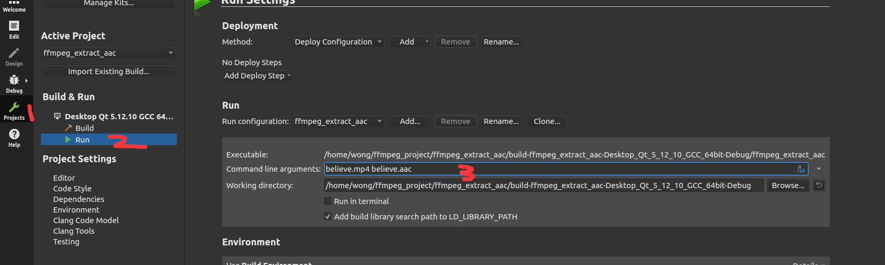

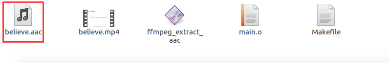 

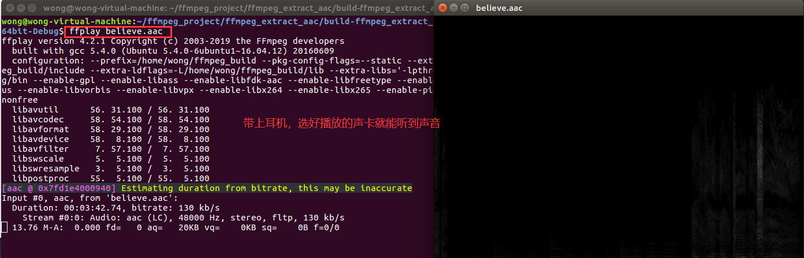 
