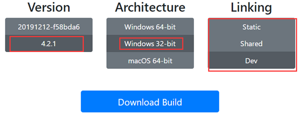
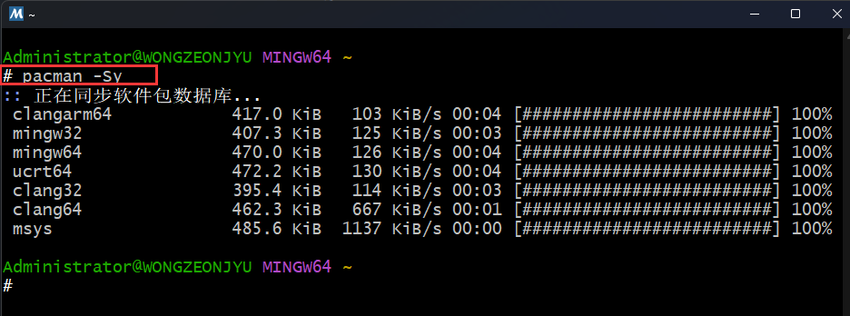
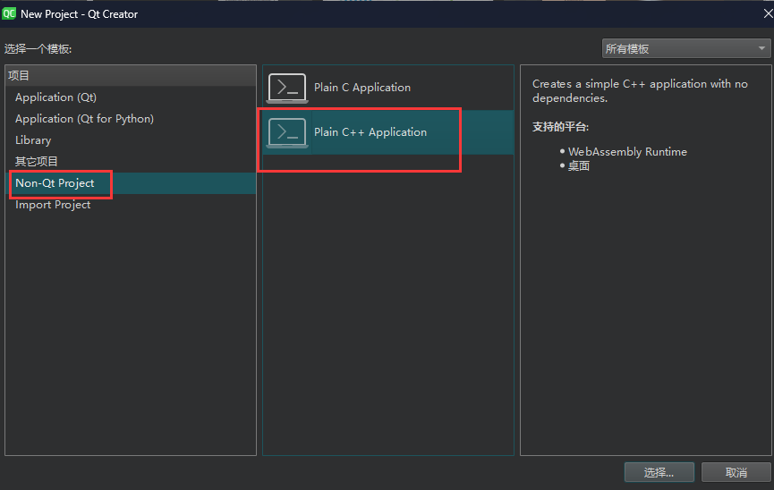

# 1.FFMPEG命令行的搭建

## 1.1 文件源码下载

[[FFMPEG官⽹]](http://ffmpeg.org/)

[[4.2.1版本源码]](https://ffmpeg.org/releases/ffmpeg-4.2.1.tar.bz2  )

[[下载已经编译好的FFMPEG]](https://ffmpeg.zeranoe.com/builds/  )

 

[[Shared : 包含FFMPEG的dll库⽂件]](https://ffmpeg.zeranoe.com/builds/win32/shared/ffmpeg-4.2.1-win32-shared.zip  )

[[Static : 包含了FFMPEG的官⽅⽂档]](https://ffmpeg.zeranoe.com/builds/win32/static/ffmpeg-4.2.1-win32-static.zip  )

[[Dev：包含FFMPEG的lib⽂件/头⽂件]](https://ffmpeg.zeranoe.com/builds/win32/dev/ffmpeg-4.2.1-win32-dev.zip  )

> ```tex
> 教程主要是使⽤32位的版本
> ```

## 1.2 搭建步骤

1. 解压ffmpeg-4.2.1-win32-shared.zip
2. 拷⻉可执⾏⽂件到C:\Windows

 

3. 拷⻉动态链接库到C:\Windows\SysWOW64

> ```tex
> WoW64 (Windows On Windows64 )是⼀个Windows操作系统的⼦系统,被设计⽤来处理许多在
> 32-bit Windows和64-bit Windows之间的不同的问题,使得可以在64-bit Windows中运⾏32-bit程序
> ```

 

4. 打开cmd命令⾏窗⼝

> ```tex
> 输⼊ffmpeg -version测试
> ```

 

> ```tex
> 对于命令⾏实战中遇到FFmpeg版本号不同的时候不⽤担⼼
> ```

# 2. VS2015安装

vs2015安装自行查阅资料

# 3. 安装QT

QT安装自行查阅资料

# 4. Windows编译FFmpeg

## 4.1 编译环境

> ```tex
> MSYS2 (Minimal SYStem 2)是⼀个MSYS的独⽴改写版本，主要⽤于 shell 命令⾏开发环境。同时它也
> 是⼀个在Cygwin(POSIX 兼容性层) 和 MinGW-w64(从"MinGW-⽣成")基础上产⽣的，追求更好的互操作性的 Windows 软件
> 。
> MSYS2 是MSYS的⼀个升级版,准确的说是集成了panman和Mingw-64的Cygwin升级版, 提供了bash
> shell等linux环境、版本控制软件（git/hg）和MinGW-w64 ⼯具链。与MSYS最⼤的区别是移植了Archlinux的软件包管理系统Pacman(其实是与Cygwin的区别)。
> ```

### 4.1.1 下载安装MSYS2  ,安装路径建议默认

> ```tex
> C:/msys64(默认路径)
> ```

## 4.1.2 修改msys2_shell.cmd文件

> ```
> 安装完成之后,先把安装⽬录下的msys2_shell.cmd中注释掉的 rem set MSYS2_PATH_TYPE=inherit 改成
> set MSYS2_PATH_TYPE=inherit ，这是为了将vs的环境继承给MSYS2。
> ```


> ```tex
> MSYS2可以选择msys或者MinGW-w64环境来编译,不过在msys下使⽤gcc编译出来的exe和dll依赖msys-2.0.dll,⽽MinGW-w64下编译出来的⽂件不需要依赖这个dll,从程序的运⾏效率来看,不依赖这个dll的程序的效率应该更⾼。所以选择MinGW-w64来编译更佳。
> ```

[[msys2下载地址]](https://www.msys2.org/)

 

> ```tex
> 版本会一直更新,直接下载就行
> ```

## 4.2 修改pacman的源  

> ```tex
> pacman是⼀个软件包管理器,⽤来在MSYS2中安装软件,但是默认的国外的源下载安装包时⾮常缓慢,⼤概只有⼗⼏⼆⼗KB的速度,⽽且还容易下载中断出错,所以需要修改为国内源,国内源可以选择中科⼤的源。
> ```

按照MSYS2镜像提示修改 , 具体如下 : 

 

> ```tex
> 注意:是在⽂件夹打开⽂件进⾏编辑,不是在shell窗⼝编辑
> ```


```tex
Server = https://mirrors.tuna.tsinghua.edu.cn/msys2/mingw/x86_64/
Server = http://mirrors.ustc.edu.cn/msys2/mingw/x86_64/
```

 

```
Server = https://mirrors.tuna.tsinghua.edu.cn/msys2/mingw/i686/
Server = http://mirrors.ustc.edu.cn/msys2/mingw/i686/
```

 

```tex
Server = https://mirrors.tuna.tsinghua.edu.cn/msys2/msys/$arch/
Server = http://mirrors.ustc.edu.cn/msys2/msys/$arch/
```

# 5. 启动命令⾏窗⼝

```tex
建议采用 Developer PowerShell for VS 20xx 或 Developer Command Prompt for VS 20xx启动
```

 

在msys2的shell中执⾏ : 

> ```bash
> pacman -Sy
> ```

 

# 6. 安装编译环境

> ```tex
> gcc编译器、git等
> msys2 遇到两类开发环境：
> 1. MSYS2 ⾃带的开发环境，安装的包叫 msys2-devel
> 2. MinGW-w64 的安装
> 这两者有什么区别呢?
> ⼀⾔以蔽之，前者编译出来的可执⾏⽂件，要依赖 MSYS2 提供的动态链接库，⽽后者不需要。下⾯详细
> 说明⼀下:
> (1) MSYS2 下的 gcc 编译环境，编译的可执⾏⽂件要依赖于 msys-2.0.dll，这个 DLL 提供了 Linux
> 下编程的提供的函数和接⼝，例如 fork 函数。
> 这个编译环境对于编译基于 Linux 下编写的软件，是⾮常适合的。例如编译 GNU 提供的各种⼯具。例
> 如，你想编译最新版本的 GNU grep ⼯具，MSYS2 下的这个环境是⾮常适合的。
> (2) ⽤ MinGW64 的编译环境，不再依赖于 msys-2.0.dll，如果源代码就是基于 windows 开发的，那
> 使⽤ MinGW 的编译环境⽐较好，编译出来的可执⾏⽂件，不⽤再依赖 MSYS 提供的动态链接库。当然，
> 前提是代码中不能使⽤ Linux 的东⻄，即 POSIX 的那套东⻄。
> ```

## 6.1 安装mingw-w64

这⾥我们只⽤MinGW

如果选择 MinGW-w64 编译则打开 MSYS2 MinGW64 , 在shell窗⼝中输⼊ : 

> ```bash
> pacman -S mingw-w64-x86_64-toolchain
> ```

然后默认全部安装即可(直接回⻋)

## 6.2 安装相关依赖工具

> ```tex
> pacman -S git
> pacman -S make
> pacman -S automake
> pacman -S autoconf
> pacman -S perl
> pacman -S libtool
> pacman -S mingw-w64-i686-cmake
> pacman -S pkg-config
> #如果需要编译出ffplayer的话，还需要安装SDL
> pacman -S mingw-w64-x86_64-SDL2
> pacman -S yasm
> pacman -S nasm
> ```

## 6.3 编译环境的其他准备⼯作

### 6.3.1 重命名link.exe

> ```tex
> 重命名 msys64/usr/bin/link.exe 为 msys64/usr/bin/link.bak , 避免和MSVC的link.exe抵触
> ```

### 6.3.2 启动命令行窗口

[请看 5.启动命令⾏窗⼝(GitHub可能跳转失败)](#5. 启动命令⾏窗⼝)

## 6.4 编译第三方库  

所有第三方库都下载到/home/xxx/下的ffmpeg文件夹

 

!!! 没有ffmpeg文件夹的请使用 ``mkdir ffmpeg`` 命令新建

用MinGW-w64版本编译

下载完5个库应该是如图 : 

 

### 6.4.1 下载和编译x264

1. 下载

> ```bash
> #下载x264或者使⽤
> #将下载下的放置于/home/xxx/ffmpeg，把第三⽅库编译的库⽂件放在 /home/xxx/ffmpeg/build
> #xxx代表你的用户名
> #如果没有ffmpeg这个文件夹,在xxx下,新建一个
> #命令:
> git clone http://git.videolan.org/git/x264.git
> ```

 

2. 编译

> ```bash
> #1
> cd x264
> #2
> ./configure --prefix=/home/xxx/ffmpeg/build/libx264 --host=x86_64-w64-mingw32 --enable-shared \
> --enable-static --extra-ldflags=-Wl,--output-def=libx264.def
> #3
> make
> #4
> make install
> ```

3. ⽣成libx264.lib

上⾯编译出来的结果没有包含lib⽂件 , 需要⾃⼰⼿⼯⽣成。
**configure** 时我们⽣成了 libx264.def 此时就派上⽤场。

> ```bash
> cp ./libx264.def /home/xxx/ffmpeg/build/libx264/lib/
> cd /home/xxx/ffmpeg/build/libx264/lib
> #若要⽣成64位lib⽂件则输⼊如下命令：
> lib /machine:X64 /def:libx264.def
> #若要⽣成32位lib⽂件则输⼊如下命令:
> #lib /machine:i386 /def:libx264.def
> ```

> ```tex
> 即得到 libx264.lib,然后将 /home/xxx/ffmpeg/build/libx264/bin/libx264-161.dll (具体名字和x264版本有关) 改名或者复制⼀份为 libx264.dll 。
> 如果想在程序中直接使⽤x264的话,将include中的.h头⽂件、 libx264.lib 和 libx264.dll 复制到项⽬中对应位置,并且在程序中添加头⽂件,然后就可以使⽤x264中的函数(⽅法)了
> ```

### 6.4.2 下载和编译fdk-aac

1. 下载fdk-aac

> ```bash
> git clone --depth 1 https://gitee.com/mirrors/fdk-aac.git
> ```

2. 编译fdk-aac

> ```bash
> #1
> cd fdk-aac
> #2
> ./autogen.sh
> #3
> ./configure --prefix=/home/xxx/ffmpeg/build/libfdk-aac --enable-static --enable-shared
> #4
> make -j4
> #5
> make install
> ```

[[libfdk_aac官⽹下载]](https://sourceforge.net/projects/opencore-amr/files/fdk-aac/)

### 6.4.3 下载编译mp3

1. 下载

> ```bash
> git clone --depth 1 https://gitee.com/hqiu/lame.git
> ```

2. 编译

> ```bash
> #1
> cd lame
> #2
> ./configure --prefix=/home/xxx/ffmpeg//build/libmp3lame --disable-shared --disable-frontend \
> --enable-static
> #3
> make
> #4
> make install
> ```

[[libmp3lame官⽹下载(选择版本>= 3.98.3)]](https://sourceforge.net/projects/lame/files/lame/  )

### 6.4.4 下载编译libvpx

1. 下载

> ```bash
> git clone --depth 1 https://github.com/webmproject/libvpx.git
> ```

2. 编译

> ```bash
> #1
> cd libvpx
> #2
> ./configure --prefix=/home/32687/ffmpeg/build/libvpx --disable-examples --disable-unit-tests \
> --enable-vp9-highbitdepth --as=yasm
> #3
> make -j4
> #4
> make install
> ```

### 6.4.5 下载和编译libx265

1. 下载

> [[x265下载地址]](https://www.x265.org/downloads/) 选择最新版就Ok

2. 编译

> ```bash
> x.x代表x265的版本号,根据自己下载的版本号进行调整
> #1
> #先修改x265_x.x\build\msys-cl下的make-Makefiles-64bit.sh
> #把target_processor='amd64'改成target_processor='x64'
> #然后在target_processor='x64'上方添加
> INSTALL_DIR="./../../../build/"
> #用于nmake install
> #2
> cd x265_x.x/build/msys-cl
> #3
> sh make-Makefiles-64bit.sh
> #4
> make -j28
> #5
> nmake install
> ```

### 6.4.6 下载和编译SDL2

1. 下载

> ```bash
> #https://github.com/libsdl-org/SDL
> #下载最新版
> SDL2-2.30.8.tar.gz linux下用
> SDL2-2.30.8.zip windows下用
> ```

2. 编译

> ```bash
> #1
> cd SDL2-xxx
> 
> #2
> ./configure --enable-static --enable-shared --prefix=/home/ubuntu/Libs/SDL2/build
> #--prefix可自行修改
> 
> #3
> make -j28
> #4
> make install
> ```

### 6.4.7 下载和编译ffmpeg

1. 下载ffmpeg

> ```bash
> git clone git://source.ffmpeg.org/ffmpeg.git
> #或者码云的链接
> git clone https://gitee.com/mirrors/ffmpeg.git
> 
> cd ffmpeg
> #查看版本
> git branch -a
> # 选择4.2版本,如果可以建议用新版本,例如目前最新是7.1
> git checkout remotes/origin/release/4.2
> git checkout remotes/origin/release/7.1
> ```

```tex
版本选择的时候需要注意,有些版本可能编译报错,原因是编译器与该版本的兼容性问题,具体问题具体解决!
```

2. 编译ffmpeg  

在/home/xxx/ffmpeg/ffmpeg 下建立 `build_ffmpeg.sh`

> ```bash
> sh build_ffmpeg.sh
> ```

> ```bash
> ./configure \
>  --prefix=/home/xxx/ffmpeg/build/libffmepg \
>  --arch=x86_64 \
>  --enable-shared \
>  --enable-gpl \
>  --enable-libfdk-aac \
>  --enable-nonfree \
>  --enable-libvpx \
>  --enable-libx264 \
>  --enable-libx265 \
>  --enable-libmp3lame \
>  --enable-sdl2 \
>  --extra-cflags="-I/home/xxx/ffmpeg/build/libfdk-aac/include" \
>  --extra-ldflags="-L/home/xxx/ffmpeg/build/libfdk-aac/lib" \
>  --extra-cflags="-I/home/xxx/ffmpeg/build/libvpx/include" \
>  --extra-ldflags="-L/home/xxx/ffmpeg/build/libvpx/lib" \
>  --extra-cflags="-I/home/xxx/ffmpeg/build/libx264/include" \
>  --extra-ldflags="-L/home/xxx/ffmpeg/build/libx264/lib" \
>  --extra-cflags="-I/home/xxx/ffmpeg/build/libx265/include" \
>  --extra-ldflags="-L/home/xxx/ffmpeg/build/libx265/lib" \
>  --extra-cflags="-I/home/xxx/ffmpeg/build/libmp3lame/include" \
>  --extra-ldflags="-L/home/xxx/ffmpeg/build/libmp3lame/lib" \
>  --extra-cflags="-I/home/xxx/ffmpeg/build/SDL2/include" \
>  --extra-ldflags="-L/home/xxx/ffmpeg/build/SDL2/lib"
> 
> #j16代表使用多少个线程编译,看自己电脑情况而定
> make -j16
> 
> make install
> ```

## 7.使用QT编写测试程序

1. 新建C++工程 , 选择 `Non-QT-Project`

    

2. 编译完后把 `/home/xxx/ffmpeg/build/` 下的 `libffmepg` 整个文件夹复制到QT工程带 `*.pro` 文件下的地方

3. 修改 `*.pro`

> ```bash
> TEMPLATE = app
> CONFIG += console c++17
> CONFIG -= app_bundle
> CONFIG -= qt
> 
> SOURCES += \
>         main.cpp
> #=====================================================================================#
> #分割线以上的内容不需要动,下面是添加头文件路径、库路径以及库名字
> #具体路径根据自己的实际情况调整
> INCLUDEPATH += \
>         $$PWD/ffmepg-6.1/include
> 
> LIBS += $$PWD/ffmepg-6.1/bin/avformat.lib \
>         $$PWD/ffmepg-6.1/bin/avcodec.lib \
>         $$PWD/ffmepg-6.1/bin/avdevice.lib \
>         $$PWD/ffmepg-6.1/bin/avfilter.lib \
>         $$PWD/ffmepg-6.1/bin/avutil.lib \
>         $$PWD/ffmepg-6.1/bin/swresample.lib \
>         $$PWD/ffmepg-6.1/bin/swscale.lib
> ```

3. 测试文件

> ```c++
> #include <iostream>
> // 包含ffmpeg头⽂件
> extern "C" {
> #include "libavutil/avutil.h"
> }
> 
> int main()
> {
>     cout << "Hello FFMPEG, version is" << av_version_info() << "\n";
>     return 0;
> }
> ```

