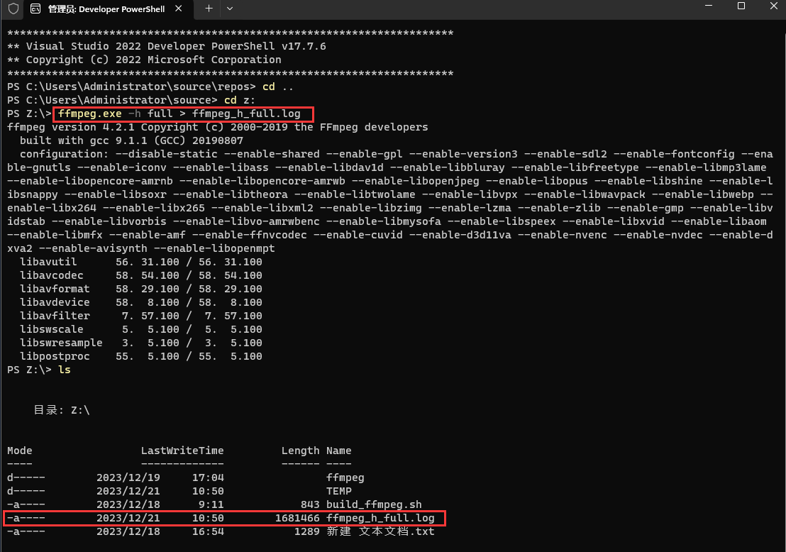
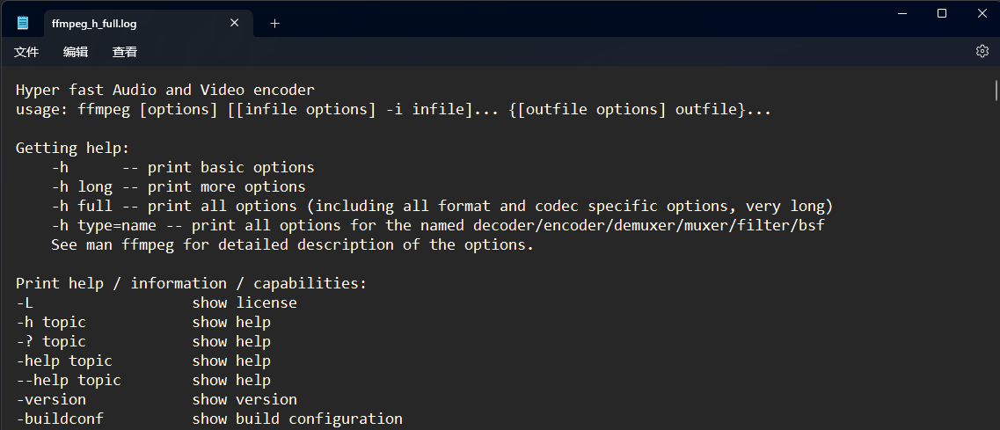

# 1. ffmpeg / ffplay / ffprobe区别

* ffmpeg:
  Hyper fast Audio and Video encoder (超快音视频编码器 (类似爱剪辑))

* ffplay:

  Simple media player (简单媒体播放器)

* ffprobe:
  Simple multimedia streams analyzer (简单多媒体流分析器)

# 2. ffmpeg命令查看帮助文档

* 基本信息 : `ffmpeg -h`
* 高级信息 : `ffmpeg -h long`
* 所有信息 : `ffmpeg -h full`

> ```tex
> 小技巧:ffmepg -h full > ffmpeg_h_full.log，然后再打开ffmpeg_h_full.log文件查看
> ```

* usage : `ffmpeg [options] [[infile options] -i infile]... {[outfile options] outfile}...`

 

 

# 3. ffplay命令查看帮助文档

* 所有信息 : `ffplay -h`
* usage : `ffplay [options] input_file`

> ```bash
> #例子:
> ffplay -h > ffplay_h.log
> ```

# 4. ffprobe命令查看帮助文档

* 所有信息 :  `ffprobe -h`
* usage : `ffprobe [OPTIONS] [INPUT_FILE] `

* ffmpeg/ffplay/ffprobe 部分参数通用 , 部分参数不通用 , 在使用时需要注意。