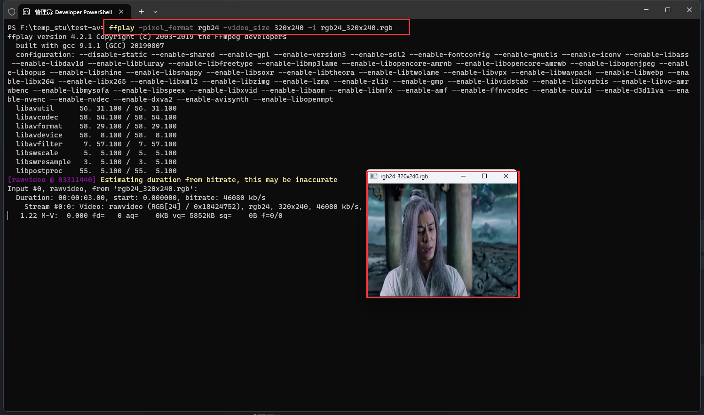

# 1. **ffmpeg** 命令提取像素格式和 **PCM** 数据

 输入视频

 

## 1.1 提取 **YUV**

* 提取**3**秒数据 , 分辨率和源视频一致

> ```bash
> ffmpeg -i test_1280x720.mp4 -t 3 -pix_fmt yuv420p yuv420p_orig.yuv
> ```

 

播放时候 , 需要设置分辨率 , 分辨率设置成原来的大小的分辨率

 

* 提取**3**秒数据 , 分辨率转为 **320x240**

> ```bash
> ffmpeg -i test_1280x720.mp4 -t 3 -pix_fmt yuv420p -s 320x240 yuv420p_320x240.yuv
> ```

 

由于指定了分辨率 , 通过 `YUV Player Deluxe` 播放的时候不需要设置分辨率

> ```bash
> #如果用ffplay播放,不管提取的时候是否设定了分辨率,必须用 -video_size 或 -s 参数指定分辨率,例:
> ffplay -pixel_format yuv420p -video_size 1280x720 yuv420p_orig.yuv
> #生成出来的yuv文件,如果手动在文件名加上分辨率,也是可以播放,但是要加对
> #例子:xxx.yuv ===> xxx_320x240.yuv 就可以播放
> ```

## 1.2 提取 **RGB**

* 提取**3**秒数据 , 分辨率转为 **320x240**

> ```bash
> ffmpeg -i test.mp4 -t 3 -pix_fmt rgb24 -s 320x240 rgb24_320x240.rgb
> ```

 

1. 播放rgb命令

> ```bash
> ffplay -pixel_format rgb24 -video_size 320x240 -i rgb24_320x240.rgb
> ```

2. 播放效果

 

## 1.3 **RGB**和**YUV**之间的转换

> ```bash
> ffmpeg -s 1280x720 -pix_fmt yuv420p -i yuv420p_orig_1280x720.yuv -pix_fmt rgb24 rgb24_1280x720.rgb
> ```

  

1. 播放 rgb 命令

> ```bash
> ffplay -pixel_format rgb24 -video_size 1280x720 -i rgb24_1280x720.rgb
> ```

2. 播放效果

 

## 1.4 提取 **PCM**

> ```bash
> #1
> ffmpeg -i buweishui.mp3 -ar 48000 -ac 2 -f s16le 48000_2_s16le.pcm
> #2
> ffmpeg -i buweishui.mp3 -ar 48000 -ac 2 -sample_fmt s16 out_s16.wav
> #3
> ffmpeg -i buweishui.mp3 -ar 48000 -ac 2 -codec:a pcm_s16le out2_s16le.wav
> #4
> ffmpeg -i buweishui.mp3 -ar 48000 -ac 2 -f f32le 48000_2_f32le.pcm
> #5
> ffmpeg -i test.mp4 -t 10 -vn -ar 48000 -ac 2 -f f32le 48000_2_f32le_2.pcm
> ```

1. 48000_2_s16le.pcm

 

 

2. out_s16.wav

 

 

3. out2_s16le.wav

 

 

4. 48000_2_f32le.pcm

 

 

