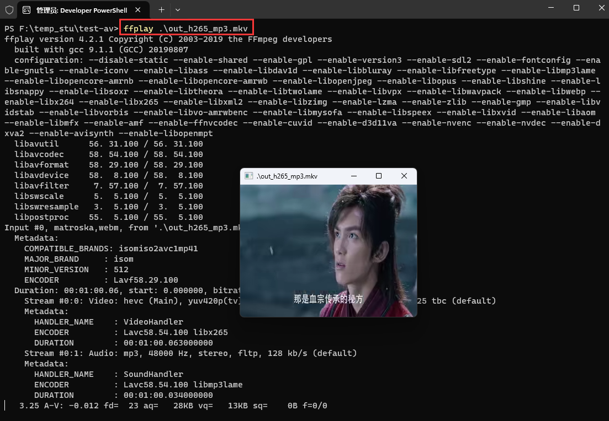
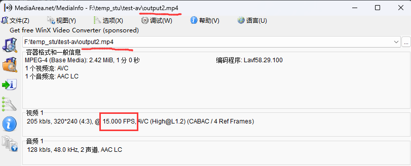
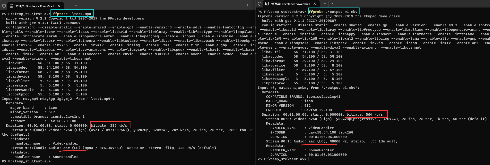

# 1. 保持编码格式

> ```bash
> ffmpeg -i test.mp4 -vcodec copy -acodec copy test_copy.ts 
> ffmpeg -i test.mp4 -codec copy test_copy2.ts
> ```

# 2. 改变编码格式

> ```bash
> ffmpeg -i test.mp4 -vcodec libx265 -acodec libmp3lame out_h265_mp3.mkv
> ```

 

 

 

# 3. 修改帧率

> ```bash
> #下面是错误命令,因为帧率修改需要重新编码,带上-codec copy之后,不会重新编码,帧率修改失败
> ffmpeg -i test.mp4 -r 15 -codec copy output.mp4 
> #下面是正确的命令(视频会被重新编码)
> ffmpeg -i test.mp4 -r 15 output2.mp4
> ```

## 3.1 错误命令出来的结果

 

## 3.2 正确命令出来的结果

 

 

# 4. 修改视频码率

> ```bash
> ffmpeg -i test.mp4 -b 400k output_b.mkv(此时音频也被重新编码)
> #或
> ffmpeg -i test.mp4 -b:v 400k output_bv.mkv
> #如果需要保持原来的音频格式则需要加上-acodec copy
> ffmpeg -i test.mp4 -b 400k -acodec copy output_b1.mkv
> #或
> ffmpeg -i test.mp4 -b:v 400k -acodec copy output_b1.mkv
> ```

## 4.1 码率修改(音频格式被重新编码)

 

## 4.2 码率修改(音频格式保持原样)



# 5. 修改音频码率

> ```bash
> ffmpeg -i test.mp4 -b:a 192k output_ba.mp4 
> #如果不想重新编码video,需要加上-vcodec copy
> ```

# 6. 修改音视频码率

> ```bash
> ffmpeg -i test.mp4 -b:v 400k -b:a 192k output_bva.mp4
> ```

# 7. 修改视频分辨率

> ```bash
> ffmpeg -i test.mp4 -s 480x270 output_480x270.mp4
> ```

# 8. 修改音频采样率

> ```bash
> ffmpeg -i test.mp4 -ar 44100 output_44100hz.mp4
> ```

