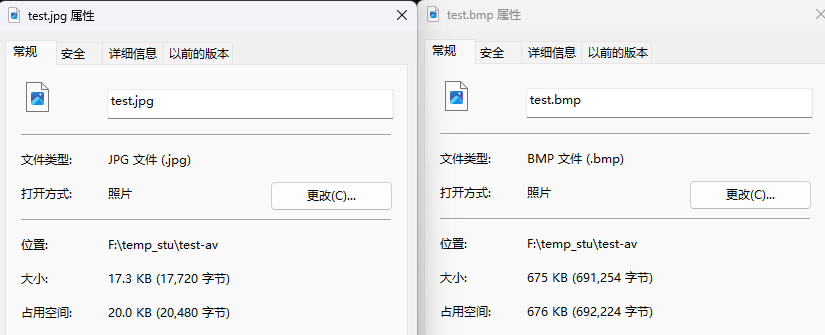

# 1. 截取一张图片

>```bash
>ffmpeg -i test.mp4 -y -f image2 -ss 00:00:02 -vframes 1 -s 640x360 test.jpg 
>ffmpeg -i test.mp4 -y -f image2 -ss 00:00:02 -vframes 1 -s 640x360 test.bmp
>```

* `-i` 输入
* `-y` 覆盖
* `-f` 格式
  * `image2` 一种格式
* `-ss` 启始值
* `-vframes` 帧 , 如果大小1那么 输出加 `%03d` , 例如 : `test%03d.jpg`
* `-s` 格式大小size

 

# 2. 转换视频为图片 (每帧一张图) :

>```bash
>ffmpeg -i test.mp4 -t 5 -s 640x360 -r 15 frame%03d.jpg
>```

> ```tex
> %03d,d代表整数,%后面的03代表0xx顺序,比如上面的命令frame001.jpg frame002.jpg frame00n.jpg
> ```

# 3. 图片转换为视频

> ```bash
> ffmpeg -f image2 -i frame%03d.jpg -r 25 video.mp4
> ```


# 4. fmpeg命令GIF和视频转换

> ```bash
> ffmpeg -f gif -i image2.gif image2.mp4
> ```


