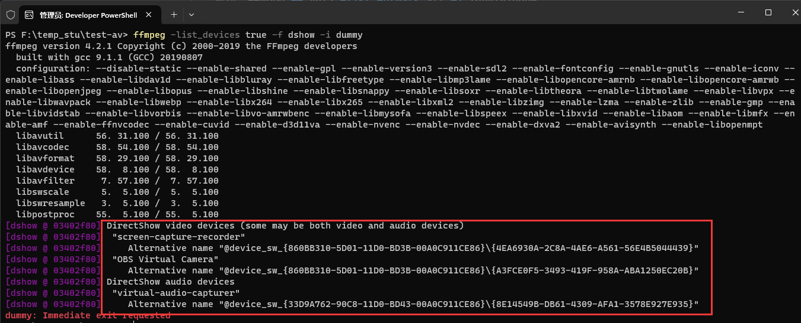
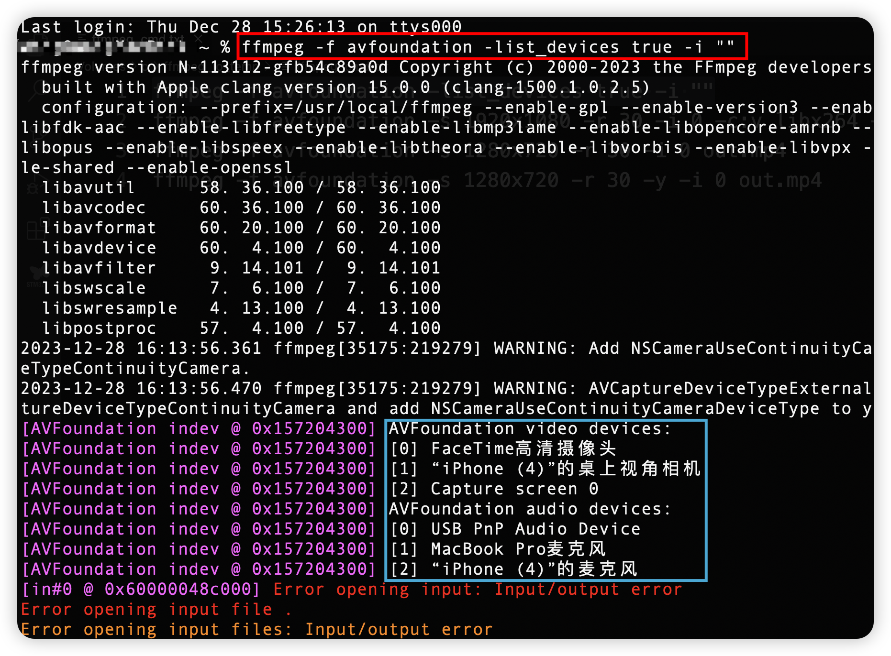

# 1. ffmpeg命令视频录制(Windows)

# 1.1 先安装dshow软件 Screen Capturer Recorder

* [[项目地址链接]](https://sourceforge.net/projects/screencapturer/files/)
* 然后查看可用设备名字 

> ```bash
> #Windows
> ffmpeg -list_devices true -f dshow -i dummy
> #macos
> ffmpeg -f avfoundation -list_devices true -i ""
> 
> #linux(ubuntu)
> 视频: ffmpeg -f v4l2 -list_formats all -i /dev/video0
> 音频: ffmpeg -f alsa -list_devices true -i ""
> ```

* windows显示采集设备列表 : 

 

* macOS显示采集设备列表 : 

#   2. 音视频录制

## 2.1 录制视频 (默认参数)

* 桌面 

> ```bash
> #windows
> ffmpeg -f dshow -i video="screen-capture-recorder" v-out.mp4
> #macos
> ffmpeg -f avfoundation -s 1920x1080 -r 30 -i 2 -c:v libx264 -pix_fmt yuyv422 -y output.ts
> ffmpeg -f avfoundation -s 1920x1080 -r 30 -i "2:none" -c:v libx264 -pix_fmt yuyv422 -y output.ts
> ```

> ```tex
> 针对MACOS说明
> 这个命令将捕捉屏幕内容并保存为output.mp4文件。参数`-i "0:none"`表示捕捉屏幕,而不捕捉任何声音,也可以-i 0,
> 命令如果没有加入相关录音的选项,基本上不会录音,如果视频与音频一起录制,下面会有讲解
> -i 参数取决于avfoundation video devices的列表顺序
> ```

* 摄像头 

> ```bash
> #window
> ffmpeg -f dshow -i video="Integrated Webcam" -y v-out2.flv
> #(要根据自己的摄像头名称)
> #macos
> ffmpeg -f avfoundation -s 1920x1080 -r 30 -i 0 -c:v libx264 -pix_fmt yuyv422 -y output.ts
> ffmpeg -f avfoundation -s 1920x1080 -r 30 -i "0:none" -c:v libx264 -pix_fmt yuyv422 -y output.ts
> ```

## 2.2 录制声音 (默认参数)

* 系统声音 

> ```bash
> #winodw
> ffmpeg -f dshow -i audio="virtual-audio-capturer" a-out.aac
> #macos
> ```

* 麦克风声音 : 

> ```bash
> #window
> ffmpeg -f dshow -i audio="麦克风 (Realtek Audio)" output.wav
> #macos
> ffmpeg -f avfoundation -i ":1" -acodec pcm_s16le output.wav
> ```

* 系统+麦克风声音 : 

> ```bash
> #window
> ffmpeg -f dshow -i audio="麦克风 (Realtek Audio)" -f dshow -i audio="virtual-audio-capturer" -filter_complex amix=inputs=2:duration=first:dropout_transition=2 a-out2.aac
> #macos
> ffmpeg -f avfoundation -video_device_index 0 -r 30 -s 1920x1080 -i :1 out.mp4
> ffmpeg -f avfoundation -s 1920x1080 -r 30 -i 0 -f avfoundation -i :1 output.mp4
> ```

## 2.3 同时录制声音和视频

> ```bash
> #windows
> ffmpeg -f dshow -i audio="麦克风 (Realtek Audio)" -f dshow -i audio="virtualaudio-capturer" -filter_complex amix=inputs=2:duration=first:dropout_transition=2 -f dshow -i video="screen-capture-recorder" -y av-out.flv
> #macos
> ffmpeg -f avfoundation -video_size 1920x1080 -framerate 30 -i "1:none" -f avfoundation -i ":0" output.mp4
> ```

> ```tex
> 针对MACOS说明
> 这个命令将录制屏幕和系统声音，并将其保存为output.mp4文件。参数`-i "1:none"`表示捕捉屏幕，而参数`-i ":0"`表示捕捉系统声音。
> 请注意，捕捉系统声音可能会受到MacOS的权限设置的限制。在某些情况下，您可能需要调整系统设置以允许应用程序捕获系统声音。也请确保已经安装好OBS Virtual Camera。
> ```

# 3. 查看视频录制的可选参数

> ```bash
> ffmpeg -f dshow -list_options true -i video="screen-capture-recorder"
> ```

# 4. 查看音频设备可选参数

> ```bash
> ffmpeg -f dshow -list_options true -i audio="virtual-audio-capturer“
> ffmpeg -f dshow -list_options true -i audio="麦克风 (Realtek Audio)"
> ```

# 5. 指定参数录制音视频

> ```bash
> ffmpeg -f dshow -i audio="麦克风 (Realtek Audio)" -f dshow -i audio="virtual-audio-capturer" -filter_complex amix=inputs=2:duration=first:dropout_transition=2 -f dshow -video_size 1920x1080 -framerate 15 -pixel_format yuv420p -i video="screen-capturerecorder" -vcodec h264_qsv -b:v 3M -y av-out.flv
> 
> ```

> ```bash
> ffmpeg -f dshow -i audio="麦克风 (Realtek Audio)" -f dshow -i audio="virtual-audio-capturer" -filter_complex amix=inputs=2:duration=first:dropout_transition=2 -f dshow -i video="screen-capture-recorder" -vcodec h264_qsv -b:v 3M -r 15 -y avout2.mp4
> 
> ```

> ```bash
> ffmpeg -f dshow -i audio="麦克风 (Realtek Audio)" -f dshow -i audio="virtual-audio-capturer" -filter_complex amix=inputs=2:duration=first:dropout_transition=2 -f dshow -framerate 15 -pixel_format yuv420p -i video="screen-capture-recorder" -vcodec h264_qsv -b:v 3M -r 15 -y av-out3.mp4
> 
> ```


