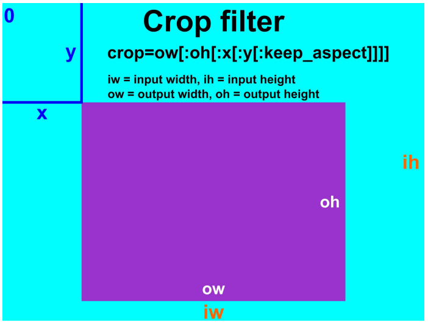
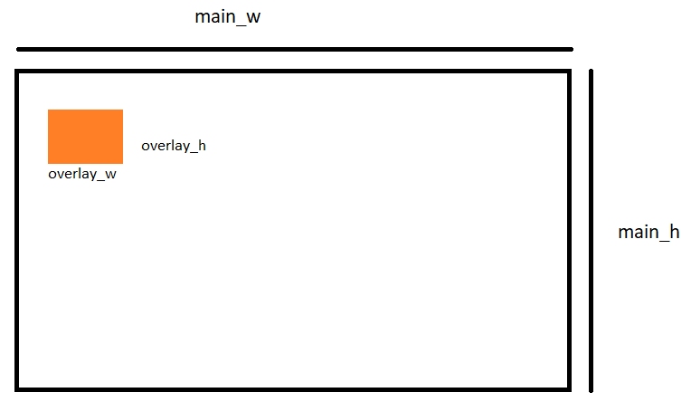
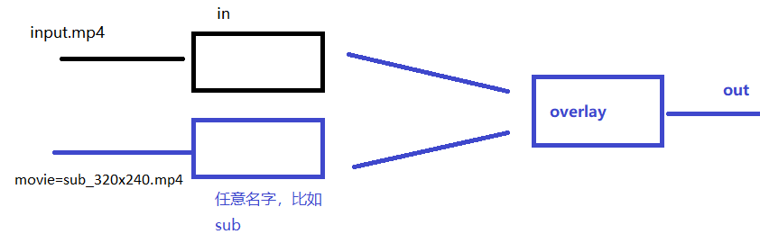
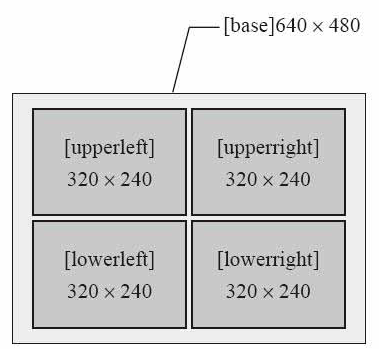
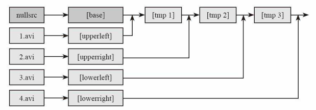

# 1. FFmpeg 滤镜  

## 1.1 filter 的分类  

* 按照处理数据的类型 , 通常多媒体的 filter 分为 : 
  * 音频 filter
  * 视频 filter
  * 字幕 filter

* 另一种按照处于编解码器的位置划分 : 
  * prefilters : used before encoding
  * intrafilters : used while encoding (and are thus an integral part of a video codec)
  * postfilters : used after decoding

* FFmpeg 中 filter 分为 : 
  * source filter (只有输出)
  * audio filter
  * video filter
  * Multimedia filter
  * sink filter (只有输入)
  * 除了 source 和 sink filter , 其他 filter 都至少有一个输入、至少一个输出。

## 1.2 视频裁剪  

视频过滤器 (滤镜) : 裁剪

 

| 描述 | 将输入视频帧的宽度和高度从 x 和 y 值表示的位置裁剪到指定的宽度和高度 ; x 和 y 是输出的左上角坐标，协调系统的中心是输入视频帧的左上角。 如果使用了可选的 keep_aspect 参数，将会改变输出SAR (样本宽比) 以补偿新的 DAR (显示长宽比) |
| ---- | ------------------------------------------------------------ |
| 语法 | crop=ow[:oh[:x[:y[:keep_aspect]]]]                           |

| 变量       | 用于 ow 和 oh 参数的表达式中的可用变量                       |
| ---------- | ------------------------------------------------------------ |
| x, y       | 对 x 的计算值 (从左上角水平方向的像素个数) 和 y (垂直像素的数量) , 对每个帧进行评估， x 的默认值为 (iw - ow) / 2 , y的默认值为 (ih - oh) / 2 |
| in_w, iw   | 输入的宽度                                                   |
| in_h, ih   | 输入的高度                                                   |
| out_w, ow  | 输出(裁剪)宽度 , 默认值= iw                                  |
| out_h, oh  | 输出(裁剪)高度 , 默认值= ih                                  |
| a          | 纵横比 , 与 iw/ih 相同                                       |
| sar        | 输入样本比例                                                 |
| dar        | 输入显示宽比 , 等于表达式 a*sar                              |
| hsub, vsub | 水平和垂直的色度子样本值 , 对于像素格式 yuv422p , hsub 的值为 2 , vsub 为 1 |
| n          | 输入帧的数目 , 从 0 开始                                     |
| pos        | 位置在输入框的文件中 , 如果不知道 NAN                        |
| t          | 时间戳以秒表示，如果输入时间戳未知                           |

> ```bash
> #ow 的值可以从 oh 得到,反之亦然1,但不能从 x 和 y 中得到,因为这些值是在 ow 和 oh 之后进行的。x 的值可以从 y 的值中得到,反之亦然。例如,在输入框的左三、中三和右三，我们可以使用命令:
> ffmpeg -i input -vf crop=iw/3:ih:0:0 output
> ffmpeg -i input -vf crop=iw/3:ih:iw/3:0 output
> ffmpeg -i input -vf crop=iw/3:ih:iw/3*2:0 output
> ```

练习题 : 

1. 裁剪 100x100 的区域，起点为(12,34)

   > ```bash
   > crop=100:100:12:34
   > #相同效果:
   > crop=w=100:h=100:x=12:y=34
   > ```

2. 裁剪中心区域，大小为 100x100

   > ```bash
   > crop=100:100
   > ```

   

> ```tex
> 练习题：
> 
> 
> (3)裁剪中心区域，大小为输入视频的 2/3
> crop=2/3*in_w:2/3*in_h
> (4)裁剪中心区域的正方形，高度为输入视频的高
> crop=out_w=in_h
> crop=in_h
> (5)裁剪偏移左上角 100 像素
> crop=in_w-100:in_h-100:100:100
> (6)裁剪掉左右 10 像素，上下 20 像素
> crop=in_w-2*10:in_h-2*20
> (7)裁剪右下角区域
> crop=in_w/2:in_h/2:in_w/2:in_h/2
> ```

## 1.3 FFmpeg 滤镜 Filter 内置变量

> ```tex
> 在使用 Filter 时,经常会用到根据时间轴进行操作的需求,在使用 FFmpeg 的 Filter 时可以使用 Filter 的时间相关的内置变量,下面先来了解一下这些相关的变量,见下表
> ```

| 变量 | 说明                                              |
| ---- | ------------------------------------------------- |
| t    | 以秒表示的时间戳 , 如果输入的时间是未知的则是 NAN |
| n    | 输入帧的顺序编号 , 从 0 开始                      |
| pos  | 输入帧的位置 , 如果未知的则是 NAN                 |
| w    | 输入视频帧的宽度                                  |
| h    | 输入视频帧的高度                                  |

## 1.4 添加水印

### 1.4.1 文字水印

> ```tex
> 在视频中增加文字水印需要准备的条件比较多,需要有文字字库处理的相关文件,在编译 FFmpeg 时需要支持
> FreeType、FontConfig、iconv,系统中需要有相关的字库,在 FFmpeg 中增加纯字母水印可以使用 drawtext滤镜进行支持,下面就来看一下 drawtext 的滤镜参数,具体见下表
> ```

| 参数     | 类型   | 说明                        |
| -------- | ------ | --------------------------- |
| text     | 字符串 | 文字                        |
| textfile | 字符串 | 文字文件                    |
| box      | 布尔   | 文字区域背景框 (缺省 false) |
| boxcolor | 色彩   | 展示字体区域块的颜色        |
| font     | 字符串 | 字体名称 (默认为 Sans 字体) |
| fontsize | 整数   | 显示字体的大小              |
| x        | 字符串 | 缺省为 0                    |
| y        | 字符串 | 缺省为 0                    |
| alpha    | 浮点数 | 透明度(默认为 1) , 值从 0~1 |

> ```bash
> #(1)将文字的水印加在视频的左上角:
> ffplay -i input.mp4 -vf "drawtext=fontsize=100:fontfile=FreeSerif.ttf:text='hello world':x=20:y=20"
> 
> #将字体的颜色设置为绿色：
> ffplay -i input.mp4 -vf "drawtext=fontsize=100:fontfile=FreeSerif.ttf:text='hello world':fontcolor=green"
> 
> #如果想调整文字水印显示的位置,调整 x 与 y 参数的数值即可。
> ffplay -i input.mp4 -vf "drawtext=fontsize=100:fontfile=FreeSerif.ttf:text='hello
> world':fontcolor=green:x=400:y=200"
> 
> #修改透明度
> ffplay -i input.mp4 -vf "drawtext=fontsize=100:fontfile=FreeSerif.ttf:text='hello
> world':fontcolor=green:x=400:y=200:alpha=0.5"
> 
> #(2)文字水印还可以增加一个框,然后给框加上背景颜色:
> 
> ffplay -i input.mp4 -vf "drawtext=fontsize=100:fontfile=FreeSerif.ttf:text='hello
> world':fontcolor=green:box=1:boxcolor=yellow"
> 
> #至此,文字水印的基础功能已经添加完成。
> 
> #(3)有些时候文字水印希望以本地时间作为水印内容，可以在 drawtext 滤镜中配合一些特殊用法来
> 完成，在 text 中显示本地当前时间，格式为年月日时分秒的方式
> 
> ffplay -i input.mp4 -vf
> "drawtext=fontsize=60:fontfile=FreeSerif.ttf:text='%{localtime\:%Y\-%m\-%d %H-%M-%S}':fontcolor=green:box=1:boxcolor=yellow"
> 
> #在使用 ffmpeg 转码存储到文件时需要加上-re，否则时间不对。
> ffmpeg -re -i input.mp4 -vf
> "drawtext=fontsize=60:fontfile=FreeSerif.ttf:text='%{localtime\:%Y\-%m\-%d %H-%M-%S}':fontcolor=green:box=1:boxcolor=yellow" out.mp4
> 
> #(4)在个别场景中,需要定时显示水印,定时不显示水印,这种方式同样可以配合 drawtext 滤镜进行处理,使用 drawtext 与 enable 配合即可,例如每 3 秒钟显示一次文字水印:
> ffplay -i input.mp4 -vf "drawtext=fontsize=60:fontfile=FreeSerif.ttf:text='test':fontcolor=green:box=1:boxcolor=yellow:enable=lt(mod(t\,3)\,1)"
> 
> #在使用ffmpeg转码存储到文件时需要加上-re,否则时间不对
> 
> lt(x, y) Return 1 if x is lesser than y, 0 otherwise.
> mod(x, y) Compute the remainder of division of x by y.
> 
> (5) 跑马灯效果
> ffplay -i input.mp4 -vf
> "drawtext=fontsize=100:fontfile=FreeSerif.ttf:text='helloworld':x=mod(100*t\,w):y=abs(sin(t))*h*0.7"
> 
> 修改字体透明度,修改字体颜色
> ffplay -i input.mp4 -vf
> "drawtext=fontsize=40:fontfile=FreeSerif.ttf:text='liaoqingfu':x=mod(50*t\,w):y=abs(sin(t))*h*0.7:alpha=0.5:fontcolor=white:enable=lt(mod(t\,3)\,1)"
> ```

[[表达式参考]](http://www.ffmpeg.org/ffmpeg-utils.html 3 Expression Evaluation)

### 1.4.2 图片水印

> ```tex
> FFmpeg 除了可以向视频添加文字水印之外,还可以向视频添加图片水印、视频跑马灯等,本节将重点介绍如何为视频添加图片水印;为视频添加图片水印可以使用 movie 滤镜,下面就来熟悉一下 movie 滤镜的参数,如下表 所示。
> ```

| 参数             | 类型     | 说明                                 |
| ---------------- | -------- | ------------------------------------ |
| filename         | 字符串   | 输入的文件名，可以是文件，协议，设备 |
| format_name, f   | 字符串   | 输入的封装格式                       |
| stream_index, si | 整数     | 输入的流索引编号                     |
| seek_point, sp   | 浮点数   | Seek 输入流的时间位置                |
| streams, s       | 字符串   | 输入的多个流的流信息                 |
| loop             | 整数     | 循环次数                             |
| discontinuity    | 时间差值 | 支持跳动的时间戳差值                 |

> ```bash
> ffmpeg -i input.mp4 -vf "movie=logo.png[watermark];[in[watermark]overlay=x=10:y=10[out]" output.mp4
> ```

* 原始视频文件路径 : input.mp4
* 水印图片路径 : logo.png
* 水印位置 : (x,y)=(10,10)<=(left,top)距离左侧、顶部各 10 像素；
* 输出文件路径 : output.mp4  

| 参数      | 说明             |
| --------- | ---------------- |
| main_w    | 视频单帧图像宽度 |
| main_h    | 视频单帧图像高度 |
| overlay_w | 水印图片的宽度   |
| overlay_h | 水印图片的高度   |

对应地可以将 overlay 参数设置成如下值来改变水印图片的位置 : 

| 水印图片位置 | overlay 值                              |
| ------------ | --------------------------------------- |
| 左上角       | 10:10                                   |
| 右上角       | main_w-overlay_w-10:10                  |
| 左下角       | 10:main_h-overlay_h-10                  |
| 右下角       | main_w-overlay_w-10:main_h-overlay_h-10 |

 

> ```tex
> 在 FFmpeg 中加入图片水印有两种方式，一种是通过 movie 指定水印文件路径，另外一种方式是通过
> filter 读取输入文件的流并指定为水印，这里重点介绍如何读取 movie 图片文件作为水印
> ```

(1) 图片 logo.png 将会打入到 input.mp4 视频中 ,  显示在 x 坐标 50、 y 坐标 20 的位置

> ```bash
> ffplay -i input.mp4 -vf "movie=logo.png[logo];[in][logo]overlay=50:10[out]"
> ```

由于 logo.png 图片的背景色是白色 , 所以显示起来比较生硬 , 如果水印图片是透明背景的 , 效果会更好,
下面找一张透明背景色的图片试一下 : 

> ```bash
> ffplay -i input.mp4 -vf "movie=logo2.png[watermark];[in][watermark]overlay=50:10[out]"
> ```

(2) 显示位置

> ```bash
> ffplay -i input.mp4 -vf "movie=logo.png[watermark];[in][watermark]overlay=10:10[out]"
> 
> ffplay -i input.mp4 -vf "movie=logo.png[watermark];[in][watermark]overlay=main_w-overlay_w-10:10[out]"
> 
> ffplay -i input.mp4 -vf "movie=logo.png[watermark];[in][watermark]overlay=10:main_h-overlay_h-10[out]"
> 
> ffplay -i input.mp4 -vf "movie=logo.png[watermark];[in][watermark]overlay=main_w-overlay_w-10:main_hoverlay_h-10[out]"
> ```

(3) 跑马灯效果

> ```bash
> ffplay -i input.mp4 -vf "movie=logo.png[watermark];[in][watermark]overlay=x=mod(50*t\,main_w):y=abs(sin(t))*h*0.7[out]"
> ```

### 1.4.3 FFmpeg 生成画中画

> ```tex
> 在使用 FFmpeg 处理流媒体文件时,有时需要使用画中画的效果。在 FFmpeg 中,可以通过 overlay 将
> 多个视频流、多个多媒体采集设备、多个视频文件合并到一个界面中,生成画中画的效果。在前面的滤镜
> 使用中,以至于以后的滤镜使用中,与视频操作相关的处理,大多数都会与 overlay 滤镜配合使用,尤其是
> 用在图层处理与合并场景中,下面就来了解一下 overlay 的参数,具体见下表
> ```

| 参数       | 类型   | 说明                                                         |
| ---------- | ------ | ------------------------------------------------------------ |
| x          | 字符串 | X 坐标                                                       |
| y          | 字符串 | Y 坐标                                                       |
| eof_action | 整数   | 遇到 eof 表示时的处理方式，默认为重复 ➢ repeat(值为 0)：重复前一帧 ➢ endcall(值为 1)：停止所有的流 ➢ pass(值为 2)：保留主图层 |
| shortest   | 布尔   | 终止最短的视频时全部终止(默认 false)                         |
| format     | 整数   | 设置 output 的像素格式，默认为 yuv420 ➢ yuv420 (值为 0) ➢ yuv422 (值为 1) ➢ yuv444 (值为 2) ➢ rgb (值为 3) |

> ```tex
> 从参数列表中可以看到,主要参数并不多,但实际上在 overlay 滤镜使用中,还有很多组合的参数可以使用,可以使用一些内部变量,例如 overlay 图层的宽、高、坐标等。
> ```

 

(1) 显示画中画效果

> ```bash
> ffplay -i input.mp4 -vf "movie=sub_320x240.mp4[sub];[in][sub]overlay=x=20:y=20[out]"
> 
> ffplay -i input.mp4 -vf "movie=sub_320x240.mp4[sub];[in][sub]overlay=x=20:y=20:eof_action=1[out]"
> 
> ffplay -i input.mp4 -vf "movie=sub_320x240.mp4[sub];[in][sub]overlay=x=20:y=20:shortest =1[out]"
> ```

缩放子画面尺寸

> ```bash
> ffplay -i input.mp4 -vf "movie=sub_320x240.mp4,scale=640x480[sub];[in][sub]overlay=x=20:y=20[out]"
> ```

(2) 跑马灯

> ```bash
> ffplay -i input.mp4 -vf "movie=sub_320x240.mp4[test];[in][test]overlay=
> x=mod(50*t\,main_w):y=abs(sin(t))*main_h*0.7[out]"
> ```

### 1.4.4 FFmpeg 视频多宫格处理

> ```tex
> 视频除了画中画显示,还有一种场景为以多宫格的方式呈现出来,除了可以输入视频文件,还可以输入视
> 频流、采集设备等。从前文中可以看出进行视频图像处理时, overlay 滤镜为关键画布,可以通过 FFmpeg9
> 建立一个画布,也可以使用默认的画布。如果想以多宫格的方式展现,则可以自己建立一个足够大的画布,
> 下面就来看一下多宫格展示的例子:
> ```

> ```bash
> ffmpeg -i 1.mp4 -i 2.mp4 -i 3.mp4 -i 4.mp4 -filter_complex "nullsrc=size=640x480[base];[0:v] setpts=PTSSTARTPTS,scale=320x240[upperleft];[1:v]setpts=PTS-STARTPTS,scale=320x240[upperright];[2:v]setpts=PTSSTARTPTS, scale=320x240[lowerleft];[3:v]setpts=PTSSTARTPTS,scale=320x240[lowerright];[base][upperleft]overlay=shortest=1[tmp1];[tmp1][upperright]overlay=
> shortest=1:x=320[tmp2];[tmp2][lowerleft]overlay=shortest=1:y=240[tmp3];[tmp3][lowerright]overlay=shortest=1:x=320:y=240" out.mp4
> ```

> ```tex
> 1.2.3.4.mp4 为文件路径,out.MP4 为输出文件路径,通过 nullsrc 创建 overlay 画布,画布大小 640:480,使用[0:v][1:v][2:v][3:v]将输入的 4 个视频流去除,分别进行缩放处理,然后基于 nullsrc 生成的画布进行视频平铺,命令中自定义 upperleft,upperright,lowerleft,lowerright 进行不同位置平铺。
> ```

 

 

只叠加左上右上的命令 : 

> ```bash
> ffmpeg -i 1.mp4 -i 2.mp4 -i 3.mp4 -i 4.mp4 -filter_complex "nullsrc=size=640x480[base];[0:v]setpts=PTSSTARTPTS,scale=320x240[upperleft];[1:v]setpts=PTSSTARTPTS,scale=320x240[upperright];[base][upperleft]overlay=shortest=1[tmp1];[tmp1][upperright]overlay=sho
> rtest=1:x=320" out2.mp4
> ```

