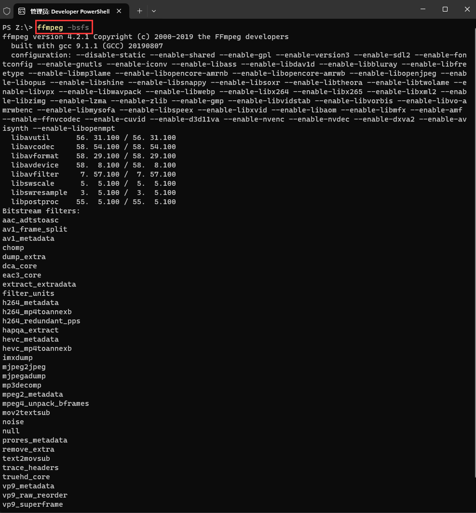

# 1. 部分命令

|  命令参数  |                内容                 |   命令参数   |          内容          |
| :--------: | :---------------------------------: | :----------: | :--------------------: |
|  -version  |              显示版本               |    -bsfs     |  显示可用比特流filter  |
| -buildconf |            显示编译配置             |  -protocols  |     显示可用的协议     |
|  -formats  |     显示格式 (muxers+demuxers)      |   -filters   |    显示可用的过滤器    |
|  -muxers   |           显示可用复用器            |  -pix_fmts   |   显示可用的像素格式   |
| -demuxers  |          显示可用解复用器           |   -layouts   |    显示标准声道名称    |
|  -codecs   | 显示可用编解码器(decoders+encoders) | -sample_fmts | 显示可用的音频采样格式 |
| -decoders  |           显示可用解码器            |   -colors    |   显示可用的颜色名称   |
| -encoders  |           显示可用编码器            |   -devices   |        显示设备        |

## 1.1 `ffmpeg -version` (显示版本)

 

## 1.2 `ffmpeg -buildconf` (显示编译配置)

  

## 1.3 `ffmpeg -formats ` (显示格式)

 

> ```tex
> D.和E. 是命令行选项 -formats 的输出中的一部分,它们显示了与多媒体格式相关的信息
> "D." 表示"Demuxing supported",意思是FFmpeg支持解复用,也就是从特定格式中分离出音频、视频和其他流
> "E." 表示"Muxing supported",即FFmpeg支持复用,也就是将多个流(比如音频和视频)合并到特定格式中
> 因此,如果你看到某个格式标有 D. 或 E.,则表示FFmpeg可以在该格式上执行相应的操作
> ```

## 1.3 `ffmpeg -muxers` (显示可用复用器)

 

## 1.4 `ffmpeg -demuxers` (显示可用解复用器)

 

## 1.5 `ffmpeg -devices  ` (显示可用解复用器)

 

## 1.6 `ffmpeg -codecs` (显示可用编解码器)

 

- D..... = Decoding supported : 表示该编解码器支持解码操作。

- .E.... = Encoding supported : 表示该编解码器支持编码操作。

- ..V... = Video codec : 表示这是一个视频编解码器。

- ..A... = Audio codec : 表示这是一个音频编解码器。

- ..S... = Subtitle codec : 表示这是一个字幕编解码器。

- ...I.. = Intra frame-only codec : 表示这是一个仅支持帧内编码的编解码器。

- ....L. = Lossy compression : 表示这是一个有损压缩编解码器。

- .....S = Lossless compression : 表示这是一个无损压缩编解码器。

## 1.7 `ffmpeg -decoders` (显示可用解码器)

 

## 1.8 `ffmpeg -encoders` (显示可用编码器)

 

## 1.9 `ffmpeg -bsfs` (显示可用比特流filter)

 

## 2.0 `ffmpeg -protocols` (显示可用的协议)

 

 

## 2.1 `ffmpeg -filters` (显示可用的过滤器)

 

在FFmpeg中，这些符号代表了不同的流过滤器，用于指示流处理的特性和功能。具体含义如下：

- T.. = Timeline support：表示该过滤器支持时序处理，可以对多个事件或多个时间点进行处理。
- .S. = Slice threading：这表示过滤器支持切片线程处理，即可以将工作切分成小片段，并且可以在不同的线程中并行执行。
- ..C = Command support：表示该过滤器支持命令操作，能够接收和处理命令。
- A = Audio input/output：表示该过滤器支持音频输入/输出。
- V = Video input/output：表示该过滤器支持视频输入/输出。
- N = Dynamic number and/or type of input/output：表示该过滤器支持动态的输入/输出，可以处理不固定数量或不同类型的输入/输出。
- | = Source or sink filter：表示源或者接收端过滤器，用于筛选或过滤输入或输出数据。

这些符号主要用于描述FFmpeg中流过滤器的特性和功能，对于开发人员来说，这些符号能够帮助他们更好地理解和使用FFmpeg中的流过滤器，以便进行音视频处理和流媒体处理。

## 2.2 `ffmpeg -pix_fmts` (显示可用的像素格式)

 

> ```tex
> 在FFmpeg中，这些符号代表了不同的格式标记，用于指示支持的输入和输出格式的特性和功能。具体含义如下：
> 
> - I.... = Supported input format for conversion：表示该格式标记代表支持的输入格式，用于在转换过程中作为输入文件的格式。
> - .O... = Supported output format for conversion：表示该格式标记代表支持的输出格式，用于在转换过程中作为输出文件的格式。
> - ..H.. = Hardware accelerated format：表示该格式标记代表的是硬件加速格式，即支持硬件加速的特定格式。
> - ...P. = Paletted format：表示该格式标记代表的是调色板格式，即图像使用调色板进行颜色索引。
> - ....B = Bitstream format：表示该格式标记代表的是比特流格式，用于存储和传输比特流数据。
> 
> 这些格式标记主要用于描述FFmpeg中对输入和输出格式的支持情况，以及硬件加速和其他特定格式的支持情况。开发人员可以根据这些标记来选择合适的输入和输出格式，并了解FFmpeg对不同格式的支持程度。
> ```

> ```tex
> 在FFmpeg中，NB_COMPONENTS表示每个像素中的颜色组件数量，而BITS_PER_PIXEL代表每个像素的位数。这些参数通常用于描述视频或图像的编码格式和色彩深度。
> 
> - NB_COMPONENTS：表示每个像素中的颜色组件数量，例如，对于RGB色彩模型，每个像素通常包含红色、绿色、蓝色三个颜色通道，因此NB_COMPONENTS的值将是3。
> - BITS_PER_PIXEL：表示每个像素的位数，即用于表示颜色的位数。例如，对于8位颜色深度的图像，BITS_PER_PIXEL的值将是8。
> 
> 这些参数在视频和图像处理中非常重要，可以影响到图像的色彩表现和编码效率。因此，在使用FFmpeg进行视频或图像处理时，开发人员可以根据NB_COMPONENTS和BITS_PER_PIXEL参数来了解所处理的视频或图像的颜色结构和编码方式。
> ```

## 2.3 `ffmpeg -layouts` (显示标准声道名称)

 

> ```tex
> Individual channels:
> NAME           DESCRIPTION
> FL             front left
> FR             front right
> FC             front center
> LFE            low frequency
> BL             back left
> BR             back right
> FLC            front left-of-center
> FRC            front right-of-center
> BC             back center
> SL             side left
> SR             side right
> TC             top center
> TFL            top front left
> TFC            top front center
> TFR            top front right
> TBL            top back left
> TBC            top back center
> TBR            top back right
> DL             downmix left
> DR             downmix right
> WL             wide left
> WR             wide right
> SDL            surround direct left
> SDR            surround direct right
> LFE2           low frequency 2
> 
> Standard channel layouts:
> NAME           DECOMPOSITION
> mono           FC
> stereo         FL+FR
> 2.1            FL+FR+LFE
> 3.0            FL+FR+FC
> 3.0(back)      FL+FR+BC
> 4.0            FL+FR+FC+BC
> quad           FL+FR+BL+BR
> quad(side)     FL+FR+SL+SR
> 3.1            FL+FR+FC+LFE
> 5.0            FL+FR+FC+BL+BR
> 5.0(side)      FL+FR+FC+SL+SR
> 4.1            FL+FR+FC+LFE+BC
> 5.1            FL+FR+FC+LFE+BL+BR
> 5.1(side)      FL+FR+FC+LFE+SL+SR
> 6.0            FL+FR+FC+BC+SL+SR
> 6.0(front)     FL+FR+FLC+FRC+SL+SR
> hexagonal      FL+FR+FC+BL+BR+BC
> 6.1            FL+FR+FC+LFE+BC+SL+SR
> 6.1(back)      FL+FR+FC+LFE+BL+BR+BC
> 6.1(front)     FL+FR+LFE+FLC+FRC+SL+SR
> 7.0            FL+FR+FC+BL+BR+SL+SR
> 7.0(front)     FL+FR+FC+FLC+FRC+SL+SR
> 7.1            FL+FR+FC+LFE+BL+BR+SL+SR
> 7.1(wide)      FL+FR+FC+LFE+BL+BR+FLC+FRC
> 7.1(wide-side) FL+FR+FC+LFE+FLC+FRC+SL+SR
> octagonal      FL+FR+FC+BL+BR+BC+SL+SR
> hexadecagonal  FL+FR+FC+BL+BR+BC+SL+SR+TFL+TFC+TFR+TBL+TBC+TBR+WL+WR
> downmix        DL+DR
> ```

## 2.4 `ffmpeg -sample_fmts` (显示可用的音频采样格式)

 

## 2.5 `ffmpeg -colors` (显示可用的颜色名称)

 

# 2. 查看具体分类所支持的参数  

* 语法 : 

> ```bash
> ffmepg -h type=name
> ```

* 例如 : 

> ```bash
> ffmpeg -h muxer=flv
> ffmpeg -h filter=atempo (atempo调整音频播放速率)
> ffmpeg -h encoder=libx264
> ```

 

