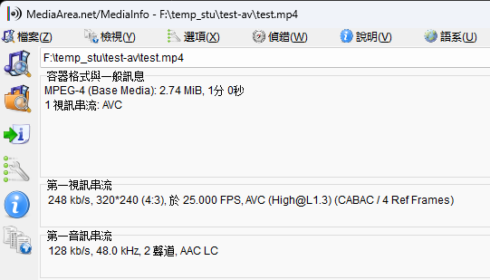
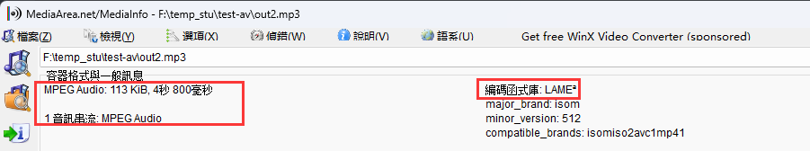
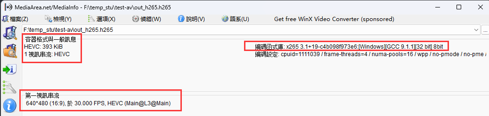

# 1. ffmpeg 命令参数说明

输入源数据

 

## 1.1 主要参数

* `-i` 设定输入流 
* `-f` 设定输出格式 ( **$\color{red}{format}$** ) 
  * 如果设置了该选项 , 输出文件的后缀与设定格式不一样 , 以`-f`设定的格式为准
  * 一般不通过 `-f` 设定格式 , 直接通过输出文件后缀名作为输出文件的格式
* `-ss` 开始时间 
* `-t` 时间长度

## 1.2 音频参数

* `-aframes` 设置要输出的音频帧数
* `-b:a` 音频码率
* `-ar` 设定采样率
* `-ac` 设定声音的Channel数
* `-acodec` 设定声音编解码器 , 如果用copy表示原始编解码数据必须被拷贝
* `-an` 不处理音频
* `-af` 音频过滤器

> ```bash
> ffmpeg -i test.mp4 -b:a 192k -ar 48000 -ac 2 -acodec libmp3lame -aframes 200 out2.mp3
> ```

 

## 1.3 视频参数

* `-vframes` 设置要输出的视频帧数
* `-b` 设定视频码率
* `-b:v` 视频码率 (与`-b`一样)
* `-r` 设定帧速率
* `-s` 设定画面的宽与高
* `-vn` 不处理视频
* `-aspect aspect` 设置横纵比 `4:3` `16:9` 或 `1.3333` `1.7777`
* `-vcodec` 设定视频编解码器 , 如果用copy表示原始编解码数据必须被拷贝
* `-vf` 视频过滤器

> ```bash
> ffmpeg -i test.mp4 -vframes 300 -b:v 300k -r 30 -s 640x480 -aspect 16:9 -vcodec libx265 out_h265.h265
> ```

 

[[更多参考]](http://www.ffmpeg.org/ffmpeg.html)


