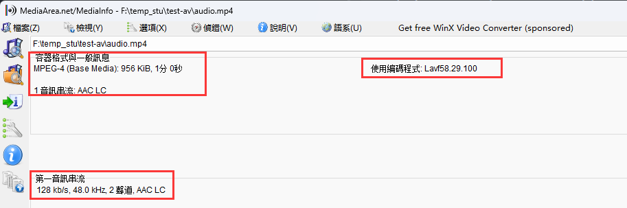

# 1.ffmpeg 提取音视频数据

输入视频

 

## 1.1保留封装格式

> ```bash
> ffmpeg -i test.mp4 -acodec copy -vn audio.mp4
> #或 ffmpeg -i test.mp4 -codec:a copy -vn audio.mp4
> ffmpeg -i test.mp4 -vcodec copy -an video.mp4
> #或ffmpeg -i test.mp4 -codec:v copy -an video.mp4
> ```

 

  

## 1.2 提取视频

> ```bash
> #保留编码格式 : 
> ffmpeg -i test.mp4 -vcodec copy -an test_copy.h264
> #或ffmpeg -i test.mp4 -codec:v copy -an test_copy.h264
> #强制格式 : 
> ffmpeg -i test.mp4 -vcodec libx264 -an test_force_H264.h264
> #ffmpeg -i test.mp4 -codec:v libx264 -an test_force_H264.h264
> ```

### 1.2.1 保留编码结果

 

###  1.2.2 强制编码结果

 

## 1.3 提取音频

> ```bash
> #保留编码格式 : 
> ffmpeg -i test.mp4 -acodec copy -vn test_save.aac
> #ffmpeg -i test.mp4 -codec:a copy -vn test_save.aac
> #强制格式 : 
> ffmpeg -i test.mp4 -acodec libmp3lame -vn test_force_mp3.mp3
> #ffmpeg -i test.mp4 -codec:a libmp3lame -vn test_force_mp3.mp3
> ```

### 1.3.1 保留编码结果

 

### 1.3.2 强制编码结果

 
