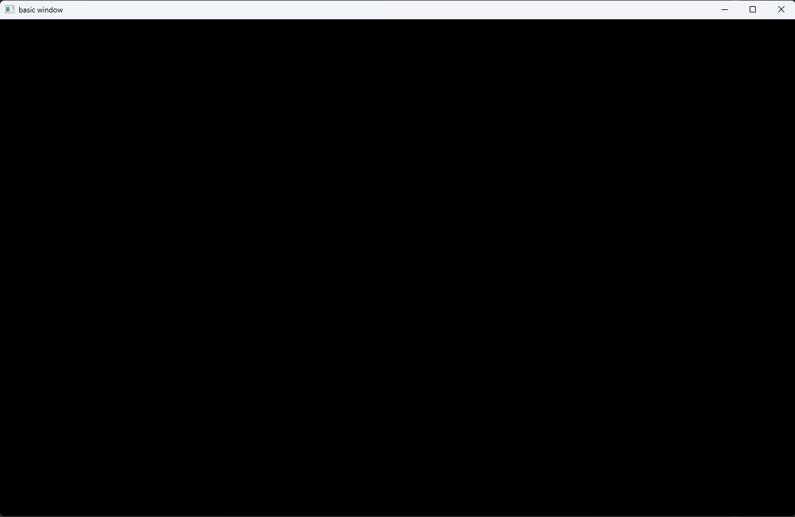

# 1.SDL简介

[[官网]](https://www.libsdl.org/)	[[文档]](http://wiki.libsdl.org/Introduction  )

SDL（Simple DirectMedia Layer）是一套开放源代码的跨平台多媒体开发库 , 使用C语言写成。 SDL提供了数种控制图像、声音、输出入的函数 , 让开发者只要用相同或是相似的代码就可以开发出跨多个平台 (Linux、 Windows、 Mac OS X等) 的应用软件。目前SDL多用于开发游戏、模拟器、 媒体播放器等多媒体应用领域

对于我们课程而言 : SDL主要用来辅助学习FFmpeg , 所以我们只会关注我们用到的知识点

 

## 1.1 Windows环境搭建

[[下载地址]](https://www.libsdl.org/download-2.0.php)

 

 版本会持续更新 , 下载对应的版本就OK

## 1.2 Linux环境搭建

### 1.2.1 下载SDL源码库 , SDL2-x.x.x.tar.gz

[[下载地址]](https://www.libsdl.org/download-2.0.php)

 

### 1.2.2 解压

> ```bash
> tar -vxf SDL2-x.x.x.tar.gz
> ```

### 1.2.3 配置 & 编译

> ```bash
> ./configure
> make
> sudo make install
> ```

### 1.2.4 遇到错误

> ```tex
> 如果出现Could not initialize SDL - No available video device
> (Did you set the DISPLAY variable?)错误
> 说明系统中没有安装x11的库文件，因此编译出来的SDL库实际上不能用。
> 下载安装
> ```

> ```bash
> sudo apt-get install libx11-dev
> sudo apt-get install xorg-dev
> ```

## 1.3 Mac 搭建

### 1.3.1 自己下载搭建

[[下载地址]](https://www.libsdl.org/download-2.0.php)


下载后打开安装包将 SDL2.framework 拖拽到 /Library/Frameworks这个目录下

### 1.3.2 命令搭建

> ```bash
> brew install SDL2
> #这是使用 Homebrew 默认的方式来安装 SDL2。这将会从 Homebrew 的二进制存储库中下载预编译的二进制文件,并将其安装到系统中。通常情况下,这种方式比较快速,因为它直接使用了预编译好的二进制文件,无需进行编译操作
> 
> brew install --build-from-source sdl2
> #这个命令指示 Homebrew 在安装SDL2时从源代码构建。这意味着 Homebrew 将下载 SDL2的源代码并在本地编译,然后将其安装在系统中。这种方式需要更多的时间和计算资源,但具有更大的灵活性,因为可以在编译过程中进行自定义设置和调整
> ```

## 1.4 新建开发工程(qt)

### 1.4.1 windows 下

#### 1.4.1.1 新建工程

 

路径任君选择 , 不能有中文路径

 

 

教程采用32bit开发 , 本人尝试使用64bit开发

#### 1.4.1.2 拷贝SDL库到工程目录

 

  

#### 1.4.1.3 修改 `pro` 文件

> ```bash
> TEMPLATE = app
> CONFIG += console c++17
> CONFIG -= app_bundle
> CONFIG -= qt
> 
> SOURCES += \
>         main.cpp
> 
> INCLUDEPATH += $$PWD/SDL2-2.28.5-VC/include
> LIBS += $$PWD/SDL2-2.28.5-VC/lib/x64/SDL2.lib
> #把库文件路径与头文件路径加进去,库文件路径需要指定到具体某个库
> 
> CONFIG += shadow -build
> DESTDIR = $$PWD/bin
> #CONFIG += shadow 用于告诉 qmake 使用生成的中间文件目录作为构建目录
> #DESTDIR = $$PWD/bin 把输出目录调整到工程文件夹下的bin文件夹
> ```

#### 1.4.1.4 main.cpp包含头文件并测试

> ```c++
> #include <iostream>
> #include <SDL.h>
> 
> using namespace std;
> 
> #undef main //必须加上此宏定义,由于在SDL_main.h定义了#define main SDL_main
> int main(int argc,const char* argv[])
> {
>     SDL_version ver{};
>     SDL_GetVersion(&ver);
> 
>     cout << dec << static_cast<int>(ver.major) << "." <<
>             static_cast<int>(ver.minor) << "." <<
>             static_cast<int>(ver.patch) << "\n";
> 
>     return 0;
> }
> ```

 

### 1.4.2 linux 下

### 1.4.3 Macos 下

# 2. SDL 编程

## 2.1 SDL子系统

SDL将功能分成下列数个子系统 (subsystem) : 

* 👉 **SDL_INIT_TIMER : 定时器**
* 👉 **SDL_INIT_AUDIO : 音频**
* 👉 **SDL_INIT_VIDEO : 视频**
* SDL_INIT_JOYSTICK : 摇杆
* SDL_INIT_HAPTIC : 触摸屏
* SDL_INIT_GAMECONTROLLER : 游戏控制器
* 👉 **SDL_INIT_EVENTS : 事件**
* SDL_INIT_EVERYTHING : 包含上述所有选项 

## 2.2 Window显示 

### 2.2.1 SDL视频显示函数简介

* `SDL_Init()` : 初始化SDL系统
* `SDL_CreateWindow()` : 创建窗口SDL_Window
* `SDL_CreateRenderer()` : 创建渲染器SDL_Renderer
* `SDL_CreateTexture()` : 创建纹理SDL_Texture
* `SDL_UpdateTexture()` : 设置纹理的数据
* `SDL_RenderCopy()` : 将纹理的数据拷贝给渲染器
* `SDL_RenderPresent()` : 显示
* `SDL_Delay()` : 工具函数 , 用于延时
* `SDL_Quit()` : 退出SDL系统  

#### 2.2.1.1 编程示例

[[01-sdl-basic参考链接]](/code/win/1-SDL/01-sdl-basic)

> ```c++
> #include <iostream>
> #include <string>
> #include <SDL.h>
> 
> #undef main	/*必须在#include <SDL.h>下*/
> using namespace std;
> 
> int main(int argc,const char* argv[])
> {
>     (void)argc,(void)argv;
> 
>     SDL_Init(SDL_INIT_VIDEO);
>     auto window {SDL_CreateWindow("basic window",
>                                  SDL_WINDOWPOS_CENTERED,
>                                  SDL_WINDOWPOS_CENTERED,
>                                  1280,800,
>                                  SDL_WINDOW_RESIZABLE | SDL_WINDOW_OPENGL)};
> 
>     if(!window){
>         throw (string("err") + SDL_GetError());
>     }
> 	SDL_Delay(10000);
>     SDL_DestroyWindow(window);
>     SDL_Quit();
>     return 0;
> }
> ```

 

### 2.2.2 SDL数据结构简介

* `SDL_Window` 代表了一个 “窗口”
* `SDL_Renderer` 代表了一个 “渲染器”
* `SDL_Texture` 代表了一个 “纹理”
* `SDL_Rect` 一个简单的矩形结构  

> ```tex
> 存储RGB和存储纹理的区别:
> 比如一个从左到右由红色渐变到蓝色的矩形,用存储RGB的话就需要把矩形中每个点的具体颜色值存储下来;而纹理只是一些描述信息,比如记录了矩形的大小、起始颜色、终止颜色等信息,显卡可以通过这些信息推算出矩形块的详细信息。
> 所以相对于存储RGB而已,存储纹理占用的内存要少的多。
> ```

## 2.3 SDL事件

* 函数
  * `SDL_WaitEvent()` : 等待一个事件
  * `SDL_PushEvent()` : 发送一个事件
  * `SDL_PumpEvents()` : 
    * 将硬件设备产生的事件放入事件队列 , 用于读取事件 , 在调用该函数之前 , 必须调用 `SDL_PumpEvents` 搜集键盘等事件
  * `SDL_PeepEvents()` : 从事件队列提取一个事件
* 数据结构
  * `SDL_Event` : 代表一个事件  

## 2.4 SDL多线程

* SDL线程创建 : `SDL_CreateThread()`
* SDL线程等待 : `SDL_WaitThead()`
* SDL互斥锁创建/销毁 : `SDL_CreateMutex() / SDL_DestroyMutex()`
* SDL锁定互斥 : `SDL_LockMutex() / SDL_UnlockMutex()`
* SDL条件变量 (信号量) 创建/销毁 : `SDL_CreateCond() / SDL_DestoryCond()`
* SDL条件变量 (信号量) 等待/通知 : `SDL_CondWait() / SDL_CondSingal()`

## 2.5 YUV显示 : SDL视频显示的流程

 

## 2.6 SDL播放音频PCM

### 2.6.1 打开音频设备

> ```c++
> typedef struct SDL_AudioSpec {
>     int freq; // 音频采样率
>     SDL_AudioFormat format; // 音频数据格式
>     Uint8 channels; // 声道数: 1 单声道, 2 立体声
>     Uint8 silence; // 设置静音的值， 因为声音采样是有符号的， 所以0当然就是这个值
>     Uint16 samples; // 音频缓冲区中的采样个数，要求必须是2的n次
>     Uint16 padding; // 考虑到兼容性的一个参数
>     Uint32 size; // 音频缓冲区的大小，以字节为单位
>     SDL_AudioCallback callback; // 填充音频缓冲区的回调函数
>     void *userdata; // 用户自定义的数据
> } SDL_AudioSpec;
> 
> int SDLCALL SDL_OpenAudio(SDL_AudioSpec* desired,SDL_AudioSpec* obtained);
> // desired：期望的参数。
> // obtained：实际音频设备的参数,一般情况下设置为NULL即可
> ```

### 2.6.2 `SDL_AudioCallback`

> ```c++
> // userdata:SDL_AudioSpec结构中的用户自定义数据,一般情况下可以不用
> // stream:该指针指向需要填充的音频缓冲区
> // len:音频缓冲区的大小(以字节为单位) 1024*2*2
> void (SDLCALL *SDL_AudioCallback) (void *userdata, Uint8 *stream, int len);
> 
> // 当pause_on设置为0的时候即可开始播放音频数据。设置为1的时候，将会播放静音的值。
> void SDLCALL SDL_PauseAudio(int pause_on)
> ```


