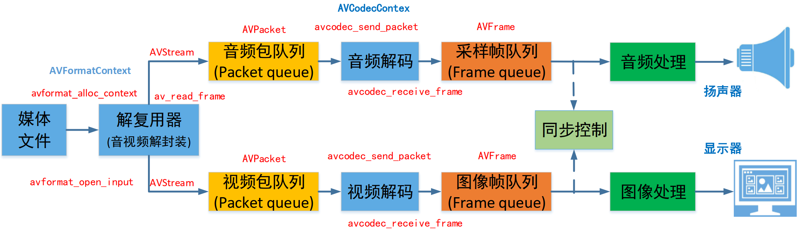
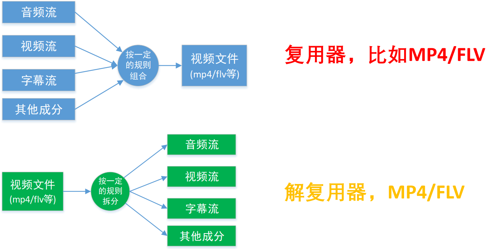
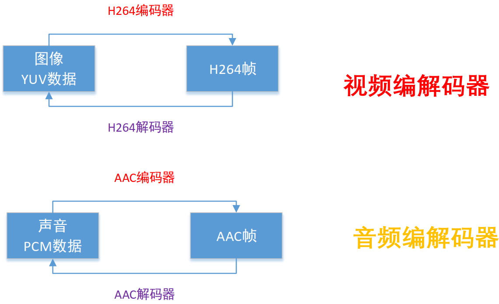
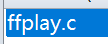
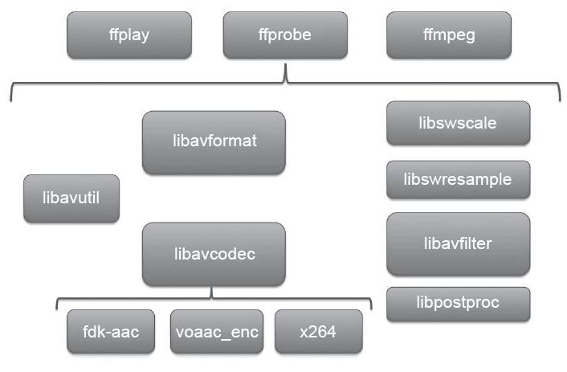
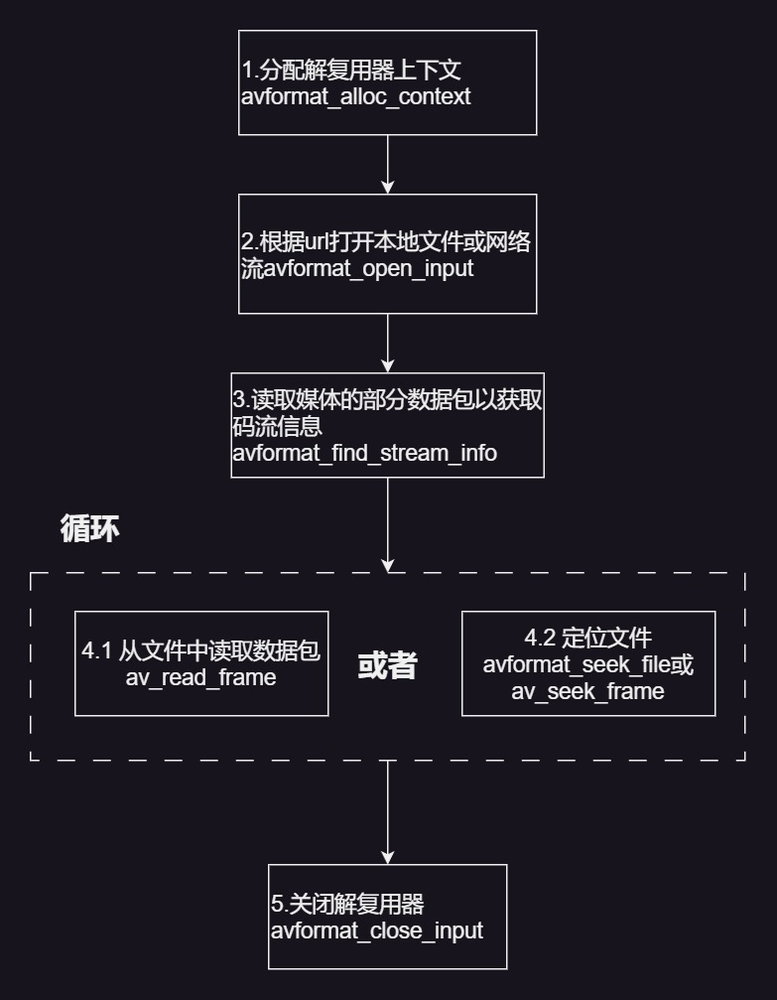
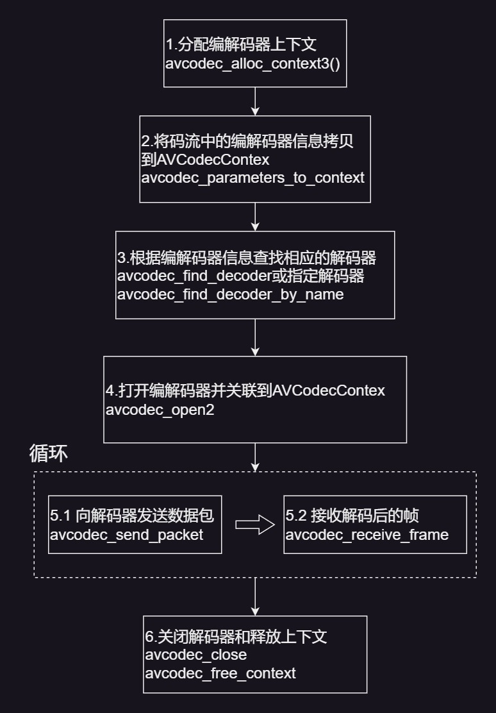
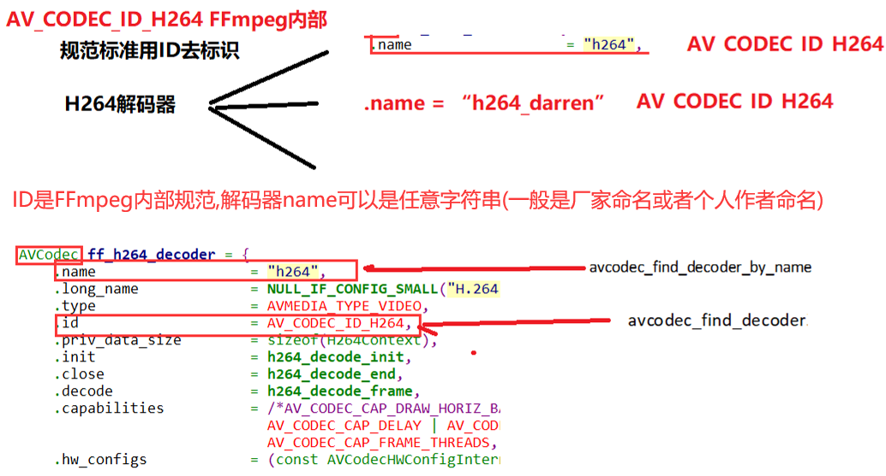

# 1. 播放器框架

 

# 2. 常用音视频术语

* **$\color{red}{\mathbf{容器／文件(Conainer/File)}}$** : 即特定格式的多媒体文件 , 比如 mp4、 flv、 mkv等
* **$\color{red}{\mathbf{媒体流(Stream)}}$** : 表示时间轴上的一段连续数据 , 如一段 **$\color{red}{声音数据}$** 、一段 **$\color{red}{视频数据}$** 或一段 **$\color{red}{字幕数据}$** , 可以是压缩的 , 也可以是非压缩的 , 压缩的数据需要关联特定的编解码器 (有些码流音频它是纯PCM数据)  
* **$\color{red}{\mathbf{数据帧／数据包 (Frame/Packet)}}$** : 通常 , 一个媒体流是由大量的数据帧组成的 , 对于压缩数据 , 帧对应着编解码器的最小处理单元 , 分属于不同媒体流的数据帧交错存储于容器之中
* **$\color{red}{\mathbf{编解码器}}$** : 编解码器是以帧为单位实现压缩数据和原始数据之间的相互转换的。  

# 3. 复用器  

 

# 4. 编解码器

 

# 5. FFmpeg库简介

## 5.1 FFmpeg的整体结构

   

 

## 5.2 FFMPEG有8个常用库 

* **$\mathbf{\color{SkyBlue}{AVUtil}}$** : 核心工具库 ,下面的许多其他模块都会依赖该库做一些基本的音视频处理操作
* **$\color{red}{\mathbf{AVFormat}}$** : 文件格式和协议库 , 该模块是最重要的模块之一 , 封装了Protocol 层 和 Demuxer、 Muxer层 , 使得协议和格式对于开发者来说是透明的
* **$\color{red}{\mathbf{AVCodec}}$** : 编解码库 , 封装了Codec层 , 但是有一些Codec是具备自己的License的 , FFmpeg是不会默认添加像 **$\mathbf{\color{red}{libx264、FDK-AAC}}$** 等库的 , 但是FFmpeg就像一个平台一样 , 可以将其他的第三方的Codec以插件的方式添加进来 , 然后为开发者提供统一的接口
* **$\mathbf{\color{SkyBlue}{AVFilter}}$** : 音视频滤镜库 , 该模块提供了包括音频特效和视频特效的处理 , 在使用FFmpeg的API进行编解码的过程中 , 直接使用该模块为音视频数据做特效处理是非常方便同时也非常高效的一种方式
* **$\mathbf{\color{SkyBlue}{AVDevice}}$** : 输入输出设备库 , 比如 , 需要编译出播放声音或者视频的工具ffplay , 就需要确保该模块是打开的 , 同时也需要SDL的预先编译 , 因为该设备模块播放声音与播放视频使用的都是SDL库 
* **$\mathbf{\color{red}{SwrRessample}}$** : 该模块可用于 **$\color{red}{音频重采样}$** , 可以对数字音频进 **$\color{red}{行声道数、数据格式、采样率}$** 等多种基本信息的转换
* **$\mathbf{\color{red}{SWScale}}$** : 该模块是将图像进行格式转换的模块 , 比如 , 可以将YUV的数据转换为RGB的数据 , 缩放尺寸由1280 × 720变为800 × 480
* **$\mathbf{\color{SkyBlue}{PostProc}}$** : 该模块可用于进行后期处理 , 当我们使用AVFilter的时候需要打开该模块的开关 , 因为Filter中会使用到该模块的一些基础函数

# 6. FFmpeg函数简介

* ~~av_register_all()~~ : 注册所有组件 , 4.0已经弃用
* `avdevice_register_all()` 
  * **$\color{red}{\mathbf{对设备进行注册 , 比如V4L2等}}$**
* `avformat_network_init()` 
  * 初始化网络库以及网络加密协议相关的库 (比如openssl) 

## 6.1 封装格式相关函数

* `avformat_alloc_context()` 
  * 负责申请一个 `AVFormatContext` 结构的内存 , 并进行简单初始化  
* `avformat_free_context()`
  * 释放该结构里的所有东西以及该结构本身
* `avformat_close_input()`
  * 关闭解复用器。关闭后就不再需要使用 `avformat_free_context` 进行释放  
* `avformat_open_input()` 
  * 打开输入视频文件
* `avformat_find_stream_info()`
  * 获取 **$\color{red}{音视频}$** 文件信息
* `av_read_frame()`
  * 读取音视频包(读取成packet)
* `avformat_seek_file()`
  * 定位文件
* `av_seek_frame()`
  * 定位文件  

### 6.1.1 调用流程

 

## 6.2 解码器相关函数

* `avcodec_alloc_context3()` 
  * 分配解码器上下文
* `avcodec_find_decoder()` 
  * 根据ID查找解码器
* `avcodec_find_decoder_by_name()` 
  * 根据解码器名字
* `avcodec_open2()` 
  * 打开编解码器
* ~~avcodec_decode_video2()~~  
  * ~~解码一帧视频数据~~
* ~~avcodec_decode_audio4()~~ 
  * ~~解码一帧音频数据~~
* `avcodec_send_packet()` 
  * 发送编码数据包
* `avcodec_receive_frame()` 
  * 接收解码后数据
* `avcodec_free_context()` 
  * 释放解码器上下文 , 包含了 `avcodec_close()`
* `avcodec_close()` 
  * 关闭解码器  

### 6.2.1 调用流程

 

### 6.2.2 补充

 