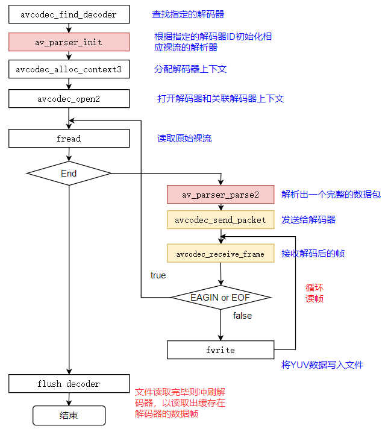

# 1. 视频解码过程

> ```tex
> 视频解码对于FFmpeg而言,流程基本上和⾳频解码⼀致
> ```

⼀般解出来的是420p , 视频解码过程如下图所示

 

# 2. FFmpeg流程

 

## 2.1 关键函数

- `avcodec_find_decoder` : 根据指定的AVCodecID查找注册的解码器。
- `av_parser_init` : 初始化AVCodecParserContext。
- `avcodec_alloc_context3` : 为AVCodecContext分配内存。
- `avcodec_open2` : 打开解码器。
- `av_parser_parse2` : 解析获得⼀个Packet。
- `avcodec_send_packet` : 将AVPacket压缩数据给解码器。
- `avcodec_receive_frame` : 获取到解码后的AVFrame数据。
- `av_get_bytes_per_sample` : 获取每个sample中的字节数。  

## 2.2 关键数据结构

`AVCodecParser` : 用于解析输入的数据流并把它分成一帧一帧的压缩编码数据。比较形象的说法就是把长长的⼀段连续的数据"切割"成⼀段段的数据

`libavcodec/h264_parser.c`

> ```c++
> const AVCodecParser ff_h264_parser = {
>     .codec_ids      = { AV_CODEC_ID_H264 },
>     .priv_data_size = sizeof(H264ParseContext),
>     .parser_init    = init,
>     .parser_parse   = h264_parse,
>     .parser_close   = h264_close,
> };
> ```

从AVCodecParser结构的实例化我们可以看出来 , 不同编码类型的parser是和CODE_ID进⾏绑定的。所以也就可以解释可以通过CODE_ID查找到对应的码流 parser  

> ```c++
> parser = av_parser_init(AV_CODEC_ID_H264);
> ```

## 2.3 avcodec编解码API介绍

### 2.3.1 `avcodec_send_packet(...)`

- 函数 : `int avcodec_send_packet(AVCodecContext *avctx, const AVPacket *avpkt);`

- 作用 : 支持将裸流数据包送给解码器  

- 警告 : 

  - 输入的 `avpkt-data` 缓冲区必须大于 `AV_INPUT_PADDING_SIZE` , 因为优化的字节流读取器必须⼀次读取32或者64bit的数据
  - 不能跟之前的API (例如 `avcodec_decode_video2` )混⽤ , 否则会返回不可预知的错误 

- 备注 : 

  - 在将包发送给解码器的时候 , `AVCodecContext` 必须已经通过 `avcodec_open2` 打开  

- 参数 : 

  - avctx : 解码上下文

  - avpkt : 输⼊AVPakcet.通常情况下 , 输入数据是一个单一的视频帧或者几个完整的音频帧。调用者保留包的原有属性 , 解码器不会修改包的内容。解码器可能创建对包的引⽤。如果包没有引⽤计数将拷贝⼀份。跟以往的API不一样 , 输入的包的数据将被完全地消耗 , **$\color{red}{\mathbf{如果包含有多个帧 , 要求多次调⽤avcodec\\\_recvive\\\_frame(...),\\\ 直到avcodec\\\_recvive\\\_frame(...)返回}}$**

    **$\color{SkyBlue}{\mathbf{VERROR (EAGAIN)\ 或\ AVERROR\\\_EOF}}$** 输入参数可以为 NULL , 或者 `AVPacket` 的 `data` 域设置为 NULL 或者 `size` 域设置为0 , 表示将刷新所有的包 , 意味着数据流已经结束了。第⼀次发送刷新会总会成功 , 第⼆次发送刷新包是没有必要的 , 并且返回 `AVERROR_EOF` , 如果xxx缓存了一些帧 , 返回⼀个刷新包 , 将会返回所有的解码包  

- 返回值 : 

  - 0 : 表示成功
  - `AVERROR(EAGAIN)` : 当前状态不接受输入 , 用户必须先使用 `avcodec_receive_frame(...)` 读取数据帧
  - `AVERROR_EOF` : 解码器已刷新 , 不能再向其发送新包
  - `AVERROR(EINVAL)` : 没有打开解码器 , 或者这是⼀个编码器 , 或者要求刷新
  - `AVERRO(ENOMEN)` : ⽆法将数据包添加到内部队列

### 2.3.2 `int avcodec_receive_frame (...)`

- 函数 : `int avcodec_receive_frame ( AVCodecContext * avctx, AVFrame * frame )`
- 作用 : 从解码器返回已解码的输出数据
- 参数 : 
  - `avctx` : 编解码器上下文
  - `frame` : 获取使用 reference-counted 机制的a udio或者video帧 (取决于解码器类型) 。请注意 , 在执⾏其他操作之前 , 函数内部将始终先调用 `av_frame_unref(frame)`

- 返回值 : 
  - 0 : 成功 , 返回一个帧
  - `AVERROR(EAGAIN)` : 该状态下没有帧输出 , 需要使用 `avcodec_send_packet` 发送新的 `packet` 到解码器
  - `AVERROR_EOF` : 解码器已经被完全刷新 , 不再有输出帧
  - `AVERROR(EINVAL)` : 编解码器没打开
  - 其他 <0 的值 : 具体查看对应的错误码

# 3. 附录

## 3.1 分离H264或mpeg2video视频格式数据

> ```bash
> #提取H264:
> ffmpeg -i source.200kbps.768x320_10s.flv -vcodec libx264 -an -f h264 source.200kbps.768x320_10s.h264
> 
> #提取MPEG2:
> ffmpeg -i source.200kbps.768x320_10s.flv -vcodec mpeg2video -an -f mpeg2video
> source.200kbps.768x320_10s.mpeg2v
> ```

## 3.2 播放YUV

> ```bash
> #播放:
> ffplay -pixel_format yuv420p -video_size 768x320 -framerate 25 source.200kbps.768x320_10s.yuv
> ```

## 3.3 FFmpeg命令查找重定向

⽐如我们在-f fmt打算指定格式时 , 怎么知道什么样的格式才是适合的format ?
可以通过 `ffmpeg -formats | findstr xx` 的方式去查找。
对于 `findstr` , /i是忽略大小写
比如 : 

- 查找Audio的裸流解复⽤器 : `ffmpeg -formats | findstr /i audio`
- 查找Video的裸流解复⽤器 : `ffmpeg -formats | findstr /i video`

# 4. 编程实战

[[参考工程]](/code/win/2-FFmpeg/07-decode_video)

> ```c++
> #include <iostream>
> #include <fstream>
> #include <string>
> #include <memory_resource>
> 
> extern "C"{
> #include <libavcodec/avcodec.h>
> #include <libavutil/pixfmt.h>
> #include <libavutil/pixdesc.h>
> }
> 
> using namespace std;
> 
> static std::string av_get_err(const int& errnum)
> {
>     char err_buf[1024]{};
>     av_strerror(errnum, err_buf, sizeof(err_buf));
>     return {err_buf};
> }
> 
> static void print_video_format(const AVFrame &frame)
> {
>     std::cout << "width: " << frame.width << "\n";
>     std::cout << "height: "<< frame.height << "\n";
>     std::cout << "format: " << frame.format << " " << av_get_pix_fmt_name(static_cast<AVPixelFormat>(frame.format)) << "\n";
> 
>     // 格式需要注意,实际存储到本地文件时已经改成交错模式
> }
> 
> static void decode(AVCodecContext &dec_ctx,const AVPacket &pkt, AVFrame &frame,
>                    ofstream &outfile)
> {
>     /* send the packet with the compressed data to the decoder */
>     auto ret { avcodec_send_packet(&dec_ctx, &pkt)};
>     if(AVERROR(EAGAIN) == ret){
>         std::cerr << "Receive_frame and send_packet both returned EAGAIN, which is an API violation.\n";
>     }else if (ret < 0){
>         std::cerr << "Error submitting the packet to the decoder, err: " << av_get_err(ret) <<
>             " , pkt_size : " << pkt.size << "\n";
>         return;
>     }
> 
>     /* read all the output frames (infile general there may be any number of them */
>     while (ret >= 0){
>         // 对于frame, avcodec_receive_frame内部每次都先调用
>         ret = avcodec_receive_frame(&dec_ctx, &frame);
>         if (AVERROR(EAGAIN) == ret   || AVERROR_EOF == ret ) {
>             return;
>         }else if (ret < 0){
>             std::cerr << "Error during decoding\n";
>             exit(-1);
>         }
> 
>         static bool s_print_format {};
>         s_print_format = s_print_format ? true : (print_video_format(frame),true);
> 
>         // 一般H264默认为 AV_PIX_FMT_YUV420P,具体怎么强制转为 AV_PIX_FMT_YUV420P 在音视频合成输出的时候讲解
>         // frame->linesize[1]  对齐的问题
>         // 正确写法  linesize[]代表每行的字节数量，所以每行的偏移是linesize[]
> #if 1
>         for(int j{}; j<frame.height; j++) {
>             const auto p{frame.data[0] + j * frame.linesize[0]};
>             outfile.write(reinterpret_cast<const char *>(p),frame.width);
>         }
> 
>         for(int j{}; j<frame.height/2; j++) {
>             const auto p{frame.data[1] + j * frame.linesize[1]};
>             outfile.write(reinterpret_cast<const char *>(p),frame.width / 2);
>         }
> 
>         for(int j{}; j<frame.height/2; j++) {
>             const auto p{frame.data[2] + j * frame.linesize[2]};
>             outfile.write(reinterpret_cast<const char *>(p),frame.width / 2);
>         }
> #else
>         // 错误写法 用source.200kbps.766x322_10s.h264测试时可以看出该种方法是错误的
>         //  写入y分量
>         outfile.write(reinterpret_cast<const char*>(frame.data[0]),frame.width * frame.height);
>         // 写入u分量
>         outfile.write(reinterpret_cast<const char*>(frame.data[1]),(frame.width) *(frame.height)/4);//U:宽高均是Y的一半
>         //  写入v分量
>         outfile.write(reinterpret_cast<const char*>(frame.data[2]),(frame.width) *(frame.height)/4);//V:宽高均是Y的一半
> #endif
>     }
> }
> 
> /*
> 注册测试的时候不同分辨率的问题
> 提取H264: ffmpeg -i source.200kbps.768x320_10s.flv -vcodec libx264 -an -f h264 source.200kbps.768x320_10s.h264
> 提取MPEG2: ffmpeg -i source.200kbps.768x320_10s.flv -vcodec mpeg2video -an -f mpeg2video source.200kbps.768x320_10s.mpeg2
> 播放 : ffplay -pixel_format yuv420p -video_size 768x320 -framerate 25 source.200kbps.768x320_10s.yuv
> */
> 
> template<typename F>
> struct Destroyer final{
>     explicit Destroyer(F&& f):f(std::move(f)){}
>     ~Destroyer(){
>         std::cout << __FUNCTION__ << "\n";
>         f();
>     }
> private:
>     F f;
> };
> 
> int main(const int argc,const char* argv[])
> {
>     constexpr auto VIDEO_INBUF_SIZE {20480};
>     constexpr auto VIDEO_REFILL_THRESH {4096};
> 
>     if (argc <= 2){
>         std::cerr << "Usage: " << argv[0] << " <input file> <output file>\n";
>         return -1;
>     }
> 
>     const auto filename {argv[1]};
>     const auto outfilename {argv[2]};
> 
>     ifstream in_file(filename,ios::binary);
>     ofstream out_file(outfilename,ios::binary);
> 
>     pmr::unsynchronized_pool_resource mpool;
> 
>     AVCodecParserContext *parser{};
>     AVCodecContext *codec_ctx{};
>     void *inbuf{};
> 
>     auto destory{[&]() {
>         in_file.close();
>         out_file.close();
>         avcodec_free_context(&codec_ctx);
>         av_parser_close(parser);
>         mpool.deallocate(inbuf,VIDEO_INBUF_SIZE + AV_INPUT_BUFFER_PADDING_SIZE);
>         mpool.release();
>     }};
> 
>     Destroyer d(std::move(destory));
> 
>     auto video_codec_id {AV_CODEC_ID_H264};
>     if(std::string(filename).find("264") != std::string::npos){
>         video_codec_id = AV_CODEC_ID_H264;
>     }else if(std::string(filename).find("mpeg2") != std::string::npos){
>         video_codec_id = AV_CODEC_ID_MPEG2VIDEO;
>     }else{
>         std::cout << "default codec id: " << video_codec_id << "\n";
>     }
> 
>     /*查找解码器*/
>     const auto codec{avcodec_find_decoder(video_codec_id)}; /*AV_CODEC_ID_H264*/
>     if (!codec) {
>         std::cerr << "Codec not found\n";
>         return -1;
>     }
> 
>    //获取裸流的解析器 AVCodecParserContext(数据)  +  AVCodecParser(方法);
>     parser = av_parser_init(codec->id);
>     if (!parser) {
>         std::cerr << "Parser not found\n";
>         return -1;
>     }
> 
>     // 分配codec上下文
>     codec_ctx = avcodec_alloc_context3(codec);
>     if (!codec_ctx) {
>         std::cerr << "Could not allocate audio codec context\n";
>         return -1;
>     }
> 
>     if (avcodec_open2(codec_ctx,codec,nullptr) < 0) {
>         std::cerr << "Could not open codec\n";
>         return -1;
>     }
> 
>     if (!in_file) {
>         std::cerr << "in file open faild\n";
>         return -1;
>     }
> 
>     if (!out_file) {
>         std::cerr << "out file open faild\n";
>         return -1;
>     }
> 
>     try {
>         inbuf = mpool.allocate(VIDEO_INBUF_SIZE + AV_INPUT_BUFFER_PADDING_SIZE);
>     } catch (const std::exception &e) {
>         std::cerr << "mpool.allocate failed!" << e.what() << "\n";
>         return -1;
>     }
> 
>     auto data{static_cast<uint8_t*>(inbuf)};
>     in_file.read(static_cast<char*>(inbuf),VIDEO_INBUF_SIZE);
>     auto read_data_size{in_file.gcount()};
> 
>     AVPacket pkt{};
>     AVFrame decoded_frame{};
> 
>     while (read_data_size > 0) {
> 
>         const auto parser_len{av_parser_parse2(parser,codec_ctx,&pkt.data,&pkt.size,
>             data,read_data_size,AV_NOPTS_VALUE,AV_NOPTS_VALUE,0)};
>         if (parser_len < 0) {
>             std::cerr << "Error while parsing\n";
>             return -1;
>         }
> 
>         data += parser_len;
>         read_data_size -= parser_len;
> 
>         if (pkt.size) {
>             decode(*codec_ctx,pkt,decoded_frame,out_file);
>         }
> 
>         if (read_data_size < VIDEO_REFILL_THRESH) {
>             std::move(data,data + read_data_size,static_cast<uint8_t*>(inbuf));
>             data = static_cast<uint8_t *>(inbuf);
>             in_file.read(reinterpret_cast<char *>(data + read_data_size) , VIDEO_INBUF_SIZE - read_data_size);
>             const auto len{in_file.gcount()};
>             if (len > 0) {
>                 read_data_size += len;
>             }
>         }
>     }
> 
>     pkt.data = nullptr;
>     pkt.size = 0;
>     decode(*codec_ctx,pkt,decoded_frame,out_file);
> 
>     std::cout << "main finish, please enter Enter and exit\n";
>     return 0;
> }
> 
> ```

