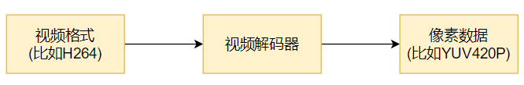

# 1. 视频解码过程

> ```tex
> 视频解码对于FFmpeg而言,流程基本上和⾳频解码⼀致
> ```

⼀般解出来的是420p , 视频解码过程如下图所示

 

# 2. FFmpeg流程

 

## 2.1 关键函数

- `avcodec_find_decoder` : 根据指定的AVCodecID查找注册的解码器。
- `av_parser_init` : 初始化AVCodecParserContext。
- `avcodec_alloc_context3` : 为AVCodecContext分配内存。
- `avcodec_open2` : 打开解码器。
- `av_parser_parse2` : 解析获得⼀个Packet。
- `avcodec_send_packet` : 将AVPacket压缩数据给解码器。
- `avcodec_receive_frame` : 获取到解码后的AVFrame数据。
- `av_get_bytes_per_sample` : 获取每个sample中的字节数。  

## 2.2 关键数据结构

`AVCodecParser` : 用于解析输入的数据流并把它分成一帧一帧的压缩编码数据。比较形象的说法就是把长长的⼀段连续的数据"切割"成⼀段段的数据

`libavcodec/h264_parser.c`

> ```c++
> const AVCodecParser ff_h264_parser = {
>     .codec_ids      = { AV_CODEC_ID_H264 },
>     .priv_data_size = sizeof(H264ParseContext),
>     .parser_init    = init,
>     .parser_parse   = h264_parse,
>     .parser_close   = h264_close,
> };
> ```

从AVCodecParser结构的实例化我们可以看出来 , 不同编码类型的parser是和CODE_ID进⾏绑定的。所以也就可以解释可以通过CODE_ID查找到对应的码流 parser  

> ```c++
> parser = av_parser_init(AV_CODEC_ID_H264);
> ```

## 2.3 avcodec编解码API介绍

### 2.3.1 `avcodec_send_packet(...)`

- 函数 : `int avcodec_send_packet(AVCodecContext *avctx, const AVPacket *avpkt);`

- 作用 : 支持将裸流数据包送给解码器  

- 警告 : 

  - 输入的 `avpkt-data` 缓冲区必须大于 `AV_INPUT_PADDING_SIZE` , 因为优化的字节流读取器必须⼀次读取32或者64bit的数据
  - 不能跟之前的API (例如 `avcodec_decode_video2` )混⽤ , 否则会返回不可预知的错误 

- 备注 : 

  - 在将包发送给解码器的时候 , `AVCodecContext` 必须已经通过 `avcodec_open2` 打开  

- 参数 : 

  - avctx : 解码上下文

  - avpkt : 输⼊AVPakcet.通常情况下 , 输入数据是一个单一的视频帧或者几个完整的音频帧。调用者保留包的原有属性 , 解码器不会修改包的内容。解码器可能创建对包的引⽤。如果包没有引⽤计数将拷贝⼀份。跟以往的API不一样 , 输入的包的数据将被完全地消耗 , **$\color{red}{\mathbf{如果包含有多个帧 , 要求多次调⽤avcodec\\\_recvive\\\_frame(...),\\\ 直到avcodec\\\_recvive\\\_frame(...)返回}}$**

    **$\color{SkyBlue}{\mathbf{VERROR (EAGAIN) 或 AVERROR\_EOF}}$** 输入参数可以为 NULL , 或者 `AVPacket` 的 `data` 域设置为 NULL 或者 `size` 域设置为0 , 表示将刷新所有的包 , 意味着数据流已经结束了。第⼀次发送刷新会总会成功 , 第⼆次发送刷新包是没有必要的 , 并且返回 `AVERROR_EOF` , 如果xxx缓存了一些帧 , 返回⼀个刷新包 , 将会返回所有的解码包  

- 返回值 : 

  - 0 : 表示成功
  - `AVERROR(EAGAIN)` : 当前状态不接受输入 , 用户必须先使用 `avcodec_receive_frame(...)` 读取数据帧
  - `AVERROR_EOF` : 解码器已刷新 , 不能再向其发送新包
  - `AVERROR(EINVAL)` : 没有打开解码器 , 或者这是⼀个编码器 , 或者要求刷新
  - `AVERRO(ENOMEN)` : ⽆法将数据包添加到内部队列

### 2.3.2 `int avcodec_receive_frame (...)`

- 函数 : `int avcodec_receive_frame ( AVCodecContext * avctx, AVFrame * frame )`
- 作用 : 从解码器返回已解码的输出数据
- 参数 : 
  - `avctx` : 编解码器上下文
  - `frame` : 获取使用 reference-counted 机制的a udio或者video帧 (取决于解码器类型) 。请注意 , 在执⾏其他操作之前 , 函数内部将始终先调用 `av_frame_unref(frame)`

- 返回值 : 
  - 0 : 成功 , 返回一个帧
  - `AVERROR(EAGAIN)` : 该状态下没有帧输出 , 需要使用 `avcodec_send_packet` 发送新的 `packet` 到解码器
  - `AVERROR_EOF` : 解码器已经被完全刷新 , 不再有输出帧
  - `AVERROR(EINVAL)` : 编解码器没打开
  - 其他 <0 的值 : 具体查看对应的错误码

# 3. 附录

## 3.1 分离H264或mpeg2video视频格式数据

> ```bash
> #提取H264:
> ffmpeg -i source.200kbps.768x320_10s.flv -vcodec libx264 -an -f h264 source.200kbps.768x320_10s.h264
> 
> #提取MPEG2:
> ffmpeg -i source.200kbps.768x320_10s.flv -vcodec mpeg2video -an -f mpeg2video
> source.200kbps.768x320_10s.mpeg2v
> ```

## 3.2 播放YUV

> ```bash
> #播放:
> ffplay -pixel_format yuv420p -video_size 768x320 -framerate 25 source.200kbps.768x320_10s.yuv
> ```

## 3.3 FFmpeg命令查找重定向

⽐如我们在-f fmt打算指定格式时 , 怎么知道什么样的格式才是适合的format ?
可以通过 `ffmpeg -formats | findstr xx` 的方式去查找。
对于 `findstr` , /i是忽略大小写
比如 : 

- 查找Audio的裸流解复⽤器 : `ffmpeg -formats | findstr /i audio`
- 查找Video的裸流解复⽤器 : `ffmpeg -formats | findstr /i video`

# 4. 编程实战

[[参考工程,null]]()

> ```c++
> 
> ```

