# 1. Introduction

mp4⽂件格式⼜被称为MPEG-4 Part 14 , 出⾃MPEG-4标准第14部分 .它是⼀种多媒体格式容器，⼴泛⽤于包装视频和⾳频数据流、海报、字幕和元数据等。(顺便⼀提 , ⽬前流⾏的视频编码格式AVC/H264定义在MPEG-4 Part 10)

mp4⽂件格式基于Apple公司的QuickTime格式 , 因此 , [QuickTime File Format Specification](https://developer.apple.com/documentation/quicktime-file-format#//apple_ref/doc/uid/TP40000939-CH202-TPXREF101)也可以作为我们研究mp4的重要参考

MP4⽂件结构的资料 : [link]() 

mp4box⼤杀器 : [link](https://gpac.github.io/mp4box.js/test/filereader.html)

# 2. Overview

mp4⽂件由box组成 , 每个box分为Header和Data。其中Header部分包含了box的类型和⼤⼩ , Data包含了⼦box或者数据 , **$\color{red}{\mathbf{box可以嵌套⼦box}}$**

下图是⼀个典型mp4⽂件的基本结构 : 

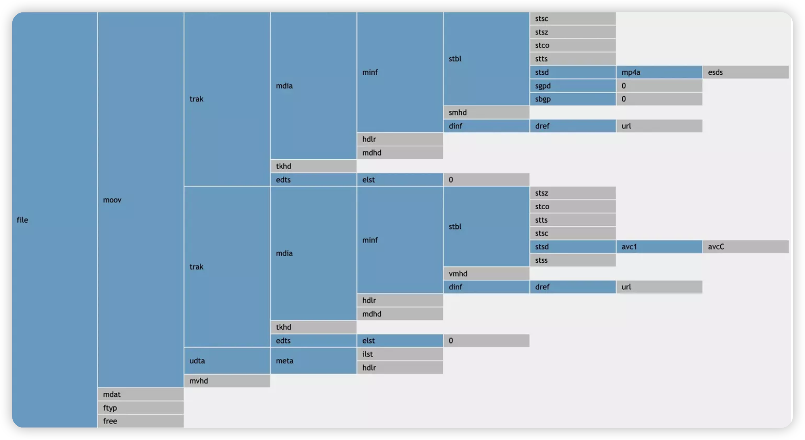  

MP4⽂件的基本组成单元是box , 也就是说MP4⽂件是由各种各样的box组成的 , 有parent box , 还有children box。因此 , 这些boxes之间存在⼀定的层次关系 , 总结如下表所示 , 表中标记出了各个box必选或可选特性 , √ 代表Box必选

| **$\color{red}{\mathbf{ftyp}}$** |                                  |                                  |                                  |                                  |                                      | √    | $\color{red}{\mathbf{file\ type and\ compatibility}}$<br />$\color{red}{\mathbf{⽂件类型和兼容性}}$ |
| -------------------------------- | -------------------------------- | -------------------------------- | -------------------------------- | -------------------------------- | ------------------------------------ | ---- | :----------------------------------------------------------- |
| pdin                             |                                  |                                  |                                  |                                  |                                      |      | progressive download information                             |
| **$\color{red}{\mathbf{moov}}$** |                                  |                                  |                                  |                                  |                                      | √    | $\color{red}{\mathbf{container\ for\ all\ the\ metadata}}$<br/>$\color{red}{\mathbf{所有元数据的容器}}$ |
|                                  | **$\color{red}{\mathbf{mvhd}}$** |                                  |                                  |                                  |                                      | √    | $\color{red}{\mathbf{movie\ header,\ overall\ declarations}}$<br/>$\color{red}{\mathbf{电影头\ ,\ 整体声明}}$ |
|                                  | **$\color{red}{\mathbf{trak}}$** |                                  |                                  |                                  |                                      | √    | $\color{red}{\mathbf{container\ for\ an\ individual\ track\ or\ stream}}$<br/>$\color{red}{\mathbf{单个轨或流的容器}}$ |
|                                  |                                  | **$\color{red}{\mathbf{tkhd}}$** |                                  |                                  |                                      | √    | $\color{red}{\mathbf{track\ header,\ overall\ information\ about\ the track}}$<br />$\color{red}{\mathbf{轨的头部\ ,\ 关于该轨的概括信息\ ,\ ⽐如视频宽⾼}}$ |
|                                  |                                  | tref                             |                                  |                                  |                                      | √    | track reference container                                    |
|                                  |                                  | edts                             |                                  |                                  |                                      | √    | edit list container                                          |
|                                  |                                  |                                  | elst                             |                                  |                                      | √    | an edit list                                                 |
|                                  |                                  | **$\color{red}{\mathbf{mdia}}$** |                                  |                                  |                                      | √    | $\color{red}{\mathbf{container\ for\ the\ media\ information\ in\ a\ track}}$<br/>$\color{red}{\mathbf{轨媒体信息的容器}}$ |
|                                  |                                  |                                  | **$\color{red}{\mathbf{mdhd}}$** |                                  |                                      | √    | **$\color{red}{\mathbf{media\ header,\ overall\ information\ about\ the\ media}}$**<br/>$\color{red}{\mathbf{媒体头\ ,\ 关于媒体的总体信息}}$ |
|                                  |                                  |                                  | **$\color{red}{\mathbf{hdlr}}$** |                                  |                                      | √    | $\color{red}{\mathbf{handler,\ declares\ the\ media\ (handler)\ type}}$<br />$\color{red}{\mathbf{媒体的播放过程信息}}$ |
|                                  |                                  |                                  | **$\color{red}{\mathbf{minf}}$** |                                  |                                      | √    | $\color{red}{\mathbf{media\ information\ container}}$<br/>$\color{red}{\mathbf{媒体信息容器}}$ |
|                                  |                                  |                                  |                                  | vmhd                             |                                      |      | video media header, overall information<br/>(video track only) |
|                                  |                                  |                                  |                                  | smhd                             |                                      |      | sound media header, overall information<br/>(sound track only) |
|                                  |                                  |                                  |                                  | hmhd                             |                                      |      | hint media header, overall information<br/>(hint track only) |
|                                  |                                  |                                  |                                  | nmhd                             |                                      |      | Null media header, overall information<br/>(some tracks only) |
|                                  |                                  |                                  |                                  | **$\color{red}{\mathbf{dinf}}$** |                                      | √    | $\color{red}{\mathbf{data\ information\ box,\ container}}$<br/>$\color{red}{\mathbf{数据信息box\ ,\ 容器}}$ |
|                                  |                                  |                                  |                                  |                                  | **$\color{red}{\mathbf{dref}}$**     | √    | $\color{red}{\mathbf{data\ reference\ box,\ declares\ source(s)\ of\ media\ data\ in\ track}}$<br/>$\color{red}{\mathbf{如何定位媒体信息}}$ |
|                                  |                                  |                                  |                                  | **$\color{red}{\mathbf{stbl}}$** |                                      | √    | $\color{red}{\mathbf{sample\ table\ box,\ container\ for\ the\ time\ /\ space\ map}}$<br/>$\color{red}{\mathbf{包含了track中的sample的所有时间和位置信息\ ,\ 以及sample的编解码等信息。}}$<br />$\color{red}{\mathbf{利⽤这个表可以解析sample的时序、类型、⼤⼩以及在各⾃存储容器中的位置}}$ |
|                                  |                                  |                                  |                                  |                                  | **$\color{red}{\mathbf{stsd}}$**     | √    | $\color{red}{\mathbf{sample\ descriptions\ (codec\ types\ ,\ initialization\ etc.)}}$<br/>$\color{red}{\mathbf{如果是视频\ ,\ 包含:\ 编码类型、宽⾼、长度等信息;}}$<br/>$\color{red}{\mathbf{如果是⾳频\ ,\ 包含:\ 声道、采样率等信息}}$ |
|                                  |                                  |                                  |                                  |                                  | **$\color{red}{\mathbf{stts}}$**     | √    | **$\color{red}{\mathbf{(decoding)\ time-to-sample}}$**<br/>**$\color{red}{\mathbf{描述了sample时序的映射⽅法 , 我们可以通过它找到任何时间的sample}}$** |
|                                  |                                  |                                  |                                  |                                  | ctts                                 |      | (composition) time to sample                                 |
|                                  |                                  |                                  |                                  |                                  | **$\color{red}{\mathbf{stsc}}$**     | √    | $\color{red}{\mathbf{sample-to-chunk,\ partial\ data-offset\ information}}$<br/>$\color{red}{\mathbf{⽤chunk组织sample可以⽅便优化数据获取 , }}$<br/>$\color{red}{\mathbf{⼀个chunk包含⼀个或多个sample}}$ |
|                                  |                                  |                                  |                                  |                                  | **$\color{SkyBlue}{\mathbf{stsz}}$** |      | **$\color{SkyBlue}{\mathbf{sample\ sizes\ (framing)}}$**<br/>**$\color{SkyBlue}{\mathbf{每个sample的⼤⼩}}$**<br/>$\color{SkyBlue}{\mathbf{虽然这⾥没有打勾 , 但对于mp4还是⾮常必要的}}$ |
|                                  |                                  |                                  |                                  |                                  | stz2                                 |      | compact sample sizes (framing)                               |
|                                  |                                  |                                  |                                  |                                  | **$\color{red}{\mathbf{stco}}$**     | √    | $\color{red}{\mathbf{chunk\ offset\ partial\ data-offset\ information}}$<br/>$\color{red}{\mathbf{定义了每个chunk在媒体流中的偏移位置}}$ |
|                                  |                                  |                                  |                                  |                                  | co6                                  |      | 64-bit chunk offset                                          |
|                                  |                                  |                                  |                                  |                                  | 4                                    |      |                                                              |
|                                  |                                  |                                  |                                  |                                  | **$\color{SkyBlue}{\mathbf{stss}}$** |      | $\color{SkyBlue}{\mathbf{sync\ sample\ table\ (random\ access points)}}$<br/>$\color{SkyBlue}{\mathbf{⽤于确定media中的关键帧}}$ |
|                                  |                                  |                                  |                                  |                                  | stsh                                 |      | shadow sync sample table                                     |
|                                  |                                  |                                  |                                  |                                  | padb                                 |      | sample padding bits                                          |
|                                  |                                  |                                  |                                  |                                  | stdp                                 |      | sample degradation priority                                  |
|                                  |                                  |                                  |                                  |                                  | sdtp                                 |      | independent and disposable samples                           |
|                                  |                                  |                                  |                                  |                                  | sbgp                                 |      | sample-to-group                                              |
|                                  |                                  |                                  |                                  |                                  | sgpd                                 |      | sample group description                                     |
|                                  |                                  |                                  |                                  |                                  | subs                                 |      | sub-sample information                                       |
|                                  | mvex                             |                                  |                                  |                                  |                                      |      | movie extends box                                            |
|                                  |                                  | mehd                             |                                  |                                  |                                      |      | movie extends header box                                     |
|                                  |                                  | trex                             |                                  |                                  |                                      | √    | track extends defaults                                       |
|                                  | ipmc                             |                                  |                                  |                                  |                                      |      | IPMP Control Box                                             |
| moof                             |                                  |                                  |                                  |                                  |                                      |      | movie fragment                                               |
|                                  | mfhd                             |                                  |                                  |                                  |                                      | √    | movie fragment header                                        |
|                                  | traf                             |                                  |                                  |                                  |                                      |      | track fragment                                               |
|                                  |                                  | tfhd                             |                                  |                                  |                                      | √    | track fragment header                                        |
|                                  |                                  | trun                             |                                  |                                  |                                      |      | track fragment run                                           |
|                                  |                                  | sdtp                             |                                  |                                  |                                      |      | independent and disposable samples                           |
|                                  |                                  | sbgp                             |                                  |                                  |                                      |      | sample-to-group                                              |
|                                  |                                  | subs                             |                                  |                                  |                                      |      | sub-sample information                                       |
| mfra                             |                                  |                                  |                                  |                                  |                                      |      | movie fragment random access                                 |
|                                  | tfra                             |                                  |                                  |                                  |                                      |      | track fragment random access                                 |
|                                  | mfro                             |                                  |                                  |                                  |                                      | √    | movie fragment random access offset                          |
| mdat                             |                                  |                                  |                                  |                                  |                                      |      | media data container                                         |
| free                             |                                  |                                  |                                  |                                  |                                      |      | free space                                                   |
| skip                             |                                  |                                  |                                  |                                  |                                      |      | free space                                                   |
|                                  | udta                             |                                  |                                  |                                  |                                      |      | user-data                                                    |
|                                  |                                  | cprt                             |                                  |                                  |                                      |      | copyright etc                                                |
| meta                             |                                  |                                  |                                  |                                  |                                      |      | metadata                                                     |
|                                  | hdlr                             |                                  |                                  |                                  |                                      | √    | handler, declares the metadata (handler) type                |
|                                  | dinf                             |                                  |                                  |                                  |                                      |      | data information box, container                              |
|                                  |                                  | dref                             |                                  |                                  |                                      |      | data reference box, declares source(s) of metadata items     |
|                                  | ipmc                             |                                  |                                  |                                  |                                      |      | IPMP Control Box                                             |
|                                  | iloc                             |                                  |                                  |                                  |                                      |      | item location                                                |
|                                  | ipro                             |                                  |                                  |                                  |                                      |      | item protection                                              |
|                                  |                                  | sinf                             |                                  |                                  |                                      |      | protection scheme information box                            |
|                                  |                                  |                                  | frma                             |                                  |                                      |      | original format box                                          |
|                                  |                                  |                                  | imif                             |                                  |                                      |      | IPMP Information box                                         |
|                                  |                                  |                                  | schm                             |                                  |                                      |      | scheme type box                                              |
|                                  |                                  |                                  | schi                             |                                  |                                      |      | scheme information box                                       |
|                                  | iinf                             |                                  |                                  |                                  |                                      |      | item information                                             |
|                                  | xml                              |                                  |                                  |                                  |                                      |      | XML container                                                |
|                                  | bxml                             |                                  |                                  |                                  |                                      |      | binary XML container                                         |
|                                  | pitm                             |                                  |                                  |                                  |                                      |      | primary item reference                                       |
|                                  | fiin                             |                                  |                                  |                                  |                                      |      | file delivery item information                               |
|                                  |                                  | paen                             |                                  |                                  |                                      |      | partition entry                                              |
|                                  |                                  |                                  | fpar                             |                                  |                                      |      | file partition                                               |
|                                  |                                  |                                  | fecr                             |                                  |                                      |      | FEC reservoir                                                |
|                                  |                                  | segr                             |                                  |                                  |                                      |      | file delivery session group                                  |
|                                  |                                  | gitn                             |                                  |                                  |                                      |      | group id to name                                             |
|                                  |                                  | tsel                             |                                  |                                  |                                      |      | track selection                                              |
| meco                             |                                  |                                  |                                  |                                  |                                      |      | additional metadata container                                |
|                                  | mere                             |                                  |                                  |                                  |                                      |      | metabox relation                                             |

本⽂使⽤mediainfo和mp4box进⾏分析

图中看到mp4⽂件由⼏个主要组成部分 , 下⾯以📎 2_audio_track_5s.mp4⽂件为分析案例

## 2.1 ftyp

File Type Box , ⼀般在⽂件的开始位置 , 描述的⽂件的版本、兼容协议等

ftyp内容

> ```tex
> 000000 File Type (32 bytes)
> 000000  Header (8 bytes)
> 000000   Size:                                 32 (0x00000020)
> 000004   Name:                                 ftyp
> 000008  MajorBrand:                            isom
> 00000C  MajorBrandVersion:                     512 (0x00000200)
> 000010  CompatibleBrand:                       isom
> 000014  CompatibleBrand:                       iso2
> 000018  CompatibleBrand:                       avc1
> 00001C  CompatibleBrand:                       mp41
> ```

## 2.2 moov

Movie Box , 包含本⽂件中所有媒体数据的宏观描述信息以及每路媒体轨道的具体信息。⼀般位于放在⽂件末尾 , 但如果为了⽀持http边下载边播放则需要将moov提前。注意 , $\color{red}{\mathbf{当改变moov位置时,内部⼀些值需要重新计算}}$​

moov内容

> ```tex
> 14B2CE File header (10341 bytes)
> 14B2CE  Header (8 bytes)
> 14B2CE   Size:                                 10341 (0x00002865)
> 14B2D2   Name:                                 moov
> ```

moov里面的box才是我们主要分析的box  

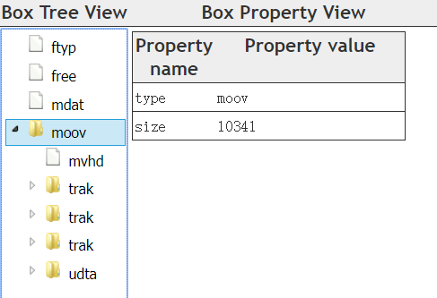  

## 2.3 mdat

Media Data Box , 存放具体的媒体数据

> ```tex
> 000028 Data (1356454 bytes)
> 000028  Header (8 bytes)
> 000028   Size:                                 1356454 (0x0014B2A6)
> 00002C   Name:                                 mdat
> 000030  Data:                                  (1356446 bytes)
> ```

# 3. Moov Insider

mp4的媒体数据信息主要存放在Moov Box中 , 是我们需要分析的重点。moov的主要组成部分如下 : 

## 3.1 mvhd

Movie Header Box , 记录整个媒体⽂件的描述信息 , 如创建时间、修改时间、时间度量标尺、可播放时长等

例如 : 可以获取文件件信息如时长为 Duration: 5016 ms

mvhd内容

> ```tex
> 14B2D6  Movie header (108 bytes)
> 14B2D6   Header (8 bytes)
> 14B2D6    Size:                                108 (0x0000006C)
> 14B2DA    Name:                                mvhd
> 14B2DE   Version:                              0 (0x00)
> 14B2DF   Flags:                                0 (0x000000)
> 14B2E2   Creation time:                        0 (0x00000000) - 
> 14B2E6   Modification time:                    0 (0x00000000) - 
> 14B2EA   Time scale:                           1000 (0x000003E8) - 1000 Hz
> 14B2EE   Duration:                             5016 (0x00001398) - 5016 ms
> 14B2F2   Preferred rate:                       65536 (0x00010000) - 1.000
> 14B2F6   Preferred volume:                     256 (0x0100) - 1.000
> 14B2F8   Reserved:                             (10 bytes)
> 14B302   Matrix structure (36 bytes)
> 14B302    a (width scale):                     1.000
> 14B306    b (width rotate):                    0.000
> 14B30A    u (width angle):                     0.000
> 14B30E    c (height rotate):                   0.000
> 14B312    d (height scale):                    1.000
> 14B316    v (height angle):                    0.000
> 14B31A    x (position left):                   0.000
> 14B31E    y (position top):                    0.000
> 14B322    w (divider):                         1.000
> 14B326   Preview time:                         0 (0x00000000)
> 14B32A   Preview duration:                     0 (0x00000000)
> 14B32E   Poster time:                          0 (0x00000000)
> 14B332   Selection time:                       0 (0x00000000)
> 14B336   Selection duration:                   0 (0x00000000)
> 14B33A   Current time:                         0 (0x00000000)
> 14B33E   Next track ID:                        4 (0x00000004)
> ```

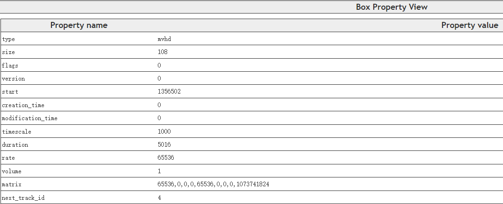 

## 3.2 udta

User Data Box , 自定义数据

> ```tex
> 14DAD1  User Data (98 bytes)
> 14DAD1   Header (8 bytes)
> 14DAD1    Size:                                98 (0x00000062)
> 14DAD5    Name:                                udta
> ```

## 3.3 track

Track Box , 记录媒体流信息 , 文件中可以存在 **$\color{red}{\mathbf{⼀个或多个track}}$** , 它们之间是相互独立的  

 

本次的示例文件里面有3个track

每个track包含以下几个组成部分 : 

### 3.3.1 tkhd

Track Header Box , 包含关于媒体流的头信息。下图示例中 , 可以看到流信息如视频流宽度(width)1920 , 高度(height)800

1. 视频tkhd内容

> ```tex
> 14CEA6   Track Header - 3 (0x3) - 4875 (0x130B) ms (92 bytes)
> 14CEA6    Header (8 bytes)
> 14CEA6     Size:                               92 (0x0000005C)
> 14CEAA     Name:                               tkhd
> 14CEAE    Version:                             0 (0x00)
> 14CEAF    Flags:                               3 (0x000003)
> 14CEB2    Track Enabled:                       Yes
> 14CEB2    Track in Movie:                      Yes
> 14CEB2    Track in Preview:                    No
> 14CEB2    Track in Poster:                     No
> 14CEB2    Creation time:                       0 (0x00000000) - 
> 14CEB6    Modification time:                   0 (0x00000000) - 
> 14CEBA    Track ID:                            3 (0x00000003)
> 14CEBE    Reserved:                            0 (0x00000000)
> 14CEC2    Duration:                            4875 (0x0000130B) - 4875 (0x130B) ms
> 14CEC6    Reserved:                            0 (0x00000000)
> 14CECA    Reserved:                            0 (0x00000000)
> 14CECE    Layer:                               0 (0x0000)
> 14CED0    Alternate group:                     2 (0x0002)
> 14CED2    Volume:                              0 (0x0000) - 0.000
> 14CED4    Reserved:                            0 (0x0000)
> 14CED6    Matrix structure (36 bytes)
> 14CED6     a (width scale):                    1.000
> 14CEDA     b (width rotate):                   0.000
> 14CEDE     u (width angle):                    0.000
> 14CEE2     c (height rotate):                  0.000
> 14CEE6     d (height scale):                   1.000
> 14CEEA     v (height angle):                   0.000
> 14CEEE     x (position left):                  0.000
> 14CEF2     y (position top):                   0.000
> 14CEF6     w (divider):                        1.000
> 14CEFA    Track width:                         1920.000
> 14CEFE    Track height:                        800.000
> ```

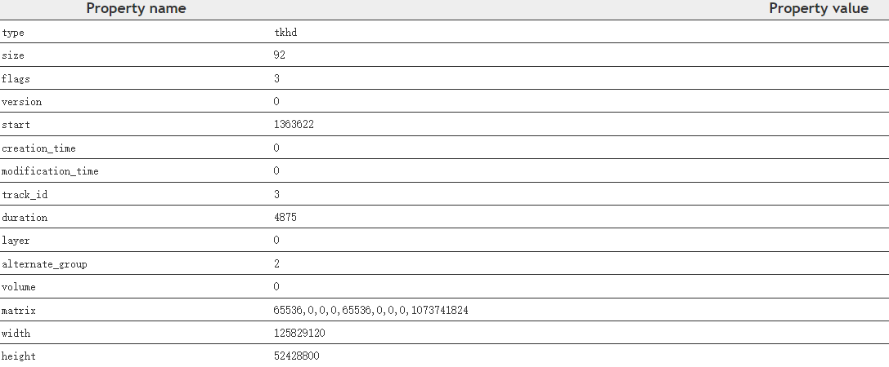 

2. 音频的tkhd , 则比如 duration、volume

> ```tex
> 14B34A   Track Header - 1 (0x1) - 5016 (0x1398) ms (92 bytes)
> 14B34A    Header (8 bytes)
> 14B34A     Size:                               92 (0x0000005C)
> 14B34E     Name:                               tkhd
> 14B352    Version:                             0 (0x00)
> 14B353    Flags:                               3 (0x000003)
> 14B356    Track Enabled:                       Yes
> 14B356    Track in Movie:                      Yes
> 14B356    Track in Preview:                    No
> 14B356    Track in Poster:                     No
> 14B356    Creation time:                       0 (0x00000000) - 
> 14B35A    Modification time:                   0 (0x00000000) - 
> 14B35E    Track ID:                            1 (0x00000001)
> 14B362    Reserved:                            0 (0x00000000)
> 14B366    Duration:                            5016 (0x00001398) - 5016 (0x1398) ms
> 14B36A    Reserved:                            0 (0x00000000)
> 14B36E    Reserved:                            0 (0x00000000)
> 14B372    Layer:                               0 (0x0000)
> 14B374    Alternate group:                     0 (0x0000)
> 14B376    Volume:                              256 (0x0100) - 1.000
> 14B378    Reserved:                            0 (0x0000)
> 14B37A    Matrix structure (36 bytes)
> 14B37A     a (width scale):                    1.000
> 14B37E     b (width rotate):                   0.000
> 14B382     u (width angle):                    0.000
> 14B386     c (height rotate):                  0.000
> 14B38A     d (height scale):                   1.000
> 14B38E     v (height angle):                   0.000
> 14B392     x (position left):                  0.000
> 14B396     y (position top):                   0.000
> 14B39A     w (divider):                        1.000
> 14B39E    Track width:                         0.000
> 14B3A2    Track height:                        0.000
> ```

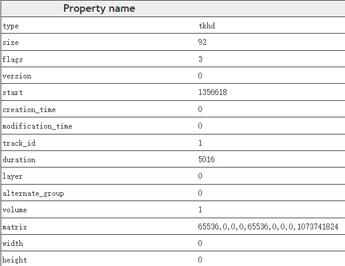 

### 3.3.2 mdia

Media Box , 这是⼀个包含track媒体数据信息的 container box , 子 box包括 : 

1. mdhd : Media Header Box , 存放视频流创建时间 , 长度等信息
2. hdlr : Handler Reference Box , 媒体的播放过程信息
3. minf : Media Information Box , 解释track媒体数据的handler-specific信息

minf 同样是个container box , 其内部需要关注的内容是stbl , 这也是moov中最复杂的部分。stbl包含了媒体流每⼀个sample在文件件中的offset , pts , duration等信息。想要播放⼀个mp4文件 , 必须根据stbl正确找到每个sample并送给解码器

mdia内容

> ```tex
> 14B3CA   Media (3184 bytes)
> 14B3CA    Header (8 bytes)
> 14B3CA     Size:                               3184 (0x00000C70)
> 14B3CE     Name:                               mdia
> ```

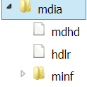 

#### 3.3.2.1 mdhd 

Media Header Box , 存放视频流创建时间 , 长度等信息

视频的mdhd , Time scale , Duration等信息  

1. 视频mdhd内容

> ```tex
> 14CF3A    Media Header (32 bytes)
> 14CF3A     Header (8 bytes)
> 14CF3A      Size:                              32 (0x00000020)
> 14CF3E      Name:                              mdhd
> 14CF42     Version:                            0 (0x00)
> 14CF43     Flags:                              0 (0x000000)
> 14CF46     Creation time:                      0 (0x00000000) - 
> 14CF4A     Modification time:                  0 (0x00000000) - 
> 14CF4E     Time scale:                         90000 (0x00015F90)
> 14CF52     Duration:                           438750 (0x0006B1DE) - 4875 (0x130B) ms
> 14CF56     Language:                           21956 (0x55C4) - und
> 14CF58     Quality:                            0 (0x0000)
> ```

 

音频的mdhd , 也类似视频mdhd的信息 , 但要注意 **$\color{red}{\mathbf{Time\ scale}}$** , 我们在计算时间戳的时候都要使用该 **$\color{red}{\mathbf{Time\ scale\ ,\ 对应我们流里面的AVStream->time\_base}}$**

2. 音频mdhdn内容

> ```tex
> 14B3D2    Media Header (32 bytes)
> 14B3D2     Header (8 bytes)
> 14B3D2      Size:                              32 (0x00000020)
> 14B3D6      Name:                              mdhd
> 14B3DA     Version:                            0 (0x00)
> 14B3DB     Flags:                              0 (0x000000)
> 14B3DE     Creation time:                      0 (0x00000000) - 
> 14B3E2     Modification time:                  0 (0x00000000) - 
> 14B3E6     Time scale:                         44100 (0x0000AC44)
> 14B3EA     Duration:                           221184 (0x00036000) - 5015 (0x1397) ms
> 14B3EE     Language:                           21956 (0x55C4) - und
> 14B3F0     Quality:                            0 (0x0000)
> ```

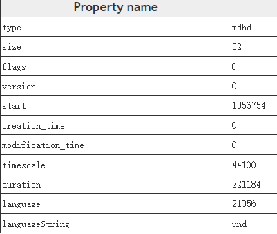 

#### 3.3.2.2 hdlr

Handler Reference Box , 媒体的播放过程信息

视频的hdlr , 重点 **$\color{red}{\mathbf{Component\ subtype\ :\ vide}}$**

> ```tex
> 14CF5A    Handler Reference (45 bytes)
> 14CF5A     Header (8 bytes)
> 14CF5A      Size:                              45 (0x0000002D)
> 14CF5E      Name:                              hdlr
> 14CF62     Version:                            0 (0x00)
> 14CF63     Flags:                              0 (0x000000)
> 14CF66     Component type:                     
> 14CF6A     Component subtype:                  vide
> 14CF6E     Component manufacturer:             
> 14CF72     Component flags:                    0 (0x00000000)
> 14CF76     Component flags mask:               0 (0x00000000)
> 14CF7A     Component name:                     VideoHandler
> ```

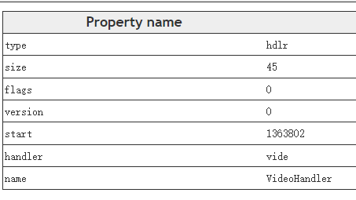 

音频的hdlr ,   **$\color{red}{\mathbf{Component\ subtype\ :\ soun}}$**

如果我们多个音轨的时候 , Component name : 粤语

> ```tex
> 14B3F2    Handler Reference (39 bytes)
> 14B3F2     Header (8 bytes)
> 14B3F2      Size:                              39 (0x00000027)
> 14B3F6      Name:                              hdlr
> 14B3FA     Version:                            0 (0x00)
> 14B3FB     Flags:                              0 (0x000000)
> 14B3FE     Component type:                     
> 14B402     Component subtype:                  soun
> 14B406     Component manufacturer:             
> 14B40A     Component flags:                    0 (0x00000000)
> 14B40E     Component flags mask:               0 (0x00000000)
> 14B412     Component name:                     粤语
> ```

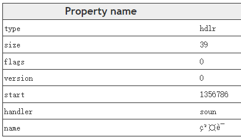 

Component name : 国语

> ```tex
> 14C0EA    Handler Reference (39 bytes)
> 14C0EA     Header (8 bytes)
> 14C0EA      Size:                              39 (0x00000027)
> 14C0EE      Name:                              hdlr
> 14C0F2     Version:                            0 (0x00)
> 14C0F3     Flags:                              0 (0x000000)
> 14C0F6     Component type:                     
> 14C0FA     Component subtype:                  soun
> 14C0FE     Component manufacturer:             
> 14C102     Component flags:                    0 (0x00000000)
> 14C106     Component flags mask:               0 (0x00000000)
> 14C10A     Component name:                     国语
> ```

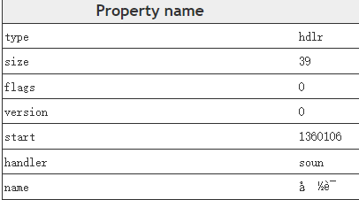 

#### 3.3.2.3 minf

minf : Media Information Box , 解释track媒体数据的handler-specific信息。minf同样是个container box , 其内部需要关注的内容是stbl , 这也是moov中最复杂的部分。

stbl包含了媒体流每⼀个sample在文件中的offset , pts , duration等信息。想要播放⼀个mp4⽂件 , 必须根据stbl正确找到每个sample并送给解码器

而且需要注意的是 , minf⾥⾯的子容器 , 音频和视频轨是有区别的 , 比如视频轨 : **$\color{red}{\mathbf{vmhd}}$** , 音频轨则为 : **$\color{red}{\mathbf{smhd}}$**  

1. vmhd

> ```tex
> 14CF8F     Video Media Header (20 bytes)
> 14CF8F      Header (8 bytes)
> 14CF8F       Size:                             20 (0x00000014)
> 14CF93       Name:                             vmhd
> 14CF97      Version:                           0 (0x00)
> 14CF98      Flags:                             1 (0x000001)
> 14CF9B      Graphic mode:                      0 (0x0000)
> 14CF9D      Graphic mode color R:              0 (0x0000)
> 14CF9F      Graphic mode color G:              0 (0x0000)
> 14CFA1      Graphic mode color B:              0 (0x0000)
> ```

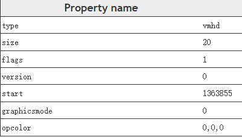 

2. smhd

> ```tex
> 14B421     Sound Media Header (16 bytes)
> 14B421      Header (8 bytes)
> 14B421       Size:                             16 (0x00000010)
> 14B425       Name:                             smhd
> 14B429      Version:                           0 (0x00)
> 14B42A      Flags:                             0 (0x000000)
> 14B42D      Audio balance:                     0 (0x0000)
> 14B42F      Reserved:                          0 (0x0000)
> ```

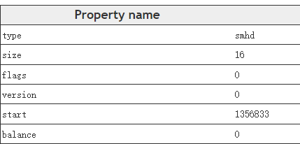 

# 4. Stbl Insider

Sample Table Box , 上⽂提到mdia中最主要的部分是存放⽂件中每个sample信息的stbl。在解析stbl前 , 我们需要区分chunk和sample这两个概念。
在mp4⽂件中 , sample是⼀个媒体流的基本单元 , 例如视频流的⼀个sample代表实际的nal数据。chunk是数据存储的基本单位 , 它是一系列sample数据的集合 , 一个chunk中可以包含⼀个或多的sample

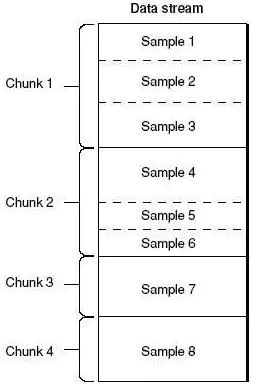 

⼀个chunk包含⼀个或多个sample

stbl⽤来描述每个sample的信息，包含以下几个主要的子box : 

## 4.1 stsd

Sample Description Box , 存放解码必须的描述信息

对于h264的视频流 , 其具体类型为 avc1 , extensions中其中存放有sps , pps等解码必要信息

1. 视频stsd内容

> ```tex
> 14CFCF      Sample Description (174 bytes)
> 14CFCF       Header (8 bytes)
> 14CFCF        Size:                            174 (0x000000AE)
> 14CFD3        Name:                            stsd
> 14CFD7       Version:                          0 (0x00)
> 14CFD8       Flags:                            0 (0x000000)
> 14CFDB       Count:                            1 (0x00000001)
> ```

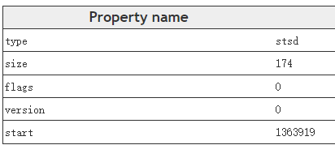 

里面包含了avc1，avc1里面⼜包含了avcC和pasp  

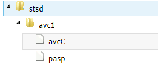 

* avc1 : 包含了视频Width、Height

> ```tex
> 14CFDF       Video (158 bytes)
> 14CFDF        Header (8 bytes)
> 14CFDF         Size:                           158 (0x0000009E)
> 14CFE3         Name:                           avc1
> 14CFE7        Reserved:                        0 (0x0000000000000000)
> 14CFED        Data reference index:            1 (0x0001)
> 14CFEF        Version:                         0 (0x0000)
> 14CFF1        Revision level:                  0 (0x0000)
> 14CFF3        Vendor:                          
> 14CFF7        Temporal quality:                0 (0x00000000)
> 14CFFB        Spatial quality:                 0 (0x00000000)
> 14CFFF        Width:                           1920 (0x0780)
> 14D001        Height:                          800 (0x0320)
> 14D003        Horizontal resolution:           4718592 (0x00480000)
> 14D007        Vertical resolution:             4718592 (0x00480000)
> 14D00B        Data size:                       0 (0x00000000)
> 14D00F        Frame count:                     1 (0x0001)
> 14D011        Compressor name size:            0 (0x00)
> 14D012        Padding:                         (31 bytes)
> 14D031        Depth:                           24 (0x0018)
> 14D033        Color table ID:                  65535 (0xFFFF)
> ```

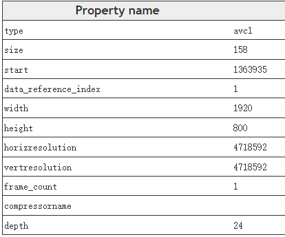 

* avcC : 包含了视频编码器相关的信息 , 包括sps、pps等信息 

> ```tex
> 14D035        AVC decode (56 bytes)
> 14D035         Header (8 bytes)
> 14D035          Size:                          56 (0x00000038)
> 14D039          Name:                          avcC
> 14D03D         Version:                        1 (0x01)
> 14D03E         Specific (47 bytes)
> 14D03E          AVCProfileIndication:          100 (0x64)
> 14D03F          profile_compatibility:         0 (0x00)
> 14D040          AVCLevelIndication:            40 (0x28)
> 14D041          reserved:                      63 (0x3F) - (6 bits)
> 14D041          lengthSizeMinusOne:            3 (0x3) - (2 bits)
> 14D042          reserved:                      7 (0x7) - (3 bits)
> 14D042          numOfSequenceParameterSets:    1 (0x01) - (5 bits)
> 14D043          seq_parameter_set (30 bytes)
> 14D043           sequenceParameterSetLength:   28 (0x001C)
> 14D045           nal_ref_idc:                  3 (0x3) - (2 bits)
> 14D045           nal_unit_type:                7 (0x7) - (5 bits)
> 14D046           profile_idc:                  100 (0x64)
> 14D047           constraint_sett_flags:        0 (0x00)
> 14D048           constraint_sett0_flag:        No
> 14D048           constraint_sett1_flag:        No
> 14D048           constraint_sett2_flag:        No
> 14D048           constraint_sett3_flag:        No
> 14D048           constraint_sett4_flag:        No
> 14D048           constraint_sett5_flag:        No
> 14D048           constraint_sett6_flag:        No
> 14D048           constraint_sett7_flag:        No
> 14D048           level_idc:                    40 (0x28)
> 14D049           seq_parameter_set_id:         0 (0x0)
> 14D049           high profile specific (1 bytes)
> 14D049            chroma_format_idc:           1 (0x1) - 4:2:0
> 14D049            bit_depth_luma_minus8:       0 (0x0)
> 14D049            bit_depth_chroma_minus8:     0 (0x0)
> 14D049            qpprime_y_zero_transform_bypass_flag: No
> 14D049            seq_scaling_matrix_present_flag: No
> 14D04A           log2_max_frame_num_minus4:    0 (0x0)
> 14D04A           pic_order_cnt_type:           0 (0x0)
> 14D04A           log2_max_pic_order_cnt_lsb_minus4: 2 (0x2)
> 14D04A           max_num_ref_frames:           3 (0x3)
> 14D04B           gaps_in_frame_num_value_allowed_flag: No
> 14D04B           pic_width_in_mbs_minus1:      119 (0x077)
> 14D04D           pic_height_in_map_units_minus1: 49 (0x031)
> 14D04E           frame_mbs_only_flag:          Yes
> 14D04E           direct_8x8_inference_flag:    Yes
> 14D04E           frame_cropping_flag:          No
> 14D04E           vui_parameters_present_flag (17 bytes)
> 14D04E            vui_parameters_present_flag: Yes
> 14D04E            aspect_ratio_info_present_flag (2 bytes)
> 14D04E             aspect_ratio_info_present_flag: Yes
> 14D04F             aspect_ratio_idc:           1 (0x01) - (8 bits) - 1.000
> 14D050            overscan_info_present_flag:  No
> 14D050            video_signal_type_present_flag (3 bytes)
> 14D050             video_signal_type_present_flag: Yes
> 14D050             video_format:               5 (0x5) - (3 bits) - 
> 14D050             video_full_range_flag:      0 (0x0) - (1 bits) - Limited
> 14D050             colour_description_present_flag (3 bytes)
> 14D050              colour_description_present_flag: Yes
> 14D050              colour_primaries:          1 (0x01) - (8 bits) - BT.709
> 14D051              transfer_characteristics:  1 (0x01) - (8 bits) - BT.709
> 14D052              matrix_coefficients:       1 (0x01) - (8 bits) - BT.709
> 14D053            chroma_loc_info_present_flag: No
> 14D054            timing_info_present_flag (8 bytes)
> 14D054             timing_info_present_flag:   Yes
> 14D054             num_units_in_tick:          1 (0x00000001) - (32 bits)
> 14D058             time_scale:                 48 (0x00000030) - (32 bits)
> 14D05C             fixed_frame_rate_flag:      Yes
> 14D05C            nal_hrd_parameters_present_flag: No
> 14D05C            vcl_hrd_parameters_present_flag: No
> 14D05C            pic_struct_present_flag:     No
> 14D05C            bitstream_restriction_flag (3 bytes)
> 14D05C             bitstream_restriction_flag: Yes
> 14D05C             motion_vectors_over_pic_boundaries_flag: Yes
> 14D05D             max_bytes_per_pic_denom:    0 (0x0)
> 14D05D             max_bits_per_mb_denom:      0 (0x0)
> 14D05D             log2_max_mv_length_horizontal: 11 (0x0B)
> 14D05E             log2_max_mv_length_vertical: 11 (0x0B)
> 14D05F             max_num_reorder_frames:     2 (0x2)
> 14D05F             max_dec_frame_buffering:    4 (0x4)
> 14D061          numOfPictureParameterSets:     1 (0x01)
> 14D062          pic_parameter_set (6 bytes)
> 14D062           pictureParameterSetLength:    5 (0x0005)
> 14D064           nal_ref_idc:                  3 (0x3) - (2 bits)
> 14D064           nal_unit_type:                8 (0x8) - (5 bits)
> 14D065           pic_parameter_set_id:         0 (0x0)
> 14D065           seq_parameter_set_id:         0 (0x0)
> 14D065           entropy_coding_mode_flag:     Yes
> 14D065           bottom_field_pic_order_in_frame_present_flag: No
> 14D065           num_slice_groups_minus1:      0 (0x0)
> 14D065           num_ref_idx_l0_default_active_minus1: 3 (0x3)
> 14D066           num_ref_idx_l1_default_active_minus1: 0 (0x0)
> 14D066           weighted_pred_flag:           No
> 14D066           weighted_bipred_idc:          2 (0x2) - (2 bits)
> 14D066           pic_init_qp_minus26:          0 (0x0)
> 14D067           pic_init_qs_minus26:          0 (0x0)
> 14D067           chroma_qp_index_offset:       0 (0x0)
> 14D067           deblocking_filter_control_present_flag: Yes
> 14D067           constrained_intra_pred_flag:  No
> 14D067           redundant_pic_cnt_present_flag: No
> 14D067           transform_8x8_mode_flag:      Yes
> 14D067           pic_scaling_matrix_present_flag: No
> 14D067           second_chroma_qp_index_offset: 0 (0x0)
> 14D068          -------------------------
> 14D068          ---   AVC, accepted   ---
> 14D068          -------------------------
> 14D069          reserved:                      63 (0x3F) - (6 bits)
> 14D069          chroma_format:                 1 (0x1) - (2 bits)
> 14D06A          reserved:                      31 (0x1F) - (5 bits)
> 14D06A          bit_depth_luma_minus8:         0 (0x0) - (3 bits)
> 14D06B          reserved:                      31 (0x1F) - (5 bits)
> 14D06B          bit_depth_chroma_minus8:       0 (0x0) - (3 bits)
> 14D06C          numOfSequenceParameterSetExt:  0 (0x00)
> 14D06D        Pixel Aspect Ratio (16 bytes)
> 14D06D         Header (8 bytes)
> 14D06D          Size:                          16 (0x00000010)
> 14D071          Name:                          pasp
> 14D075         hSpacing:                       1 (0x00000001)
> 14D079         vSpacing:                       1 (0x00000001)
> ```

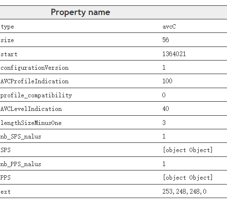 

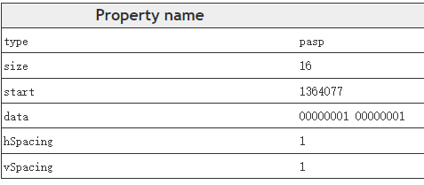 

2. 音频的stsd 

包含了音频相关的信息 , 比如采样率 , 通道数量等

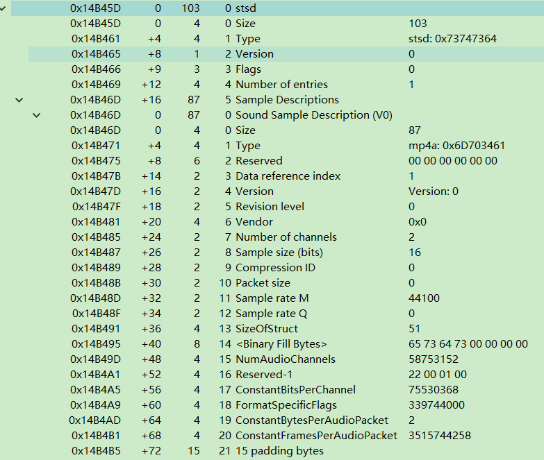 

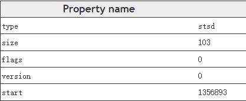 

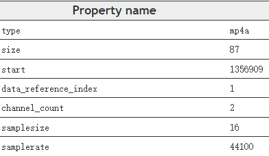 

## 4.2 stts

Time-to-Sample Box , 定义每个sample时长。Time-To-Sample的table entry布局如下 : 

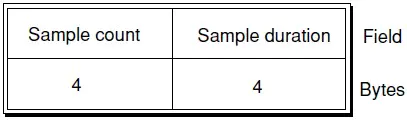 

stts table entry布局  

- sample count : sample个数
- sample duration : sample持续时间  

**$\color{red}{\mathbf{持续时间相同的连续sample可以放到⼀个entry⾥达到节省空间的目的}}$**

这⾥先给出来的是视频的 stts , Number of entries , **$\color{red}{\mathbf{这个参数需要注意并不是sample的个数\ , sample的实际数量需要将每个entry\ 的\ sample\ count\ 进行累加才是真正的sample个数}}$​​** 参考下面的数据为例子 sample total = 1+1+1+2+...+2+1

下面文本示例中 , 第1个sample时间为3720 , 单位用mdhd的time scale进行换算 , 比如视频的(Time scale)是90000 , 此时换算成秒为3720 ÷ 90000 = 0.0413333333333333秒 = 41.3333333333333ms

1. 视频stts内容

> ```tex
> 14D07D      Time to Sample (664 bytes)
> 14D07D       Header (8 bytes)
> 14D07D        Size:                            664 (0x00000298)
> 14D081        Name:                            stts
> 14D085       Version:                          0 (0x00)
> 14D086       Flags:                            0 (0x000000)
> 14D089       Number of entries:                81 (0x00000051)
> 14D08D       Sample Count:                     1 (0x00000001)
> 14D091       Sample Duration:                  3720 (0x00000E88)
> 14D095       Sample Count:                     1 (0x00000001)
> 14D099       Sample Duration:                  3780 (0x00000EC4)
> 14D09D       Sample Count:                     1 (0x00000001)
> 14D0A1       Sample Duration:                  3690 (0x00000E6A)
> 14D0A5       Sample Count:                     2 (0x00000002)
> 14D0A9       Sample Duration:                  3780 (0x00000EC4)
> 14D0AD       Sample Count:                     1 (0x00000001)
> 14D0B1       Sample Duration:                  3690 (0x00000E6A)
> 14D0B5       Sample Count:                     2 (0x00000002)
> 14D0B9       Sample Duration:                  3780 (0x00000EC4)
> 14D0BD       Sample Count:                     1 (0x00000001)
> 14D0C1       Sample Duration:                  3690 (0x00000E6A)
> 14D0C5       Sample Count:                     2 (0x00000002)
> 14D0C9       Sample Duration:                  3780 (0x00000EC4)
> 14D0CD       Sample Count:                     1 (0x00000001)
> 14D0D1       Sample Duration:                  3690 (0x00000E6A)
> 14D0D5       Sample Count:                     2 (0x00000002)
> 14D0D9       Sample Duration:                  3780 (0x00000EC4)
> 14D0DD       Sample Count:                     1 (0x00000001)
> 14D0E1       Sample Duration:                  3690 (0x00000E6A)
> 14D0E5       Sample Count:                     2 (0x00000002)
> 14D0E9       Sample Duration:                  3780 (0x00000EC4)
> 14D0ED       Sample Count:                     1 (0x00000001)
> 14D0F1       Sample Duration:                  3690 (0x00000E6A)
> 14D0F5       Sample Count:                     2 (0x00000002)
> 14D0F9       Sample Duration:                  3780 (0x00000EC4)
> 14D0FD       Sample Count:                     1 (0x00000001)
> 14D101       Sample Duration:                  3690 (0x00000E6A)
> 14D105       Sample Count:                     2 (0x00000002)
> 14D109       Sample Duration:                  3780 (0x00000EC4)
> 14D10D       Sample Count:                     1 (0x00000001)
> 14D111       Sample Duration:                  3690 (0x00000E6A)
> 14D115       Sample Count:                     2 (0x00000002)
> 14D119       Sample Duration:                  3780 (0x00000EC4)
> 14D11D       Sample Count:                     1 (0x00000001)
> 14D121       Sample Duration:                  3690 (0x00000E6A)
> 14D125       Sample Count:                     2 (0x00000002)
> 14D129       Sample Duration:                  3780 (0x00000EC4)
> 14D12D       Sample Count:                     1 (0x00000001)
> 14D131       Sample Duration:                  3690 (0x00000E6A)
> 14D135       Sample Count:                     2 (0x00000002)
> 14D139       Sample Duration:                  3780 (0x00000EC4)
> 14D13D       Sample Count:                     1 (0x00000001)
> 14D141       Sample Duration:                  3690 (0x00000E6A)
> 14D145       Sample Count:                     2 (0x00000002)
> 14D149       Sample Duration:                  3780 (0x00000EC4)
> 14D14D       Sample Count:                     1 (0x00000001)
> 14D151       Sample Duration:                  3690 (0x00000E6A)
> 14D155       Sample Count:                     2 (0x00000002)
> 14D159       Sample Duration:                  3780 (0x00000EC4)
> 14D15D       Sample Count:                     1 (0x00000001)
> 14D161       Sample Duration:                  3690 (0x00000E6A)
> 14D165       Sample Count:                     2 (0x00000002)
> 14D169       Sample Duration:                  3780 (0x00000EC4)
> 14D16D       Sample Count:                     1 (0x00000001)
> 14D171       Sample Duration:                  3690 (0x00000E6A)
> 14D175       Sample Count:                     2 (0x00000002)
> 14D179       Sample Duration:                  3780 (0x00000EC4)
> 14D17D       Sample Count:                     1 (0x00000001)
> 14D181       Sample Duration:                  3690 (0x00000E6A)
> 14D185       Sample Count:                     2 (0x00000002)
> 14D189       Sample Duration:                  3780 (0x00000EC4)
> 14D18D       Sample Count:                     1 (0x00000001)
> 14D191       Sample Duration:                  3690 (0x00000E6A)
> 14D195       Sample Count:                     2 (0x00000002)
> 14D199       Sample Duration:                  3780 (0x00000EC4)
> 14D19D       Sample Count:                     1 (0x00000001)
> 14D1A1       Sample Duration:                  3690 (0x00000E6A)
> 14D1A5       Sample Count:                     1 (0x00000001)
> 14D1A9       Sample Duration:                  3780 (0x00000EC4)
> 14D1AD       Sample Count:                     1 (0x00000001)
> 14D1B1       Sample Duration:                  3750 (0x00000EA6)
> 14D1B5       Sample Count:                     1 (0x00000001)
> 14D1B9       Sample Duration:                  3720 (0x00000E88)
> 14D1BD       Sample Count:                     2 (0x00000002)
> 14D1C1       Sample Duration:                  3780 (0x00000EC4)
> 14D1C5       Sample Count:                     1 (0x00000001)
> 14D1C9       Sample Duration:                  3690 (0x00000E6A)
> 14D1CD       Sample Count:                     2 (0x00000002)
> 14D1D1       Sample Duration:                  3780 (0x00000EC4)
> 14D1D5       Sample Count:                     1 (0x00000001)
> 14D1D9       Sample Duration:                  3690 (0x00000E6A)
> 14D1DD       Sample Count:                     2 (0x00000002)
> 14D1E1       Sample Duration:                  3780 (0x00000EC4)
> 14D1E5       Sample Count:                     1 (0x00000001)
> 14D1E9       Sample Duration:                  3690 (0x00000E6A)
> 14D1ED       Sample Count:                     2 (0x00000002)
> 14D1F1       Sample Duration:                  3780 (0x00000EC4)
> 14D1F5       Sample Count:                     1 (0x00000001)
> 14D1F9       Sample Duration:                  3690 (0x00000E6A)
> 14D1FD       Sample Count:                     2 (0x00000002)
> 14D201       Sample Duration:                  3780 (0x00000EC4)
> 14D205       Sample Count:                     1 (0x00000001)
> 14D209       Sample Duration:                  3690 (0x00000E6A)
> 14D20D       Sample Count:                     2 (0x00000002)
> 14D211       Sample Duration:                  3780 (0x00000EC4)
> 14D215       Sample Count:                     1 (0x00000001)
> 14D219       Sample Duration:                  3690 (0x00000E6A)
> 14D21D       Sample Count:                     2 (0x00000002)
> 14D221       Sample Duration:                  3780 (0x00000EC4)
> 14D225       Sample Count:                     1 (0x00000001)
> 14D229       Sample Duration:                  3690 (0x00000E6A)
> 14D22D       Sample Count:                     2 (0x00000002)
> 14D231       Sample Duration:                  3780 (0x00000EC4)
> 14D235       Sample Count:                     1 (0x00000001)
> 14D239       Sample Duration:                  3690 (0x00000E6A)
> 14D23D       Sample Count:                     2 (0x00000002)
> 14D241       Sample Duration:                  3780 (0x00000EC4)
> 14D245       Sample Count:                     1 (0x00000001)
> 14D249       Sample Duration:                  3690 (0x00000E6A)
> 14D24D       Sample Count:                     2 (0x00000002)
> 14D251       Sample Duration:                  3780 (0x00000EC4)
> 14D255       Sample Count:                     1 (0x00000001)
> 14D259       Sample Duration:                  3690 (0x00000E6A)
> 14D25D       Sample Count:                     2 (0x00000002)
> 14D261       Sample Duration:                  3780 (0x00000EC4)
> 14D265       Sample Count:                     1 (0x00000001)
> 14D269       Sample Duration:                  3690 (0x00000E6A)
> 14D26D       Sample Count:                     2 (0x00000002)
> 14D271       Sample Duration:                  3780 (0x00000EC4)
> 14D275       Sample Count:                     1 (0x00000001)
> 14D279       Sample Duration:                  3690 (0x00000E6A)
> 14D27D       Sample Count:                     2 (0x00000002)
> 14D281       Sample Duration:                  3780 (0x00000EC4)
> 14D285       Sample Count:                     1 (0x00000001)
> 14D289       Sample Duration:                  3690 (0x00000E6A)
> 14D28D       Sample Count:                     2 (0x00000002)
> 14D291       Sample Duration:                  3780 (0x00000EC4)
> 14D295       Sample Count:                     1 (0x00000001)
> 14D299       Sample Duration:                  3690 (0x00000E6A)
> 14D29D       Sample Count:                     2 (0x00000002)
> 14D2A1       Sample Duration:                  3780 (0x00000EC4)
> 14D2A5       Sample Count:                     1 (0x00000001)
> 14D2A9       Sample Duration:                  3690 (0x00000E6A)
> 14D2AD       Sample Count:                     2 (0x00000002)
> 14D2B1       Sample Duration:                  3780 (0x00000EC4)
> 14D2B5       Sample Count:                     1 (0x00000001)
> 14D2B9       Sample Duration:                  3750 (0x00000EA6)
> 14D2BD       Sample Count:                     1 (0x00000001)
> 14D2C1       Sample Duration:                  3720 (0x00000E88)
> 14D2C5       Sample Count:                     1 (0x00000001)
> 14D2C9       Sample Duration:                  3780 (0x00000EC4)
> 14D2CD       Sample Count:                     1 (0x00000001)
> 14D2D1       Sample Duration:                  3690 (0x00000E6A)
> 14D2D5       Sample Count:                     2 (0x00000002)
> 14D2D9       Sample Duration:                  3780 (0x00000EC4)
> 14D2DD       Sample Count:                     1 (0x00000001)
> 14D2E1       Sample Duration:                  3690 (0x00000E6A)
> 14D2E5       Sample Count:                     2 (0x00000002)
> 14D2E9       Sample Duration:                  3780 (0x00000EC4)
> 14D2ED       Sample Count:                     1 (0x00000001)
> 14D2F1       Sample Duration:                  3690 (0x00000E6A)
> 14D2F5       Sample Count:                     2 (0x00000002)
> 14D2F9       Sample Duration:                  3780 (0x00000EC4)
> 14D2FD       Sample Count:                     1 (0x00000001)
> 14D301       Sample Duration:                  3690 (0x00000E6A)
> 14D305       Sample Count:                     2 (0x00000002)
> 14D309       Sample Duration:                  3780 (0x00000EC4)
> 14D30D       Sample Count:                     1 (0x00000001)
> 14D311       Sample Duration:                  3750 (0x00000EA6)
> ```

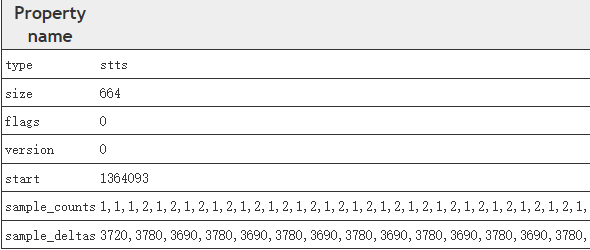 

2. 音频的stts

只是mdhd的 time scale 的差别 , 之前我们看到⾳频为44100 , 则计算第⼀个sample的时间 1024/44100=0.0232199546485261秒 = 23.2199546485261ms

> ```tex
> 14B4C4      Time to Sample (1048 bytes)
> 14B4C4       Header (8 bytes)
> 14B4C4        Size:                            1048 (0x00000418)
> 14B4C8        Name:                            stts
> 14B4CC       Version:                          0 (0x00)
> 14B4CD       Flags:                            0 (0x000000)
> 14B4D0       Number of entries:                129 (0x00000081)
> 14B4D4       Sample Count:                     1 (0x00000001)
> 14B4D8       Sample Duration:                  1024 (0x00000400)
> 14B4DC       Sample Count:                     1 (0x00000001)
> 14B4E0       Sample Duration:                  1025 (0x00000401)
> 14B4E4       Sample Count:                     2 (0x00000002)
> 14B4E8       Sample Duration:                  1024 (0x00000400)
> 14B4EC       Sample Count:                     1 (0x00000001)
> 14B4F0       Sample Duration:                  1023 (0x000003FF)
> 14B4F4       Sample Count:                     1 (0x00000001)
> 14B4F8       Sample Duration:                  1024 (0x00000400)
> 14B4FC       Sample Count:                     1 (0x00000001)
> 14B500       Sample Duration:                  1025 (0x00000401)
> 14B504       Sample Count:                     1 (0x00000001)
> 14B508       Sample Duration:                  1024 (0x00000400)
> 14B50C       Sample Count:                     1 (0x00000001)
> 14B510       Sample Duration:                  1023 (0x000003FF)
> 14B514       Sample Count:                     2 (0x00000002)
> 14B518       Sample Duration:                  1024 (0x00000400)
> 14B51C       Sample Count:                     1 (0x00000001)
> 14B520       Sample Duration:                  1025 (0x00000401)
> 14B524       Sample Count:                     1 (0x00000001)
> 14B528       Sample Duration:                  1024 (0x00000400)
> 14B52C       Sample Count:                     1 (0x00000001)
> 14B530       Sample Duration:                  1023 (0x000003FF)
> 14B534       Sample Count:                     2 (0x00000002)
> 14B538       Sample Duration:                  1024 (0x00000400)
> 14B53C       Sample Count:                     1 (0x00000001)
> 14B540       Sample Duration:                  1025 (0x00000401)
> 14B544       Sample Count:                     1 (0x00000001)
> 14B548       Sample Duration:                  1024 (0x00000400)
> 14B54C       Sample Count:                     1 (0x00000001)
> 14B550       Sample Duration:                  1023 (0x000003FF)
> 14B554       Sample Count:                     2 (0x00000002)
> 14B558       Sample Duration:                  1024 (0x00000400)
> 14B55C       Sample Count:                     1 (0x00000001)
> 14B560       Sample Duration:                  1025 (0x00000401)
> 14B564       Sample Count:                     1 (0x00000001)
> 14B568       Sample Duration:                  1024 (0x00000400)
> 14B56C       Sample Count:                     1 (0x00000001)
> 14B570       Sample Duration:                  1023 (0x000003FF)
> 14B574       Sample Count:                     1 (0x00000001)
> 14B578       Sample Duration:                  1024 (0x00000400)
> 14B57C       Sample Count:                     1 (0x00000001)
> 14B580       Sample Duration:                  1025 (0x00000401)
> 14B584       Sample Count:                     2 (0x00000002)
> 14B588       Sample Duration:                  1024 (0x00000400)
> 14B58C       Sample Count:                     1 (0x00000001)
> 14B590       Sample Duration:                  1023 (0x000003FF)
> 14B594       Sample Count:                     1 (0x00000001)
> 14B598       Sample Duration:                  1024 (0x00000400)
> 14B59C       Sample Count:                     1 (0x00000001)
> 14B5A0       Sample Duration:                  1025 (0x00000401)
> 14B5A4       Sample Count:                     2 (0x00000002)
> 14B5A8       Sample Duration:                  1024 (0x00000400)
> 14B5AC       Sample Count:                     1 (0x00000001)
> 14B5B0       Sample Duration:                  1023 (0x000003FF)
> 14B5B4       Sample Count:                     1 (0x00000001)
> 14B5B8       Sample Duration:                  1024 (0x00000400)
> 14B5BC       Sample Count:                     1 (0x00000001)
> 14B5C0       Sample Duration:                  1025 (0x00000401)
> 14B5C4       Sample Count:                     2 (0x00000002)
> 14B5C8       Sample Duration:                  1024 (0x00000400)
> 14B5CC       Sample Count:                     1 (0x00000001)
> 14B5D0       Sample Duration:                  1023 (0x000003FF)
> 14B5D4       Sample Count:                     1 (0x00000001)
> 14B5D8       Sample Duration:                  1024 (0x00000400)
> 14B5DC       Sample Count:                     1 (0x00000001)
> 14B5E0       Sample Duration:                  1025 (0x00000401)
> 14B5E4       Sample Count:                     2 (0x00000002)
> 14B5E8       Sample Duration:                  1024 (0x00000400)
> 14B5EC       Sample Count:                     1 (0x00000001)
> 14B5F0       Sample Duration:                  1023 (0x000003FF)
> 14B5F4       Sample Count:                     1 (0x00000001)
> 14B5F8       Sample Duration:                  1024 (0x00000400)
> 14B5FC       Sample Count:                     1 (0x00000001)
> 14B600       Sample Duration:                  1025 (0x00000401)
> 14B604       Sample Count:                     2 (0x00000002)
> 14B608       Sample Duration:                  1024 (0x00000400)
> 14B60C       Sample Count:                     1 (0x00000001)
> 14B610       Sample Duration:                  1023 (0x000003FF)
> 14B614       Sample Count:                     1 (0x00000001)
> 14B618       Sample Duration:                  1024 (0x00000400)
> 14B61C       Sample Count:                     1 (0x00000001)
> 14B620       Sample Duration:                  1025 (0x00000401)
> 14B624       Sample Count:                     2 (0x00000002)
> 14B628       Sample Duration:                  1024 (0x00000400)
> 14B62C       Sample Count:                     1 (0x00000001)
> 14B630       Sample Duration:                  1023 (0x000003FF)
> 14B634       Sample Count:                     1 (0x00000001)
> 14B638       Sample Duration:                  1024 (0x00000400)
> 14B63C       Sample Count:                     1 (0x00000001)
> 14B640       Sample Duration:                  1025 (0x00000401)
> 14B644       Sample Count:                     50 (0x00000032)
> 14B648       Sample Duration:                  1024 (0x00000400)
> 14B64C       Sample Count:                     1 (0x00000001)
> 14B650       Sample Duration:                  1023 (0x000003FF)
> 14B654       Sample Count:                     2 (0x00000002)
> 14B658       Sample Duration:                  1024 (0x00000400)
> 14B65C       Sample Count:                     1 (0x00000001)
> 14B660       Sample Duration:                  1025 (0x00000401)
> 14B664       Sample Count:                     1 (0x00000001)
> 14B668       Sample Duration:                  1024 (0x00000400)
> 14B66C       Sample Count:                     1 (0x00000001)
> 14B670       Sample Duration:                  1023 (0x000003FF)
> 14B674       Sample Count:                     2 (0x00000002)
> 14B678       Sample Duration:                  1024 (0x00000400)
> 14B67C       Sample Count:                     1 (0x00000001)
> 14B680       Sample Duration:                  1025 (0x00000401)
> 14B684       Sample Count:                     1 (0x00000001)
> 14B688       Sample Duration:                  1024 (0x00000400)
> 14B68C       Sample Count:                     1 (0x00000001)
> 14B690       Sample Duration:                  1023 (0x000003FF)
> 14B694       Sample Count:                     2 (0x00000002)
> 14B698       Sample Duration:                  1024 (0x00000400)
> 14B69C       Sample Count:                     1 (0x00000001)
> 14B6A0       Sample Duration:                  1025 (0x00000401)
> 14B6A4       Sample Count:                     1 (0x00000001)
> 14B6A8       Sample Duration:                  1024 (0x00000400)
> 14B6AC       Sample Count:                     1 (0x00000001)
> 14B6B0       Sample Duration:                  1023 (0x000003FF)
> 14B6B4       Sample Count:                     1 (0x00000001)
> 14B6B8       Sample Duration:                  1024 (0x00000400)
> 14B6BC       Sample Count:                     1 (0x00000001)
> 14B6C0       Sample Duration:                  1025 (0x00000401)
> 14B6C4       Sample Count:                     2 (0x00000002)
> 14B6C8       Sample Duration:                  1024 (0x00000400)
> 14B6CC       Sample Count:                     1 (0x00000001)
> 14B6D0       Sample Duration:                  1023 (0x000003FF)
> 14B6D4       Sample Count:                     1 (0x00000001)
> 14B6D8       Sample Duration:                  1024 (0x00000400)
> 14B6DC       Sample Count:                     1 (0x00000001)
> 14B6E0       Sample Duration:                  1025 (0x00000401)
> 14B6E4       Sample Count:                     2 (0x00000002)
> 14B6E8       Sample Duration:                  1024 (0x00000400)
> 14B6EC       Sample Count:                     1 (0x00000001)
> 14B6F0       Sample Duration:                  1023 (0x000003FF)
> 14B6F4       Sample Count:                     1 (0x00000001)
> 14B6F8       Sample Duration:                  1024 (0x00000400)
> 14B6FC       Sample Count:                     1 (0x00000001)
> 14B700       Sample Duration:                  1025 (0x00000401)
> 14B704       Sample Count:                     2 (0x00000002)
> 14B708       Sample Duration:                  1024 (0x00000400)
> 14B70C       Sample Count:                     1 (0x00000001)
> 14B710       Sample Duration:                  1023 (0x000003FF)
> 14B714       Sample Count:                     1 (0x00000001)
> 14B718       Sample Duration:                  1024 (0x00000400)
> 14B71C       Sample Count:                     1 (0x00000001)
> 14B720       Sample Duration:                  1025 (0x00000401)
> 14B724       Sample Count:                     2 (0x00000002)
> 14B728       Sample Duration:                  1024 (0x00000400)
> 14B72C       Sample Count:                     1 (0x00000001)
> 14B730       Sample Duration:                  1023 (0x000003FF)
> 14B734       Sample Count:                     1 (0x00000001)
> 14B738       Sample Duration:                  1024 (0x00000400)
> 14B73C       Sample Count:                     1 (0x00000001)
> 14B740       Sample Duration:                  1025 (0x00000401)
> 14B744       Sample Count:                     2 (0x00000002)
> 14B748       Sample Duration:                  1024 (0x00000400)
> 14B74C       Sample Count:                     1 (0x00000001)
> 14B750       Sample Duration:                  1023 (0x000003FF)
> 14B754       Sample Count:                     1 (0x00000001)
> 14B758       Sample Duration:                  1024 (0x00000400)
> 14B75C       Sample Count:                     1 (0x00000001)
> 14B760       Sample Duration:                  1025 (0x00000401)
> 14B764       Sample Count:                     2 (0x00000002)
> 14B768       Sample Duration:                  1024 (0x00000400)
> 14B76C       Sample Count:                     1 (0x00000001)
> 14B770       Sample Duration:                  1023 (0x000003FF)
> 14B774       Sample Count:                     1 (0x00000001)
> 14B778       Sample Duration:                  1024 (0x00000400)
> 14B77C       Sample Count:                     1 (0x00000001)
> 14B780       Sample Duration:                  1025 (0x00000401)
> 14B784       Sample Count:                     1 (0x00000001)
> 14B788       Sample Duration:                  1024 (0x00000400)
> 14B78C       Sample Count:                     1 (0x00000001)
> 14B790       Sample Duration:                  1023 (0x000003FF)
> 14B794       Sample Count:                     2 (0x00000002)
> 14B798       Sample Duration:                  1024 (0x00000400)
> 14B79C       Sample Count:                     1 (0x00000001)
> 14B7A0       Sample Duration:                  1025 (0x00000401)
> 14B7A4       Sample Count:                     1 (0x00000001)
> 14B7A8       Sample Duration:                  1024 (0x00000400)
> 14B7AC       Sample Count:                     1 (0x00000001)
> 14B7B0       Sample Duration:                  1023 (0x000003FF)
> 14B7B4       Sample Count:                     2 (0x00000002)
> 14B7B8       Sample Duration:                  1024 (0x00000400)
> 14B7BC       Sample Count:                     1 (0x00000001)
> 14B7C0       Sample Duration:                  1025 (0x00000401)
> 14B7C4       Sample Count:                     1 (0x00000001)
> 14B7C8       Sample Duration:                  1024 (0x00000400)
> 14B7CC       Sample Count:                     1 (0x00000001)
> 14B7D0       Sample Duration:                  1023 (0x000003FF)
> 14B7D4       Sample Count:                     2 (0x00000002)
> 14B7D8       Sample Duration:                  1024 (0x00000400)
> 14B7DC       Sample Count:                     1 (0x00000001)
> 14B7E0       Sample Duration:                  1025 (0x00000401)
> 14B7E4       Sample Count:                     1 (0x00000001)
> 14B7E8       Sample Duration:                  1024 (0x00000400)
> 14B7EC       Sample Count:                     1 (0x00000001)
> 14B7F0       Sample Duration:                  1023 (0x000003FF)
> 14B7F4       Sample Count:                     1 (0x00000001)
> 14B7F8       Sample Duration:                  1024 (0x00000400)
> 14B7FC       Sample Count:                     1 (0x00000001)
> 14B800       Sample Duration:                  1025 (0x00000401)
> 14B804       Sample Count:                     2 (0x00000002)
> 14B808       Sample Duration:                  1024 (0x00000400)
> 14B80C       Sample Count:                     1 (0x00000001)
> 14B810       Sample Duration:                  1023 (0x000003FF)
> 14B814       Sample Count:                     1 (0x00000001)
> 14B818       Sample Duration:                  1024 (0x00000400)
> 14B81C       Sample Count:                     1 (0x00000001)
> 14B820       Sample Duration:                  1025 (0x00000401)
> 14B824       Sample Count:                     2 (0x00000002)
> 14B828       Sample Duration:                  1024 (0x00000400)
> 14B82C       Sample Count:                     1 (0x00000001)
> 14B830       Sample Duration:                  1023 (0x000003FF)
> 14B834       Sample Count:                     1 (0x00000001)
> 14B838       Sample Duration:                  1024 (0x00000400)
> 14B83C       Sample Count:                     1 (0x00000001)
> 14B840       Sample Duration:                  1025 (0x00000401)
> 14B844       Sample Count:                     2 (0x00000002)
> 14B848       Sample Duration:                  1024 (0x00000400)
> 14B84C       Sample Count:                     1 (0x00000001)
> 14B850       Sample Duration:                  1023 (0x000003FF)
> 14B854       Sample Count:                     1 (0x00000001)
> 14B858       Sample Duration:                  1024 (0x00000400)
> 14B85C       Sample Count:                     1 (0x00000001)
> 14B860       Sample Duration:                  1025 (0x00000401)
> 14B864       Sample Count:                     2 (0x00000002)
> 14B868       Sample Duration:                  1024 (0x00000400)
> 14B86C       Sample Count:                     1 (0x00000001)
> 14B870       Sample Duration:                  1023 (0x000003FF)
> 14B874       Sample Count:                     1 (0x00000001)
> 14B878       Sample Duration:                  1024 (0x00000400)
> 14B87C       Sample Count:                     1 (0x00000001)
> 14B880       Sample Duration:                  1025 (0x00000401)
> 14B884       Sample Count:                     2 (0x00000002)
> 14B888       Sample Duration:                  1024 (0x00000400)
> 14B88C       Sample Count:                     1 (0x00000001)
> 14B890       Sample Duration:                  1023 (0x000003FF)
> 14B894       Sample Count:                     1 (0x00000001)
> 14B898       Sample Duration:                  1024 (0x00000400)
> 14B89C       Sample Count:                     1 (0x00000001)
> 14B8A0       Sample Duration:                  1025 (0x00000401)
> 14B8A4       Sample Count:                     2 (0x00000002)
> 14B8A8       Sample Duration:                  1024 (0x00000400)
> 14B8AC       Sample Count:                     1 (0x00000001)
> 14B8B0       Sample Duration:                  1023 (0x000003FF)
> 14B8B4       Sample Count:                     1 (0x00000001)
> 14B8B8       Sample Duration:                  1024 (0x00000400)
> 14B8BC       Sample Count:                     1 (0x00000001)
> 14B8C0       Sample Duration:                  1025 (0x00000401)
> 14B8C4       Sample Count:                     11 (0x0000000B)
> 14B8C8       Sample Duration:                  1024 (0x00000400)
> 14B8CC       Sample Count:                     1 (0x00000001)
> 14B8D0       Sample Duration:                  1023 (0x000003FF)
> 14B8D4       Sample Count:                     1 (0x00000001)
> 14B8D8       Sample Duration:                  1024 (0x00000400)
> ```

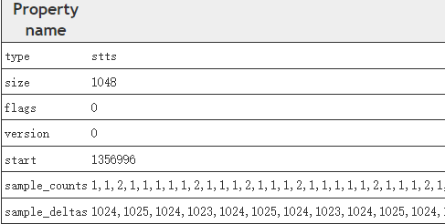 

## 4.3 stss

**$\color{red}{\mathbf{Sync\ Sample\ Box}}$** (只针对视频) , 同步sample表 , 存放关键帧列表 , 关键帧是为了⽀持随机访问

stss的table entry布局如下 : 

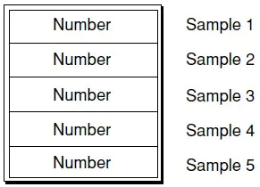 

stss table entry布局 

下文示例中 , 该视频track有3个关键帧

> ```tex
> 14D315      Sync Sample (28 bytes)
> 14D315       Header (8 bytes)
> 14D315        Size:                            28 (0x0000001C)
> 14D319        Name:                            stss
> 14D31D       Version:                          0 (0x00)
> 14D31E       Flags:                            0 (0x000000)
> 14D321       entry-count:                      3 (0x00000003)
> 14D331      Composition Time To Sample (952 bytes)
> 14D331       Header (8 bytes)
> 14D331        Size:                            952 (0x000003B8)
> 14D335        Name:                            ctts
> 14D339       Version:                          0 (0x00)
> 14D33A       Flags:                            0 (0x000000)
> 14D33D       entry_count:                      117 (0x00000075)
> ```

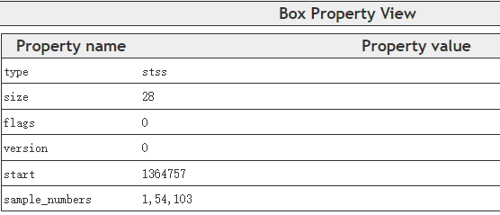 

## 4.4 stsc

Sample-To-Chunk Box , sample-chunk映射表。上⽂提到mp4通常把sample封装到chunk中 , 一个chunk可能会包含⼀个或者几个sample

Sample-To-Chunk Atom的table entry布局如下图所示 : 

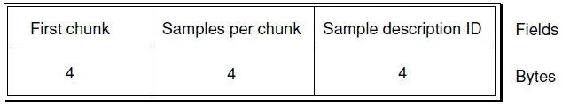 

stsc table entry布局

- First chunk : 使用该表项的第⼀个chunk序号
- Samples per chunk : 使用该表项的chunk中包含有几个sample
- Sample description ID : 使用该表项的chunk参考的stsd表项序号  

下图示例中 , 可以看到该 **视频track** 一共有1个stsc表项 , chunk序列1-x , 每个chunk包含⼀个sample。这里则说明每个chunk里面只有⼀个sample (⼀个chunk是可以有多个sample)

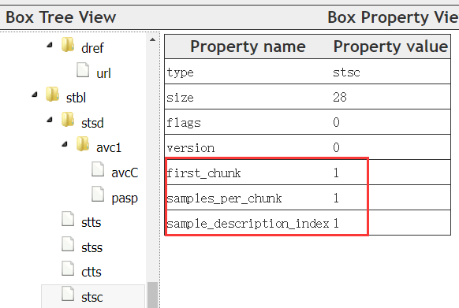 

 下图是音频的stsc的示例 

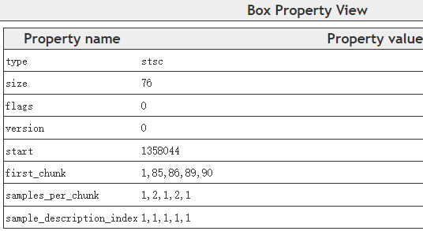 

> ```tex
> chunk 1~84 的每个chunk包含1个samples
> chunk 85 包含2个samples
> chunk 86~88 的每个chunk包含1个samples
> chunk 89 包含2个samples
> chunk 90 包含1个samples
> ```

## 4.5 stsz


