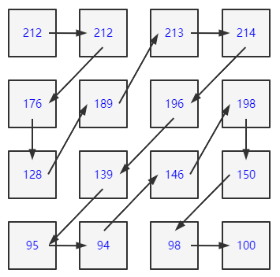
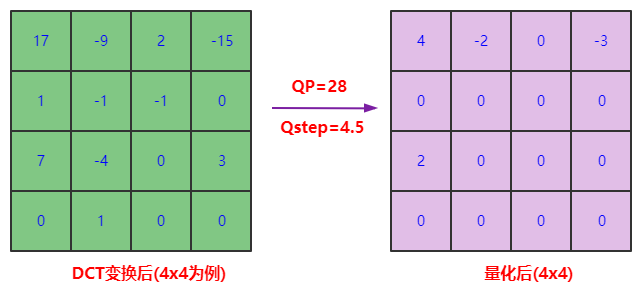
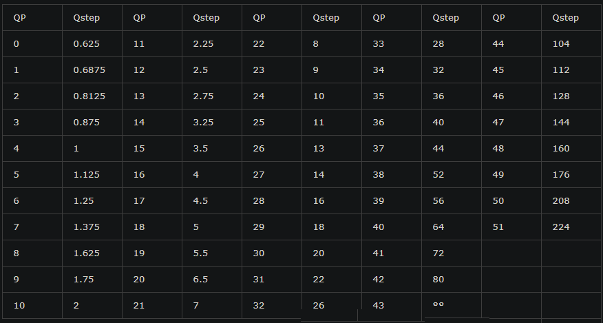

# 1. 视频为什么需要进行编码压缩
* 一张为720x480的图像 , 用YUV420P的格式来表示 ,  其大小为 : 720 × 480 × 1.5 约等于0.5MB
  * 如果是25帧 , 10分钟的数据量 0.5M 1024 × 60  × 25 = 7500MB -> 7GB多
* 视频编码压缩的目的是降低视频数据大小 , 方便存储和传输  

 

# 2. 为什么压缩的原始数据一般采用YUV格式

- 视频编码是对一张张图像来进行的 , 我们知道彩色图像的格式是 RGB 的 , 但RGB 三个颜色是有相关性的
- 采用YUV格式 , 利用人对图像的感觉的生理特性 , 对于亮度信息比较敏感 , 而对于色度信息不太敏感 , 所以视频编码是将Y分量和UV分量分开来编码的 , 并且可以减少UV分量 , 比如我们之前说的YUV420P  

 

# 3. 视频压缩原理-数据冗余 

编码的目的是为了压缩 , 各种视频编码算法都是为了让视频体积变得更小 , 减少对存储空间和传输带宽的占用 , 编码的核心是去除冗余信息 , 通过以下几种冗余来达到压缩视频的目的 : 

## 3.1 空间冗余

图像相邻像素之间有较强的相关性, 比如一帧图像划分成多个 16x16 的块之后,相邻的块很多时候都有比较明显的相似性  

## 3.2 时间冗余

视频序列的相邻前后帧图像之间内容相似 , 比如帧率为 25fps 的视频中前后两帧图像相差只有 40ms , 前后两张图像的变化较小 , 相似性很高

## 3.3 视觉冗余

我们的眼睛对某些细节不敏感 , 对图像中高频信息的敏感度小于低频信息的 , 可以去除图像中的一些高频信息 , 人眼看起来跟不去除高频信息差别不大 (有损压缩)  

## 3.4 编码冗余(信息熵冗余)

一幅图像中不同像素出现的概率是不同的 , 对出现次数比较多的像素 , 用少的位数来编码 , 对出现次数比较少的像素 , 用多的位数来编码 , 能够减少编码的大小 , 比如哈夫曼编码 !

# 4. 图像帧的类型 (I帧、P帧和B帧) 

I帧 、P帧和B帧是视频压缩领域中的基础概念 , 用于提升视频压缩效率、视频质量和视频恢复能力

- I帧(关键帧或帧内帧)仅由帧内预测的宏块组成
- P帧代表预测帧 , 除帧内空域预测以外 , 它还可以通过时域预测来进行压缩 , P帧通过使用已经编码的帧进行运动估计
- B帧可以参考在其前后出现的帧 , B帧中的B代表双向 (Bi-Directional) 

 

# 5. GOP (一组图像 , Group of Pictures) 和 GOP长度 

- 一个序列的第一个图像叫做 IDR 图像 (立即刷新图像) IDR 图像都是 I 帧图像 , 在视频编码序列中 ,  GOP即Group of picture (图像组) 指两个IDR帧之间的距离
- GOP长度越大 , 视频压缩效率越高 , 但视频质量和视频流恢复能力也越差 , 反之亦然
- 直播 , 如果是一秒25帧 , 一般gop设置为25, 50 (一般是帧率的倍数)
- 如果不是直播流 , B帧一般设置2帧连续B帧 , 以降低码率 

## 5.1 GOP 之 Closed GOP 和 Open GOP

Closed GOP 和 Open GOP常见于视频流中 , 并影响压缩效率、视频容错能力以及ABR流的切换能力

- 顾名思义 ,  Closed GOP 对 GOP外部的帧是封闭的 , 一个属于Closed GOP的帧只能参考这个GOP之内的帧 
- Open GOP 与 Closed GOP相反 ,  Open GOP内部的帧可以参考其他GOP中的帧

 

## 5.2 GOP间隔

GOP 越大 , 编码的 I 帧就会越少 , 相比而言 , P 帧 、B 帧的压缩率更高 , 因此整个视频的编码效率就会越高 , 但是 GOP 太大 , 也会导致 IDR 帧距离太大 , 点播场景时进行视频的seek 操作就会不方便  

 

# 6. H264编码原理

**$\color{red}{\mathbf{对于每一帧图像 , 是划分为一个个块进行编码 , 就是我们说的宏块}}$**

宏块大小一般是 16x16 (H264、VP8) , 32x32 (H265、 VP9) , 64x64 (H265、 VP9、AV1) ,128x128 (AV1)  

## 6.1 宏块扫描

对于一个 YUV 图像 , 可以把划分成一个个 16x16 的宏块 (以 H264 为例) , Y、 U、 V 分量的大小分别是16x16、 8x8、 8x8 , 这里我们只对 Y 分量进行分析 (U、V 分量同理) , 假设 Y 分量这 16x16 个像素就是一个个数字 , 采用 "之" 字方式扫描每一个像素值 , 则可以得到一个 "像素串"  

 

压缩的目的是使得编码器当前的字符出现连续相同的字符 , 比如1,1,1,1,1,1,1,1, 我们可以描述为8个1 

数字越小越容易用更少的bit做压缩 , 比如一连串数字很小(比如 0 , 1, 2, 1, 0) 的 "像素串" , 因为 0 在二进制中只占 1 个位 , 2只占2个位即可

 

## 6.2 帧内预测

- 帧内预测就是在当前编码图像内部已经编码完成的块中找到与将要编码的块相邻的块 , 一般就是即将编码块的左边块、上边块、左上角块和右上角块 , 通过将这些块与编码块相邻的像素经过多种不同的算法得到多个不同的预测块
- 然后我们再用编码块减去每一个预测块得到一个个残差块 , 最后 , 我们取这些算法得到的残差块中像素的绝对值加起来最小的块为预测块 , 而得到这个预测块的算法为帧内预测模式  

 

## 6.3 残缺块

   

此时我们把原始编码块的像素值减去预测块的像素值得到残缺块 , 可以看到对应的数值更为接近0 

[[H.264整数DCT公式推导及蝶形算法分析 - Mr.Rico - 博客园(cnblogs.com)]](https://www.cnblogs.com/xkfz007/archive/2012/07/31/2616791.html)

## 6.4 帧间预测

- 同理 , 帧间预测也是一样的 , 我们在前面已经编码完成的图像中 , 循环遍历每一个块 , 将它作为预测块 , 用当前的编码块与这个块做差值 , 得到残差块 , 取残差块中像素值的绝对值加起来最小的块为预测块 , 预测块所在的已经编码的图像称为参考帧 , 预测块在参考帧中的坐标值 (x0, y0) 与编码块在编码帧中的坐标值 (x1, y1) 的差值 (x0 - x1, y0 - y1) 称之为运动矢量 
- 而在参考帧中去寻找预测块的过程称之为运动搜索 , 事实上编码过程中真正的运动搜索不是一个个块去遍历寻找的 , $\color{red}{\mathbf{而是有快速的运动搜索算法的}}$
- 通过预测得到的 **$\color{red}{\mathbf{残差块的像素值}}$​** 相比编码块的像素值 , 去除了大部分空间冗余信息和时间冗余信息 , 这样得到的像素值更小 如果把这个残差块做扫描得到的像素串送去做行程编码 , 是不是相比直接拿编码块的像素串去做编码更有可能得到更大的压缩率

## 6.5 DCT 变换和量化

- 我们的目标不只是将像素值变小 ,  而是希望能出现连续的 0 像素
- 这就需要利用我们人眼的视觉敏感性的特点了 , 我们刚才说了人眼对高频信息不太敏感 , 因为人眼看到的效果可能差别不大 , 所以我们可以去除一些高频信息 , 这个就是接下来我们要讨论的 DCT 变换和量化 

### 6.5.1 DCT变换 

 

### 6.5.2 量化步长

- 由于人眼对高频信息不太敏感 , 如果我们通过一种手段去除掉大部分高频信息 , 也就是将大部分高频信息置为 0 , 但又不太影响人的观感 , 是不是就可以达到我们最初的目标 , 即可以得到有一连串 0 的像素串? 这就涉及到量化操作了
- 我们让变换块的系数都 **$\color{red}{\mathbf{同时除以一个值\ ,\ 这个值我们称之为量化步长}}$** , 也就是 QStep (QStep 是编码器内部的概念 , 用户一般使用量化参数 QP 这个值) , QP 和 QStep 得到的结果就是量化后的系数 , QStep 越大 , 得到量化后的系数就会越小 , 同时 , 相同的 QStep 值 , 高频系数值相比低频系数值更小 , 量化后就更容易变成 0 , 这样一来 , 将大部分高频系数变成 0 , 如下图所示 : 

 

 

- 解码的时候 , 需要将 QStep 乘以量化后的系数得到变换系数 , 很明显这个变换系数和原始没有量化的变换系数是不一样的 , 这个就是常说的有损编码
- 而到底损失多少呢？ 其由 QStep 来控制 , QStep 越大 , 损失就越大 , QStep 跟 QP 一一对应 , 从编码器应用角度来看 , **QP 值越大 , 损失就越大** , 从而画面的清晰度就会越低 , 同时 , QP 值越大系数被量化成 0 的概率就越大 , 这样编码之后码流大小就会越小 , 压缩就会越高

### 6.5.3 量化步长表 

 

# 7. 编码原理总结

- 为了能够在最后熵编码的时候压缩率更高 , 对于送到熵编码 (以行程编码为例) 的 "像素串" , 包含的0越多 , 越能提高压缩率 , 为了达到这个目标 : 
  - 先通过帧内预测或者帧间预测去除空间冗余和时间冗余 , 从而得到一个像素值相比编码块小很多的残差块
  - 然后再通过 DCT 变换将低频和高频信息分离开来得到变换块 , 然后再对变换块的系数做量化
  - 由于高频系数通常比较小 , 很容易量化为 0 , 同时人眼对高频信息不太敏感 , 这样就得到了一串含有很多个 0 , 大多数情况下是一串含有连续 0 的 "像素串" , 并且人的观感还不会太明显 , 这样 , 最后熵编码就能把图像压缩成比较小的数据 , 以此达到视频压缩的目的
- 这即是视频编码的原理