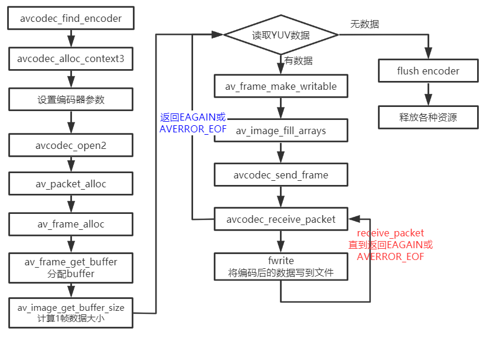
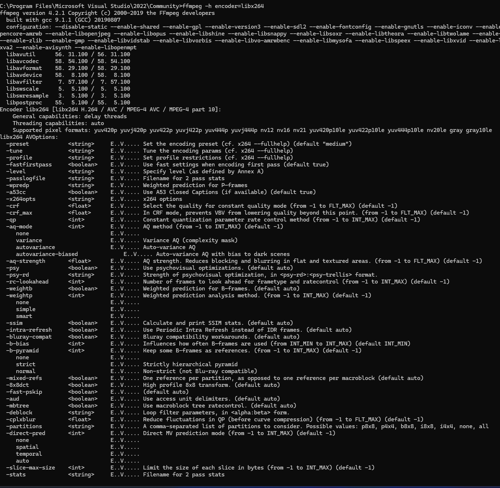

# 1. FFmpeg流程

 

从本地读取YUV数据编码为h264格式的数据 , 然后再存⼊到本地 , 编码后的数据有带startcode

与FFmpeg 示例⾳频编码的流程基本⼀致

函数说明:

| 函数名称                            | 函数作用                                                     |
| ----------------------------------- | ------------------------------------------------------------ |
| `avcodec_find_encoder_by_name(...)` | 根据指定的编码器名称查找注册的编码器                         |
| `avcodec_alloc_context3(...)`       | 为AVCodecContext分配内存                                     |
| `avcodec_open2(...)`                | 打开编解码器                                                 |
| `avcodec_send_frame(..)`            | 将AVFrame⾮压缩数据给编码器                                  |
| `avcodec_receive_packet(...)`       | 获取到编码后的AVPacket数据                                   |
| `av_frame_get_buffer(...)`          | 为⾳频或视频数据分配新的buffer , 在调⽤这个函数之前 , 必须在AVFame上设置好以下属性 : <br />format (视频为像素格式 , ⾳频为样本格式)<br />nb_samples (样本个数 , 针对⾳频)<br />channel_layout (通道类型 , 针对⾳频) <br />width / height (宽⾼ , 针对视频) |
| `av_frame_make_writable(...)`       | 确保AVFrame是可写的 , 尽可能避免数据的复制如果AVFrame不是是可写的 , 将分配新的buffer和复制数 |
| `av_image_fill_arrays(...)`         | 存储⼀帧像素数据存储到AVFrame对应的data buffer               |

编码出来的h264数据可以直接使⽤ffplay播放 , 也可以使⽤VLC播放

## 1.1 `av_image_get_buffer_size(...)`

`int av_image_get_buffer_size(enum AVPixelFormat pix_fmt, int width, int height, int align);`

函数的作⽤是通过指定像素格式、图像宽、图像⾼来计算所需的内存⼤⼩重点说明⼀个参数align:此参数是设定内存对⻬的对⻬数 , 也就是按多⼤的字节进⾏内存对⻬ : 

- ⽐如设置为 1 , 表示按1字节对⻬ , 那么得到的结果就是与实际的内存⼤⼩⼀样
- 再⽐如设置为4 , 表示按4字节对⻬ , 也就是内存的起始地址必须是4的整倍数

## 1.2 `av_image_alloc(...)`

> ```c++
> int av_image_alloc(uint8_t* pointers[4], 
>                    int linesizes[4], int w, int h, 
>                    enum AVPixelFormat pix_fmt,
>                    int align);
> ```

`av_image_alloc(...)` 是这样定义的 , 此函数的功能是按照指定的宽、⾼、像素格式来分配图像内存 

| 参数                       | 参数说明                                                     |
| -------------------------- | ------------------------------------------------------------ |
| uint8_t* pointers[4]       | 保存图像通道的地址 , 如果是RGB , 则前三个指针分别指向R,G,B的内存地址 , 第四个指针保留不⽤ |
| int linesizes[4]           | 保存图像每个通道的内存对⻬的步⻓ , 即⼀⾏的对⻬内存的宽度 , 此值⼤⼩等于图像宽度 |
| int w                      | 要申请内存的图像宽度                                         |
| int h                      | 要申请内存的图像⾼度                                         |
| enum AVPixelFormat pix_fmt | 要申请内存的图像的像素格式                                   |
| int align                  | ⽤于内存对⻬的值                                             |

| 返回类型int | 返回值解释                                           |
| ----------- | ---------------------------------------------------- |
| return(int) | 所申请的内存空间的总⼤⼩ , 如果是负值 , 表示申请失败 |

## 1.3 `av_image_fill_arrays(...)`

> ```c++
> int av_image_fill_arrays(uint8_t *dst_data[4],int dst_linesize[4],
>                          const uint8_t *src,
>                          enum AVPixelFormat pix_fmt,
>                          int width,int height,int align);
> ```

`av_image_fill_arrays(...)` 函数⾃身不具备内存申请的功能 , 此函数类似于格式化已经申请的内存 , 即通过 `av_malloc(...)` 函数申请的内存空间 , 或者 `av_frame_get_buffer()` 函数申请的内存空间 , 再者 , `av_image_fill_arrays(...)` 中参数具体说明 : 

| 参数                       | 参数解释                                              |
| -------------------------- | ----------------------------------------------------- |
| uint8_t *dst_data[4]       | [out] 对申请的内存格式化为三个通道后 , 分别保存其地址 |
| int dst_linesize[4]        | [out] 格式化的内存的步⻓ (即内存对⻬后的宽度)         |
| const uint8_t *src         | [in] `av_alloc(...)` 函数申请的内存地址               |
| enum AVPixelFormat pix_fmt | [in] 申请 src内存时的像素格式                         |
| int width                  | [in] 申请src内存时指定的宽度                          |
| int height                 | [in] 申请scr内存时指定的⾼度                          |
| int align                  | [in] 申请src内存时指定的对⻬字节数                    |

# 2. H.264 码率设置

## 2.1 什么是视频码率

- 视频码率是视频数据 (包含视频⾊彩量、亮度量、像素量) 每秒输出的位数 , ⼀般⽤的单位是kbps

## 2.2 设置视频码率的必要性

- 在⽹络视频应⽤中 , 视频质量和⽹络带宽占⽤是相⽭盾的 , 通常情况下 , 视频流占⽤的带宽越⾼则视频质量也越⾼ , 需要的⽹络带宽也越⼤ , 解决这⼀⽭盾的钥匙当然是视频编解码技术 , 评判⼀种视频编解码技术的优劣 , 是⽐较在相同的带宽条件下 , 哪个视频质量更好;在相同的视频质量条件下哪,个占⽤的⽹络带宽更少 (⽂件体积⼩) 
- 是不是视频码率越⾼ , 质量越好呢? 理论上是这样的 , 然⽽在我们⾁眼分辨的范围内 , 当码率⾼到⼀定程度时 , 就没有什么差别了 , 所以码率设置有它的最优值 , H.264 (也叫AVC或X264) 的⽂件中 , 视频的建议码率如下 : 

| 视频大小 | 分辨率    | 推荐码率 |
| -------- | --------- | -------- |
| 480P     | 720X480   | 1800Kbps |
| 720P     | 1280X720  | 3500Kbps |
| 1080P    | 1920X1080 | 8500Kbps |

# 3 . ⼿机设置码率建议

通过上⾯的介绍 , 结合我做过的⼀些⼿机项⽬ , 我总结了⼀套设置码率的公式 , 分享给⼤家如下 :

| 项目     | 计算公式    | 192x144 | 320x240  | 480x360  | 640x480  | 1280x720 | 1920x1080 |
| -------- | ----------- | ------- | -------- | -------- | -------- | -------- | --------- |
| 极低码率 | (宽X⾼X3)/4 | 30kbps  | 60kbps   | 120kbps  | 250kbps  | 500kbps  | 1000kbps  |
| 低码率   | (宽X⾼X3)/2 | 60kbps  | 120kbps  | 250kbps  | 500kbps  | 1000kbps | 2000kbps  |
| 中码率   | (宽X⾼X3)   | 120kbps | 250kbps  | 500kbps  | 1000kbps | 2000kbps | 4000kbps  |
| 高码率   | (宽X⾼X3)X2 | 250kbps | 500kbps  | 1000kbps | 2000kbps | 4000kbps | 8000kbps  |
| 极高码率 | (宽X⾼X3)X4 | 500kbps | 1000kbps | 2000kbps | 4000kbps | 8000kbps | 16000kbps |

# 4. FFmpeg与H264编码指南

鉴于x264的参数众多 , 各种参数的配合复杂 , 为了使用者方便 , x264建议如无特别需要可使用 preset 和 tune 设置 , 这套开发者推荐的参数较为合理 , 可在此基础上在调整⼀些具体参数以符合自己需要 , 手动设定的参数会覆盖 preset和tune里面的参数

使用 `ffmpeg -h encoder=libx264` 命令查询相关支持的参数 ，下图为部分截图

 

英文地址 : [[ H.264 视频编码指南]](https://trac.ffmpeg.org/wiki/Encode/H.264) , 内容有一定出入 , 但是可以借鉴学习

x264是⼀个 H.264/MPEG4 AVC 编码器 , 本指南将指导新⼿如何创建⾼质量的H.264视频 , 对于普通⽤户通常有两种码率控制模式 : CRF (Constant Rate Factor)和Two pass ABR) 码率控制是⼀种决定为每⼀个视频帧分配多少⽐特数的⽅法 , 它将决定⽂件的大小和质量的分配 , 如果你在编译和安装libx264 ⽅⾯需要帮助 , 请查看ffmpeg和x264编译指南:

[[CompilationGuide  ]](http://ffmpeg.org/trac/ffmpeg/wiki/CompilationGuide  )

[[参考]](https://www.jianshu.com/p/b46a33dd958d)

# 5.CRF(Constant Rate Factor):

## 5.1 选择⼀个CRF值

量化比例的范围为0~51 , 其中0为⽆损模式 , 23为缺省值 , 51可能是最差的 , 该数字越小 , 图像质量越好 , 从主观上讲 , 18~28是⼀个合理的范围 , 18往往被认为从视觉上看是⽆损的 , 它的输出视频质量和输⼊视频⼀模⼀样或者说相差无几 , 但从技术的⻆度来讲 , 它依然是有损压缩 , 若CRF值加6 , 输出码率⼤概减少⼀半; 若CRF值减6 , 输出码率翻倍 , 通常是在保证可接受视频质量的前提下选择⼀个最大的CRF值 , 如果输出视频质量很好 , 那就尝试⼀个更⼤的值 , 如果看起来很糟 , 那就尝试⼀个小⼀点值

注释 : 本⽂所提到的量化⽐例只适⽤于8-bit x264 (10-bit x264的量化比例 为0~63) , 你可以使⽤ `x264 --help` 命令在Output bit depth选项查看输出位深 , 在各种版本中 , 8bit是最常见的

## 5.2 选择⼀个preset和tune

### 5.2.1 preset

$\color{red}{\mathbf{预设是⼀系列参数的集合}}$ , 这个集合能够在编码速度和压缩率之间做出⼀个权衡 , ⼀个编码速度稍慢的预设会提供更高的压缩效率(压缩效率是以文件大小来衡量的) , 这就是说，假如你想得到⼀个指定大小的⽂件或者采⽤恒定比特率编码模式 , 你可以采⽤⼀个较慢的预设来获得更好的质量。同样的 , 对于恒定质量编码模式 , 你可以通过选择⼀个较慢的预设轻松地节省比特率

如果你很有耐心 , 通常的建议是使⽤最慢的预设。目前所有的预设按照编码速度降序排列为：  

| ultrafast                                           |      |
| --------------------------------------------------- | ---- |
| superfast                                           |      |
| veryfast                                            |      |
| faster                                              |      |
| fast                                                |      |
| medium – default preset                             |      |
| slow                                                |      |
| slower                                              |      |
| veryslow                                            |      |
| placebo - ignore this as it is not useful (see FAQ) |      |

**$\color{red}{\mathbf{默认为medium级别}}$​**

可以使用 `--preset` 来查看预设列表 , 也可以通过 `x264 --fullhelp` 来查看预设所采⽤的参数配置

### 5.2.2 tune

tune是x264中重要性仅次于 preset 的选项，它是视觉优化的参数 , tune可以理解为视频偏好 (或者视频类型) , tune不是⼀个单⼀的参数 , **$\color{red}{\mathbf{而是由一组参数构成\ -tune\ 来改变参数设置}}$​** , 当前的 tune包括 : 

| 操作数      | 操作数解释                                    |
| ----------- | --------------------------------------------- |
| film        | 电影类型 , 对视频的质量⾮常严格时使⽤该选项   |
| animation   | 动画⽚ , 压缩的视频是动画⽚时使⽤该选项       |
| grain       | 颗粒物很重 , 该选项适⽤于颗粒感很重的视频     |
| stillimage  | 静态图像 , 该选项主要⽤于静⽌画⾯⽐较多的视频 |
| psnr        | 提⾼psnr , 该选项编码出来的视频psnr⽐较⾼     |
| ssim        | 提⾼ssim , 该选项编码出来的视频ssim⽐较⾼     |
| fastdecode  | 快速解码 , 该选项有利于快速解码               |
| zerolatency | 零延迟 , 该选项主要⽤于视频直播               |

如果你不确定使⽤哪个选项或者说你的输⼊与所有的tune皆不匹配，你可以忽略 `--tune` 选项 , 你可以使用 `-tune` 来查看 tune列表 , 也可以通过 `x264 --fullhelp` 来查看tune所采用的参数配置

# 6.profile

另外⼀个可选的参数是 `-profile:v` , 它可以将你的输出限制到⼀个特定的 H.264 profile , ⼀些非常老的或者要被淘汰的设备仅⽀持有限的选项 , 比如只支持baseline或者main

所有的profile包括 : 

|                  |                                                              |
| ---------------- | ------------------------------------------------------------ |
| baseline profile | 基本画质 , ⽀持I/P 帧 , 只⽀持⽆交错 (Progressive) 和CAVLC   |
| extended profile | 进阶画质 , ⽀持I/P/B/SP/SI 帧 , 只⽀持⽆交错 (Progressive) 和CAVLC |
| main profile     | 主流画质 , 提供I/P/B 帧 , ⽀持⽆交错 (Progressive) 和交错 (Interlaced) , 也⽀持CAVLC 和CABAC 的支持 |
| high profile     | ⾼级画质 , 在main Profile 的基础上增加了8x8内部预测、⾃定义量化、 ⽆损视频编码和更多的YUV格式 |

想要说明H.264 high profile与H.264 main profile的区别就要讲到H.264的技术发展了。JVT于2003年完成H.264基本部分标准制定工作 , 包含baseline profile、extended profile和main profile，分别包括不同的编码⼯具 , 之后JVT⼜完成了H.264 FRExt (即 : Fidelity Range Extensions) 扩展部分 (Amendment) 的制定工作 , 包括high profile (HP)、high 10 profile (Hi10P)、high 4:2:2 profile (Hi422P)、high 4:4:4 profile (Hi444P) 4个profile

H.264 baseline profile、extended profile和main profile都是针对8位样本数据、4:2:0格式的视频序列 , FRExt将其扩展到8～12位样本数据 , 视频格式可以为4:2:0、4:2:2、4:4:4，设立了 highprofile（HP）、high 10 profile（Hi10P）、high 4:2:2 profile (Hi422P) 、high 4:4:4profile (Hi444P) 4个profile，这4个profile都以main profile为基础

在相同配置情况下，High profile（HP）可以⽐Main profile（MP）节省10%的码流量，⽐MPEG-2MP节省60%的码流量 , 具有更好的编码性能 , 根据应⽤领域的不同 : 

|                  |                          |
| ---------------- | ------------------------ |
| baseline profile | 多应用于实时通信领域     |
| main profile     | 多应用于流媒体领域       |
| high profile     | 则多应⽤于广电和存储领域 |

[[扩展阅读 : H264编码系列之profile & level控制  ]](https://www.jianshu.com/p/48d723bb2740)

# 7. 低延迟

x264提供了⼀个 `-tune` zerolatency 选项

# 8. 兼容性

如果你想让你的视频最大化的和⽬标播放设备兼容 (比如⽼版本的的ios或者所有的android 设备) , 那么你可以这做 : 

`-profile:v baseline`

这将会关闭很多高级特性 , 但是它会提供很好的兼容性 , 也许你可能不需要这些设置 , 因为⼀旦你用了这些设置 , 在同样的视频质量下与更高的编码档次相比会使比特率稍有增加 , 关于profile列表和关于它们的描述 , 你可以运行 `x264 --fullhelp` 要牢记apple quick time 对于x264编码的视频只支持 YUV 420颜⾊空间 , 而且不支持任何高于 mianprofile 编码档次 , 这样对于quick time **只留下了两个兼容选项 baseline 和 main** , 其他的编码档次quciktime均不支持 , 虽然它们均可以在其它的播放设备上回放

## 8.1 问题与解答

| 问题                                       | 解答                                                         |
| ------------------------------------------ | ------------------------------------------------------------ |
| 两遍编码模式能够⽐CRF模式提供更好的质量吗? | 不能 , 但它可以更加精确地控制目标文件大小                    |
| 为什么 placebo 是⼀个浪费时间的玩意儿?     | 与 veryslow相比 , 它以极⾼的编码时间为代价换取了⼤概1%的视频质量提升，这是⼀种收益递减准则，<br/>veryslow 与 slower相⽐提升了3%；slower 与 slow相⽐提升了5%；slow 与 medium相⽐提升了<br/>5%~10% |
| 为什么我的⽆损输出看起来是⽆损的?          | 这是由于rgb->yuv的转换 , 如果你转换到yuv444,它依然是无损的   |
| 显卡能够加速x264的编码吗 ?                 | 不 , x264没有使用 (至少现在没有) , 有⼀些私有编码器使⽤了GPU加快了编码速度 , 但这并不意味着它们经过良好的优化 , 也有可能还不如x264 , 或许速度更慢 , 总的来说 , ffmpeg到目前为止还不支持GPU<br/>翻译注释 : x264在2013版中已经开始支持基于opencl的显卡加速 , 用于帧类型的判定 |
| 为Quick time 播放器压制视频                | 你需要使⽤-pix_fmt yuv420p来是你的输出⽀持QT 播放器。这是因为对于H.264视频剪辑苹果的Quick time只支持 YUV420颜色空间 , 否则ffmpeg会根据你的视频源输出与Quick time 不兼容的视频格式或者不是基于ffmpeg的视频 |

# 9. X264参数之zerolatency的分析

我们都知道 , 加⼊zerolatency 的目的是为了降低在线转码的编码延迟 , 那么 , 该参数是如何影响到x264的转码性能了呢?

⾸先 , 先来看看代码中编码延迟的影响因素 : 

> ```c++
> h->frames.i_delay = max(h->param.i_bframe, h->param.rc.i_lookahead) + h->i_thread_frames - 1
> + h->param.i_sync_lookahead
> + h->param.b_vfr_input
> ```

设置zerolatency后 , 相应的参数配置如下

> ```c++
> if(!strncasecmp(s,"zerolatency",11))
> {
>     param->rc.i_lookahead = 0;
>     param->i_sync_lookahead = 0;
>     param->i_bframe = 0;
>     param->b_sliced_threads = 1;
>     param->b_vfr_input = 0;
>     param->rc.b_mb_tree = 0;
> }
> ```

下面我们来看一下zerolatency设置中各个参数的意义 : 

|                |                                                              |
| -------------- | ------------------------------------------------------------ |
| rc_lookahead   | Set number of frames to look ahead for frametype and ratecontrol<br />该参数为mb-tree码率控制和vbv-lookahead设置可⽤的帧数量 , 最大值为250 , 对于mbi-tree来说 ,<br/>rc_lookahead值越大 , 会得到更准确的结果 , 但编码速度也会更慢 , 因为编码器需要缓存慢rc_lookahead帧数据后 , 才会开始第⼀帧编码 , 增加编码延时 , 因此在实时视频通信中将其设置为0 |
| sync_lookahead | 设置用于线程预测的帧缓存大小 , 最大值为250 , 在第⼆遍及更多遍编码或基于分片线<br/>程时自动关闭 , sync_lookahead = 0为关闭线程预测 , 可减少延迟 , 但也会降低性能 |
| bframes        | I帧和P帧或者两个P帧之间可⽤的最⼤连续B帧数量 , 默认值为3 , B帧可使⽤双向预测 , 从而显著提高压缩率 , 但由于需要缓存更多的帧数以及重排序的原因 , 会降低编码速度 , 增加编码延迟 , 因此在实时编码时也建议将该值设置为0 |
| sliced_threads | 基于分片的线程 , 默认值为off , 开启该⽅法在压缩率和编码效率上都略低于默认方法 , 但没有编码延时 ,除非在编码实时流或者对低延迟要求较⾼的场合开启该⽅法 , ⼀般情况下建议设为off |
| vfr_input      | 与 force-cfr 选项相对应 <br />`OPT("force-cfr") p->b_vfr_input = !atobool(value);`<br />vfr_input = 1时 , 为可变帧率，使⽤timebase和timestamps做码率控制；vfr_input = 0时，为固定帧率，使⽤fps做码率控制 |
| mb_tree        | 基于宏块树的码率控制 , 对于每个MB , 向前预测⼀定数量的帧 (该数量由rc_lookahead和keyint<br/>中的较小值决定) , 计算该MB被引⽤的次数 , 根据被引⽤次数的多少决定为该MB分配的量化QP值 , 该方法会生成⼀个临时stats⽂件 , 记录了每个P帧中每个MB被参考的情况 , 使⽤mb_tree的⽅法能够节约大概30%的码率 , 但同时也会增加编码延迟 , 因此实时流编码时也将其关闭 |
|                |                                                              |

[[原文地址]](https://blog.csdn.net/DeliaPu/article/details/77004392)

[[CRF Guide (Constant Rate Factor in x264, x265 and libvpx)]](https://slhck.info/video/2017/02/24/crf-guide.html)

