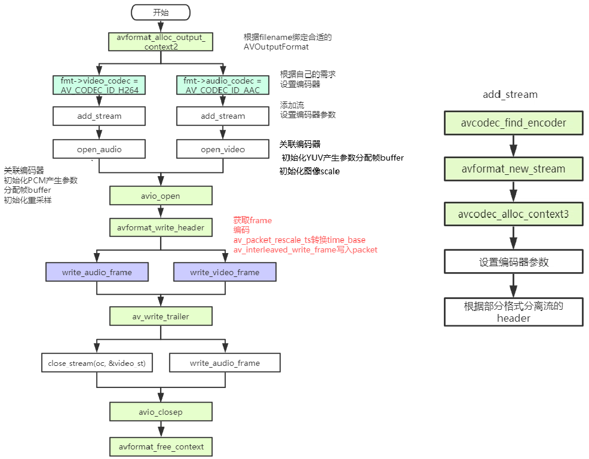

# 1. FFmpeg合成流程  

本程序会生成一个合成的音频和视频流 , 并将它们编码和封装输出到输出文件 , 输出格式是根据文件扩展名自动猜测的 , 流程图如下 : 

  

ffmpeg 的 Mux 主要分为三步操作 : 

|                                                         |          |
| ------------------------------------------------------- | -------- |
| `avformat_write_header(...)`                            | 写文件头 |
| `av_write_frame(...) / av_interleaved_write_frame(...)` | 写packet |
| `av_write_trailer(...)`                                 | 写文件尾 |

|                                   |                                                              |
| --------------------------------- | ------------------------------------------------------------ |
| `avcodec_parameters_from_context` | 将AVCodecContext结构体中码流参数拷贝到AVCodecParameters结构体中和avcodec_parameters_to_context刚好相反 |

# 2. 相关结构体

## 2.1 `AVOutputFormat` 

### 2.1.1 描述

`AVOutpufFormat` 表示输出⽂件容器格式 , `AVOutputFormat` 结构主要包含的信息有 : 

- **$\color{red}{\mathbf{封装名称描述}}$**
- **$\color{red}{\mathbf{编码格式信息 (video/audio 默认编码格式,支持的编码格式列表)}}$**

ffmpeg支持各种各样的输出文件格式 , MP4 , FLV , 3GP等等 , 而 `AVOutputFormat` 结构体则保存了这些格式的信息和⼀些常规设置 , 每⼀种封装对应⼀个 `AVOutputFormat` 结构，ffmpeg 将 `AVOutputFormat` 按照链表存储 : 

 

### 2.1.2 结构体定义

> ```c++
> typedef struct AVOutputFormat {
>     const char *name;
>     /**
>      * Descriptive name for the format, meant to be more human-readable
>      * than name. You should use the NULL_IF_CONFIG_SMALL() macro
>      * to define it.
>      */
>     const char *long_name;
>     const char *mime_type;
>     const char *extensions; /**< comma-separated filename extensions */
>     /* output support */
>     enum AVCodecID audio_codec;    /**< default audio codec */
>     enum AVCodecID video_codec;    /**< default video codec */
>     enum AVCodecID subtitle_codec; /**< default subtitle codec */
>     /**
>      * can use flags: AVFMT_NOFILE, AVFMT_NEEDNUMBER,
>      * AVFMT_GLOBALHEADER, AVFMT_NOTIMESTAMPS, AVFMT_VARIABLE_FPS,
>      * AVFMT_NODIMENSIONS, AVFMT_NOSTREAMS,
>      * AVFMT_TS_NONSTRICT, AVFMT_TS_NEGATIVE
>      */
>     int flags;
>     /**
>      * List of supported codec_id-codec_tag pairs, ordered by "better
>      * choice first". The arrays are all terminated by AV_CODEC_ID_NONE.
>      */
>     const struct AVCodecTag * const *codec_tag;
> 
>     const AVClass *priv_class; ///< AVClass for the private context
> } AVOutputFormat;
> ```

### 2.1.3 常见变量及其作用

| 字段名                           | 字段解释                  |
| -------------------------------- | ------------------------- |
| `const char *name;`              | 复用器名称                |
| `const char *long_name;`         | 格式的描述性名称,易于阅读 |
| `enum AVCodecID audio_codec;`    | 默认的音频编解码器        |
| `enum AVCodecID video_codec;`    | 默认的视频编解码器        |
| `enum AVCodecID subtitle_codec;` | 默认的字幕编解码器        |

大部分复用器都有默认的编码器 , 所以大家如果要调整编码器类型则需要自己手动指定

## 2.2 `FFOutputFormat`

查看源码发现ffmpeg 6.0 , 估计之后的版本都是这样设计 , `AVOutputFormat` 被内部的 `FFOutputFormat` 所以包含 , `AVOutputFormat` 不包含任何操作函数 , 由`FFOutputFormat`包含 :

**$\color{red}{\mathbf{⼀些对封装的操作函数 write\_header(...),write\_packet(...),write\_tailer(...)等}}$​​**

> ```c++
> typedef struct FFOutputFormat {
>     /**
>      * The public AVOutputFormat. See avformat.h for it.
>      */
>     AVOutputFormat p;
>     /**
>      * size of private data so that it can be allocated in the wrapper
>      */
>     int priv_data_size;
> 
>     /**
>      * Internal flags. See FF_FMT_* in internal.h and mux.h.
>      */
>     int flags_internal;
> 
>     int (*write_header)(AVFormatContext *);
>     /**
>      * Write a packet. If FF_FMT_ALLOW_FLUSH is set in flags_internal,
>      * pkt can be NULL in order to flush data buffered in the muxer.
>      * When flushing, return 0 if there still is more data to flush,
>      * or 1 if everything was flushed and there is no more buffered
>      * data.
>      */
>     int (*write_packet)(AVFormatContext *, AVPacket *pkt);
>     int (*write_trailer)(AVFormatContext *);
>     /**
>      * A format-specific function for interleavement.
>      * If unset, packets will be interleaved by dts.
>      *
>      * @param s           An AVFormatContext for output. pkt will be added to
>      *                    resp. taken from its packet buffer.
>      * @param[in,out] pkt A packet to be interleaved if has_packet is set;
>      *                    also used to return packets. If no packet is returned
>      *                    (e.g. on error), pkt is blank on return.
>      * @param flush       1 if no further packets are available as input and
>      *                    all remaining packets should be output.
>      * @param has_packet  If set, pkt contains a packet to be interleaved
>      *                    on input; otherwise pkt is blank on input.
>      * @return 1 if a packet was output, 0 if no packet could be output,
>      *         < 0 if an error occurred
>      */
>     int (*interleave_packet)(AVFormatContext *s, AVPacket *pkt,
>                              int flush, int has_packet);
>     /**
>      * Test if the given codec can be stored in this container.
>      *
>      * @return 1 if the codec is supported, 0 if it is not.
>      *         A negative number if unknown.
>      *         MKTAG('A', 'P', 'I', 'C') if the codec is only supported as AV_DISPOSITION_ATTACHED_PIC
>      */
>     int (*query_codec)(enum AVCodecID id, int std_compliance);
> 
>     void (*get_output_timestamp)(AVFormatContext *s, int stream,
>                                  int64_t *dts, int64_t *wall);
>     /**
>      * Allows sending messages from application to device.
>      */
>     int (*control_message)(AVFormatContext *s, int type,
>                            void *data, size_t data_size);
> 
>     /**
>      * Write an uncoded AVFrame.
>      *
>      * See av_write_uncoded_frame() for details.
>      *
>      * The library will free *frame afterwards, but the muxer can prevent it
>      * by setting the pointer to NULL.
>      */
>     int (*write_uncoded_frame)(AVFormatContext *, int stream_index,
>                                struct AVFrame **frame, unsigned flags);
>     /**
>      * Returns device list with it properties.
>      * @see avdevice_list_devices() for more details.
>      */
>     int (*get_device_list)(AVFormatContext *s, struct AVDeviceInfoList *device_list);
>     /**
>      * Initialize format. May allocate data here, and set any AVFormatContext or
>      * AVStream parameters that need to be set before packets are sent.
>      * This method must not write output.
>      *
>      * Return 0 if streams were fully configured, 1 if not, negative AVERROR on failure
>      *
>      * Any allocations made here must be freed in deinit().
>      */
>     int (*init)(AVFormatContext *);
>     /**
>      * Deinitialize format. If present, this is called whenever the muxer is being
>      * destroyed, regardless of whether or not the header has been written.
>      *
>      * If a trailer is being written, this is called after write_trailer().
>      *
>      * This is called if init() fails as well.
>      */
>     void (*deinit)(AVFormatContext *);
>     /**
>      * Set up any necessary bitstream filtering and extract any extra data needed
>      * for the global header.
>      *
>      * @note pkt might have been directly forwarded by a meta-muxer; therefore
>      *       pkt->stream_index as well as the pkt's timebase might be invalid.
>      * Return 0 if more packets from this stream must be checked; 1 if not.
>      */
>     int (*check_bitstream)(AVFormatContext *s, AVStream *st,
>                            const AVPacket *pkt);
> } FFOutputFormat;
> ```

| 字段名                                                       | 字段作用                                                     |
| ------------------------------------------------------------ | ------------------------------------------------------------ |
| `int (*write_header)(struct AVFormatContext *);`             |                                                              |
| `int (*write_packet)(struct AVFormatContext *, AVPacket *pkt);` | 写⼀个数据包 , 如果在标志中设置AVFMT_ALLOW_FLUSH , 则pkt可以为NULL |
| `int (*write_trailer)(struct AVFormatContext *);`            |                                                              |
| `int (*interleave_packet)(struct AVFormatContext *, AVPacket *out, AVPacket *in, int flush);` |                                                              |
| `int (*control_message)(struct AVFormatContext *s, int type, void *data, size_t data_size);` | 允许从应⽤程序向设备发送消息                                 |
| `int (*write_uncoded_frame)(struct AVFormatContext *, int stream_index, AVFrame **frame,<br/>unsigned flags);` | 写⼀个未编码的AVFrame                                        |
| `int (*init)(struct AVFormatContext *);`                     | 初始化格式 , 可以在此处分配数据 , 并设置在发送数据包之前需要设置的任何AVFormatContext或AVStream参数 |
| `void (*deinit)(struct AVFormatContext *);`                  | 取消初始化格式                                               |
| `int (*check_bitstream)(struct AVFormatContext *, const AVPacket *pkt);` | 设置任何必要的⽐特流过滤 , 并提取全局头部所需的任何额外数据  |

# 3. 用到相关函数

## 3.1 `avformat_write_header(...)`

> ```c++
> int avformat_write_header(AVFormatContext *s,AVDictionary **options);
> ```

| 参数                     | 参数解释                                                     |
| ------------------------ | ------------------------------------------------------------ |
| `AVFormatContext *s`     | 媒体文件句柄 , 必须使用 `avformat_alloc_context(...)` 进行分配 , 其oformat字段必须设置为所需的输出格式;其pb字段必须设置为已经打开的AVIOContext |
| `AVDictionary **options` | 一个包含AVFormatContext和混流器私有选项的AVDictionary , 返回时 , 这个参数将被销毁并替换为一个包含未找到的选项的字典 , 可能为空NULL |

| 返回值 | 返回值解释                                                   |
| ------ | ------------------------------------------------------------ |
| int    | `AVSTREAM_INIT_IN_WRITE_HEADER` 表示在 `avformat_init(...)` 中成功初始化编解码器 (如果编解码器尚未完全初始化), `AVSTREAM_INIT_IN_INIT_OUTPUT` 表示在 `avformat_init(...)` 中成功初始化编解码器 (如果编解码器已经完全初始化) , 失败时返回负 `AVERROR` |

源码实现 : 

> ```c++
> int avformat_write_header(AVFormatContext *s, AVDictionary **options)
> {
>     FFFormatContext *const si = ffformatcontext(s);
>     int already_initialized = si->initialized;
>     int streams_already_initialized = si->streams_initialized;
>     int ret = 0;
> 
>     if (!already_initialized)
>         if ((ret = avformat_init_output(s, options)) < 0)
>             return ret;
> 
>     if (ffofmt(s->oformat)->write_header) {
>         if (!(s->oformat->flags & AVFMT_NOFILE) && s->pb)
>             avio_write_marker(s->pb, AV_NOPTS_VALUE, AVIO_DATA_MARKER_HEADER);
>         ret = ffofmt(s->oformat)->write_header(s);
>         if (ret >= 0 && s->pb && s->pb->error < 0)
>             ret = s->pb->error;
>         if (ret < 0)
>             goto fail;
>         flush_if_needed(s);
>     }
>     if (!(s->oformat->flags & AVFMT_NOFILE) && s->pb)
>         avio_write_marker(s->pb, AV_NOPTS_VALUE, AVIO_DATA_MARKER_UNKNOWN);
> 
>     if (!si->streams_initialized) {
>         if ((ret = init_pts(s)) < 0)
>             goto fail;
>     }
> 
>     return streams_already_initialized;
> 
> fail:
>     deinit_muxer(s);
>     return ret;
> }
> ```

最终调用复用器(muxer)的 `write_header(...)`

例如FLV MP4的muxer

> ```c++
> /*MP4 MUXER*/
> const FFOutputFormat ff_mp4_muxer = {
>     .p.name            = "mp4",
>     .p.long_name       = NULL_IF_CONFIG_SMALL("MP4 (MPEG-4 Part 14)"),
>     .p.mime_type       = "video/mp4",
>     .p.extensions      = "mp4",
>     .priv_data_size    = sizeof(MOVMuxContext),
>     .p.audio_codec     = AV_CODEC_ID_AAC,
>     .p.video_codec     = CONFIG_LIBX264_ENCODER ?
>                          AV_CODEC_ID_H264 : AV_CODEC_ID_MPEG4,
>     .init              = mov_init,
>     .write_header      = mov_write_header,
>     .write_packet      = mov_write_packet,
>     .write_trailer     = mov_write_trailer,
>     .deinit            = mov_free,
> #if FF_API_ALLOW_FLUSH
>     .p.flags           = AVFMT_GLOBALHEADER | AVFMT_ALLOW_FLUSH | AVFMT_TS_NEGATIVE,
> #else
>     .p.flags           = AVFMT_GLOBALHEADER | AVFMT_TS_NEGATIVE,
> #endif
>     .p.codec_tag       = mp4_codec_tags_list,
>     .check_bitstream   = mov_check_bitstream,
>     .p.priv_class      = &mov_isobmff_muxer_class,
>     .flags_internal    = FF_FMT_ALLOW_FLUSH,
> };
> 
> /*FLV MUXER*/
> 
> const FFOutputFormat ff_flv_muxer = {
>     .p.name         = "flv",
>     .p.long_name    = NULL_IF_CONFIG_SMALL("FLV (Flash Video)"),
>     .p.mime_type    = "video/x-flv",
>     .p.extensions   = "flv",
>     .priv_data_size = sizeof(FLVContext),
>     .p.audio_codec  = CONFIG_LIBMP3LAME ? AV_CODEC_ID_MP3 : AV_CODEC_ID_ADPCM_SWF,
>     .p.video_codec  = AV_CODEC_ID_FLV1,
>     .init           = flv_init,
>     .write_header   = flv_write_header,
>     .write_packet   = flv_write_packet,
>     .write_trailer  = flv_write_trailer,
>     .deinit         = flv_deinit,
>     .check_bitstream= flv_check_bitstream,
>     .p.codec_tag    = (const AVCodecTag* const []) {
>                           flv_video_codec_ids, flv_audio_codec_ids, 0
>                       },
>     .p.flags        = AVFMT_GLOBALHEADER | AVFMT_VARIABLE_FPS |
>                       AVFMT_TS_NONSTRICT,
>     .p.priv_class   = &flv_muxer_class,
> };
> ```

## 3.2 `avformat_alloc_output_context2(...)`

> ```c++
> int avformat_alloc_output_context2(AVFormatContext **avctx, 
>                                    const AVOutputFormat *oformat,
>                                    const char *format, 
>                                    const char *filename);
> ```

| 参数                            | 参数说明                                                     |
| ------------------------------- | ------------------------------------------------------------ |
| `AVFormatContext **avctx`       | 需要创建的context , 返回NULL表示失败                         |
| `const AVOutputFormat *oformat` | 指定对应的AVOutputFormat , 如果不指定 , 可以通过后面format_name、filename两个参数进行指定 , 让ffmpeg自己推断 |
| `const char *format`            | 指定音视频的格式 , 比如 "flv" , "mpeg" , "mp4"等 , 如果设置为NULL , 则由filename进行指定 , 让ffmpeg自己推断 |
| `const char *filename`          | 指定音视频文件的路径 , 如果oformat、format_name为NULL , 则ffmpeg内部根据<br/>filename后缀名选择合适的复用器 , 比如xxx.flv则使用flv复用器 |

| 返回值 | 返回值说明                                          |
| ------ | --------------------------------------------------- |
| int    | 成功时返回大于等于0的值 , 失败时返回负的AVERROR代码 |

源码实现 : 

> ```c++
> int avformat_alloc_output_context2(AVFormatContext **avctx, const AVOutputFormat *oformat,
>                                    const char *format, const char *filename)
> {
>     AVFormatContext *s = avformat_alloc_context();
>     int ret = 0;
> 
>     *avctx = NULL;
>     if (!s)
>         goto nomem;
> 
>     if (!oformat) {
>         if (format) {
>             oformat = av_guess_format(format, NULL, NULL); /*根据提供的格式进行查找*/
>             if (!oformat) {
>                 av_log(s, AV_LOG_ERROR, "Requested output format '%s' is not known.\n", format);
>                 ret = AVERROR(EINVAL);
>                 goto error;
>             }
>         } else { /*oformat 和 format 为空*/
>             oformat = av_guess_format(NULL, filename, NULL); /*根据文件名后缀进行查找*/
>             if (!oformat) {
>                 ret = AVERROR(EINVAL);
>                 av_log(s, AV_LOG_ERROR,
>                        "Unable to choose an output format for '%s'; "
>                        "use a standard extension for the filename or specify "
>                        "the format manually.\n", filename);
>                 goto error;
>             }
>         }
>     }
> 
>     s->oformat = oformat;
>     if (ffofmt(s->oformat)->priv_data_size > 0) {
>         s->priv_data = av_mallocz(ffofmt(s->oformat)->priv_data_size);
>         if (!s->priv_data)
>             goto nomem;
>         if (s->oformat->priv_class) {
>             *(const AVClass**)s->priv_data= s->oformat->priv_class;
>             av_opt_set_defaults(s->priv_data);
>         }
>     } else
>         s->priv_data = NULL;
> 
>     if (filename) {
>         if (!(s->url = av_strdup(filename)))
>             goto nomem;
> 
>     }
>     *avctx = s;
>     return 0;
> nomem:
>     av_log(s, AV_LOG_ERROR, "Out of memory\n");
>     ret = AVERROR(ENOMEM);
> error:
>     avformat_free_context(s);
>     return ret;
> }
> ```

可以看出 , 里面最主要的就两个函数 , `avformat_alloc_context(...)` 和 `av_guess_format(...)` , ⼀个是申请内存分配上下文 , ⼀个是通过后面两个参数获取 `AVOutputFormat`

`av_guess_format(...)` 这个函数会通过 `filename` 和 `short_name` 来和所有的编码器进行比对 , 找出最接近的编码器然后返回

> ```c++
> const AVOutputFormat *av_guess_format(const char *short_name, const char *filename,
>                                       const char *mime_type)
> {
>     const AVOutputFormat *fmt = NULL;
>     const AVOutputFormat *fmt_found = NULL;
>     void *i = 0;
>     int score_max, score;
> 
>     /* specific test for image sequences */
> #if CONFIG_IMAGE2_MUXER
>     if (!short_name && filename &&
>         av_filename_number_test(filename) &&
>         ff_guess_image2_codec(filename) != AV_CODEC_ID_NONE) {
>         return av_guess_format("image2", NULL, NULL);
>     }
> #endif
>     /* Find the proper file type. */
>     score_max = 0;
>     while ((fmt = av_muxer_iterate(&i))) {
>         score = 0;
>         if (fmt->name && short_name && av_match_name(short_name, fmt->name))
>             //fmt->name比如ff_flv_muxer的为"flv"
>             score += 100; // 匹配了name最⾼规格
>         if (fmt->mime_type && mime_type && !strcmp(fmt->mime_type, mime_type))
>             //ff_flv_muxer的为 "video/x-flv"
>             score += 10;//匹配mime_type
>         if (filename && fmt->extensions &&
>             av_match_ext(filename, fmt->extensions)) {
>             //ff_flv_muxer的为 "flv"
>             score += 5; //匹配
>         }
>         if (score > score_max) {
>             score_max = score; //更新最匹配的分值
>             fmt_found = fmt;
>         }
>     }
>     return fmt_found;
> }
> ```

## 3.3 `avformat_new_stream(...)`

AVStream 即是流通道 , 例如我们将 H264 和 AAC 码流存储为MP4文件的时候 , 就需要在 MP4文件中增加两个流通道 , ⼀个存储Video : H264 , 一个存储Audio : AAC , (假设H264和AAC只包含单个流通道)

> ```c++
> AVStream *avformat_new_stream(AVFormatContext *s, const AVCodec *c);
> ```

| 参数               | 参数说明 |
| ------------------ | -------- |
| AVFormatContext *s |          |
| const AVCodec *c   |          |

`avformat_new_stream(...)` 在 `AVFormatContext` 中创建 Stream 通道

关联的结构体

`AVFormatContext`

| 关联字段                   |                    |
| -------------------------- | ------------------ |
| `unsigned int nb_streams;` | 记录stream通道数目 |
| `AVStream **streams;`      | 存储stream通道     |

`AVStream`

| 关联字段   |                                       |
| ---------- | ------------------------------------- |
| int index; | 在 `AVFormatContext` 中所处的通道索引 |

`avformat_new_stream(...)` 之后便在 `AVFormatContext` 里增加了AVStream 通道 (相关的index已经被设置了) , 之后，我们就可以自行设置 AVStream 的⼀些参数信息 , 例如 : codec_id , format ,bit_rate ,width , height

## 3.4 `av_interleaved_write_frame(...)`

> ```c++
> int av_interleaved_write_frame(AVFormatContext *s, AVPacket *pkt);
> ```

说明 : 将数据包写入输出媒体文件 , 并确保正确的交织 (保持packet中的dts的增长性) , 该函数会在内部根据需要缓存 `packet` , 以确保输出文件中的 `packet` 按 dts递增的顺序正确交织 , 如果自己进行交织则应调用 `av_write_frame(...)`

|                      |                                                              |
| -------------------- | ------------------------------------------------------------ |
| `AVFormatContext *s` | 媒体文件句柄                                                 |
| `AVPacket *pkt`      | 要写⼊的packet , 如果packet使用引用参考计数的内存⽅式 , 则此函数将获取此引用权 (可以理解为move了reference) , 并在内部在合适的时候进行释放 , 此函数返回后 , 调用者者不得通过此引用访问数据 , 如果packet没有要利用计数 , `libavformat` 将进行复制 , 此参数可以为NULL (在任何时候 , 不仅在结尾) , 以刷新交织队列Packet的 `stream_index` 字段必须设置为 `s->streams` 中相应流的索引 , 时间戳记 (pts , dts) 必须设置为stream's timebase中的正确值 ( 除非输出格式用 `AVFMT_NOTIMESTAMPS` 标志标记 , 然后可以将其设置为 `AV_NOPTS_VALUE` ) 同⼀stream后续packet 的 dts必须严格递增 (除非输出格式用 `AVFMT_TS_NONSTRICT` 标记 , 则它们只必须不减少) duration也应设置 (如果已知) |

| 返回值 |                                                              |
| ------ | ------------------------------------------------------------ |
| int    | 成功时为0 , 错误时为负AVERROR , 即使此函数调用失败 , Libavformat仍将始终释放该packet |

## 3.5 `av_compare_ts(...)`

> ```c++
> int av_compare_ts(int64_t ts_a,AVRational tb_a,int64_t ts_b,AVRational tb_b);
> ```

| 返回值 | 返回值意义         |
| ------ | ------------------ |
| -1     | ts_a在ts_b之前     |
| 1      | ts_a在ts_b之后     |
| 0      | ts_a在ts_b同⼀位置 |

> ```c++
> //伪代码理解
> return ts_a == ts_b ? 0 : ts_a < ts_b ? -1 : 1`
> ```

# 4.`avformat_write_header(...)` 和 `av_write_trailer(...)`

-  `avformat_write_header(...)` + `av_write_trailer(...)` 对于flv而言没有任何变化
-  `avformat_write_header(...)` + `av_write_trailer(...)` 对于mp4而言就有变化 , 不调用 `av_write_trailer(...)` 会出问题

# 5. FFmpeg时间戳详解

[[原文参考连接]](https://www.cnblogs.com/leisure_chn/p/10584910.html)

## 5.1 I 帧、P 帧、B 帧

**I 帧** : I 帧 (Intra-coded picture, 帧内编码帧 , 常称为关键帧) 包含一幅完整的图像信息 , 属于帧内编码图像 , 不含运动矢量 , 在解码时不需要参考其他帧图像 , 因此在 I 帧图像处可以切换频道 , 而不会导致图像丢失或无法解码 , I 帧图像用于阻止误差的累积和扩散 , 在闭合式 GOP 中 , 每个 GOP 的第一个帧一定是 I 帧 , 且当前 GOP 的数据不会参考前后 GOP 的数据

**P 帧** : P 帧(Predictive-coded picture, 预测编码图像帧)是帧间编码帧 , 利用之前的 I 帧或 P 帧进行预测编码

**B 帧** : B 帧(Bi-directionally predicted picture, 双向预测编码图像帧)是帧间编码帧 , 利用之前和(或)之后的 I 帧或 P 帧进行双向预测编码 , B 帧不可以作为参考帧
B 帧具有更高的压缩率 , 但需要更多的缓冲时间以及更高的 CPU 占用率 , 因此 B 帧适合本地存储以及视频点播 , 而不适用对实时性要求较高的直播系统

## 5.2 DTS 和 PTS

DTS (Decoding Time Stamp, 解码时间戳) , 表示压缩帧的解码时间

PTS(Presentation Time Stamp, 显示时间戳) , 表示将压缩帧解码后得到的原始帧的显示时间

音频中 DTS 和 PTS 是相同的 , 视频中由于 B 帧需要双向预测 , B 帧依赖于其前和其后的帧 , 因此含 B 帧的视频解码顺序与显示顺序不同 , 即 DTS 与 PTS 不同 , 当然 , 不含 B 帧的视频 , 其 DTS 和 PTS 是相同的 , 下图以一个开放式 GOP 示意图为例 , 说明视频流的解码顺序和显示顺序

 

- **采集顺序**指图像传感器采集原始信号得到图像帧的顺序
- **编码顺序**指编码器编码后图像帧的顺序 , 存储到磁盘的本地视频文件中图像帧的顺序与编码顺序相同
- **传输顺序**指编码后的流在网络中传输过程中图像帧的顺序
- **解码顺序**指解码器解码图像帧的顺序
- **显示顺序**指图像帧在显示器上显示的顺序
- **采集顺序与显示顺序相同 , 编码顺序、传输顺序和解码顺序相同**

以图中“B[1]”帧为例进行说明 , “B[1]”帧解码时需要参考“I[0]”帧和“P[3]”帧 , 因此“P[3]”帧必须比“B[1]”帧先解码 , 这就导致了解码顺序和显示顺序的不一致 , 后显示的帧需要先解码

## 5.3 FFmpeg 中的时间基与时间戳

### 5.3.1 时间基与时间戳的概念

在 FFmpeg 中 , 时间基(time_base)是时间戳(timestamp)的单位 , 时间戳值乘以时间基 , 可以得到实际的时刻值(以秒等为单位), 例如 , 如果一个视频帧的 dts 是 40 , pts 是 160 , 其 time_base 是 1/1000 秒 , 那么可以计算出此视频帧的解码时刻是 40 毫秒(40/1000) , 显示时刻是 160 毫秒(160/1000) , FFmpeg 中时间戳(pts/dts)的类型是 int64_t 类型 , 把一个 time_base 看作一个时钟脉冲 , 则可把 dts/pts 看作时钟脉冲的计数

### 5.3.2 三种时间基 tbr、tbn 和 tbc

不同的封装格式具有不同的时间基 , 在 FFmpeg 处理音视频过程中的不同阶段 , 也会采用不同的时间基
FFmepg 中有三种时间基 , 命令行中 tbr、tbn 和 tbc 的打印值就是这三种时间基的倒数 : 

- tbn : 对应容器中的时间基 , 值是 AVStream.time_base 的倒数
- tbc : 对应编解码器中的时间基 , 值是 AVCodecContext.time_base 的倒数
- tbr : 从视频流中猜算得到 , 可能是帧率或场率(帧率的 2 倍)

[[测试文件下载(右键另存为)]](https://gitee.com/leisure_chn/blog/raw/master/video/tuan/tnmil3.flv)

使用 ffprobe 探测媒体文件格式 , 如下:

> ```bash
> think@opensuse> ffprobe tnmil3.flv 
> ffprobe version 4.1 Copyright (c) 2007-2018 the FFmpeg developers
> Input #0, flv, from 'tnmil3.flv':
>   Metadata:
>     encoder         : Lavf58.20.100
>   Duration: 00:00:03.60, start: 0.017000, bitrate: 513 kb/s
>     Stream #0:0: Video: h264 (High), yuv420p(progressive), 784x480, 25 fps, 25 tbr, 1k tbn, 50 tbc
>     Stream #0:1: Audio: aac (LC), 44100 Hz, stereo, fltp, 128 kb/s
> ```

关于 tbr、tbn 和 tbc 的说明 , 原文如下 , 来自 FFmpeg 邮件列表 : 

> ```bash
> There are three different time bases for time stamps in FFmpeg. The
> values printed are actually reciprocals of these, i.e. 1/tbr, 1/tbn and
> 1/tbc.
> 
> tbn is the time base in AVStream that has come from the container, I
> think. It is used for all AVStream time stamps.
> 
> tbc is the time base in AVCodecContext for the codec used for a
> particular stream. It is used for all AVCodecContext and related time
> stamps.
> 
> tbr is guessed from the video stream and is the value users want to see
> when they look for the video frame rate, except sometimes it is twice
> what one would expect because of field rate versus frame rate.
> ```

### 5.3.3 内部时间基 AV_TIME_BASE

除以上三种时间基外 , FFmpeg 还有一个内部时间基 AV_TIME_BASE(以及分数形式的 AV_TIME_BASE_Q)

> ```bash
> // Internal time base represented as integer
> #define AV_TIME_BASE            1000000
> 
> // Internal time base represented as fractional value
> #define AV_TIME_BASE_Q          (AVRational){1, AV_TIME_BASE}
> ```

AV_TIME_BASE 及 AV_TIME_BASE_Q 用于 FFmpeg 内部函数处理 , 使用此时间基计算得到时间值表示的是微秒

### 5.3.4 时间值形式转换

av_q2d()将时间从 AVRational 形式转换为 double 形式 , AVRational 是分数类型 , double 是双精度浮点数类型 , 转换的结果单位是秒 , 转换前后的值基于同一时间基 , 仅仅是数值的表现形式不同而已

av_q2d()实现如下 : 

> ```c++
> /**
>  * Convert an AVRational to a `double`.
>  * @param a AVRational to convert
>  * @return `a` in floating-point form
>  * @see av_d2q()
>  */
> static inline double av_q2d(AVRational a){
>     return a.num / (double) a.den;
> }
> ```

av_q2d()使用方法如下 : 

> ```c++
> AVStream stream;
> AVPacket packet;
> packet 播放时刻值：timestamp(单位秒) = packet.pts × av_q2d(stream.time_base);
> packet 播放时长值：duration(单位秒) = packet.duration × av_q2d(stream.time_base);
> ```

### 5.3.5 时间基转换函数

av_rescale_q()用于不同时间基的转换 , 用于将时间值从一种时间基转换为另一种时间基

> ```c++
> /**
>  * Rescale a 64-bit integer by 2 rational numbers.
>  *
>  * The operation is mathematically equivalent to `a × bq / cq`.
>  *
>  * This function is equivalent to av_rescale_q_rnd() with #AV_ROUND_NEAR_INF.
>  *
>  * @see av_rescale(), av_rescale_rnd(), av_rescale_q_rnd()
>  */
> int64_t av_rescale_q(int64_t a, AVRational bq, AVRational cq) av_const;
> ```

av_packet_rescale_ts()用于将 AVPacket 中各种时间值从一种时间基转换为另一种时间基

> ```c++
> /**
>  * Convert valid timing fields (timestamps / durations) in a packet from one
>  * timebase to another. Timestamps with unknown values (AV_NOPTS_VALUE) will be
>  * ignored.
>  *
>  * @param pkt packet on which the conversion will be performed
>  * @param tb_src source timebase, in which the timing fields in pkt are
>  *               expressed
>  * @param tb_dst destination timebase, to which the timing fields will be
>  *               converted
>  */
> void av_packet_rescale_ts(AVPacket *pkt, AVRational tb_src, AVRational tb_dst);
> ```

### 5.3.6 转封装过程中的时间基转换

容器中的时间基(AVStream.time_base , 3.2 节中的 tbn)定义如下：

> ```c++
> typedef struct AVStream {
>     ......
>     /**
>      * This is the fundamental unit of time (in seconds) in terms
>      * of which frame timestamps are represented.
>      *
>      * decoding: set by libavformat
>      * encoding: May be set by the caller before avformat_write_header() to
>      *           provide a hint to the muxer about the desired timebase. In
>      *           avformat_write_header(), the muxer will overwrite this field
>      *           with the timebase that will actually be used for the timestamps
>      *           written into the file (which may or may not be related to the
>      *           user-provided one, depending on the format).
>      */
>     AVRational time_base;
>     ......
> }
> ```

AVStream.time_base 是 AVPacket 中 pts 和 dts 的时间单位 , 输入流与输出流中 time_base 按如下方式确定 : 

- 对于输入流 : 打开输入文件后 , 调用 avformat_find_stream_info()可获取到每个流中的 time_base
- 对于输出流 : 打开输出文件后 , 调用 avformat_write_header()可根据输出文件封装格式确定每个流的 time_base 并写入输出文件中

不同封装格式具有不同的时间基 , 在转封装(将一种封装格式转换为另一种封装格式)过程中 , 时间基转换相关代码如下 : 

> ```c++
> av_read_frame(ifmt_ctx, &pkt);
> pkt.pts = av_rescale_q_rnd(pkt.pts, in_stream->time_base, out_stream->time_base, AV_ROUND_NEAR_INF|AV_ROUND_PASS_MINMAX);
> pkt.dts = av_rescale_q_rnd(pkt.dts, in_stream->time_base, out_stream->time_base, AV_ROUND_NEAR_INF|AV_ROUND_PASS_MINMAX);
> pkt.duration = av_rescale_q(pkt.duration, in_stream->time_base, out_stream->time_base);
> ```

下面的代码具有和上面代码相同的效果 : 

> ```c++
> // 从输入文件中读取 packet
> av_read_frame(ifmt_ctx, &pkt);
> // 将 packet 中的各时间值从输入流封装格式时间基转换到输出流封装格式时间基
> av_packet_rescale_ts(&pkt, in_stream->time_base, out_stream->time_base);
> ```

这里流里的时间基`in_stream->time_base`和`out_stream->time_base` , 是容器中的时间基 , 就是 3.2 节中的 tbn

例如 , flv 封装格式的 time_base 为{1,1000}，ts 封装格式的 time_base 为{1,90000}
我们编写程序将 flv 封装格式转换为 ts 封装格式 , 抓取原文件(flv)的前四帧显示时间戳 :

> ```bash
> think@opensuse> ffprobe -show_frames -select_streams v tnmil3.flv | grep pkt_pts  
> ffprobe version 4.1 Copyright (c) 2007-2018 the FFmpeg developers
> Input #0, flv, from 'tnmil3.flv':
>   Metadata:
>     encoder         : Lavf58.20.100
>   Duration: 00:00:03.60, start: 0.017000, bitrate: 513 kb/s
>     Stream #0:0: Video: h264 (High), yuv420p(progressive), 784x480, 25 fps, 25 tbr, 1k tbn, 50 tbc
>     Stream #0:1: Audio: aac (LC), 44100 Hz, stereo, fltp, 128 kb/s
> pkt_pts=80
> pkt_pts_time=0.080000
> pkt_pts=120
> pkt_pts_time=0.120000
> pkt_pts=160
> pkt_pts_time=0.160000
> pkt_pts=200
> pkt_pts_time=0.200000
> ```

再抓取转换的文件(ts)的前四帧显示时间戳 : 

> ```bash
> think@opensuse> ffprobe -show_frames -select_streams v tnmil3.ts | grep pkt_pts  
> ffprobe version 4.1 Copyright (c) 2007-2018 the FFmpeg developers
> Input #0, mpegts, from 'tnmil3.ts':
>   Duration: 00:00:03.58, start: 0.017000, bitrate: 619 kb/s
>   Program 1 
>     Metadata:
>       service_name    : Service01
>       service_provider: FFmpeg
>     Stream #0:0[0x100]: Video: h264 (High) ([27][0][0][0] / 0x001B), yuv420p(progressive), 784x480, 25 fps, 25 tbr, 90k tbn, 50 tbc
>     Stream #0:1[0x101]: Audio: aac (LC) ([15][0][0][0] / 0x000F), 44100 Hz, stereo, fltp, 127 kb/s
> pkt_pts=7200
> pkt_pts_time=0.080000
> pkt_pts=10800
> pkt_pts_time=0.120000
> pkt_pts=14400
> pkt_pts_time=0.160000
> pkt_pts=18000
> pkt_pts_time=0.200000
> ```

可以发现 , 对于同一个视频帧 , 它们时间基(tbn)不同因此时间戳(pkt_pts)也不同 , 但是计算出来的时刻值(pkt_pts_time)是相同的 , 看第一帧的时间戳 , 计算关系：80×{1,1000} == 7200×{1,90000} == 0.080000

### 5.3.7 转码过程中的时间基转换

编解码器中的时间基(AVCodecContext.time_base，3.2 节中的 tbc)定义如下 : 

> ```c++
> typedef struct AVCodecContext {
>     ......
>     
>     /**
>      * This is the fundamental unit of time (in seconds) in terms
>      * of which frame timestamps are represented. For fixed-fps content,
>      * timebase should be 1/framerate and timestamp increments should be
>      * identically 1.
>      * This often, but not always is the inverse of the frame rate or field rate
>      * for video. 1/time_base is not the average frame rate if the frame rate is not
>      * constant.
>      *
>      * Like containers, elementary streams also can store timestamps, 1/time_base
>      * is the unit in which these timestamps are specified.
>      * As example of such codec time base see ISO/IEC 14496-2:2001(E)
>      * vop_time_increment_resolution and fixed_vop_rate
>      * (fixed_vop_rate == 0 implies that it is different from the framerate)
>      *
>      * - encoding: MUST be set by user.
>      * - decoding: the use of this field for decoding is deprecated.
>      *             Use framerate instead.
>      */
>     AVRational time_base;
>     
>     ......
> }
> ```

上述注释指出 , AVCodecContext.time_base 是帧率(视频帧)的倒数 , 每帧时间戳递增 1 , 那么 tbc 就等于帧率 , 编码过程中 , 应由用户设置好此参数 , 解码过程中 , 此参数已过时 , 建议直接使用帧率倒数用作时间基

这里有一个问题 : 按照此处注释说明 , 帧率为 25 的视频流 , tbc 理应为 25 , 但实际值却为 50 , 不知作何解释?是否 tbc 已经过时 ,不具参考意义?

根据注释中的建议 , 实际使用时 , 在视频解码过程中 , 我们不使用 AVCodecContext.time_base , 而用帧率倒数作时间基 , 在视频编码过程中 , 我们将 AVCodecContext.time_base 设置为帧率的倒数

#### 5.3.7.1 视频流

视频按帧播放 , 所以解码后的原始视频帧时间基为 1/framerate

视频解码过程中的时间基转换处理:

> ```c++
> AVFormatContext *ifmt_ctx;
> AVStream *in_stream;
> AVCodecContext *dec_ctx;
> AVPacket packet;
> AVFrame *frame;
> 
> // 从输入文件中读取编码帧
> av_read_frame(ifmt_ctx, &packet);
> 
> // 时间基转换
> int raw_video_time_base = av_inv_q(dec_ctx->framerate);
> av_packet_rescale_ts(packet, in_stream->time_base, raw_video_time_base);
> 
> // 解码
> avcodec_send_packet(dec_ctx, packet)
> avcodec_receive_frame(dec_ctx, frame);
> ```

视频编码过程中的时间基转换处理:

> ```c++
> AVFormatContext *ofmt_ctx;
> AVStream *out_stream;
> AVCodecContext *dec_ctx;
> AVCodecContext *enc_ctx;
> AVPacket packet;
> AVFrame *frame;
> 
> // 编码
> avcodec_send_frame(enc_ctx, frame);
> avcodec_receive_packet(enc_ctx, packet);
> 
> // 时间基转换
> packet.stream_index = out_stream_idx;
> enc_ctx->time_base = av_inv_q(dec_ctx->framerate);
> av_packet_rescale_ts(&opacket, enc_ctx->time_base, out_stream->time_base);
> 
> // 将编码帧写入输出媒体文件
> av_interleaved_write_frame(o_fmt_ctx, &packet);
> ```

#### 5.3.7.2 音频流

音频按采样点播放 , 所以解码后的原始音频帧时间基为 1/sample_rate

音频解码过程中的时间基转换处理 : 

> ```c++
> AVFormatContext *ifmt_ctx;
> AVStream *in_stream;
> AVCodecContext *dec_ctx;
> AVPacket packet;
> AVFrame *frame;
> 
> // 从输入文件中读取编码帧
> av_read_frame(ifmt_ctx, &packet);
> 
> // 时间基转换
> int raw_audio_time_base = av_inv_q(dec_ctx->sample_rate);
> av_packet_rescale_ts(packet, in_stream->time_base, raw_audio_time_base);
> 
> // 解码
> avcodec_send_packet(dec_ctx, packet)
> avcodec_receive_frame(dec_ctx, frame);
> ```

音频编码过程中的时间基转换处理 : 

> ```c++
> AVFormatContext *ofmt_ctx;
> AVStream *out_stream;
> AVCodecContext *dec_ctx;
> AVCodecContext *enc_ctx;
> AVPacket packet;
> AVFrame *frame;
> 
> // 编码
> avcodec_send_frame(enc_ctx, frame);
> avcodec_receive_packet(enc_ctx, packet);
> 
> // 时间基转换
> packet.stream_index = out_stream_idx;
> enc_ctx->time_base = av_inv_q(dec_ctx->sample_rate);
> av_packet_rescale_ts(&opacket, enc_ctx->time_base, out_stream->time_base);
> 
> // 将编码帧写入输出媒体文件
> av_interleaved_write_frame(o_fmt_ctx, &packet);
> ```

