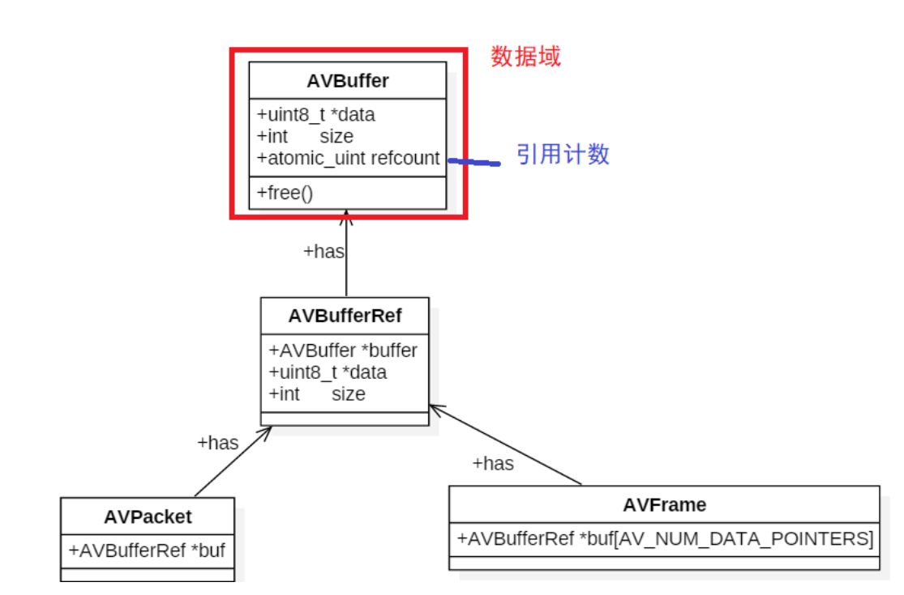
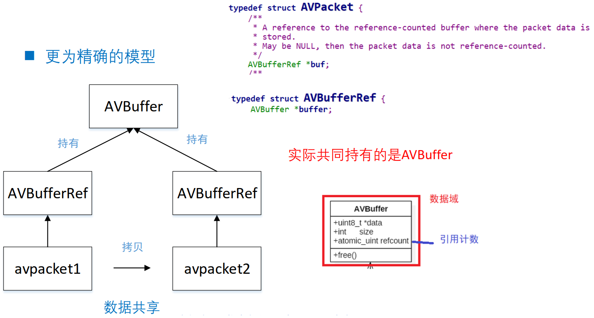

# 1. FFmpeg内存模型

 

 

 

问题 : 

1. 从av_read_frame读取到一个AVPacket后怎么放入队列?
2. 从avcodec_recevice_frame读取到一个AVFrame后又怎么放入队列?

## 1.1 Packet拷贝

从现有的Packet拷贝一个新Packet的时候 , 有两种情况 :

1. 两个Packet的buf引用的是同一数据缓存空间 , 这时候要注意数据缓存空间的释放问题
2. 两个Packet的buf引用不同的数据缓存空间 , 每个Packet都有数据缓存空间的copy

 

 

 

 

## 1.2 引用计数  

* 对于多个 `AVPacket` 共享同一个缓存空间 , FFmpeg使用的引用计数的机制(reference-count)
  * 初始化引用计数为0 , 只有真正分配 `AVBuffer` 的时候 , 引用计数初始化为1
  * 当有新的 Packet 引用共享的缓存空间时 , 就将引用计数+1
  * 当释放了引用共享空间的Packet , 就将引用计数-1 , 引用计数为0时 , 就释放掉引用的缓存空间 `AVBuffer`
* `AVFrame` 也是采用同样的机制

# 2. AVPacket常用API

| 函数原型                                                 | 说明                                         |
| -------------------------------------------------------- | -------------------------------------------- |
| `AVPacket *av_packet_alloc(void);`                       | 分配AVPacket 这个时候和buffer没有关系        |
| `void av_packet_free(AVPacket **pkt);`                   | 释放AVPacket 和_alloc对应                    |
| `void av_init_packet(AVPacket *pkt);`                    | 初始化AVPacket 只是单纯初始化pkt字段         |
| `int av_new_packet(AVPacket *pkt, int size);`            | 给AVPacket的buf分配内存 , 引 用计数初始化为1 |
| `int av_packet_ref(AVPacket *dst, const AVPacket *src);` | 增加引用计数                                 |
| `void av_packet_unref(AVPacket *pkt);`                   | 减少引用计数                                 |
| `void av_packet_move_ref(AVPacket *dst, AVPacket *src);` | 转移引用计数                                 |
| `AVPacket *av_packet_clone(const AVPacket *src);`        | 等于 `av_packet_alloc()` + `av_packet_ref()` |

# 3. AVFrame常用API

| 函数原型                                               | 说明                                      |
| ------------------------------------------------------ | ----------------------------------------- |
| `AVFrame *av_frame_alloc(void); `                      | 分配AVFrame                               |
| `void av_frame_free(AVFrame **frame); `                | 释放AVFrame                               |
| `int av_frame_ref(AVFrame *dst, const AVFrame *src); ` | 增加引用计数                              |
| `void av_frame_unref(AVFrame *frame); `                | 减少引用计数                              |
| `void av_frame_move_ref(AVFrame *dst, AVFrame *src); ` | 转移引用计数                              |
| `int av_frame_get_buffer(AVFrame *frame, int align); ` | 根据AVFrame分配内存                       |
| `AVFrame *av_frame_clone(const AVFrame *src); `        | 等于 `av_frame_alloc()`+ `av_frame_ref()` |

