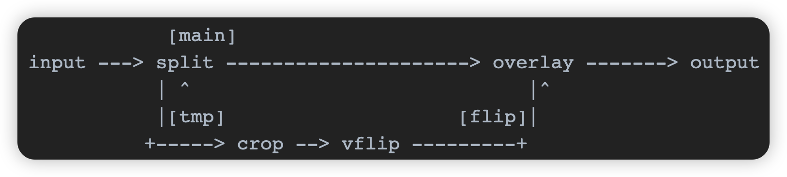

# 1.主要结构体和API介绍


ffmpeg的filter⽤起来是和Gstreamer的plugin是⼀样的概念 , 通过avfilter_link , 将各个创建好的filter按⾃⼰想要的次序链接到⼀起 , 然后avfilter_graph_config之后 , 就可以正常使⽤


⽐较常⽤的滤镜有 : scale、trim、overlay、rotate、movie、yadif

- scale 滤镜⽤于缩放
- trim 滤镜⽤ 于帧级剪切
- overlay 滤镜⽤于视频叠加
- rotate 滤镜实现旋转
- movie 滤镜可以加载第三⽅的视频
- yadif 滤镜可以去隔⾏

## 1.1 AVFilterGraph : 对 filters 系统的整体管理

> ```c++
> //重要成员变量
> AVFilterContext **filters; /*指向AVFilter上下文的指针*/
> unsigned nb_filters; /*记录创建有多少个AVFilter*/
> ```


> ```c++
> /*AVFilterGraph 完整结构体*/
> /*对filters系统的整体管理*/
> typedef struct AVFilterGraph {
>     const AVClass *av_class;
>     AVFilterContext **filters;
>     unsigned nb_filters;
> 
>     char *scale_sws_opts; ///< sws options to use for the auto-inserted scale filters
> 
>     /**
>      * Type of multithreading allowed for filters in this graph. A combination
>      * of AVFILTER_THREAD_* flags.
>      *
>      * May be set by the caller at any point, the setting will apply to all
>      * filters initialized after that. The default is allowing everything.
>      *
>      * When a filter in this graph is initialized, this field is combined using
>      * bit AND with AVFilterContext.thread_type to get the final mask used for
>      * determining allowed threading types. I.e. a threading type needs to be
>      * set in both to be allowed.
>      */
>     int thread_type;
> 
>     /**
>      * Maximum number of threads used by filters in this graph. May be set by
>      * the caller before adding any filters to the filtergraph. Zero (the
>      * default) means that the number of threads is determined automatically.
>      */
>     int nb_threads;
> 
>     /**
>      * Opaque user data. May be set by the caller to an arbitrary value, e.g. to
>      * be used from callbacks like @ref AVFilterGraph.execute.
>      * Libavfilter will not touch this field in any way.
>      */
>     void *opaque;
> 
>     /**
>      * This callback may be set by the caller immediately after allocating the
>      * graph and before adding any filters to it, to provide a custom
>      * multithreading implementation.
>      *
>      * If set, filters with slice threading capability will call this callback
>      * to execute multiple jobs in parallel.
>      *
>      * If this field is left unset, libavfilter will use its internal
>      * implementation, which may or may not be multithreaded depending on the
>      * platform and build options.
>      */
>     avfilter_execute_func *execute;
> 
>     char *aresample_swr_opts; ///< swr options to use for the auto-inserted aresample filters, Access ONLY through AVOptions
> } AVFilterGraph;
> ```


## 1.2 AVFilter : 定义filter本身的能⼒

> ```c++
> /*重要成员变量*/
> 
> const char *name;
> const AVFilterPad *inputs;
> const AVFilterPad *outputs;
> ```


> ```c++
> /*AVFilter完整结构体*/
> /*定义filter本身的能⼒,拥有的pads,回调函数接⼝定义*/
> /*与AVCodec结构体类似*/
> typedef struct AVFilter {
>     /**
>      * Filter name. Must be non-NULL and unique among filters.
>      */
>     const char *name;
> 
>     /**
>      * A description of the filter. May be NULL.
>      *
>      * You should use the NULL_IF_CONFIG_SMALL() macro to define it.
>      */
>     const char *description;
> 
>     /**
>      * List of static inputs.
>      *
>      * NULL if there are no (static) inputs. Instances of filters with
>      * AVFILTER_FLAG_DYNAMIC_INPUTS set may have more inputs than present in
>      * this list.
>      */
>     const AVFilterPad *inputs;
> 
>     /**
>      * List of static outputs.
>      *
>      * NULL if there are no (static) outputs. Instances of filters with
>      * AVFILTER_FLAG_DYNAMIC_OUTPUTS set may have more outputs than present in
>      * this list.
>      */
>     const AVFilterPad *outputs;
> 
>     /**
>      * A class for the private data, used to declare filter private AVOptions.
>      * This field is NULL for filters that do not declare any options.
>      *
>      * If this field is non-NULL, the first member of the filter private data
>      * must be a pointer to AVClass, which will be set by libavfilter generic
>      * code to this class.
>      */
>     const AVClass *priv_class;
> 
>     /**
>      * A combination of AVFILTER_FLAG_*
>      */
>     int flags;
> 
>     /*****************************************************************
>      * All fields below this line are not part of the public API. They
>      * may not be used outside of libavfilter and can be changed and
>      * removed at will.
>      * New public fields should be added right above.
>      *****************************************************************
>      */
> 
>     /**
>      * The number of entries in the list of inputs.
>      */
>     uint8_t nb_inputs;
> 
>     /**
>      * The number of entries in the list of outputs.
>      */
>     uint8_t nb_outputs;
> 
>     /**
>      * This field determines the state of the formats union.
>      * It is an enum FilterFormatsState value.
>      */
>     uint8_t formats_state;
> 
>     /**
>      * Filter pre-initialization function
>      *
>      * This callback will be called immediately after the filter context is
>      * allocated, to allow allocating and initing sub-objects.
>      *
>      * If this callback is not NULL, the uninit callback will be called on
>      * allocation failure.
>      *
>      * @return 0 on success,
>      *         AVERROR code on failure (but the code will be
>      *           dropped and treated as ENOMEM by the calling code)
>      */
>     int (*preinit)(AVFilterContext *ctx);
> 
>     /**
>      * Filter initialization function.
>      *
>      * This callback will be called only once during the filter lifetime, after
>      * all the options have been set, but before links between filters are
>      * established and format negotiation is done.
>      *
>      * Basic filter initialization should be done here. Filters with dynamic
>      * inputs and/or outputs should create those inputs/outputs here based on
>      * provided options. No more changes to this filter's inputs/outputs can be
>      * done after this callback.
>      *
>      * This callback must not assume that the filter links exist or frame
>      * parameters are known.
>      *
>      * @ref AVFilter.uninit "uninit" is guaranteed to be called even if
>      * initialization fails, so this callback does not have to clean up on
>      * failure.
>      *
>      * @return 0 on success, a negative AVERROR on failure
>      */
>     int (*init)(AVFilterContext *ctx);
> 
>     /**
>      * Filter uninitialization function.
>      *
>      * Called only once right before the filter is freed. Should deallocate any
>      * memory held by the filter, release any buffer references, etc. It does
>      * not need to deallocate the AVFilterContext.priv memory itself.
>      *
>      * This callback may be called even if @ref AVFilter.init "init" was not
>      * called or failed, so it must be prepared to handle such a situation.
>      */
>     void (*uninit)(AVFilterContext *ctx);
> 
>     /**
>      * The state of the following union is determined by formats_state.
>      * See the documentation of enum FilterFormatsState in internal.h.
>      */
>     union {
>         /**
>          * Query formats supported by the filter on its inputs and outputs.
>          *
>          * This callback is called after the filter is initialized (so the inputs
>          * and outputs are fixed), shortly before the format negotiation. This
>          * callback may be called more than once.
>          *
>          * This callback must set ::AVFilterLink's
>          * @ref AVFilterFormatsConfig.formats "outcfg.formats"
>          * on every input link and
>          * @ref AVFilterFormatsConfig.formats "incfg.formats"
>          * on every output link to a list of pixel/sample formats that the filter
>          * supports on that link.
>          * For video links, this filter may also set
>          * @ref AVFilterFormatsConfig.color_spaces "incfg.color_spaces"
>          *  /
>          * @ref AVFilterFormatsConfig.color_spaces "outcfg.color_spaces"
>          * and @ref AVFilterFormatsConfig.color_ranges "incfg.color_ranges"
>          *  /
>          * @ref AVFilterFormatsConfig.color_ranges "outcfg.color_ranges"
>          * analogously.
>          * For audio links, this filter must also set
>          * @ref AVFilterFormatsConfig.samplerates "incfg.samplerates"
>          *  /
>          * @ref AVFilterFormatsConfig.samplerates "outcfg.samplerates"
>          * and @ref AVFilterFormatsConfig.channel_layouts "incfg.channel_layouts"
>          *  /
>          * @ref AVFilterFormatsConfig.channel_layouts "outcfg.channel_layouts"
>          * analogously.
>          *
>          * This callback must never be NULL if the union is in this state.
>          *
>          * @return zero on success, a negative value corresponding to an
>          * AVERROR code otherwise
>          */
>         int (*query_func)(AVFilterContext *);
>         /**
>          * A pointer to an array of admissible pixel formats delimited
>          * by AV_PIX_FMT_NONE. The generic code will use this list
>          * to indicate that this filter supports each of these pixel formats,
>          * provided that all inputs and outputs use the same pixel format.
>          *
>          * In addition to that the generic code will mark all inputs
>          * and all outputs as supporting all color spaces and ranges, as
>          * long as all inputs and outputs use the same color space/range.
>          *
>          * This list must never be NULL if the union is in this state.
>          * The type of all inputs and outputs of filters using this must
>          * be AVMEDIA_TYPE_VIDEO.
>          */
>         const enum AVPixelFormat *pixels_list;
>         /**
>          * Analogous to pixels, but delimited by AV_SAMPLE_FMT_NONE
>          * and restricted to filters that only have AVMEDIA_TYPE_AUDIO
>          * inputs and outputs.
>          *
>          * In addition to that the generic code will mark all inputs
>          * and all outputs as supporting all sample rates and every
>          * channel count and channel layout, as long as all inputs
>          * and outputs use the same sample rate and channel count/layout.
>          */
>         const enum AVSampleFormat *samples_list;
>         /**
>          * Equivalent to { pix_fmt, AV_PIX_FMT_NONE } as pixels_list.
>          */
>         enum AVPixelFormat  pix_fmt;
>         /**
>          * Equivalent to { sample_fmt, AV_SAMPLE_FMT_NONE } as samples_list.
>          */
>         enum AVSampleFormat sample_fmt;
>     } formats;
> 
>     int priv_size;      ///< size of private data to allocate for the filter
> 
>     int flags_internal; ///< Additional flags for avfilter internal use only.
> 
>     /**
>      * Make the filter instance process a command.
>      *
>      * @param cmd    the command to process, for handling simplicity all commands must be alphanumeric only
>      * @param arg    the argument for the command
>      * @param res    a buffer with size res_size where the filter(s) can return a response. This must not change when the command is not supported.
>      * @param flags  if AVFILTER_CMD_FLAG_FAST is set and the command would be
>      *               time consuming then a filter should treat it like an unsupported command
>      *
>      * @returns >=0 on success otherwise an error code.
>      *          AVERROR(ENOSYS) on unsupported commands
>      */
>     int (*process_command)(AVFilterContext *, const char *cmd, const char *arg, char *res, int res_len, int flags);
> 
>     /**
>      * Filter activation function.
>      *
>      * Called when any processing is needed from the filter, instead of any
>      * filter_frame and request_frame on pads.
>      *
>      * The function must examine inlinks and outlinks and perform a single
>      * step of processing. If there is nothing to do, the function must do
>      * nothing and not return an error. If more steps are or may be
>      * possible, it must use ff_filter_set_ready() to schedule another
>      * activation.
>      */
>     int (*activate)(AVFilterContext *ctx);
> } AVFilter;
> ```


某个AVFilter例子

> ```c++
> /* AVFilterGraph的输入源 */
> const AVFilter ff_vsrc_buffer = {
>     .name      = "buffer", /**/
>     .description = NULL_IF_CONFIG_SMALL("Buffer video frames, and make them accessible to the filterchain."),
>     .priv_size = sizeof(BufferSourceContext),
>     .activate  = activate,
>     .init      = init_video,
>     .uninit    = uninit,
> 
>     .inputs    = NULL,
>     FILTER_OUTPUTS(avfilter_vsrc_buffer_outputs),
>     FILTER_QUERY_FUNC(query_formats),
>     .priv_class = &buffer_class,
> };
> 
> /*AVFilterGraph的接收缓冲区*/
> const AVFilter ff_vsink_buffer = {
>     .name          = "buffersink",
>     .description   = NULL_IF_CONFIG_SMALL("Buffer video frames, and make them available to the end of the filter graph."),
>     .priv_size     = sizeof(BufferSinkContext),
>     .priv_class    = &buffersink_class,
>     .init          = common_init,
>     .uninit        = uninit,
>     .activate      = activate,
>     FILTER_INPUTS(ff_video_default_filterpad),
>     .outputs       = NULL,
>     FILTER_QUERY_FUNC(vsink_query_formats),
> };
> 
> ```


## 1.3 AVFilterContext : filter的实例,filter上下文,管理filter与外部的联系

> ```c++
> /*重要成员变量*/
> const AVFilter *filter;
> char *name;
> AVFilterPad *input_pads;
> AVFilterLink **inputs;
> unsigned nb_inputs
> AVFilterPad *output_pads;
> AVFilterLink **outputs;
> unsigned nb_outputs;
> struct AVFilterGraph *graph; /*从属于哪个AVFilterGraph*/
> 
> ```


> ```c++
> struct AVFilterContext {
>     const AVClass *av_class;        ///< needed for av_log() and filters common options
> 
>     const AVFilter *filter;         ///< the AVFilter of which this is an instance
> 
>     char *name;                     ///< name of this filter instance
> 
>     AVFilterPad   *input_pads;      ///< array of input pads
>     AVFilterLink **inputs;          ///< array of pointers to input links
>     unsigned    nb_inputs;          ///< number of input pads
> 
>     AVFilterPad   *output_pads;     ///< array of output pads
>     AVFilterLink **outputs;         ///< array of pointers to output links
>     unsigned    nb_outputs;         ///< number of output pads
> 
>     void *priv;                     ///< private data for use by the filter
> 
>     struct AVFilterGraph *graph;    ///< filtergraph this filter belongs to
> 
>     /**
>      * Type of multithreading being allowed/used. A combination of
>      * AVFILTER_THREAD_* flags.
>      *
>      * May be set by the caller before initializing the filter to forbid some
>      * or all kinds of multithreading for this filter. The default is allowing
>      * everything.
>      *
>      * When the filter is initialized, this field is combined using bit AND with
>      * AVFilterGraph.thread_type to get the final mask used for determining
>      * allowed threading types. I.e. a threading type needs to be set in both
>      * to be allowed.
>      *
>      * After the filter is initialized, libavfilter sets this field to the
>      * threading type that is actually used (0 for no multithreading).
>      */
>     int thread_type;
> 
>     /**
>      * Max number of threads allowed in this filter instance.
>      * If <= 0, its value is ignored.
>      * Overrides global number of threads set per filter graph.
>      */
>     int nb_threads;
> 
>     struct AVFilterCommand *command_queue;
> 
>     char *enable_str;               ///< enable expression string
>     void *enable;                   ///< parsed expression (AVExpr*)
>     double *var_values;             ///< variable values for the enable expression
>     int is_disabled;                ///< the enabled state from the last expression evaluation
> 
>     /**
>      * For filters which will create hardware frames, sets the device the
>      * filter should create them in.  All other filters will ignore this field:
>      * in particular, a filter which consumes or processes hardware frames will
>      * instead use the hw_frames_ctx field in AVFilterLink to carry the
>      * hardware context information.
>      *
>      * May be set by the caller on filters flagged with AVFILTER_FLAG_HWDEVICE
>      * before initializing the filter with avfilter_init_str() or
>      * avfilter_init_dict().
>      */
>     AVBufferRef *hw_device_ctx;
> 
>     /**
>      * Ready status of the filter.
>      * A non-0 value means that the filter needs activating;
>      * a higher value suggests a more urgent activation.
>      */
>     unsigned ready;
> 
>     /**
>      * Sets the number of extra hardware frames which the filter will
>      * allocate on its output links for use in following filters or by
>      * the caller.
>      *
>      * Some hardware filters require all frames that they will use for
>      * output to be defined in advance before filtering starts.  For such
>      * filters, any hardware frame pools used for output must therefore be
>      * of fixed size.  The extra frames set here are on top of any number
>      * that the filter needs internally in order to operate normally.
>      *
>      * This field must be set before the graph containing this filter is
>      * configured.
>      */
>     int extra_hw_frames;
> };
> ```


## 1.4 AVFilterLink : 定义两个filters之间的联接

> ```c++
> /*重要成员变量*/
> AVFilterContext *src;
> AVFilterPad *srcpad;
> AVFilterContext *dst;
> AVFilterPad *dstpad;
> struct AVFilterGraph *graph;
> ```


> ```c++
> truct AVFilterLink {
>     AVFilterContext *src;       ///< source filter
>     AVFilterPad *srcpad;        ///< output pad on the source filter
> 
>     AVFilterContext *dst;       ///< dest filter
>     AVFilterPad *dstpad;        ///< input pad on the dest filter
> 
>     enum AVMediaType type;      ///< filter media type
> 
>     int format;                 ///< agreed upon media format
> 
>     /* These parameters apply only to video */
>     int w;                      ///< agreed upon image width
>     int h;                      ///< agreed upon image height
>     AVRational sample_aspect_ratio; ///< agreed upon sample aspect ratio
>     /**
>      * For non-YUV links, these are respectively set to fallback values (as
>      * appropriate for that colorspace).
>      *
>      * Note: This includes grayscale formats, as these are currently treated
>      * as forced full range always.
>      */
>     enum AVColorSpace colorspace;   ///< agreed upon YUV color space
>     enum AVColorRange color_range;  ///< agreed upon YUV color range
> 
>     /* These parameters apply only to audio */
>     int sample_rate;            ///< samples per second
>     AVChannelLayout ch_layout;  ///< channel layout of current buffer (see libavutil/channel_layout.h)
> 
>     /**
>      * Define the time base used by the PTS of the frames/samples
>      * which will pass through this link.
>      * During the configuration stage, each filter is supposed to
>      * change only the output timebase, while the timebase of the
>      * input link is assumed to be an unchangeable property.
>      */
>     AVRational time_base;
> 
>     /*****************************************************************
>      * All fields below this line are not part of the public API. They
>      * may not be used outside of libavfilter and can be changed and
>      * removed at will.
>      * New public fields should be added right above.
>      *****************************************************************
>      */
> 
>     /**
>      * Lists of supported formats / etc. supported by the input filter.
>      */
>     AVFilterFormatsConfig incfg;
> 
>     /**
>      * Lists of supported formats / etc. supported by the output filter.
>      */
>     AVFilterFormatsConfig outcfg;
> 
>     /**
>      * Graph the filter belongs to.
>      */
>     struct AVFilterGraph *graph;
> 
>     /**
>      * Current timestamp of the link, as defined by the most recent
>      * frame(s), in link time_base units.
>      */
>     int64_t current_pts;
> 
>     /**
>      * Current timestamp of the link, as defined by the most recent
>      * frame(s), in AV_TIME_BASE units.
>      */
>     int64_t current_pts_us;
> 
>     /**
>      * Frame rate of the stream on the link, or 1/0 if unknown or variable;
>      * if left to 0/0, will be automatically copied from the first input
>      * of the source filter if it exists.
>      *
>      * Sources should set it to the best estimation of the real frame rate.
>      * If the source frame rate is unknown or variable, set this to 1/0.
>      * Filters should update it if necessary depending on their function.
>      * Sinks can use it to set a default output frame rate.
>      * It is similar to the r_frame_rate field in AVStream.
>      */
>     AVRational frame_rate;
> 
>     /**
>      * Minimum number of samples to filter at once. If filter_frame() is
>      * called with fewer samples, it will accumulate them in fifo.
>      * This field and the related ones must not be changed after filtering
>      * has started.
>      * If 0, all related fields are ignored.
>      */
>     int min_samples;
> 
>     /**
>      * Maximum number of samples to filter at once. If filter_frame() is
>      * called with more samples, it will split them.
>      */
>     int max_samples;
> 
>     /**
>      * Number of past frames sent through the link.
>      */
>     int64_t frame_count_in, frame_count_out;
> 
>     /**
>      * Number of past samples sent through the link.
>      */
>     int64_t sample_count_in, sample_count_out;
> 
>     /**
>      * True if a frame is currently wanted on the output of this filter.
>      * Set when ff_request_frame() is called by the output,
>      * cleared when a frame is filtered.
>      */
>     int frame_wanted_out;
> 
>     /**
>      * For hwaccel pixel formats, this should be a reference to the
>      * AVHWFramesContext describing the frames.
>      */
>     AVBufferRef *hw_frames_ctx;
> };
> 
> ```


## 1.5 AVFilterPad : 定义filter的输⼊/输出接⼝

> ```c++
> /*重要成员变量*/
> const char *name;
> union {
>     AVFrame *(*video)(AVFilterLink *link, int w, int h);
>     AVFrame *(*audio)(AVFilterLink *link, int nb_samples);
> } get_buffer;
> 
> int (*filter_frame)(AVFilterLink *link, AVFrame *frame);
> int (*request_frame)(AVFilterLink *link);
> ```


> ```c++
> struct AVFilterPad {
>     /**
>      * Pad name. The name is unique among inputs and among outputs, but an
>      * input may have the same name as an output. This may be NULL if this
>      * pad has no need to ever be referenced by name.
>      */
>     const char *name;
> 
>     /**
>      * AVFilterPad type.
>      */
>     enum AVMediaType type;
> 
>     /**
>      * The filter expects writable frames from its input link,
>      * duplicating data buffers if needed.
>      *
>      * input pads only.
>      */
> #define AVFILTERPAD_FLAG_NEEDS_WRITABLE                  (1 << 0)
> 
>     /**
>      * The pad's name is allocated and should be freed generically.
>      */
> #define AVFILTERPAD_FLAG_FREE_NAME                       (1 << 1)
> 
>     /**
>      * A combination of AVFILTERPAD_FLAG_* flags.
>      */
>     int flags;
> 
>     /**
>      * Callback functions to get a video/audio buffers. If NULL,
>      * the filter system will use ff_default_get_video_buffer() for video
>      * and ff_default_get_audio_buffer() for audio.
>      *
>      * The state of the union is determined by type.
>      *
>      * Input pads only.
>      */
>     union {
>         AVFrame *(*video)(AVFilterLink *link, int w, int h);
>         AVFrame *(*audio)(AVFilterLink *link, int nb_samples);
>     } get_buffer;
> 
>     /**
>      * Filtering callback. This is where a filter receives a frame with
>      * audio/video data and should do its processing.
>      *
>      * Input pads only.
>      *
>      * @return >= 0 on success, a negative AVERROR on error. This function
>      * must ensure that frame is properly unreferenced on error if it
>      * hasn't been passed on to another filter.
>      */
>     int (*filter_frame)(AVFilterLink *link, AVFrame *frame);
> 
>     /**
>      * Frame request callback. A call to this should result in some progress
>      * towards producing output over the given link. This should return zero
>      * on success, and another value on error.
>      *
>      * Output pads only.
>      */
>     int (*request_frame)(AVFilterLink *link);
> 
>     /**
>      * Link configuration callback.
>      *
>      * For output pads, this should set the link properties such as
>      * width/height. This should NOT set the format property - that is
>      * negotiated between filters by the filter system using the
>      * query_formats() callback before this function is called.
>      *
>      * For input pads, this should check the properties of the link, and update
>      * the filter's internal state as necessary.
>      *
>      * For both input and output filters, this should return zero on success,
>      * and another value on error.
>      */
>     int (*config_props)(AVFilterLink *link);
> };
> 
> ```


## 1.6 AVFilterInOut : 过滤器链输⼊/输出的链接列表


> ```c++
> typedef struct AVFilterInOut {
>     /** unique name for this input/output in the list */
>     char *name;
> 
>     /** filter context associated to this input/output */
>     AVFilterContext *filter_ctx;
> 
>     /** index of the filt_ctx pad to use for linking */
>     int pad_idx;
> 
>     /** next input/input in the list, NULL if this is the last */
>     struct AVFilterInOut *next;
> } AVFilterInOut;
> ```


在AVFilter模块中定义了AVFilter结构 , 每个AVFilter都是具有独⽴功能的节点

- 如scale filter的作⽤就是进⾏图像尺⼨变换
- overlay filter的作⽤就是进⾏图像的叠加

这⾥需要重点提的是两个特别的filter : **$\color{Red}{\mathbf{ ⼀个是buffer , ⼀个是buffersink }}$**

- 滤波器buffer代表filter graph中的 **$\color{red}{源头}$** , 原始数据就往这个filter节点输⼊的
- 滤波器buffersink代表filter graph中的 **$\color{red}{\mathbf{输出节点}}$** , 处理完成的数据从这个filter节点输出

# 2.函数使用

## 2.1 `avfilter_get_by_name`

| `const AVFilter *avfilter_get_by_name(const char *name);`<br />//获取FFmpeg中定义的filter |
| ------------------------------------------------------------ |

| 参数               | 参数解释                 |
| ------------------ | ------------------------ |
| `const char *name` | 通过滤波器名字获取滤波器 |

| 返回值            | 返回值解释     |
| ----------------- | -------------- |
| `const AVFilter*` | 返回一个滤波器 |

## 2.2 `avfilter_graph_alloc`

| `AVFilterGraph *avfilter_graph_alloc();`<br />//创建⼀个滤波器图filter graph |
| ------------------------------------------------------------ |

| 返回值           | 解释                     |
| ---------------- | ------------------------ |
| `AVFilterGraph*` | 返回一个`AVFilterGraph*` |

## 2.3 `avfilter_graph_create_filter`

| int avfilter_graph_create_filter ( AVFilterContext **filt_ctx , <br />const AVFilter *filt , <br />const char *name , <br />const char *args , <br />void *opaque , <br />AVFilterGraph *graph_ctx );<br />//创建⼀个滤波器实例AVFilterContext，并添加到AVFilterGraph中 |
| ------------------------------------------------------------ |

| 参数                         | 参数解释                             |
| ---------------------------- | ------------------------------------ |
| `AVFilterContext **filt_ctx` | 返回滤波器上下文                     |
| `const AVFilter *filt`       | 输入获取到的滤波器                   |
| `const char *name`           | 命名要赋予创建的过滤器实例的实例名称 |
| `const char *args`           | 滤波器参数                           |
| `void *opaque`               | 一般置空                             |
| `AVFilterGraph *graph_ctx`   | 把滤波器添加到AVFilterGraph          |

| 返回值 |                        |
| ------ | ---------------------- |
| `int`  | 0为成功 , 负数代表失败 |

## 2.4 `avfilter_link`

| `int avfilter_link(AVFilterContext *src, unsigned srcpad , AVFilterContext *dst, unsigned dstpad);`<br />// 连接两个滤波器节点 |
| ------------------------------------------------------------ |

| 参数                   | 参数意义             |
| ---------------------- | -------------------- |
| `AVFilterContext *src` | 过滤器上下文         |
| `unsigned srcpad`      | 编号                 |
| `AVFilterContext *dst` | 被连接的过滤器上下文 |
| `unsigned dstpad`      | 编号                 |

| 返回值 | 解释                 |
| ------ | -------------------- |
| `int`  | 0为成功 , 负数为失败 |

## 2.5 `av_buffersrc_add_frame`

| `int av_buffersrc_add_frame(AVFilterContext *ctx, AVFrame *frame);`<br />//把帧添加到过滤器进行处理 |
| ------------------------------------------------------------ |

| 参数                   | 参数意义                                 |
| ---------------------- | ---------------------------------------- |
| `AVFilterContext *ctx` | 过滤器上下文(通常填写输入过滤器的上下文) |
| `AVFrame *frame`       | 输入帧                                   |

| 返回值 | 返回值意义           |
| ------ | -------------------- |
| `int`  | 0为成功 , 负数为失败 |

## 2.6 `av_buffersink_get_frame`

| `int av_buffersink_get_frame(AVFilterContext *ctx, AVFrame *frame)` <br />//获取被过滤器处理后的帧 |
| ------------------------------------------------------------ |

| 参数                   | 参数意义                                 |
| ---------------------- | ---------------------------------------- |
| `AVFilterContext *ctx` | 过滤器上下文(通常填写输出过滤器的上下文) |
| `AVFrame *frame`       | 输出帧                                   |

| 返回值 | 返回值意义          |
| ------ | ------------------- |
| `int`  | 0为成功 ,负数为失败 |


# 3. AVFilter主体框架流程

在利用AVFilter进行音视频数据处理前先将在进行的处理流程绘制出来 , 现在以FFmpeg filter官方文档中的⼀个例子为例进行说明

   


这个例⼦的处理流程如上所示 , ⾸先使⽤split滤波器将input流分成两路流(main和tmp) , 然后分别对两路流进⾏处理 , 对于tmp流 , 先经过crop滤波器进⾏裁剪处理 , 再经过flip滤波器进⾏垂直⽅向上的翻转操作 , 输出的结果命名为flip流 , 再将main流和flip流输⼊到overlay滤波器进⾏合成操作 , 上图的input就是上⾯提过的buffer源滤波器 , output就是上⾯的提过的buffersink滤波器 , 上图中每个节点都是⼀个AVFilterContext , 每个连线就是AVFliterLink , 所有这些信息都统⼀由AVFilterGraph来管理

# 4.编程实战

## 4.1 视频过滤器

[[视频过滤器,第一种写法]](/code/win/2-FFmpeg/16-video-filter)

[[视频过滤器,第二种写法]](/code/win/2-FFmpeg/16-video-filter_2)

[[水印叠加]]()

## 4.2 音频过滤器

[[音频过滤器]](/code/win/2-FFmpeg/17-audio-mix)

