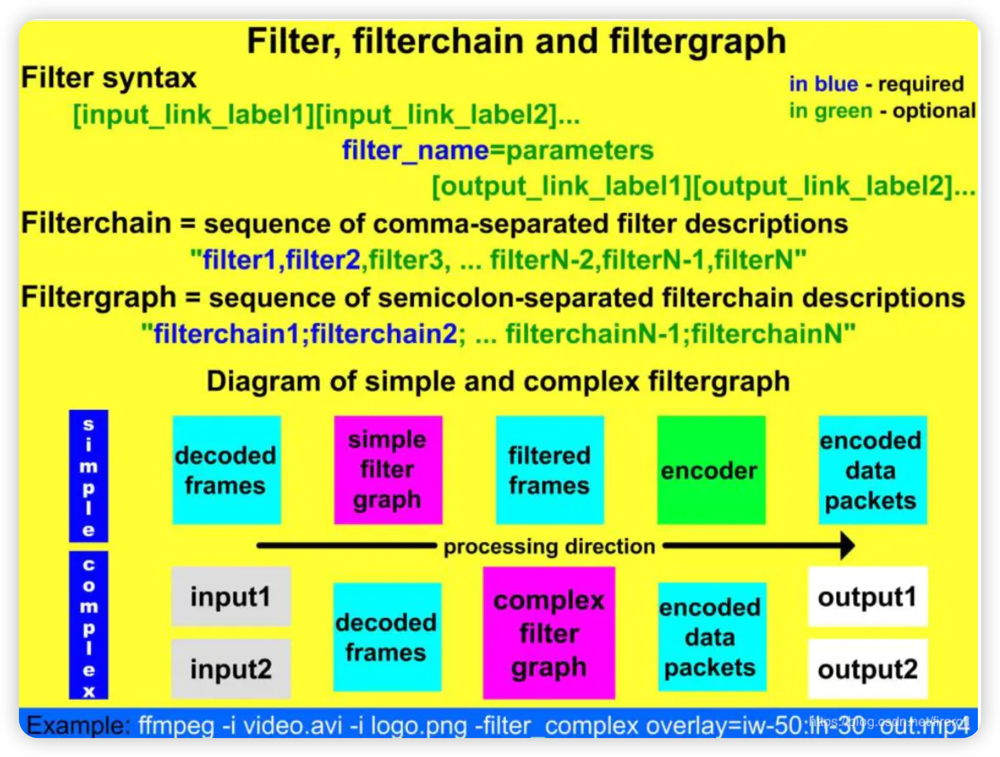
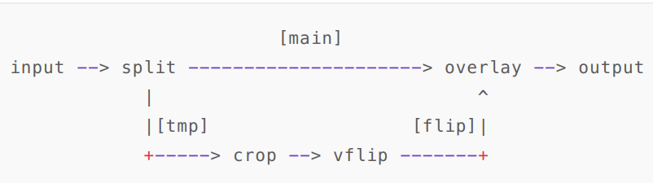
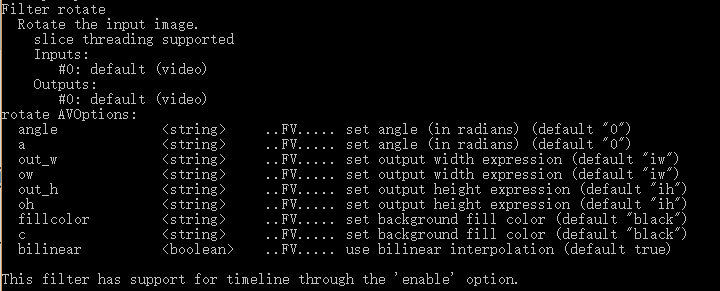
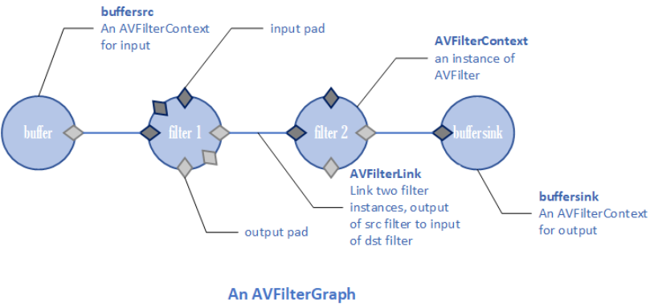
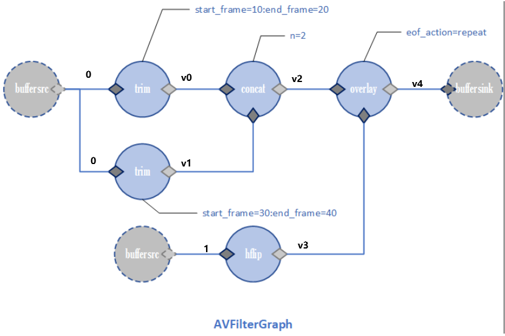

ffmpeg中有很多已经实现好的滤波器 , 这些滤波器的实现位于libavfilter⽬录之下 , ⽤户需要进⾏滤波时 , 就是是调⽤这些滤波器来实现的 , ffmpeg对于调⽤滤波器有⼀整套的调⽤机制

[[参考文档1]](https://ffmpeg.org/libavfilter.html)

[[参考文档2]](https://ffmpeg.org/ffmpeg-filters.html)

# 1. FFmpeg filter简介

FFmpeg filter提供了很多⾳视频特效处理的功能 

⽐如视频缩放、截取、翻转、叠加等 , 其中定义了很多的filter , 例如以下常⽤的⼀些filter

- scale : 视频/图像的缩放
- overlay : 视频/图像的叠加
- crop : 视频/图像的裁剪
- trim : 截取视频的⽚段
- rotate : 以任意⻆度旋转视频

⽀持的filter的列表可以通过以下命令获得

> ```bash
> ffmpeg -filters
> ```


也可以查看⽂档[2]，具体某个版本的⽀持情况以命令⾏获取到的结果为准。
以下是filter的⼀个简单的应⽤示例 , 对视频的宽和⾼减半

> ```bash
> ffmpeg -i input -vf scale=iw/2:ih/2 output
> ```


# 2. filter的使⽤⽅法

学习filter的使⽤ , 先需要了解⼀下filter的语法
FFmpeg中filter包含三个层次 , filter->filterchain->filtergraph

 

- 第⼀层是 filter 的语法
- 第⼆层是 filterchain的语法
- 第三层是 filtergraph的语法

filtergraph可以用文本形式表示 , 可以作为ffmpeg中的 `-filter/-vf/-af` 和 `-filter_complex` 选项以及
ffplay中的 `-vf/-af` 和 `libavfilter/avfilter.h` 中定义的 `avfilter_graph_parse2(...)` 函数的参数
为了说明可能的情况 , 我们考虑下⾯的例子 “把视频的上部分镜像到下半部分”
处理流程如下:

1. 使用split filter将输⼊流分割为两个流[main]和[temp]。
2. 其中⼀个流[temp]通过crop filter把下半部分裁剪掉。
3. 步骤2中的输出再经过vflip filter对视频进行和垂直翻转 , 输出[flip]
4. 把步骤3中输出[flip]叠加到[main]的下半部分

以下整个处理过程的⼀个图示 , 也就是对filtergraph的⼀个描述  

 

可以用以下的命令来实现这个流程

> ```bash
> ffmpeg -i INPUT -vf "split [main][tmp];[tmp] crop=iw:ih/2:0:0,vflip[flip];[main][flip] overlay=0:H/2" OUTPUT
> ```

处理结果如下图所示 

 

## 2.1 filter的语法

用一个字符串描述filter的组成 , 形式如下  

> ```bash
> [in_link_1]…[in_link_N]filter_name=parameters[out_link_1]…[out_link_M]
> ```

参数说明 : 

1. **$\color{Skyblue}{\mathbf{ [ in\\\_link\\\_N ] 、[ out\\\_link\\\_N ]:用来标识输入和输出的标签}}$** , in_link_N是标签名 , 标签名可以任意命名 , 需使用方括号括起来。在filter_name的前⾯的标签⽤于标识输入 , 在filter_name后面的用于标识输出 , ⼀个filter可以有多个输入和多个输出 , 没有输入的filter称为source filter , 没有输出的filter称为sink filter , 对输入或输出打标签是可选的 , 打上标签是为了连接其他filter时使用

2. filter_name : filter的名称

3. "=parameters" : 包含初始化filter的参数 , 是可选的

   1. “=parameters” 有以下几种形式

      1. 使用 `:` 字符分隔的⼀个 "键=值" 对列表 , 如下所示

         ```bash
         ffmpeg -i input -vf scale=w=iw/2:h=ih/2 output
         ffmpeg -i input -vf scale=h=ih/2:w=iw/2 output
         ```

      2. 使用  `:` 字符分割的 "值" 的列表 , 在这种情况下 , **$\color{red}{\mathbf{键按照声明的顺序被假定为选项名}}$** , 例如 , scale filter
         的前两个选项分别是w和h , 当参数列表为 `iw/2:ih/2` 时 , `iw/2` 的值赋给 w , `ih/2` 的值赋给h , 如下所示

         ```bash
         ffmpeg -i input -vf scale=iw/2:ih/2 output
         ```

      3. 使用 `:` 字符分隔混合 "值" 和 "键=值" 对的列表 , "值" 必须位于 "键=值" 对之前 , 并遵循与前⼀点相同的约束顺序 , 之后的 "键=值" 对的顺序不受约束 , 如下所示

         ```bash
         ffmpeg -i input -vf scale=iw/2:h=ih/2 output
         ```

         filter类定义了filter的特性以及输入和输出的数量 , 某个filter的使用方式可以通过以下命令获知

         ```bash
         ffmpeg -h filter=filter_name
         ```

         

         也可以查看文档[2] , 但具体某个版本的参数形式以命令⾏获取到的结果为准

         以下是rotate filter的使用方式

         

 

- 可以看出它支持 slice threading
- Inputs下面定义的是输入 , 可以看出rotate filter有一个输入 , 格式为Video
- Outputs下面定义的是输出 , 可以看出rotate filter有一个输出 , 格式为video
- AVOptions下面定义了支持的参数 , 后面有默认值描述 , 为了简化输入参数 , 对长的参数名提供一个简化的名称 , 比如 rotate filter 中 , "angle" 的简化名称是 "a"
  

以下是使用到 fiter 的标签名的⼀个示例 : 抽取视频 Y、U、V分量到不同的文件

> ```bash
> ffmpeg -i input.mp4 -filter_complex "extractplanes=y+u+v[y][u][v]" -map "[y]" input_y.mp4 -map "[u]" input_u.mp4 -map "[v]" input_v.mp4
> ```

extractplanes filter指定了三个输出 , 分别是 [ y ] [ u ] [ v ] , 抽取后 , 将不同的输出保存到不同的文件中

## 2.2 filterchain的语法  

用⼀个字符串描述filterchain的组成 , 形式如下

> ```bash
> "filter1, filter2, ... filterN-1, filterN"
> ```

说明 : 

1. 由⼀个或多个filter的连接而成 , filter之间以逗号 `,` 分隔

2. 每个filter都连接到序列中的前⼀个filter , 即前⼀个filter的输出是后⼀个filter的输入

   比如示例

   ```bash
   ffmpeg -i INPUT -vf "split [main][tmp];[tmp]crop=iw:ih/2:0:0,vflip[flip];[main][flip]overlay=0:H/2" OUTPUT
   ```

   **$\color{red}{\mathbf{示例说明 : crop、vflip在同⼀个filterchain中}}$​**

## 2.3 filtergraph的语法

⽤⼀个字符串描述filtergraph的组成 , 形式如下

> ```bash
> "filterchain1;filterchain2;...filterchainN-1;fiterchainN"
> ```

说明:

1. 由⼀个或多个filter的组合而成 , filterchain之间用分号`;` 分隔
2. filtergraph是连接filter的有向图 , 它可以包含循环 , ⼀对filter之间可以有多个连接
3. 当在filtergraph中找到两个相同名称的标签时 , 将创建相应输入和输出之间的连接
4. 如果输出没有被打标签 , 则默认将其连接到filterchain中下一个filter的第⼀个未打标签的输入 , 例如以下filterchain中

> ```bash
> nullsrc,split[L1], [L2]overlay, nullsink
> ```

说明 : split filter有两个输出 , overlay filter有两个输入 , split的第⼀个输出标记为 "L1" , overlay的第⼀个输入pad标记为"L2" , **$\color{red}{\mathbf{split的第二个输出将连接到overlay的第二个输入}}$**

5. 在⼀个filter描述中 , 如果没有指定 **$\color{red}{\mathbf{第⼀个}}$** filter的输入标签 , 则假定为 "In" , 如果没有指定 **$\color{red}{\mathbf{最后⼀个}}$** filter的输出标签 , 则假定为 "out"  

6. 在一个完整的filterchain中 , 所有没有打标签的filter输入和输出必须是连接的 , 如果所有filterchain的所有filter输入和输出pad都是连接的 , 则认为filtergraph是有效的[2]

   > ```bash
   > ffmpeg -i INPUT -vf "split [main][tmp]; [tmp] crop=iw:ih/2:0:0, vflip [flip]; [main][flip] overlay=0:H/2" OUTPUT
   > ```

   其中有三个filterchain, 分别是：

   - `split [main][tmp]` , 它只有一个filter , 即 split , 它有一个默认的输入 , 即INPUT解码后的frame , 有两个输出 , 以 [main], [tmp] 标识
   - `[tmp] crop=iw:ih/2:0:0 , vflip [flip]` , 它由两个filter组成 , crop和vflip , crop的输入为[tmp] , vflip的输出标识为[flip]
   - `[main][flip] overlay=0:H/2` , 它由一个filter组成 , 即overlay , 有两个输入 , [main]和[flip] , 有一个默认的输出

# 3. 基本结构

我们把⼀整个滤波的流程称为滤波过程 , 下⾯是⼀个滤波过程的结构 

 

图中简要指示出了滤波所⽤到的各个结构体 , 各个结构体有如下作用 : 

| 名称              | 作用                                                         |
| ----------------- | ------------------------------------------------------------ |
| `AVFilterGraph`   | 用于统合这整个滤波过程的结构体                               |
| `AVFilter`        | 滤波器 , 滤波器的实现是通过AVFilter以及位于其下的结构体/函数来维护的 |
| `AVFilterContext` | ⼀个滤波器实例 , 即使是同⼀个滤波器 , 但是在进行实际的滤波时 , 也会由于输入的参数不同而有不同的滤波效果 , AVFilterContext就是在实际进⾏滤波时⽤于维护滤波相关信息的实体 |
| `AVFilterLink`    | 滤波器链 , 作用主要是用于连接相邻的两个`AVFilterContext` , 为了实现⼀个滤波过程 , 可能会需要多个滤波器协同完成 , 即⼀个滤波器的输出可能会是另⼀个滤波器的输入 , AVFilterLink的作用是串联两个相邻的滤波器实例 , 形成两个滤波器之间的通道 |
| `AVFilterPad`     | 滤波器的输入输出端口 , ⼀个滤波器可以有多个输入以及多个输出端口 , 相邻滤波器之间是通过AVFilterLink来串联的 , 而位于AVFilterLink两端的分别就是前⼀个滤波器的输出端口以及后⼀个滤波器的输入端口 |
| `buffersrc`       | ⼀个特殊的滤波器 , 这个滤波器的作⽤就是充当整个滤波过程的入口 ,<br /> 通过调用该滤波器提供的函数 `av_buffersrc_add_frame` 可以把需要滤波的帧传输进入滤波过程 , <br />**$\color{red}{\mathbf{在创建该滤波器实例的时候需要提供⼀些关于所输⼊的帧的格式的必要参数 (如:time\_base、图像的宽高、图像像素格式等)}}$** |
| `buffersink`      | ⼀个特殊的滤波器 , 这个滤波器的作用就是充当整个滤波过程的出口,<br />通过调用该滤波器提供的函数 `av_buffersink_get_frame` 可以提取出被滤波过程滤波完成后的帧 |

# 4. 创建简单的滤波过程

创建整个滤波过程包含以下步骤 : 

1. 首先需要得到整个滤波过程所需的滤波器 (AVFilter) , 其中 buffersrc 以及 buffersink 是作为输入以及输出所必须的两个滤波器

   ```c++
   const AVFilter *buffersrc = avfilter_get_by_name("buffer");
   const AVFilter *buffersink = avfilter_get_by_name("buffersink");
   const AVFilter *myfilter = avfilter_get_by_name("myfilter");
   ```

2. 创建统合整个滤波过程的滤波图结构体 (AVFilterGraph) 

   ```c++
   filter_graph = avfilter_graph_alloc();
   ```

3. 创建用于维护滤波相关信息的滤波器实例 (AVFilterContext)  

   ```c++
   AVFilterContext *in_video_filter = NULL;
   AVFilterContext *out_video_filter = NULL;
   AVFilterContext *my_video_filter = NULL;
   
   avfilter_graph_create_filter(&in_video_filter, buffersrc, "in", args,NULL, filter_graph);
   
   avfilter_graph_create_filter(&out_video_filter, buffersink, "out", NULL, NULL, filter_graph);
   
   avfilter_graph_create_filter(&my_video_filter, myfilter, "myfilter",NULL, NULL, filter_graph);
   ```

4. 用AVFilterLink把相邻的两个滤波实例连接起来 

   ```c++
   avfilter_link(in_video_filter, 0, my_video_filter, 0);
   avfilter_link(my_video_filter, 0, out_video_filter, 0);
   ```

5. 提交整个滤波图 

   ```c++
   avfilter_graph_config(filter_graph, NULL);
   ```

# 5. 创建复杂滤波器

当滤波过程复杂到⼀定程度时 , **$\color{red}{\mathbf{即需要多个滤波器进行复杂的连接来实现整个滤波过程}}$** , 这时候对于调⽤者来说 , 继续采用上述方法来构建滤波图就显得不够效率 , **$\color{red}{\mathbf{对于复杂的滤波过程 , ffmpeg提供了⼀个更为方便的滤波过程创建方式}}$**  

这种复杂的滤波器过程创建方式要求用户以字符串的方式描述各个滤波器之间的关系 , 如下是⼀个描述复杂滤波过程的字符串的例子

> ```bash
> [0]trim=start_frame=10:end_frame=20[v0];\
> [0]trim=start_frame=30:end_frame=40[v1];\
> [v0][v1]concat=n=2[v2];\
> [1]hflip[v3];\
> [v2][v3]overlay=eof_action=repeat[v4];\
> [v4]drawbox=50:50:120:120:red:t=5[v5]
> ```

以上是⼀个连续的字符串 , 为了方便分析我们把该字符串进行了划分 , 每一行都是⼀个滤波器实例 , 对于一行 : 

1. 开头是⼀对中括号 , 中括号内的是输入的标识名0
2. 中括号后⾯接着的是滤波器名称trim
3. 名称后的第⼀个等号后面是滤波器参数start_frame=10:end_frame=20 , 这里有两组参数 , 两组参数⽤冒号分开
4. 第⼀组参数名称为 start_frame , 参数值为10 , 中间⽤等号分开
5. 第⼆组参数名称为 end_frame , 参数值为20 , 中间⽤等号分开
6. 最后也有⼀对中括号 , 中括号内的是输出的标识名v0
7. **$\color{red}{\mathbf{如果⼀个滤波实例的输入标识名与另⼀个滤波实例的输出标识名相同 , 则表示这两个滤波实例构成滤波链}}$**
8. 如果⼀个滤波实例的输入标识名或者输出标识名⼀直没有与其它滤波实例的输出标识名或者输⼊标识名相同 , 则表明这些为外部的输⼊输出 , 通常我们会为其接上buffersrc以及buffersink , 按照这种规则 , 上⾯的滤波过程可以被描绘成以下滤波图 : 

  

ffmpeg提供⼀个函数用于解析这种字符串 : `avfilter_graph_parse2` , 这个函数会把输⼊的字符串生成如上⾯的滤波图，不过我们需要自行生成 buffersrc 以及 buffersink 的实例 , 并通过该函数提供的输⼊以及输出接⼝把 buffersrc、buffersink与该滤波图连接起来 , 整个流程包含以下步骤 

1. 创建统合整个滤波过程的滤波图结构体(AVFilterGraph)

   ```c++
   filter_graph = avfilter_graph_alloc();
   ```

2. 解析字符串 , 并构建该字符串所描述的滤波图 

   ```c++
   avfilter_graph_parse2(filter_graph, graph_desc, &inputs, &outputs);
   ```

3. 其中inputs与outputs分别为输入与输出的接⼝集合 , 我们需要为这些接口接上输⼊以及输出

   ```c++
   for (cur = inputs, i = 0; cur; cur = cur->next, i++) {
       const AVFilter *buffersrc = avfilter_get_by_name("buffer");
       avfilter_graph_create_filter(&filter, buffersrc, name, args, NULL, filter_graph);
       avfilter_link(filter, 0, cur->filter_ctx, cur->pad_idx);
   }
   
   avfilter_inout_free(&inputs);
   
   for (cur = outputs, i = 0; cur; cur = cur->next, i++) {
    const AVFilter *buffersink = avfilter_get_by_name("buffersink");
    avfilter_graph_create_filter(&filter, buffersink, name, NULL, NULL, filter_graph);
    avfilter_link(cur->filter_ctx, cur->pad_idx, filter, 0);
   }
   
   avfilter_inout_free(&outputs);
   
   ```

4. 提交整个滤波图

   ```c++
   avfilter_graph_config(filter_graph, NULL);
   ```

# 6. 滤波API

上⾯主要讨论了如何创建滤波过程，不过要进行滤波还需要把帧传输进入该过程 , 并在滤波完成后从该过程中提取出滤波完成的帧。

buffersrc提供了向滤波过程输⼊帧的API : `av_buffersrc_add_frame` , 向指定的buffersrc实例输⼊想要进行滤波的帧就可以把帧传入滤波过程

> ```c++
> av_buffersrc_add_frame(c->in_filter, pFrame);
> ```

buffersink提供了从滤波过程提取帧的API : `av_buffersink_get_frame` 可以从指定的buffersink实例提取滤波完成的帧

> ```c++
> av_buffersink_get_frame(c->out_filter, pFrame);
> ```

当 `av_buffersink_get_frame` 返回值大于0则表示提取成功


  