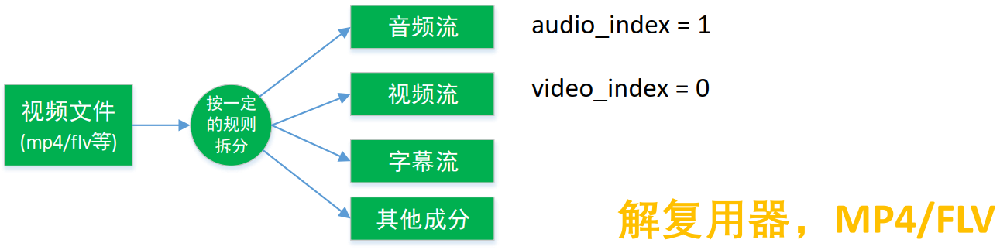
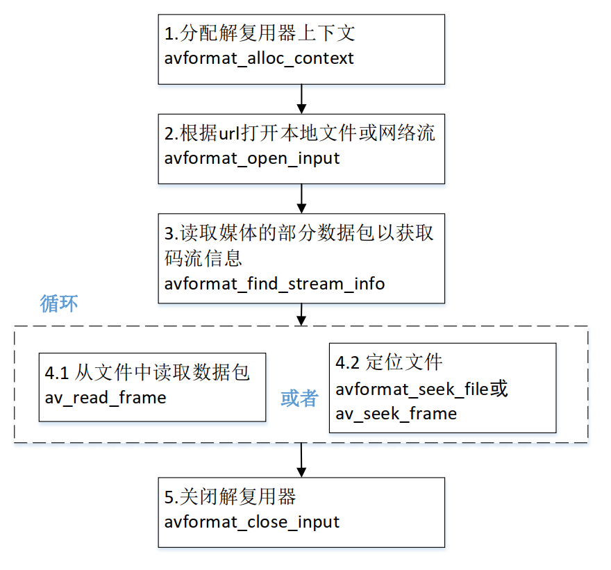

# 1. 解封装

 

 

# 2. 封装格式相关函数  

| `avformat_alloc_context();`                          | 负责申请一个 AVFormatContext 结构的内存,并进行简单初始化     |
| :--------------------------------------------------- | :----------------------------------------------------------- |
| `avformat_free_context(...);`                        | 释放该结构里的所有东西以及该结构本身                         |
| `avformat_close_input(...);`                         | 关闭解复用器。关闭后就不再需要使用 avformat_free_context 进行释放 |
| `avformat_open_input(...);`                          | 打开输入视频文件                                             |
| `avformat_find_stream_info(...);`                    | 获取视频文件信息                                             |
| `av_find_best_strea(...)`                            | 区分视频和音频                                               |
| `av_read_frame(...);`                                | 读取音视频包                                                 |
| `avformat_seek_file(...);` `av_seek_frame(...);` | 定位文件                                                     |

# 3. 解封装流程

 

# 4. FFmpeg数据结构之间的关系

## 4.1 区分不同的码流

- `AVMEDIA_TYPE_VIDEO `视频流 `video_index = av_find_best_stream(ic, AVMEDIA_TYPE_VIDEO,-1,-1, NULL, 0)`

- `AVMEDIA_TYPE_AUDIO` 音频流 `audio_index = av_find_best_stream(ic, AVMEDIA_TYPE_AUDIO,-1,-1, NULL, 0)`

`AVPacket` 里面也有一个 `index` 的字段

# 5. 重点

`avformat_open_input` 和 `avformat_find_stream_info` 分别用于打开一个流和分析流信息。 在初始信息不足的情况下(比如FLV和H264文件) , `avformat_find_stream_info` 接口需要在内部调用 `read_frame_internal` 接口读取流数据 (音视频帧), 然后再分析后 , 设置核心数据结构`AVFormatContext`

由于需要读取数据包 , `avformat_find_stream_info` 接口会带来很大的延迟