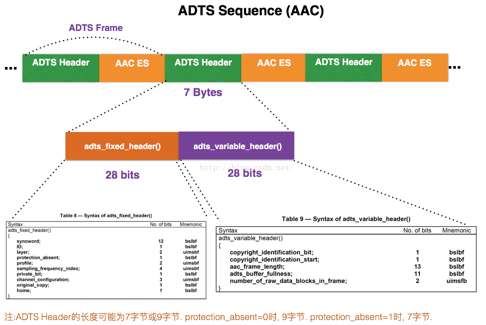
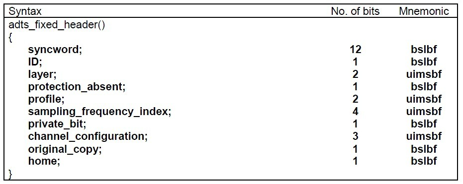
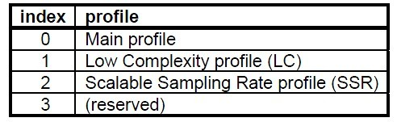
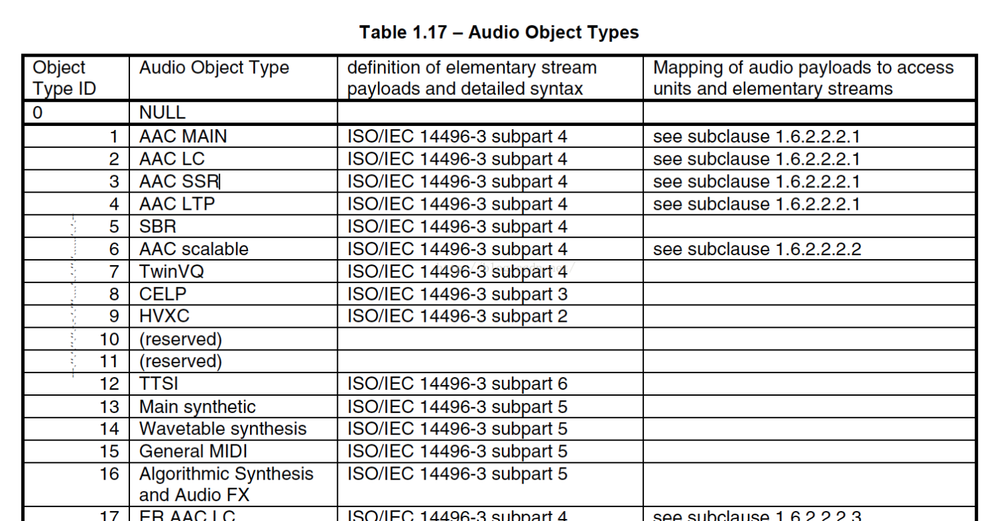
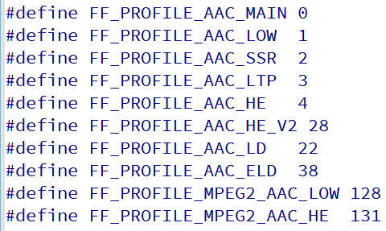
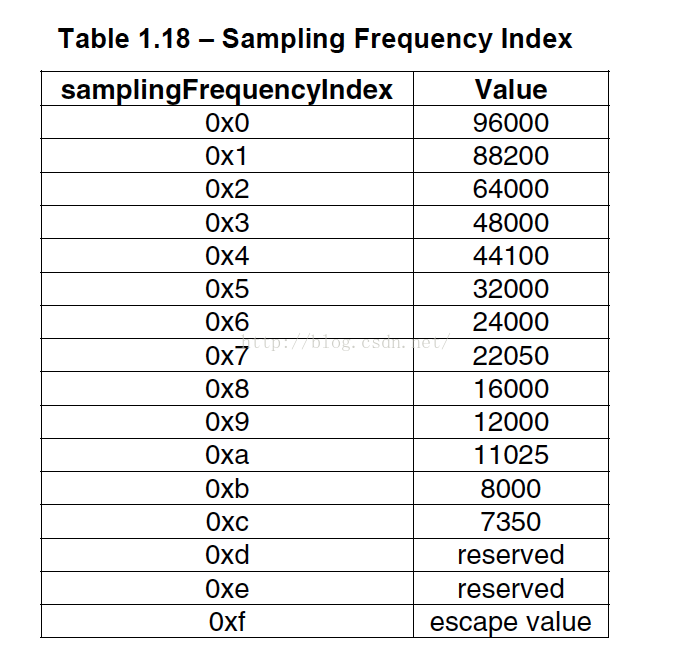
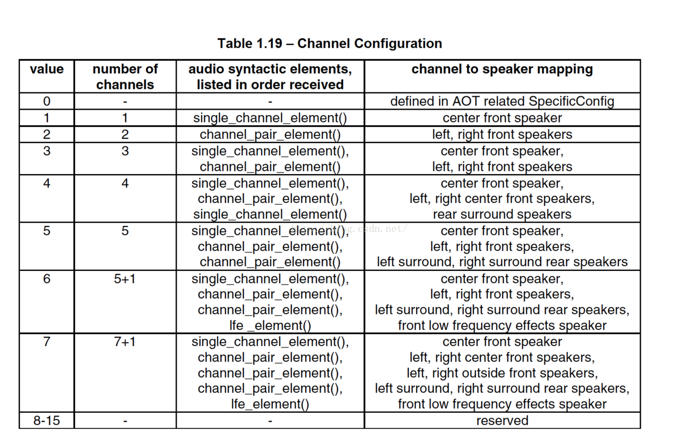
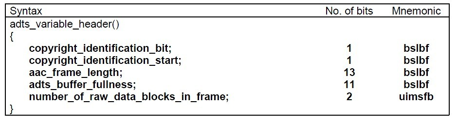
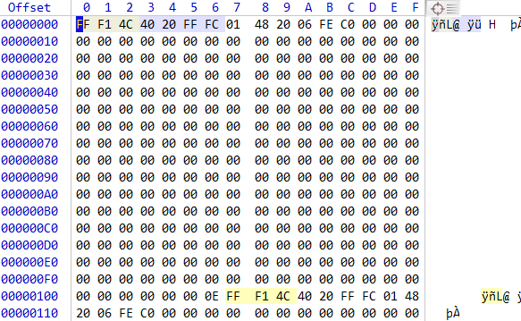

# 1.AAC⾳频格式介绍

**AAC⾳频格式** : Advanced Audio Coding(⾼级⾳频解码) , 是⼀种由 MPEG-4 标准定义的有损⾳频压缩格式 , 由Fraunhofer发展 ,Dolby, Sony 和 AT&T 是主要的贡献者  

**ADIF** : Audio Data Interchange Format ⾳频数据交换格式。这种格式的特征是可以确定的找到这个⾳频数据的开始 , 不需进⾏在音频数据流中间开始的解码 , 即它的解码必须在明确定义的开始处进⾏。故这种格式常⽤在磁盘⽂件中  

**ADTS** : 的全称是 Audio Data Transport Stream。是AAC⾳频的传输流格式。AAC⾳频格式在MPEG-2（ISO-13318-7 2003）中有定义。AAC后来⼜被采⽤到MPEG-4标准中。这种格式的特征是它是⼀个有同步字(syncword) 的比特流(bit stream) , 解码可以在这个流中任何位置开始。它的特征类似于mp3数据流格式  

## 1.1 `Audio Data Transport Stream`

简单说 , ADTS可以在 **$\color{red}{\mathbf{任意帧解码}}$** , **$\color{red}{\mathbf{也就是说它每⼀帧都有头信息}}$** 。ADIF只有⼀个统⼀的头 , 所以必须得到所有的数据后解码  

且这两种的header的格式也是不同的 , ⽬前⼀般编码后的和抽取出的都是ADTS格式的音频流。两者具体的组织结构如下所示 :

* AAC的ADIF格式⻅下图 : 

| header() | raw_data_strean() |
| -------- | ----------------- |

* AAC的ADTS的⼀般格式⻅下图 : 

| 前帧 | syncword | header() | error_check() | raw_data_block() | 后帧 |
| ---- | -------- | -------- | ------------- | ---------------- | ---- |

空⽩处表示前后帧

有的时候当你编码AAC裸流的时候 , 会遇到写出来的AAC⽂件并不能在PC和⼿机上播放 , 很⼤的可能就是AAC⽂件的每⼀帧⾥缺少了ADTS头信息⽂件的包装拼接  

只需要加⼊头⽂件ADTS即可。⼀个AAC原始数据块⻓度是可变的 , 对原始帧加上ADTS头进⾏ADTS的封装 , 就形成了ADTS帧。
AAC⾳频⽂件的每⼀帧由 **$\color{red}{\mathbf{ADTS \\\ Header}}$** 和 **$\color{red}{\mathbf{AAC \\\ Audio \\\ Data}}$** 组成。结构体如下 : 

 

每⼀帧的ADTS的头⽂件都包含了⾳频的采样率 , 声道 , 帧⻓度等信息 , 这样解码器才能解析读取

⼀般情况下ADTS的头信息都是7个字节 , 分为两部分 :

* `adts_fixed_header();  `
* `adts_variable_header();`

### 1.1.1 `adts_fixed_header()`

其⼀为固定头信息 , 紧接着是可变头信息。固定头信息中的数据每⼀帧都相同 , ⽽可变头信息则在帧与帧之间可变  

 

* `syncword` : 同步头总是0xFFF , all bits must be 1, 代表着⼀个ADTS帧的开始
* `ID` : MPEG标识符 , 0标识MPEG-4 , 1标识MPEG-2
* `Layer` : always : '00' 
* `protection_absent` : 表示是否误码校验。Warning , set to 1 if there is no CRC and 0 if there is CRC
* `profile` : 表示使⽤哪个级别的AAC , 如01 Low Complexity(LC) --- AAC LC。有些芯⽚只⽀持AAC LC
  * 在MPEG-2 AAC中定义了3种 : 
    *  
  * `profile` 的值等于 Audio Object Type 的值减1
  * `profile` = MPEG-4 Audio Object Type - 1
    *  
    *  

* `sampling_frequency_index` : 表示使⽤的采样率下标 , 通过这个下标在 Sampling ` Frequencies[]` 数组中查找得知采样率的值 
  *  
* `channel_configuration` : 表示声道数 , ⽐如2表示⽴体声双声道
  *  

>```tex
>0: Defined in AOT Specifc Config
>1: 1 channel: front-center
>2: 2 channels: front-left,front-right
>3: 3 channels: front-center,front-left,front-right
>4: 4 channels: front-center,front-left,front-right,back-center
>5: 5 channels: front-center,front-left,front-right,back-left,backright
>6: 6 channels: front-center,front-left,front-right,back-left,backright,LFE-channel
>7: 8 channels: front-center,front-left,front-right,side-left,side-right,back-left, back-right, LFE-channel
>8-15: Reserved
>```

### 1.1.2 `adts_variable_header()`

 

* frame_length : ⼀个ADTS帧的⻓度包括ADTS头和AAC原始流

  * ```tex
    frame length, this value must include 7 or 9 bytes of header length:
    
    aac_frame_length = (protection_absent == 1 ? 7 : 9) + size(AACFrame)
    
    protection_absent = 0 , header_length = 9 bytes
    protection_absent = 1 , header_length = 7 bytes
    ```

* adts_buffer_fullness : 0x7FF 说明是码率可变的码流

* number_of_raw_data_blocks_in_frame : 表示ADTS帧中有 number_of_raw_data_blocks_in_frame + 1个AAC原始帧

  * ```tex
    number_of_raw_data_blocks_in_frame == 0 表示说ADTS帧中有⼀个AAC数据块
    number_of_raw_data_blocks_in_frame == 1表示有两贞数据,依次类推
    一般情况下都是0
    ```

下⾯是ADTS的AAC⽂件部分 : 

高字节开始算

 

* 第⼀帧的帧头7个字节为 : `0xFF 0xF1 0x4C 0x40 0x20 0xFF 0xFC` 分析各个关键数值：
  * `syncword` (12bit) : 111111111111
  * `ID` (1bit) : 0
  * `layer` (2bit) : 00
  * `protection_absent` (1bit) : 1
  * `profile` (2bit) : 01
  * `sampling_frequency_index` (4bit) : 0011
  * `private_bit` (1bit) : 0
  * `channel_configuration` (3bit) : 001
  * `original_copy` (1bit) : 0
  * `home` (1bit) : 0
  * `copyright_identification_bit` (1bit) : 0
  * `copyright_identification_start` (1bit) : 0
  * `aac_frame_length` (13bit): 00001 00000111 (帧长度)
  * `adts_buffer_fullness` (11bit) : 11111111111
  * `number_of_raw_data_blocks_in_frame` (2bit) : 00
* 计算帧⻓度 : 将⼆进制 0000100000111 转换成⼗进制为263 , 观察第一帧的长度确实为263个字节
* 计算方法 : 帧⻓度为13位 , 使⽤ `unsigned int` 来存储帧⻓数值

> ```c++
> unsigned int getFrameLength(const unsigned char* str)
> {
>         if ( !str ) {
>            return 0;
>         }
>         unsigned int len = 0;
>         int f_bit = str[3];
>         int m_bit = str[4];
>         int b_bit = str[5];
>         len += (b_bit>>5);
>         len += (m_bit<<3);
>         len += ((f_bit & 3) << 11);
>         return len;
> }
> ```

# 2. 编程实验

[[代码参考链接]](/code/win/2-FFmpeg/03-extract-aac)

