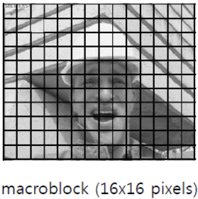
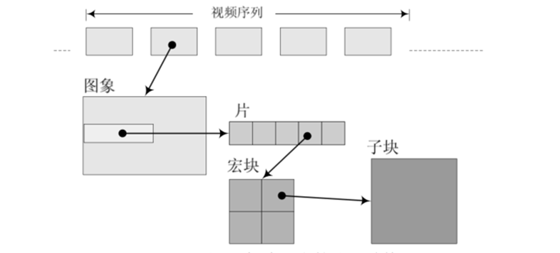
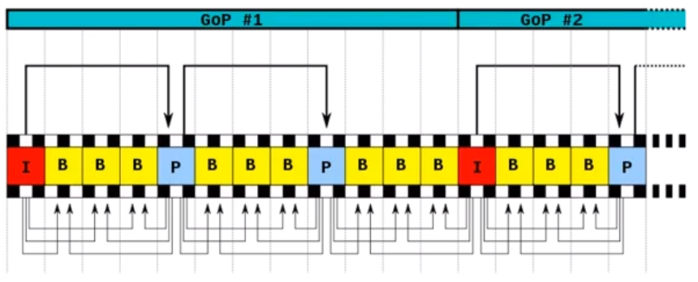
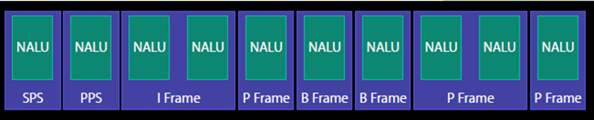
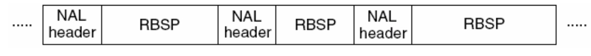
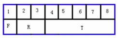

# 1. NALU (Network Abstract Layer Unit)

⾳视频编码在流媒体和⽹络领域占有重要地位 ; 流媒体编解码流程⼤致如下图所示 : 

 

# 2. H264简介

H.264从1999年开始 , 到2003年形成草案 , 最后在2007年定稿有待核实。在ITU的标准⾥称为H.264 , 在MPEG的标准⾥是MPEG-4的⼀个组成部分 MPEG-4 Part 10 , ⼜叫Advanced Video Codec , 因此常常称为MPEG-4 AVC或直接叫AVC  

# 3. H264 编解码解析  

阅读完H264/AVC 编解码器的介绍，脑海中仅仅是留下下面三条 : 

* H264并没有明白规定一个编解码器怎样实现 , 仅仅是规定了一个编码后的视频比特流的句法 , 和该比特流的解码方法 , 这个与MPEG 类似
* H264和曾经的标准 (如H261、H263、MPEG-1、MPEG-4) 的编解码器实现流程没有太大差别 , 基本的不同在于各功能块的细节
* H264就是利用实现的复杂性获得压缩性能的明显改善 (至于复杂度的评估，以后会介绍)

以下介绍一下H264的编码器框图 : 

 

> ```tex
> 编码器採用的仍是变换和预測的混合编码法。在图6.1中 , 输入的帧或场Fn以宏块为单位被编码器处理。首先 , 按帧内或者帧间预測编码的方法进行处理。假设採用帧间预測编码 , 其预測值PRED是由当前片中前面已编码的參考图像经运动补偿 (MC) 后得到 , 当中參考图像用 F’n-1表示。预測值PRED和当前块相减后 , 产生一个残差块Dn , 经块变换、量化后产生一组量化后的变换系数X ,再经熵编码 , 与解码所需的一些头信息一起组成压缩后的码流 , 经NAL(网络自适应层)供传输和存储用
> ```

H264的解码器框图 : 

 

> ```tex
> 在图6.2中,将编码器的NAL输出的H264比特流经熵解码得到量化后的一组变换系数X,再经反量化、反变换，得到残差D’n。利用从该比特流中解码出的头信息,解码器就产生一个预測块PRED,它和编码器中的原始PRED是同样的。当该解码器产生的PRED与残差D’n相加后,就得到了uF’n,再经滤波后,最后就得到滤波后的解码输出图像F’n
> ```

# 4. H264编码原理

在⾳视频传输过程中 , 视频⽂件的传输是⼀个极⼤的问题 ; ⼀段分辨率为1920 × 1080 , 每个像素点为RGB占⽤3个字节 , 帧率是25的视频 , 对于传输带宽的要求是 : 1920 ×1080 × 3 × 25 ÷ 1024 ÷ 1024 =148.315MB/s , 换成bps则意味着视频每秒带宽为
1186.523Mbps , 这样的速率对于⽹络存储是不可接受的。因此视频压缩和编码技术应运而生

对于视频⽂件来说 , 视频由单张图⽚帧所组成 , ⽐如每秒25帧 , 但是图⽚帧的像素块之间存在相似性 , 因此视频帧图像可以进⾏图像压缩 ; H264采⽤了16 ×16的分块⼤⼩对 , 视频帧图像进⾏相似⽐较和压缩编码 , 如下图所示 :

 

# 5. H264中的I帧、P帧和B帧

H26使⽤帧内压缩和帧间压缩的⽅式提⾼编码压缩率 ; H264采⽤了独特的I帧、P帧和B帧策略来实现 , 连续帧之间的压缩  

 

如上图所示 

| 帧的分类 | 中⽂                                                         | 意义                                                         |
| -------- | ------------------------------------------------------------ | ------------------------------------------------------------ |
| I帧      | 帧内编码帧 <br />intra picture                               | I 帧通常是每个 GOP（MPEG 所使⽤的⼀种视频压缩技术） 的第⼀个帧，经过适度地压缩，做为随机访问的参考点，可 以当成图象。I帧可以看成是⼀个图像经过压缩后的产物。 ⾃身可以通过视频解压算法解压成⼀张单独的完整的图⽚ |
| P帧      | 前向预测编码帧 <br />predictive-frame                        | 通过充分将低于图像序列中前⾯已编码帧的时间冗余信息来 压缩传输数据量的编码图像，也叫预测帧。 需要参考其前⾯的⼀个I frame 或者P frame来⽣成⼀张完整 的图⽚ |
| B帧      | 双向预测帧 <br />bi-directional interpolated prediction frame | 既考虑与源图像序列前⾯已编码帧，也顾及源图像序列后⾯ 已编码帧之间的时间冗余信息来压缩传输数据量的编码图像, 也叫双向预测帧。 则要参考其前⼀个I或者P帧及其后⾯的⼀个P帧来⽣成⼀张完 整的图⽚ |

压缩率 B > P > I  

# 6. H264编码结构解析

H264除了实现了对视频的压缩处理之外 , 为了⽅便⽹络传输 , 提供了对应的视频编码和分⽚策略；类似于⽹络数据封装成IP帧 , 在H264中将其称为组(GOP, group of pictures)、片(slice)、宏块(Macroblock) 这些⼀起组成了H264的码流分层结构 ; H264将其组织成为序列(GOP)、图⽚(pictrue)、⽚(Slice)、宏块(Macroblock)、⼦块(subblock)五个层次。GOP (图像组) 主要⽤作形容⼀个IDR帧 到下⼀个IDR帧之间的间隔了多少个帧  

 

H264将视频分为连续的帧进⾏传输 , 在连续的帧之间使⽤I帧、P帧和B帧。同时对于帧内⽽⾔ , 将图像分块为⽚、宏块和字块进⾏分⽚传输 ; 通过这个过程实现对视频⽂件的压缩包装  

IDR (Instantaneous Decoding Refresh , 即时解码刷新) ⼀个序列的第⼀个图像叫做 IDR 图像 (⽴即刷新图像) , IDR 图像都是 I 帧图像。I和IDR帧都使⽤帧内预测。I帧不⽤参考任何帧 , 但是之后的P帧和B帧是有可能参考这个I帧之前的帧的。IDR就不允许这样。⽐如(解码的顺序)  

* IDR1 P4 B2 B3 P7 B5 B6 I10 B8 B9 P13 B11 B12 P16 B14 B15 这⾥的B8可以跨过I10去参考P7原始图像： IDR1 B2 B3 P4 B5 B6 P7 B8 B9 I10
* IDR1 P4 B2 B3 P7 B5 B6 IDR8 P11 B9 B10 P14 B11 B12 这⾥的B9就只能参照IDR8和P11 , 不可以参考IDR8前⾯的帧

其核心作⽤是 , 是为了解码的重同步 , 当解码器解码到 IDR 图像时 , 立即将参考帧队列清空 , 将已解码的数据全部输出或抛弃 , 重新查找参数集 , 开始⼀个新的序列。这样 , 如果前⼀个序列出现重⼤错误 , 在这⾥可以获得重新同步的机会。IDR图像之后的图像永远不会使⽤IDR之前的图像的数据来解码

下⾯是⼀个H264码流的举例 (从码流的帧分析可以看出来B帧不能被当做参考帧)

   

I0 B40 B80 B120 P160
I0 B160  

# 7. NALU

 

SPS : 序列参数集 , SPS中保存了⼀组编码视频序列(Coded video sequence)的全局参数
PPS : 图像参数集 , 对应的是⼀个序列中某⼀幅图像或者某⼏幅图像的参数
I帧 : 帧内编码帧 , 可独⽴解码⽣成完整的图⽚
P帧 : 前向预测编码帧 , 需要参考其前⾯的⼀个I 或者B 来⽣成⼀张完整的图⽚
B帧 : 双向预测内插编码帧 , 则要参考其前⼀个I或者P帧及其后⾯的⼀个P帧来⽣成⼀张完整的图片

发I帧之前，⾄少要发⼀次SPS和PPS  

## 7.1 NALU结构

H.264原始码流(裸流)是由⼀个接⼀个NALU组成 , 它的功能分为两层 , VCL(视频编码层) 和 NAL(⽹络提取层) : 

* VCL : 包括核⼼压缩引擎和块 , 宏块和⽚的语法级别定义 , 设计⽬标是尽可能地独⽴于⽹络进⾏⾼效的编码
* NAL : 负责将VCL产⽣的⽐特字符串适配到各种各样的⽹络和多元环境中 , 覆盖了所有⽚级以上的语法级别

在VCL进⾏数据传输或存储之前 , 这些编码的VCL数据 , 被映射或封装进NAL单元(NALU)

> ```tex
> ⼀个NALU = ⼀组对应于视频编码的NALU头部信息 + ⼀个原始字节序列负荷(RBSP,RawByte Sequence Payload).
> ```

NALU结构单元的主体结构如下所示 ; ⼀个原始的H.264 NALU单元通常由 [StartCode] [NALUHeader] [NALU Payload]三部分组成 , 其中 Start Code ⽤于标示这是⼀个NALU 单元的开始 ,必须是 "00 00 00 01" 或 "00 00 01" , 除此之外基本相当于⼀个NAL header + RBSP

 

> ```tex
> 对于FFmpeg解复⽤后,MP4⽂件读取出来的packet是不带startcode,但TS⽂件读取出来的packet带了startcode  
> ```

## 7.2 解析NALU

每个NAL单元是⼀个⼀定语法元素的可变⻓字节字符串 , 包括包含⼀个字节的头信息 (⽤来表示数据类型) , 以及若⼲整数字节的负荷数据 

NALU头信息(⼀个字节) :

  

其中 : 

* T为负荷数据类型 , 占5bit 
  * nal_unit_type : 这个NALU单元的类型 , 1～12 由H.264使用 , 24～31由H.264以外的应⽤使用
* R为重要性指示位 , 占2个bit 
  * nal_ref_idc. : 取00~11 , 似乎指示这个NALU的重要性,如00的NALU解码器可以丢弃它⽽不影响图像的回放 , 0～3 , 取值越大 , 表示当前NAL越重要 , 需要优先受到保护。如果当前NAL是属于参考帧的⽚ , 或是序列参数集 , 或是图像参数集这些重要的单位时 , 本句法元素必需⼤于0
* 最后的F为禁⽌位 , 占1bit
  * forbidden_zero_bit : 在 H.264 规范中规定了这⼀位必须为 0.

H.264标准指出 , 当数据流是储存在介质上时 , 在每个NALU 前添加起始码 : 0x000001 或 0x00000001 , ⽤来指示⼀个NALU 的起始和终⽌位置 : 

* 在这样的机制下 , 在码流中检测起始码 , 作为⼀个NALU得起始标识 , 当检测到下⼀个起始码时 , 当前NALU结束。
* 3字节的0x000001只有⼀种场合下使⽤ , 就是⼀个完整的帧被编为多个slice（⽚）的时候 , 包含这些slice的NALU 使⽤3字节起始码。其余场合都是4字节0x00000001的

例子 : 

> ```c++
> 0x00 00 00 01 67 …
> 0x00 00 00 01 68 …
> 解析NALU8
> 0x00 00 00 01 65 …
> 67:
> ⼆进制:0110 0111
> 00111 = 7（⼗进制）
> ```

| nal_unit_type | NAL 单元和 RBSP 语法结构的内容                               |
| ------------- | ------------------------------------------------------------ |
| 0             | 未指定                                                       |
| 1             | ⼀个⾮IDR图像的编码条带 <br />slice_layer_without_partitioning_rbsp () |
| 2             | 编码条带数据分割块A <br />slice_data_partition_a_layer_rbsp() |
| 3             | 编码条带数据分割块B <br />slice_data_partition_b_layer_rbsp() |
| 4             | 编码条带数据分割块C <br />slice_data_partition_c_layer_rbsp() |
| 5             | IDR图像的编码条带(片) <br />slice_layer_without_partitioning_rbsp () |
| 6             | 辅助增强信息(SEI) <br />sei_rbsp()                           |
| 7             | 序列参数集 <br />seq_parameter_set_rbsp()                    |
| 8             | 图像参数集 <br />pic_parameter_set_rbsp()                    |
| 9             | 访问单元分隔符 <br />access_unit_delimiter_rbsp()            |
| 10            | 序列结尾 <br />end_of_seq_rbsp()                             |
| 11            | 流结尾 <br />end_of_stream_rbsp()                            |
| 12            | 填充数据 <br />filler_data_rbsp()                            |
| 13            | 序列参数集扩展<br />seq_parameter_set_extension_rbsp()       |
| 14...18       | 保留                                                         |
| 19            | 未分割的辅助编码图像的编码条带 <br />slice_layer_without_partitioning_rbsp( ) |
| 20..23        | 保留                                                         |
| 24...31       | 未指定                                                       |

> ```tex
> 对于NALU分析这节课主要关注5/6/7/8 四种类型
> ```

# 8. H264 annexb模式

H264有两种封装

* ⼀种是annexb模式 , 传统模式 , 有startcode , SPS和PPS是在ES中
* ⼀种是mp4模式 , ⼀般mp4 mkv都是mp4模式，没有startcode，SPS和PPS以及其它信息被封装在container中 , 每⼀个frame前⾯4个字节是这个frame的⻓度  

很多解码器只⽀持annexb这种模式 , 因此需要将mp4做转换 : 在ffmpeg中⽤ h264_mp4toannexb_filter可以做转换 

实现 : 

> ```c++
> const AVBitStreamFilter *bsfilter = av_bsf_get_by_name("h264_mp4toannexb");
> 
> AVBSFContext *bsf_ctx = NULL;
> 
> // 2 初始化过滤器上下⽂
> av_bsf_alloc(bsfilter, &bsf_ctx); //AVBSFContext;
> // 3 添加解码器属性
> avcodec_parameters_copy(bsf_ctx->par_in, ifmt_ctx->streams[videoindex]->codecpar);
> 
> av_bsf_init(bsf_ctx);
> 
> ```

# 9. 补充讲解

## GOP group of pictures

GOP 指的就是两个I帧之间的间隔. ⽐较说GOP为120,如果是720 p60 的话,那就是2s⼀次I帧
在视频编码序列中 , 主要有三种编码帧：I帧、P帧、B帧，如下所示：

* I帧即Intra-coded picture (帧内编码图像帧) , 不参考其他图像帧 , 只利⽤本帧的信息进行编码
* P帧即Predictive-codedPicture (预测编码图像帧) ,利⽤之前的I帧或P帧，采⽤运动预测的⽅式进⾏帧间预测编码
* B帧即Bidirectionallypredicted picture (双向预测编码图像帧) 提供最⾼的压缩比,它既需要之前的图像帧 (I帧或P帧) , 也需要后来的图像帧 (P帧) , 采⽤运动预测的⽅式进⾏帧间双向预测编码

在视频编码序列中 , GOP即Group of picture (图像组) , 指两个I帧之间的距离 , Reference(参考周期) 指两个P帧之间的距离。⼀个I帧所占⽤的字节数⼤于⼀个P帧 , ⼀个P帧所占⽤的字节数⼤于⼀个B帧  

所以在码率不变的前提下 , GOP值越大 , P、B帧的数量会越多 , 平均每个I、P、B帧所占⽤的字节数就越多 , 也就更容易获取较好的图像质量;Reference越大 , B帧的数量越多 , 同理也更容易获得较好的图像质量  