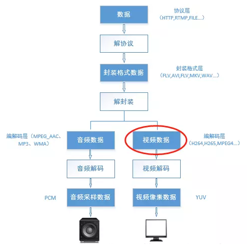
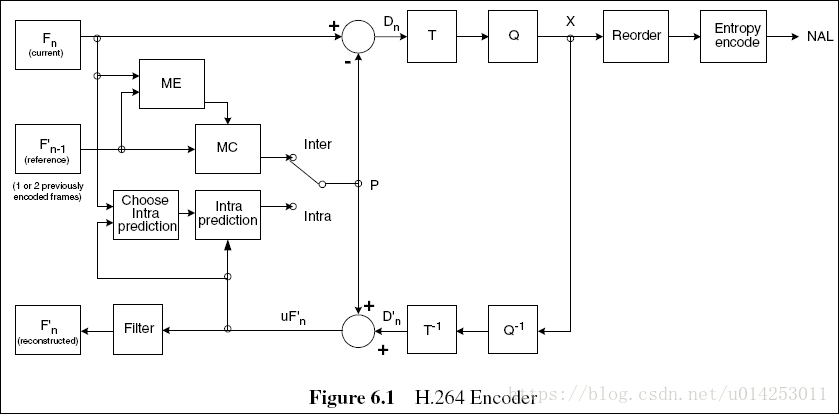
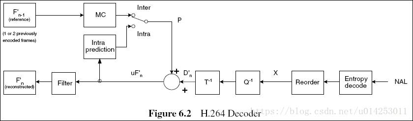

# 1. NALU (Network Abstract Layer Unit)

⾳视频编码在流媒体和⽹络领域占有重要地位 ; 流媒体编解码流程⼤致如下图所示 : 

 

# 2. H264简介

H.264从1999年开始 , 到2003年形成草案 , 最后在2007年定稿有待核实。在ITU的标准⾥称为H.264 , 在MPEG的标准⾥是MPEG-4的⼀个组成部分 MPEG-4 Part 10 , ⼜叫Advanced Video Codec , 因此常常称为MPEG-4 AVC或直接叫AVC  

# 3. H264 编解码解析  

阅读完H264/AVC 编解码器的介绍，脑海中仅仅是留下下面三条 : 

* H264并没有明白规定一个编解码器怎样实现 , 仅仅是规定了一个编码后的视频比特流的句法 , 和该比特流的解码方法 , 这个与MPEG 类似
* H264和曾经的标准 (如H261、H263、MPEG-1、MPEG-4) 的编解码器实现流程没有太大差别 , 基本的不同在于各功能块的细节
* H264就是利用实现的复杂性获得压缩性能的明显改善 (至于复杂度的评估，以后会介绍)

以下介绍一下H264的编码器框图 : 

 

> ```tex
> 编码器採用的仍是变换和预測的混合编码法。在图6.1中 , 输入的帧或场Fn以宏块为单位被编码器处理。首先 , 按帧内或者帧间预測编码的方法进行处理。假设採用帧间预測编码 , 其预測值PRED是由当前片中前面已编码的參考图像经运动补偿 (MC) 后得到 , 当中參考图像用 F’n-1表示。预測值PRED和当前块相减后 , 产生一个残差块Dn , 经块变换、量化后产生一组量化后的变换系数X ,再经熵编码 , 与解码所需的一些头信息一起组成压缩后的码流 , 经NAL(网络自适应层)供传输和存储用
> ```

H264的解码器框图 : 

 

> ```tex
> 在图6.2中,将编码器的NAL输出的H264比特流经熵解码得到量化后的一组变换系数X,再经反量化、反变换，得到残差D’n。利用从该比特流中解码出的头信息,解码器就产生一个预測块PRED,它和编码器中的原始PRED是同样的。当该解码器产生的PRED与残差D’n相加后,就得到了uF’n,再经滤波后,最后就得到滤波后的解码输出图像F’n
> ```


