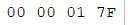

# 1. FLV封装格式介绍

FLV (Flash Video) 是Adobe公司推出的⼀种流媒体格式 , 由于其封装后的音视频文件体积小、封装简单等特点 , 非常适合于互联网上使用。目前主流的视频⽹站基本都支持FLV。采用FLV格式封装的文件后缀为 `.flv`  

# 2. FLV封装格式的组成

FLV封装格式是由一个 **头文件**  **$\color{red}{\mathbf{(file\\\ header)}}$** 和 文件体 **$\color{red}{\mathbf{(file\\\ Body)}}$** 组成。其中 , FLV body由 **⼀对对** 的 (Previous Tag Size字段 + tag) 组成。Previous Tag Size字段排列在Tag之前 , 占用4个字节。Previous Tag Size 记录了前⾯⼀个Tag的⼤⼩ , ⽤于逆向读取处理。FLV header后的第⼀个Pervious Tag Size的值为0 

Tag⼀般可以分为3种类型 : **脚本(帧)数据类型、音频数据类型、视频数据。FLV数据以 $\color{red}{大端序}$** 进行存储 , 在解析时需要注意。

⼀个标准FLV文件结构如下图 : 

 

FLV文件的详细内容结构如下图 : 

 

# 3. 大体的解析框架

 

# 4. `FLV header`

> ```tex
> 注:在下⾯的数据type中,UI表示⽆符号整形,后⾯跟的数字表示其⻓度是多少位。⽐如UI8,表示⽆符号整形,⻓度⼀个字节。UI24是三个字节,UI[8*n]表示多个字节。UB表示位域,UB5表示⼀个字节的5位。可以参考C语言中的位域结构体。
> FLV头占9个字节,⽤来标识⽂件为FLV类型,以及后续存储的⾳视频流
> ⼀个FLV⽂件,每种类型的tag都属于⼀个流,也就是⼀个flv⽂件最多只有⼀个⾳频流,⼀个视频流,不存在多个独⽴的⾳视频流在⼀个⽂件的情况
> 00000 1 0 1
> ```

FLV头的结构如下 : 

| Field      | Type | Comment                                                      |
| ---------- | ---- | ------------------------------------------------------------ |
| 签名       | UI8  | 'F'(0x46)                                                    |
| 签名       | UI8  | 'L'(0x4C)                                                    |
| 签名       | UI8  | 'V'(0x56)                                                    |
| 版本       | UI8  | FLV的版本。0x01表示FLV版本为1                                |
| 保留字段   | UB5  | 前五位都为0                                                  |
| ⾳频流标识 | UB1  | 是否存在音频流                                               |
| 保留字段   | UB1  | 为0                                                          |
| 视频流标识 | UB1  | 是否存在视频流                                               |
| 文件头大小 | UI32 | FLV版本1时填写9 , 表明的是FLV头的大小 , 为后期的 FLV版本扩展使用。包括这四个字节。数据的起始位置就是从⽂件开头偏移这么多的大小 |

# 5. `FLV Body`

FLV Header之后 , 就是FLV File Body。FLV File Body是由⼀连串的Back-pointers + tags构成。Back-pointer表示 **$\color{SkyBlue}{\mathbf{Previous\\\ Tag\\\ Size}}$** ( **$\color{red}{前⼀个\mathbf{tag}}$** 的字节数据长度) , 占 **$\color{red}{\mathbf{4个字节}}$**  

 **$\color{red}{\mathbf{计算出大小 383(dec) = 0x0000017F (hex)}}$**

 

# 6. FLV Tag

每⼀个Tag也是由两部分组成 : **tag header** 和 **tag data** , Tag Header里存放的是当前tag的类型、数据区(tag data)的长度等信息 

## 6.1 tag header

tag header⼀般占11个字节的内存空间。FLV tag结构如下 : 

| Field                              | Type                                | Comment                                                      |
| ---------------------------------- | ----------------------------------- | ------------------------------------------------------------ |
| Tag类型 Type                       | UI8                                 | 8 : audeo 9 : video 18 : Script data(脚本数据) all Others:reserved 其他所有值未使⽤ |
| 数据区⼤⼩                         | UI24                                | 当前tag的数据域的大小 , 不包含tag header。 Length of the data in the Data field |
| 时间戳Timestamp                    | UI24                                | 当前帧时戳 , 单位是毫秒。相对值 , 第⼀个tag的时戳总是为0     |
| 时戳扩展字段 TimestampExtend ed    | **$\color{red}{\mathbf{UI8}}$**     | 如果时戳⼤于0xFFFFFF , 将会使用这个字节。这个字节是时戳的高8位 , 上面的三个字节是低24位 |
| StreamID                           | UI24                                | 总是为0                                                      |
| **$\color{red}{\mathbf{数据域}}$** | **$\color{red}{\mathbf{UI[8*n]}}$** | **$\color{red}{\mathbf{数据域数据}}$**                       |

> ```tex
> 注意:
> 1.flv⽂件中Timestamp和TimestampExtended拼出来的是dts。也就是解码时间Timestamp和TimestampExtended拼出来dts单位为ms(如果不存在B帧,当然dts等于pts)
> 
> 2.CompositionTime表示PTS相对于DTS的偏移值,在每个视频tag的第14~16字节,
> 显示时间(pts) = 解码时间(tag的第5~8字节) + CompositionTime 
> CompositionTime的单位也是ms
> ```

