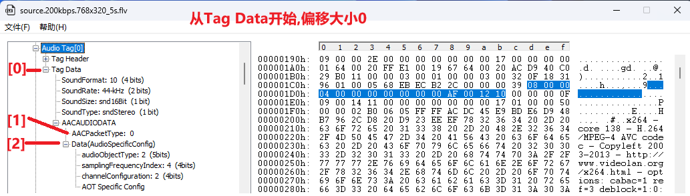
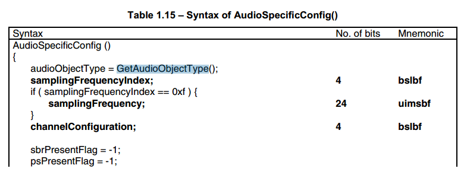
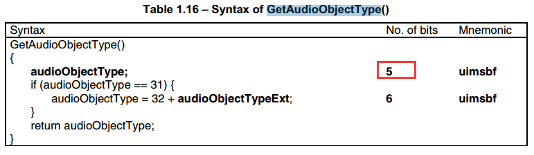
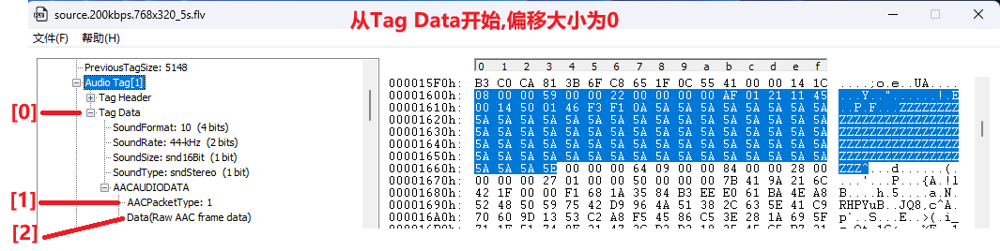
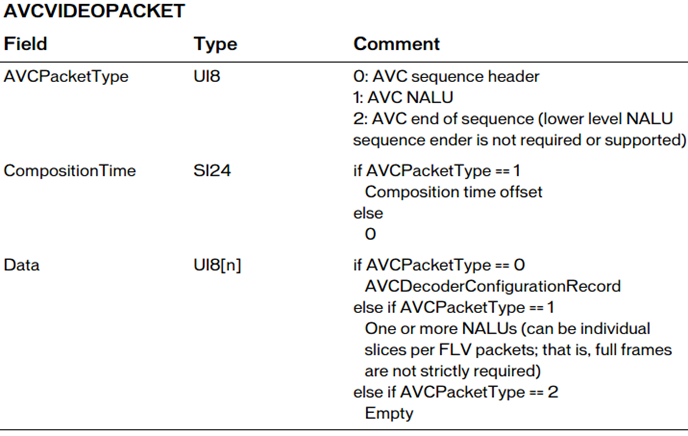
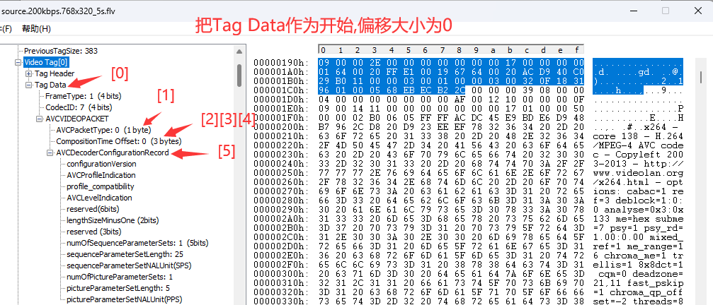
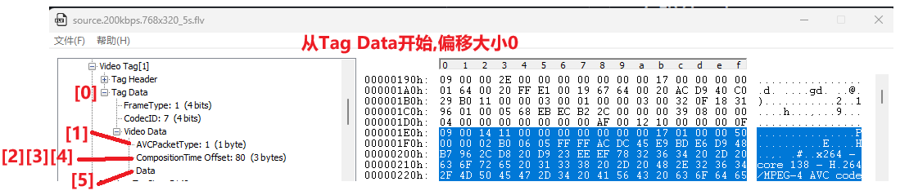

# 1. FLV封装格式介绍

FLV (Flash Video) 是Adobe公司推出的⼀种流媒体格式 , 由于其封装后的音视频文件体积小、封装简单等特点 , 非常适合于互联网上使用。目前主流的视频⽹站基本都支持FLV。采用FLV格式封装的文件后缀为 `.flv`  

# 2. FLV封装格式的组成

FLV封装格式是由一个 **头文件**  **$\color{red}{\mathbf{(file\ header)}}$** 和 文件体 **$\color{red}{\mathbf{(file\ Body)}}$** 组成。其中 , FLV body由 **⼀对对** 的 (Previous Tag Size字段 + tag) 组成。Previous Tag Size字段排列在Tag之前 , 占用4个字节。Previous Tag Size 记录了前⾯⼀个Tag的⼤⼩ , ⽤于逆向读取处理。FLV header后的第⼀个Pervious Tag Size的值为0 

Tag⼀般可以分为3种类型 : **脚本(帧)数据类型、音频数据类型、视频数据。FLV数据以 $\color{red}{大端序}$** 进行存储 , 在解析时需要注意。

⼀个标准FLV文件结构如下图 : 

 

FLV文件的详细内容结构如下图 : 

 

# 3. 大体的解析框架

 

# 4. `FLV header`

> ```tex
> 注:
> 在下⾯的数据type中,UI表示⽆符号整形,后⾯跟的数字表示其⻓度是多少位。⽐如UI8,表示⽆符号整形,⻓度⼀个字节。UI24是三个字节,UI[8*n]表示多个字节。UB表示位域,UB5表示⼀个字节的5位。可以参考C语言中的位域结构体。
> FLV头占9个字节,⽤来标识⽂件为FLV类型,以及后续存储的⾳视频流
> ⼀个FLV⽂件,每种类型的tag都属于⼀个流,也就是⼀个flv⽂件最多只有⼀个⾳频流,⼀个视频流,不存在多个独⽴的⾳视频流在⼀个⽂件的情况
> 00000 1 0 1
> ```

FLV头的结构如下 : 

| Field      | Type  | Comment                                                      |
| ---------- | ----- | ------------------------------------------------------------ |
| 签名       | UI8   | 'F'(0x46)                                                    |
| 签名       | UI8   | 'L'(0x4C)                                                    |
| 签名       | UI8   | 'V'(0x56)                                                    |
| 版本       | UI8   | FLV的版本。0x01表示FLV版本为1                                |
| 保留字段   | UB[5] | 前五位都为0                                                  |
| ⾳频流标识 | UB[1] | 是否存在音频流                                               |
| 保留字段   | UB[1] | 为0                                                          |
| 视频流标识 | UB[1] | 是否存在视频流                                               |
| 文件头大小 | UI32  | FLV版本1时填写9 , 表明的是FLV头的大小 , 为后期的 FLV版本扩展使用。包括这四个字节。数据的起始位置就是从⽂件开头偏移这么多的大小 |
|            |       |                                                              |

# 5. `FLV Body`

FLV Header之后 , 就是FLV File Body。FLV File Body是由⼀连串的Back-pointers + tags构成。Back-pointer表示 **$\color{SkyBlue}{\mathbf{Previous\\\ Tag\\\ Size}}$** ( **$\color{red}{前⼀个\mathbf{tag}}$** 的字节数据长度) , 占 **$\color{red}{\mathbf{4个字节}}$​**  

 

  **$\color{red}{\mathbf{计算出大小 383(dec) = 0x0000017F (hex)}}$**

 

# 6. FLV Tag

每⼀个Tag也是由两部分组成 : **tag header** 和 **tag data** , Tag Header里存放的是当前tag的类型、数据区(tag data)的长度等信息 

## 6.1 tag header

tag header⼀般占11个字节的内存空间。FLV tag结构如下 : 

| Field                              | Type                                | Comment                                                      |
| ---------------------------------- | ----------------------------------- | ------------------------------------------------------------ |
| Tag类型 Type                       | UI8                                 | 8 : audeo 9 : video 18 : Script data(脚本数据) all Others:reserved 其他所有值未使⽤ |
| 数据区大小                         | UI24                                | 当前tag的数据域的大小 , 不包含tag header。 Length of the data in the Data field |
| 时间戳Timestamp                    | UI24                                | 当前帧时戳 , 单位是毫秒。相对值 , 第⼀个tag的时戳总是为0     |
| 时戳扩展字段 TimestampExtended     | **$\color{red}{\mathbf{UI8}}$**     | 如果时戳⼤于0xFFFFFF , 将会使用这个字节。这个字节是时戳的高8位 , 上面的三个字节是低24位 例如 0x 01(TimestampExtended) FF FF FF |
| StreamID                           | UI24                                | 总是为0                                                      |
| **$\color{red}{\mathbf{数据域}}$** | **$\color{red}{\mathbf{UI[8*n]}}$** | **$\color{red}{\mathbf{数据域数据}}$**                       |
|                                    |                                     |                                                              |

> ```tex
> 注意:
> 1.flv⽂件中Timestamp和TimestampExtended拼出来的是dts。也就是解码时间Timestamp和TimestampExtended拼出来dts单位为ms(如果不存在B帧,当然dts等于pts)
> 
> 2.CompositionTime表示PTS相对于DTS的偏移值,在每个视频tag的第14~16字节,
> 显示时间(pts) = 解码时间(tag的第5~8字节) + CompositionTime 
> CompositionTime的单位也是ms
> ```

**Script data** 脚本数据就是描述视频或音频的信息的数据 , 如宽度、高度、时间等等 , ⼀个⽂件中通常只有⼀个元数据 , 音频tag和视频tag就是音视频信息了 , 采样、声道、频率 , 编码等信息

# 7. Script Tag Data结构 (脚本类型、帧类型)

该类型Tag又被称为 **MetaData Tag** ,存放⼀些关于FLV视频和音频的元信息，⽐如：duration、width、height等。通常该类型Tag会作为FLV文件的第⼀个tag，**$\color{red}{并且只有⼀个}$**，跟在File Header后。该类型TagDaTa的结构如下所示 : 

 

 

* **第⼀个AMF包** : 第1个字节表示AMF包类型 , ⼀般总是0x02 , 表示字符串。第2-3个字节为UI16类型值，标识字符串的长度 , ⼀般总是0x000A("onMetaData" 长度)。后⾯字节为具体的字符串，一般总为"onMetaData" (6F,6E,4D,65,74,61,44,61,74,61)  
* **第⼆个AMF包** : 第1个字节表示AMF包类型 , ⼀般总是0x08 , 表示数组。第2-5个字节为UI32类型值 , 表示数组元素的个数。后面即为各数组元素的封装 , 数组元素为元素名称和值组成的对。常见的数组元素如下表所示 : 

| 值                | Comment        | 例如             |
| ----------------- | -------------- | ---------------- |
| duration          | 时长(秒)       | 210.732          |
| width             | 视频宽度       | 768.000          |
| height            | 视频⾼度       | 320.000          |
| videodatarate     | 视频码率       | 207.260          |
| framerate         | 视频帧率       | 25.000           |
| videocodecid      | 视频编码ID     | 7.000 (H264为7)  |
| audiodatarate     | 音频码率       | 29.329           |
| audiosamplerate   | 音频采样率     | 44100.000        |
| audiosamplesize   | 音频采样大小   | 16.0000          |
| stereo            | 是否立体声     | 1                |
| audiocodecid      | 音频编码ID     | 10.000 (AAC为10) |
| major_brand       | 格式规范相关   | isom             |
| minor_version     | 格式规范相关   | 512              |
| compatible_brands | 格式规范相关   | isomiso2avc1mp41 |
| encoder           | 封装工具名称   | Lavf54.63.104    |
| filesize          | 文件大小(字节) | 6636853.000      |
|                   |                |                  |

> 注 : Lavf54.63.104 即是 Libavformat version 54.63.104. 即是ffmpeg对于库的版本

 

 

# 8. Audio Tag Data结构 (音频类型)

音频Tag Data区域开始的 : 

* 第一个字节包含了音频数据的参数信息
* 第二个字节开始为音频流数据

**$\color{red}{\mathbf{(这两个字节属于tag的data部分,不是header部分)}}$**

## 8.1 第一个字节为音频的信息 

仔细看spec发现对于AAC而言 , 比较有用的字段是SoundFormat , 格式如下 : 

| Field                | Type  | Comment                                                      |
| -------------------- | ----- | ------------------------------------------------------------ |
| ⾳频格式 SoundFormat | UB[4] | 0 = Linear PCM, platform endian <br />1 =ADPCM <br />2 = MP3 <br />3 = Linear PCM, little endian <br />4 = Nellymoser 16-kHz mono <br />5 = Nellymoser 8-kHz mono <br />6 = Nellymoser <br />7 = G.711 A-law logarithmic PCM <br />8 = G.711 mu-law logarithmic PCM <br />9 = reserved <br />10 = AAC<br />11 = Speex <br />14 = MP3 8-Khz <br />15 = Device-specific sound |
| 采样率 SoundRate     | UB[2] | **$\color{red}{\mathbf{0 = 5.5\\\ kHz}}$** <br/>**$\color{red}{\mathbf{1 = 11\\\ kHz}}$** <br/>**$\color{red}{\mathbf{2 = 22.05\\\ kHz}}$** <br/>**$\color{red}{\mathbf{3 = 44.1\\\ kHz}}$** <br/>对于AAC总是3。但实际上AAC是可以支持到48khz以上的频率(这个参数对于AAC意义不大) |
| 采样精度 SoundSize   | UB[1] | 0 = snd8Bit <br />1 = snd16Bit <br />此参数仅适用于未压缩的格式 , 压缩后的格式都是将其设为1 |
| ⾳频声道 SoundType   | UB[1] | 0 = sndMono 单声道 <br />1 = sndStereo ⽴体声 , 双声道 <br />对于AAC总是1 |
|                      |       |                                                              |

> ```tex
> If the SoundFormat indicates AAC, the SoundType should be set to 1 (stereo) and the SoundRate should be set to 3 (44 kHz). However, this does not mean that AAC audio in FLV is always stereo, 44 kHz data. Instead, the Flash Player ignores these values and extracts the channel and sample rate data is encoded in the AAC bitstream.
> 
> 大致翻译
> 如果SoundFormat明确为AAC,那么SoundType应该设置为1(立体声),SoundRate应该设置为3(44 kHz)。
> 然而,这并不意味着FLV中的AAC音频总是立体声,44 kHz的数据。
> 相反,Flash播放器会忽略这些值,并提取AAC比特流中编码的通道和采样率数据
> ```

 

## 8.2 第二个字节开始为音频数据

**$\mathbf{\color{red}{需要判断该数据是真正的音频数据,还是音频config信息}}$**

| Field                     | Type                                                         | Comment |
| ------------------------- | ------------------------------------------------------------ | ------- |
| 音频数据<br />(SoundData) | if SoundFormat == 10 (AAC类型) AACAUDIODATA <br />else Sound data — varies by format |         |
|                           |                                                              |         |

 

> ```tex
> The AudioSpecificConfig is explained in ISO 14496-3. AAC sequence header存放的是AudioSpecificConfig结构,该结构则在“ISO-14496-3 Audio”中描述。
> 《完整版ISO-14496-3(2009-09).pdf📎 完整版ISO-14496-3(2009-09).pdf》
> ```

> ```tex
> 此处AAC frame data不带ADTS header
> 如果是AAC数据,如果他是AAC RAW,tag data[2]开始才是真正的AAC frame data
> AudioSpecificConfig的也是从tag data[2]开始才是真正的Config信息
> ```

## 8.3 AudioSpecificConfig

  

 

 

## 8.4 Raw AAC frame data

  

# 9. Video Tag Data结构(视频类型)

视频Tag Data开始的 : 第一个字节包含视频数据的参数信息 , 第二个字节开始为视频流数据

## 9.1 第一个字节包含视频参数信息

格式如下 : 

| Field  | Type | Comment                                                      |
| ------ | ---- | ------------------------------------------------------------ |
| 帧类型 | UB4  | **$\color{red}{\mathbf{1:keyframe (for\ AVC, a\ seekable\ frame)\ ——\ h264的IDR   \ ,\ 关键帧}}$** <br />**$\color{red}{\mathbf{2: inter\ frame (for\ AVC,\ a\ non-\ seekable\ frame)\ ——\ h264的普通帧}}$** <br />3: disposable inter frame (H.263 only) <br />4: generated keyframe (reserved for server use only) <br />5: video info/command frame |
| 编码ID | UB4  | 使用哪种编码类型 : <br />1: JPEG (currently unused) <br />2: Sorenson H.263 <br />3: Screen video <br />4: On2 VP6 <br />5: On2 VP6 with alpha channel <br />6: Screen video version 2 <br />7: AVC |

## 9.2 第二个字节开始为视频数据

| Field    | Type    | Comment                                                      |
| -------- | ------- | ------------------------------------------------------------ |
| 视频数据 | UI[8*n] | If CodecID == 2 H263VIDEOPACKET <br />If CodecID == 3 SCREENVIDEOPACKET <br />If CodecID == 4 VP6FLVVIDEOPACKET <br />If CodecID == 5 VP6FLVALPHAVIDEOPACKET <br />If CodecID == 6 SCREENV2VIDEOPACKET <br />if CodecID == 7 (AVC格式) AVCVIDEOPACKET |

 

(1) CompositionTime单位毫秒(ms)

> ```tex
> CompositionTime每个视频tag(整个tag)的第14 ~ 16字节(如果是tag data偏移,位置索引[2]~[4],
> [0:FrameType + CodecID],[1:AVCPackettype]) 表示PTS相对于DTS的偏移值
> 
> 显示时间 = 解码时间(tag的5~8字节,位置索引[4]~[7]) + CompositionTime
> 
> ```

(2) AVCDecoderConfigurationRecord

> ```tex
> AVC sequence header就是AVCDecoderConfigurationRecord结构,该结构在标准⽂
> 档“ISO-14496-15 AVC file format”中有详细说明
> ```

## 9.3 AVCDecoderConfigurationRecord

 

## 9.4 AVC NALU

 

# 10.FLV时间戳计算

> ```
> 题记:时间戳将每⼀秒分成90000份,即将每⼀毫秒分成90份在flv中直接存储的都是毫秒级在TS存储的是时间戳级
> 其中TS、flv⼀般按照编码顺序排列
> ⼀个视频tag⼀般只包含⼀帧视频的码流
> 其中视频tag的时间戳对应的是解码时间戳(DTS/90)
> 当前序列:
> 编码顺序 I P P B B B......
> 对应帧号 0 1 5 3 2 4.......
> flv对每⼀个tag都规定了它将要播放的时间戳
> 每个时间戳都可以对应转换特性的时间
> 其中script(脚本)、video(视频)、audio(音频)的第⼀个tag的时间戳值都为0
> 时间戳占4个字节,其中第四个字节是⾼位前三个字节是低位(每个tag的5~8字节)
> 如0x6E 0x8D 0xA8 0x01 = 0x016E8DA8 = 24022440
> 
> dec(十进制)
> 
> CompositionTime 每个视频tag的第14 ~ 16字节(表示PTS相对于DTS的偏移值)
> CompositionTime 单位为ms 显示时间 = 解码时间(tag的第5~8字节,位置索引[4]~[7]) + CompositionTime
> 例如(注意显示时间最后⼀个字节是⾼位)
> 
> tag0(script): 时间戳为0
> 
> tag1(video): 第⼀个视频时间戳值为0 无CompositionTime(头信息)
> 
> tag2(audio): 第⼀个⾳频时间戳值为0
> 
> tag3(video): 
> Timestamp: 0x 00(TimestampExtended) 00 00 00 dec:0 00:00:00:00 (dts) 
> CompositionTime：0x 00 00 50 dec:80 00:00:00:80 
> I帧 pts : 00:00:00:80 poc=0
> 
> tag4(video): 
> Timestamp: 0x 00 00 00 28  dec:40 00:00:00:40 (dts)
> CompositionTime:0x 00 00 50 dec:80 00:00:00:80
> P帧 pts : 00:00:00:120(40+80) poc=1
> 
> tag5(video): 
> Timestamp: 0x00 00 00 50 dec:80 00:00:00:80 (dts) 
> CompositionTime:0x 00 00 C8 dec:200 00:00:00:200 
> P帧 pts：00:00:00:280(80+200) poc=5
> 
> tag6(audio): Timestamp :0x 00 00 00 50 dec:80 00:00:00:80(pts = dts)
> 
> tag7(audio): Timestamp: 0x 00 00 00 67 dec:103 00:00:00:103(pts = dts)
> 
> tag8(video): 
> Timestamp: 0x 00 00 00 78 dec:120 00:00:00:120(dts) 
> CompositionTime: 0x 00 00 50 dec:80 00:00:00:80 
> B帧 pts: 00:00:00:200(120+80) poc=3
> 
> tag9(audio): 0x 00 00 00 7E  dec:126 00:00:00:126(pts = dts)
> 
> tag10(audio): 0x 00 00 00 96  dec:150 00:00:00:150(pts = dts)
> 
> tag11(video): 
> Timestamp: 0x 00 00 00 A0  dec:160 00:00:00:160(dts) 
> CompositionTime: 0x 00 00 00 dec:00 00:00:00:00 
> b帧 pts: 00:00:00:160(160+0) poc=2
> 
> tag12(audio): 
> Timestamp: 0x 00 00 00 AD  dec:173 00:00:00:173(pts)
> 
> tag13(audio): 
> Timestamp: 0x 00 00 00 C4  dec:196 00:00:00:196(pts)
> 
> tag14(video): 
> TimeStamp: 0x 00 00 00 C8  dec:200 00:00:00:200(pts) 
> CompositionTime: 0x 00 00 28 dec:40 00:00:00:40
> b帧 pts: 00:00:00:240 poc=4
> 
> 我们可以看到每个视频tag相差约40ms刚好是25fps视频 每帧视频的播放时⻓
> 
> 在上例中,我们会看到按照解码时间排列
> 编码顺序 I P P B B B......
> 对应帧号 0 1 5 3 2 4.......
> ```

