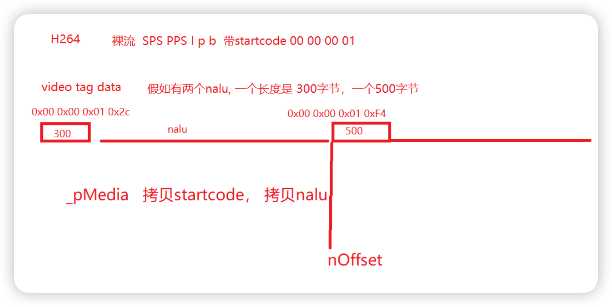
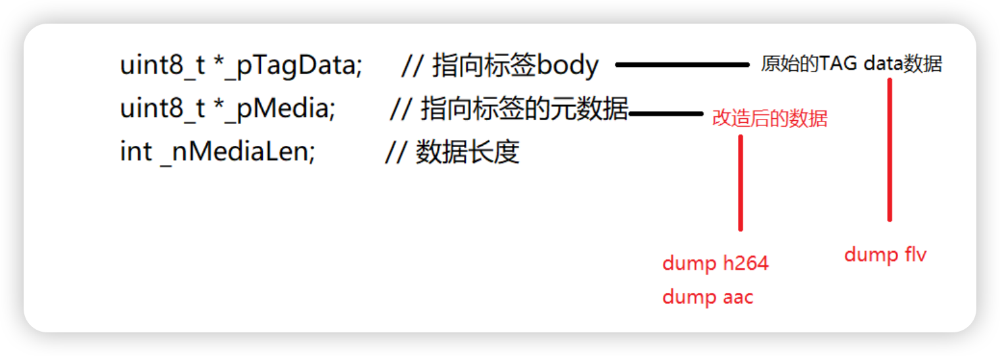

# 1.关于本项目

了解了FLV的封装原理 , 我们通过⼀个简单的FLV解析器的例子来看看FLV到底是怎么样封装和解封装

[[功能强大的FLV文件分析和解析器]](https://github.com/riverlight/FlvParser)

这个程序能够做什么 : 

1. 不能直接商用 , 因为每个tag解析后都存放到内存
2. audio parse
3. video parse
4. script parse  

# 2.总体流程

[[参考工程,null]]()

## 2.1 main.cpp

流程 : 

1. 读取输⼊⽂件 (flv类型的视频⽂件)
2. 调⽤Process进⾏处理
3. 退出

> ```c++
> #include <algorithm>
> #include <cstdlib>
> #include <cstring>
> #include <memory>
> #include <iostream>
> #include <fstream>
> 
> #include "FlvParser.h"
> 
> using namespace std;
> 
> 
> static void Process(fstream &fin, const char *filename);
> int main(const int argc,const char *argv[])
> {
> 	std::cout << sizeof(*argv) << "\n";
> 	cout << sizeof(string) << "\n";
>     cout << "Hi, this is FLV parser test program!\n";
> 
>     if (argc < 3){
>         cerr << "FlvParser.exe [input flv] [output flv]\n";
>         return -1;
>     }
> 
>     fstream fin(argv[1],ios_base::binary | ios_base::in);
> 
>     if (!fin){
>         cerr << "open error\n";
>         return -1;
>     }
>     Process(fin, argv[2]);
>     fin.close();
>     return 0;
> }
> 
> ```

## 2.2 处理函数 `Process()`

流程 : 

1. 读取⽂件
2. 开始解析
3. 打印解析信息
4. 把解析之后的数据输出到另外⼀个⽂件中

> ```c++
> static void Process(fstream &fin, const char *filename)
> {
>     CFlvParser parser;
>     constexpr auto nBufSize {2 * 1024 * 1024};
>     int nFlvPos {};
>     const auto pBuf { new uint8_t[nBufSize]},
>     pBak {new uint8_t[nBufSize]};
> 
>     for(;;){
> 
>         fin.read(reinterpret_cast<char *>(pBuf + nFlvPos), nBufSize 								- nFlvPos);
>         const auto nReadNum {fin.gcount()};
>         if (!nReadNum) {
>             break;
>         }
>         
>         nFlvPos += static_cast<int>(nReadNum);
>         int nUsedLen{};
>         parser.Parse(pBuf, nFlvPos, nUsedLen);
> 
>         if (nFlvPos != nUsedLen) {
> 	        std::cout << "nFlvPos = " << nFlvPos << " , nUsedLen = " 										<< nUsedLen << "\n";
>             std::copy_n(pBuf + nUsedLen,nFlvPos - nUsedLen,pBak);
>             std::copy_n(pBak,nFlvPos - nUsedLen,pBuf);
>         }
>         nFlvPos -= nUsedLen;
>     }
> 
>     parser.PrintInfo();
>     (void)parser.DumpH264("parser.264");
>     parser.DumpAAC("parser.aac");
> 
>     //dump into flv
>     (void)parser.DumpFlv(filename);
> 
>     delete []pBak;
>     delete []pBuf;
> }
> ```

## 2.3 解析函数`Parse(...)`

流程 : 

1. 解析flv的头部
2. 解析flv的Tag

> ```c++
> int CFlvParser::Parse(const uint8_t *pBuf,const int nBufSize, int &nUsedLen)
> {
> #define CheckBuffer(x) { if ((nBufSize-nOffset)<(x)) { nUsedLen = nOffset; return -1;} }
>     int nOffset {};
> 
>     if (!_pFlvHeader){
>         CheckBuffer(9);
>         _pFlvHeader = CreateFlvHeader(pBuf+nOffset);
>         nOffset += _pFlvHeader->nHeadSize;
>     }
> 
>     for(;;) {
>         CheckBuffer(15); // nPrevSize(4字节) + Tag header(11字节)
>         nOffset += 4;
> 
>         auto pTag {CreateTag(pBuf + nOffset, nBufSize - nOffset)};
>         if (!pTag){
>             nOffset -= 4;
>             break;
>         }
>         nOffset += (11 + pTag->_header.nDataSize);
> 
>         _vpTag.push_back(pTag);
>     }
> 
>     nUsedLen = nOffset;
>     return 0;
> }
> ```

# 3. FLV相关的数据结构

CFlvParser表示FLV解析器

FLV由FLV头部和FLV体构成 , 其中FLV体是由⼀系列的FLV tag构成的

> ```c++
> class CFlvParser
> {
> public:
>     CFlvParser();
>     virtual ~CFlvParser();
> 
>     int Parse(const uint8_t *pBuf, int nBufSize, int &nUsedLen);
>     int PrintInfo();
>     [[nodiscard]]int DumpH264(const std::string &) const;
>     int DumpAAC(const std::string &);
>     [[nodiscard]]int DumpFlv(const std::string &) const;
> 
> private:
>     // FLV头
>     struct FlvHeader {
>         int nVersion; // 版本
>         int bHaveVideo; // 是否包含视频
>         int bHaveAudio; // 是否包含音频
>         int nHeadSize;  // FLV头部长度
>         /*
>         ** 指向存放FLV头部的buffer
>         ** 上面的三个成员指明了FLV头部的信息，是从FLV的头部中“翻译”得到的，
>         ** 真实的FLV头部是一个二进制比特串，放在一个buffer中，由pFlvHeader成员指明
>         */
>         uint8_t *pFlvHeader;
>     };
> 
>     // Tag头部
>     struct TagHeader {
>         int nType{};      // 类型
>         int nDataSize{};  // 标签body的大小
>         int nTimeStamp{}; // 时间戳
>         int nTSEx{};      // 时间戳的扩展字节
>         int nStreamID{};  // 流的ID，总是0
>         uint32_t nTotalTS{};  // 完整的时间戳nTimeStamp和nTSEx拼装
>     };
> 
>     struct Tag{
>         void Init(const TagHeader *pHeader,const uint8_t *pBuf, 										int nLeftLen);
>         TagHeader _header{};
>         uint8_t *_pTagHeader{};   // 指向标签头部
>         uint8_t *_pTagData{};     // 指向标签body,原始的tag data数据
>         uint8_t *_pMedia{};       // 指向标签的元数据,改造后的数据,添加start_code与去除每个NALU payload前4个字节(plyload的真正数据的大小)的数据
>         int _nMediaLen{};         // 数据长度
>     };
> 
>     struct CVideoTag : Tag {
>         /**
>          * @brief CVideoTag
>          * @param pHeader
>          * @param pBuf 整个tag的起始地址
>          * @param nLeftLen
>          * @param pParser
>          */
>         CVideoTag(const TagHeader *pHeader,const uint8_t *pBuf,
>             int nLeftLen, CFlvParser *pParser);
> 
>         int _nFrameType;    // 帧类型
>         int _nCodecID;      // 视频编解码类型
>         int ParseH264Tag(CFlvParser *pParser);
>         int ParseH264Configuration(CFlvParser *pParser,const uint8_t *pTagData);
>         int ParseNalu(const CFlvParser *pParser,const uint8_t *pTagData);
>     };
> 
>     struct CAudioTag : Tag
>     {
>         CAudioTag(const TagHeader *pHeader,const uint8_t *pBuf, int nLeftLen, CFlvParser *pParser);
> 
>         int _nSoundFormat;  // 音频编码类型
>         int _nSoundRate;    // 采样率
>         int _nSoundSize;    // 精度
>         int _nSoundType;    // 类型
> 
>         // aac
>         static int _aacProfile;     // 对应AAC profile
>         static int _sampleRateIndex;    // 采样率索引
>         static int _channelConfig;      // 通道设置
> 
>         int ParseAACTag(CFlvParser *pParser);
>         int ParseAudioSpecificConfig(CFlvParser *pParser,const uint8_t *pTagData);
>         int ParseRawAAC(CFlvParser *pParser, uint8_t *pTagData);
>     };
> 
>     struct  CMetaDataTag : Tag
>     {
> 
>         CMetaDataTag(const TagHeader *pHeader,const uint8_t *pBuf, int nLeftLen, CFlvParser *pParser);
> 
>         static double hexStr2double(const unsigned char* hex, unsigned int length);
>         int parseMeta(CFlvParser *pParser);
>         void printMeta() const;
> 
>         uint8_t m_amf1_type{};
>         uint32_t m_amf1_size{};
>         uint8_t m_amf2_type{};
>         unsigned char *m_meta{};
>         unsigned int m_length{};
> 
>         double m_duration{};
>         double m_width{};
>         double m_height{};
>         double m_videodatarate{};
>         double m_framerate{};
>         double m_videocodecid{};
> 
>         double m_audiodatarate{};
>         double m_audiosamplerate{};
>         double m_audiosamplesize{};
>         bool m_stereo{};
>         double m_audiocodecid{};
> 
>         std::string m_major_brand;
>         std::string m_minor_version;
>         std::string m_compatible_brands;
>         std::string m_encoder;
>         double m_filesize{};
> 
>         using Metadata_Type = std::variant<double,bool,std::string>;
>         std::unordered_map<std::string,Metadata_Type> Metadata;
> 
>     };
> 
>     struct FlvStat{
>         int nMetaNum, nVideoNum, nAudioNum,nMaxTimeStamp,nLengthSize;
>         FlvStat() : nMetaNum(0), nVideoNum(0), nAudioNum(0), nMaxTimeStamp(0), nLengthSize(0){}
>     };
> 
>     static inline uint32_t ShowU32(const uint8_t *pBuf) { return (pBuf[0] << 24) | (pBuf[1] << 16) | (pBuf[2] << 8) | pBuf[3]; }
>     static inline uint32_t ShowU24(const uint8_t *pBuf) { return (pBuf[0] << 16) | (pBuf[1] << 8) | (pBuf[2]); }
>     static inline uint32_t ShowU16(const uint8_t *pBuf) { return (pBuf[0] << 8) | (pBuf[1]); }
>     static inline uint32_t ShowU8(const uint8_t *pBuf) { return (pBuf[0]); }
> 
>     static inline void WriteU64(uint64_t & x, const int length,const int value){
>         const auto mask {0xFFFFFFFFFFFFFFFF >> (64 - length)};
>         x = (x << length) | (static_cast<uint64_t>(value) & mask);
>     }
> 
>     static inline uint32_t WriteU32(const uint32_t n){
>         uint32_t nn {};
>         const auto p { reinterpret_cast<const uint8_t *>(&n) };
>         const auto pp { reinterpret_cast<uint8_t *>(&nn) };
>         pp[0] = p[3];
>         pp[1] = p[2];
>         pp[2] = p[1];
>         pp[3] = p[0];
>         return nn;
>     }
> 
>     friend struct Tag;
> 
>     static FlvHeader* CreateFlvHeader(const uint8_t *pBuf);
>     static int DestroyFlvHeader(const FlvHeader *pHeader) ;
>     Tag *CreateTag(const uint8_t *pBuf, int nLeftLen);
>     static int DestroyTag(const Tag *pTag);
>     int Stat();
>     int StatVideo(const Tag *pTag) ;
>     //int IsUserDataTag(Tag *pTag);
> 
>     //CVideojj *_vjj{};
>     std::shared_ptr<CVideojj> _vjj;
>     std::vector<Tag *> _vpTag;
>     FlvHeader* _pFlvHeader{};
>     FlvStat _sStat{};
>     // H.264
>     int _nNalUnitLength{};
> };
> ```

## 3.1 FlvHeader表示FLV的头部

> ```c++
>     struct FlvHeader {
>         int nVersion; // 版本
>         int bHaveVideo; // 是否包含视频
>         int bHaveAudio; // 是否包含音频
>         int nHeadSize;  // FLV头部长度
>         /*
>         ** 指向存放FLV头部的buffer
>         ** 上面的三个成员指明了FLV头部的信息，是从FLV的头部中“翻译”得到的，
>         ** 真实的FLV头部是一个二进制比特串，放在一个buffer中，由pFlvHeader成员指明
>         */
>         uint8_t *pFlvHeader;
>     };
> ```

## 3.2 标签

标签包括标签头部和标签体 , 根据类型的不同 , 标签体可以分成三种 : 
script类型的标签 , ⾳频标签 , 视频标签

### 3.2.1 标签头部

> ```c++
>     // Tag头部
>     struct TagHeader {
>         int nType{};      // 类型
>         int nDataSize{};  // 标签body的大小
>         int nTimeStamp{}; // 时间戳
>         int nTSEx{};      // 时间戳的扩展字节
>         int nStreamID{};  // 流的ID，总是0
>         uint32_t nTotalTS{};  // 完整的时间戳nTimeStamp和nTSEx拼装
>     };
> 
> ```

### 3.2.2 标签数据

script标签 、音频标签、音频标签都继承Tag

> ```c++
>     struct Tag{
>         void Init(const TagHeader *pHeader,const uint8_t *pBuf, int 								nLeftLen);
>         TagHeader _header{};
>         uint8_t *_pTagHeader{};   // 指向标签头部
>         uint8_t *_pTagData{};     // 指向标签body,原始的tag data数据
>         uint8_t *_pMedia{};       // 指向标签的元数据,改造后的数据,添加start_code与去除每个NALU payload前4个字节(plyload的真正数据的大小)的数据
> 
>         int _nMediaLen{};         // 数据长度
>     };
> ```

#### 3.2.2.1 script类型的标签

> ```c++
>     struct CMetaDataTag:Tag
>     {
> 
>         CMetaDataTag(const TagHeader *pHeader,const uint8_t *pBuf, 											int nLeftLen, CFlvParser *pParser);
> 
>         static double hexStr2double(const unsigned char* hex, 																				unsigned int length);
>         int parseMeta(CFlvParser *pParser);
>         void printMeta() const;
> 
>         uint8_t m_amf1_type{};
>         uint32_t m_amf1_size{};
>         uint8_t m_amf2_type{};
>         uint8_t *m_meta{};
>         uint32_t m_length{};
> 
>         double m_duration{};
>         double m_width{};
>         double m_height{};
>         double m_videodatarate{};
>         double m_framerate{};
>         double m_videocodecid{};
> 
>         double m_audiodatarate{};
>         double m_audiosamplerate{};
>         double m_audiosamplesize{};
>         bool m_stereo{};
>         double m_audiocodecid{};
> 
>         std::string m_major_brand;
>         std::string m_minor_version;
>         std::string m_compatible_brands;
>         std::string m_encoder;
>         double m_filesize{};
> 
>         using Metadata_Type = std::variant<double,bool,std::string>;
>         std::unordered_map<std::string,Metadata_Type> Metadata;
> 
>     };
> ```

#### 3.2.2.2 audio标签

> ```c++
>     struct CAudioTag:Tag
>     {
>         CAudioTag(const TagHeader *pHeader,const uint8_t *pBuf, int 								nLeftLen, CFlvParser *pParser);
> 
>         int _nSoundFormat;  // 音频编码类型
>         int _nSoundRate;    // 采样率
>         int _nSoundSize;    // 精度
>         int _nSoundType;    // 类型
> 
>         // aac
>         static int _aacProfile;     // 对应AAC profile
>         static int _sampleRateIndex;    // 采样率索引
>         static int _channelConfig;      // 通道设置
> 
>         int ParseAACTag(CFlvParser *pParser);
>         int ParseAudioSpecificConfig(CFlvParser *pParser,const 																				uint8_t *pTagData);
>       
>         int ParseRawAAC(CFlvParser *pParser, uint8_t *pTagData);
>     };
> ```

#### 3.2.2.3 video标签

> ```c++
>     struct CVideoTag:Tag {
>         /**
>          * @brief CVideoTag
>          * @param pHeader
>          * @param pBuf 整个tag的起始地址
>          * @param nLeftLen
>          * @param pParser
>          */
>         CVideoTag(const TagHeader *pHeader,const uint8_t *pBuf,
>             int nLeftLen, CFlvParser *pParser);
> 
>         int _nFrameType;    // 帧类型
>         int _nCodecID;      // 视频编解码类型
>         int ParseH264Tag(CFlvParser *pParser);
>         int ParseH264Configuration(CFlvParser *pParser,const 																					uint8_t *pTagData);
>         int ParseNalu(const CFlvParser *pParser,const uint8_t 													*pTagData);
>     };
> ```

# 4. 解析FLV头部

## 4.1 ⼊⼝函数

请点击 [[2.3 解析函数Parse(...)]](#2.3 解析函数Parse(...)) (tips : 如果无法点击,请手动找到2.3章节查看)

## 4.2 FLV头部解析函数

> ```c++
> CFlvParser::FlvHeader* CFlvParser::CreateFlvHeader(const uint8_t *pBuf)
> {
>     const auto pHeader { new FlvHeader};
>     pHeader->nVersion = pBuf[3];        // 版本号
>     pHeader->bHaveAudio = (pBuf[4] >> 2) & 0x01;    // 是否有音频
>     pHeader->bHaveVideo = (pBuf[4] >> 0) & 0x01;    // 是否有视频
>     pHeader->nHeadSize = static_cast<int>(ShowU32(pBuf + 5));         // 头部长度
> 
>     pHeader->pFlvHeader = new uint8_t[pHeader->nHeadSize];
>     //memcpy(pHeader->pFlvHeader, pBuf, pHeader->nHeadSize);
>     std::copy_n(pBuf,pHeader->nHeadSize,pHeader->pFlvHeader);
> 
>     return pHeader;
> }
> ```

# 5. 解析标签头部

标签的解析过程

1. `CFlvParser::Parse(...)` 调⽤ `CreateTag(...)` 解析标签
2. `CFlvParser::CreateTag(...)` ⾸先解析标签头部
3. 根据标签头部的类型字段 , 判断标签的类型
4. 如果是视频标签 , 那么解析视频标签
5. 如果是⾳频标签 , 那么解析⾳频标签
6. 如果是其他的标签 , 那么调⽤`Tag::Init(...)` 进⾏解析

## 5.1 解析标签头部的函数

> ```c++
> CFlvParser::Tag *CFlvParser::CreateTag(const uint8_t *pBuf,const 																				int nLeftLen)
> {
>     // 开始解析标签头部
>     TagHeader header;
>     header.nType = static_cast<int>(ShowU8(pBuf+0));  //类型
>     header.nDataSize = static_cast<int>(ShowU24(pBuf + 1));   //标签body的长度
>     header.nTimeStamp = static_cast<int>(ShowU24(pBuf + 4));  //时间戳 低24bit
>     header.nTSEx = static_cast<int>(ShowU8(pBuf + 7));        //时间戳的扩展字段, 高8bit
>     header.nStreamID = static_cast<int>(ShowU24(pBuf + 8));   //流的id
>     header.nTotalTS = static_cast<uint32_t>((header.nTSEx << 24)) + header.nTimeStamp;
>     // 标签头部解析结束
> 
> /*    
> 		cout << "total TS : " << header.nTotalTS << endl;
>     cout << "nLeftLen : " << nLeftLen << " , nDataSize : " << 								header.nDataSize << endl;
> */
> 
>     if ((header.nDataSize + 11) > nLeftLen){
>         return nullptr;
>     }
> 
>     Tag *pTag{};
>     switch (header.nType) {
>     case 0x09:  // 视频类型的Tag
>         pTag = new CVideoTag(&header, pBuf, nLeftLen, this);
>         break;
>     case 0x08:  // 音频类型的Tag
>         pTag = new CAudioTag(&header, pBuf, nLeftLen, this);
>         break;
>     case 0x12:  // script Tag
>         pTag = new CMetaDataTag(&header, pBuf, nLeftLen, this);
>         break;
>     default:    // script类型的Tag
>         pTag = new Tag();
>         pTag->Init(&header, pBuf, nLeftLen);
>         break;
>     }
> 
>     return pTag;
> }
> 
> ```

# 6. 解析视频标签

## 6.1 ⼊⼝函数CreateTag

流程如下 : 

1. 解析标签头部
2. 判断标签头部的类型
3. 根据标签头部的类型 , 解析不同的标签
4. 如果是视频类型的标签 , 那么就创建并解析视频标签

[[5.1 解析标签头部的函数]](#5.1 解析标签头部的函数)

## 6.2 创建视频标签

流程如下 : 

1. 初始化
2. 解析帧类型
3. 解析视频编码类型
4. 解析视频标签

> ```c++
> CFlvParser::CVideoTag::CVideoTag(const TagHeader *pHeader,
>     const uint8_t *pBuf,
>     const int nLeftLen,
>     CFlvParser *pParser) {
>     // 初始化,把整个tag(包含头部)拷贝到自身成员变量
>     Init(pHeader, pBuf, nLeftLen);
> 
>     const auto pd {_pTagData};/*tag data的起始位置*/
>     _nFrameType = (pd[0] & 0xf0) >> 4;  // 帧类型
>     _nCodecID = pd[0] & 0x0f;           // 视频编码类型
>     // 开始解析
>     if ((0x09 == _header.nType) && (7 == _nCodecID) ) {
>         ParseH264Tag(pParser);
>     }
> }
> ```

## 6.3 解析视频标签

流程如下 : 

1. 解析数据包类型
2. 如果数据包是配置信息 , 那么就解析配置信息
3. 如果数据包是视频数据 , 那么就解析视频数据

> ```c++
> int CFlvParser::CVideoTag::ParseH264Tag(CFlvParser *pParser)
> {
>     const auto pd { _pTagData};
>     /*
>     ** 数据包的类型
>     ** 视频数据被压缩之后被打包成数据包在网上传输
>     ** 有两种类型的数据包：视频信息包（sps、pps等）和视频数据包（视频的压缩数据）
>     */
>     const auto nAVCPacketType {static_cast<int>(pd[1])};
>    // int nCompositionTime = CFlvParser::ShowU24(pd + 2);
>    // AVCPacketType 0:Configuration 1:AVC NALU
>     if (nAVCPacketType) { // AVC NALU
>         // 如果是视频数据
>         ParseNalu(pParser, pd);
>     }else{  // AVC sequence header
>         // 如果是视频配置信息
>         ParseH264Configuration(pParser, pd);
>     }
>     return 1;
> }
> ```

## 6.4 解析视频配置信息

流程如下 : 
1. 解析配置信息的⻓度
2. 解析sps、pps的⻓度
3. 保存元数据 , 元数据即sps、pps等

> ```c++
> int CFlvParser::CVideoTag::ParseH264Configuration(CFlvParser *pParser,
>     const uint8_t *pTagData)
> {
>     const auto pd {pTagData};
>     // 跨过 Tag Data的VIDEODATA(frametype + codecid)(1字节)
>     // AVCVIDEOPACKET(AVCPacketType(1字节) 和CompositionTime(3字节) 4字节)
>     // 总共跨过5个字节
> 
>     // NalUnit长度表示占用的字节
>     pParser->_nNalUnitLength = (pd[9] & 0x03) + 1;  // lengthSizeMinusOne posloca = 9 = 5 + 4
> 
>     // sps（序列参数集）的长度
>     const auto sps_size { CFlvParser::ShowU16(pd + 11)};        // sequenceParameterSetLength 11 = 5 + 6
>     // pps（图像参数集）的长度
>     const auto pps_size {CFlvParser::ShowU16(pd + 11 + (2 + sps_size) + 1)};   // pictureParameterSetLength
> 
>     // 元数据的长度
>     _nMediaLen = static_cast<int>(4 + sps_size + 4 + pps_size);   // 添加start code
>     _pMedia = new uint8_t[_nMediaLen];
> 
>     // 保存元数据
>     //memcpy(_pMedia, &nH264StartCode, 4);
>     std::copy_n(reinterpret_cast<const uint8_t*>(&nH264StartCode),4,_pMedia);
> 
>     //memcpy(_pMedia + 4, pd + 11 + 2, sps_size);
>     std::copy_n(pd + 11 + 2,sps_size,_pMedia + 4);
> 
>     //memcpy(_pMedia + 4 + sps_size, &nH264StartCode, 4);
>     std::copy_n(reinterpret_cast<const uint8_t*>(&nH264StartCode),4,_pMedia + 4 + sps_size);
> 
>     //memcpy(_pMedia + 4 + sps_size + 4, pd + 11 + 2 + sps_size + 2 + 1, pps_size);
>     std::copy_n(pd + 11 + 2 + sps_size + 2 + 1,pps_size,_pMedia + 4 + sps_size + 4);
> 
>     return 1;
> }
> ```

## 6.5 解析视频数据

流程如下 :  

1. 如果⼀个Tag还没解析完成 , 那么执⾏下⾯步骤
2. 计算NALU的⻓度
3. 获取NALU的起始码
4. 保存NALU的数据
5. 调⽤⾃定义的处理函数对NALU数据进⾏处理

> ```c++
> int CFlvParser::CVideoTag::ParseNalu(const CFlvParser *const pParser,const uint8_t *pTagData)
> {
>     const auto pd { pTagData};
>     //int nOffset {};
> 
>     _pMedia = new uint8_t[_header.nDataSize + 10];
>     _nMediaLen = 0;
>     // 跨过 Tag Data的VIDEODATA(Frame_Type + CodecID)(1字节)
>     // AVCVIDEOPACKET(AVCPacketType和CompositionTime 4字节)
>     int nOffset {5}; // 总共跨过5个字节 132 - 5 = 127 = _nNalUnitLength(4字节)  + NALU(123字节)
>     //                                           startcode(4字节)  + NALU(123字节) = 127
>     for(;;) {
>         // 如果解析完了一个Tag，那么就跳出循环
>         if (nOffset >= _header.nDataSize){
>             break;
>         }
>         // 计算NALU（视频数据被包装成NALU在网上传输）的长度,
>         // 一个tag可能包含多个nalu,所以每个nalu前面有NalUnitLength字节表示每个nalu的长度
>         int nNaluLen{};
> 
>         switch (pParser->_nNalUnitLength) {/*_nNalUnitLength一般都是4,这里判断只是为了防止有其他情况出现*/
>             /* pParser->_nNalUnitLength决定存放NALU length需要用多少个字节,默认是4个字节 */
>         case 4:
>             nNaluLen = static_cast<int>(CFlvParser::ShowU32(pd + nOffset));
>             break;
>         case 3:
>             nNaluLen = static_cast<int>(CFlvParser::ShowU24(pd + nOffset));
>             break;
>         case 2:
>             nNaluLen = static_cast<int>(CFlvParser::ShowU16(pd + nOffset));
>             break;
>         default:
>             nNaluLen = static_cast<int>(CFlvParser::ShowU8(pd + nOffset));
>             break;
>         }
>         // 获取NALU的起始码
>         //memcpy(_pMedia + _nMediaLen, &nH264StartCode, 4);
>         std::copy_n(reinterpret_cast<const uint8_t*>(&nH264StartCode),4,_pMedia + _nMediaLen);
>         // 复制NALU的数据
>         //memcpy(_pMedia + _nMediaLen + 4, pd + nOffset + pParser->_nNalUnitLength, nNaluLen);
>         std::copy_n(pd + nOffset + pParser->_nNalUnitLength,nNaluLen,_pMedia + _nMediaLen + 4);
> 
>         /* pParser->_nNalUnitLength决定存放NALU length需要用多少个字节,默认是4个字节 */
> 
>         // 解析NALU
> //        pParser->_vjj->Process(_pMedia+_nMediaLen, 4+nNaluLen, _header.nTotalTS);
>         _nMediaLen += (4 + nNaluLen);
>         /*4代表前面start_code(4字节) + 真正数据的大小(已除去了payload的前4个字节)*/
> 
>         nOffset += (pParser->_nNalUnitLength + nNaluLen); /* 4 + 每个NALU data前4个字节就是当前NALU的长度*/
>         /*nOffset实际偏移一个NALU payload的长度(4字节 + 真正数据长度)*/
> 
>         /*这里_pMedia保存的是每一个没有NALU payload长度的数据,就是真正数据的前面4个字节*/
>     }
> 
>     return 1;
> }
> ```

 

## 6.5 ⾃定义的视频处理

把视频的NALU解析出来之后 , 可以根据⾃⼰的需要往视频中添加内容

> ```c++
> int CVideojj::Process(uint8_t *pNalu, const int nNaluLen,
> 	const int nTimeStamp)
> {
>     // 如果起始码后面的两个字节是0x05或者0x06，那么表示IDR图像或者SEI信息
> 	if (0x06 != pNalu[4] || 0x05 != pNalu[5]) {
> 		return 0;
> 	}
> 
>     auto p { pNalu + 4 + 2};
> 	while (*p++ == 0xff);
> 	constexpr auto szVideojjUUID { "VideojjLeonUUID"};
> 	auto pp {reinterpret_cast<char*>(p)};
> 
> 	for (uint32_t i {}; i < strlen(szVideojjUUID); i++) {
> 		if (pp[i] != szVideojjUUID[i]){
> 			return 0;
> 		}
> 	}
> 	
> 	VjjSEI sei;
> 	sei.nTimeStamp = nTimeStamp;
> 	sei.nLen = nNaluLen - (pp - reinterpret_cast<char*>(pNalu)) - 16 - 1;
> 	sei.szUD = new char[sei.nLen];
> 	memcpy(sei.szUD, pp + 16, sei.nLen);
> 	_vVjjSEI.push_back(sei);
> 
> 	return 1;
> }
> 
> ```

# 7. 解析⾳频标签

## 7.1 ⼊⼝函数CreateTag

流程如下 : 

1. 解析标签头部
2. 判断标签头部的类型
3. 根据标签头部的类型 , 解析不同的标签
4. 如果是⾳频类型的标签 , 那么就创建并解析⾳频标签

[[5.1 解析标签头部的函数]](#5.1 解析标签头部的函数)

## 7.2 创建⾳频标签

流程如下 : 

1. 初始化
2. 解析⾳频编码类型
3. 解析采样率
4. 解析精度和类型
5. 解析⾳频标签

> ```c++
> /**
>  * @brief  CAudioTag 音频Tag Data区域开始的第一个字节包含了音频数据的参数信息，
>  * 从第二个字节开始为音频流数据，但第二个字节对于AAC也要判断是AAC sequence header还是AAC raw。
>  * 第一个字节：SoundFormat 4bit 音频格式 0 = Linear PCM, platform endian
>                         1 =ADPCM; 2 = MP3; 3 = Linear PCM, little endian
>                         4 = Nellymoser 16-kHz mono ; 5 = Nellymoser 8-kHz mono
>                         6 = Nellymoser;  7 = G.711 A-law logarithmic PCM
>                         8 = G.711 mu-law logarithmic PCM; 9 = reserved
>                         10 = AAC ; 11  Speex 14 = MP3 8-Khz
>                         15 = Device-specific sound
>               SoundRate 2bit 采样率 0 = 5.5-kHz; 1 = 11-kHz; 2 = 22-kHz; 3 = 44-kHz
>                         对于AAC总是3。但实际上AAC是可以支持到48khz以上的频率。
>               SoundSize 1bit 采样精度  0 = snd8Bit; 1 = snd16Bit
>                         此参数仅适用于未压缩的格式，压缩后的格式都是将其设为1
>               SoundType 1bit  0 = sndMono 单声道; 1 = sndStereo 立体声，双声道
>                         对于AAC总是1
> If the SoundFormat indicates AAC, the SoundType should be set to 1 (stereo) and the
> SoundRate should be set to 3 (44 kHz). However, this does not mean that AAC audio in FLV
> is always stereo, 44 kHz data. Instead, the Flash Player ignores these values and
> extracts the channel and sample rate data is encoded in the AAC bitstream.
>  * @param pHeader
>  * @param pBuf
>  * @param nLeftLen
>  * @param pParser
>  */
> CFlvParser::CAudioTag::CAudioTag(const TagHeader *pHeader,
>     const uint8_t *pBuf,
>     const int nLeftLen, CFlvParser *pParser)
> {
>     Init(pHeader, pBuf, nLeftLen);
> 
>     const auto pd { _pTagData};
>     _nSoundFormat = (pd[0] & 0xf0) >> 4;    // 音频格式
>     _nSoundRate = (pd[0] & 0x0c) >> 2;      // 采样率
>     _nSoundSize = (pd[0] & 0x02) >> 1;      // 采样精度
>     _nSoundType = (pd[0] & 0x01);           // 是否立体声
>     if (0x0a == _nSoundFormat) {               // AAC
>         ParseAACTag(pParser);
>     }
> }
> ```

## 7.3 解析⾳频标签

流程如下 : 

1. 获取数据包的类型
2. 判断数据包的类型
3. 如果数据包是⾳频配置信息 , 那么解析有⾳频配置信息
4. 如果是原始⾳频数据 , 那么对原始⾳频数据进⾏处理

> ```c++
> int CFlvParser::CAudioTag::ParseAACTag(CFlvParser *pParser)
> {
>     const auto pd {_pTagData};
> 
>     // 数据包的类型：音频配置信息，音频数据
>     const auto nAACPacketType { static_cast<uint32_t>(pd[1])};
> 
>     // 如果是音频配置信息
>     if (!nAACPacketType){    // AAC sequence header
>         // 解析配置信息
>         ParseAudioSpecificConfig(pParser, pd); // 解析AudioSpecificConfig
>     }else {/* 如果是音频数据  AAC RAW*/
>         // 解析音频数据
>         ParseRawAAC(pParser, pd);
>     }
> 
>     return 1;
> }
> ```

## 7.4 处理⾳频配置信息

流程如下 : 

1. 解析AAC的采样率
2. 解析采样率索引
3. 解析声道

> ```c++
> int CFlvParser::CAudioTag::ParseAudioSpecificConfig(CFlvParser *pParser,
>     const uint8_t *pTagData)
> {
>     const auto pd { _pTagData};
> 
>     _aacProfile = (pd[2] & 0xf8) >> 3;    // 5bit AAC编码级别 /*AudioObjectType*/
>     _sampleRateIndex = ( (pd[2] & 0x07) << 1 ) | (pd[3] >> 7);  // 4bit 真正的采样率索引
>     _channelConfig = ( pd[3] >> 3 ) & 0x0f;                 // 4bit 通道数量
> 
>     std::cout << "----- AAC ------\n";
>     std::cout << "profile : " << _aacProfile << "\n";
>     std::cout << "sample rate index : " << _sampleRateIndex << "\n";
>     std::cout << "channel config : " << _channelConfig << "\n";
> 
>     _pMedia = nullptr;
>     _nMediaLen = 0;
>     return 1;
> }
> ```

## 7.5 处理原始⾳频数据

主要的功能是为原始的⾳频数据添加元数据 , 可以根据⾃⼰的需要进⾏改写

> ```c++
> int CFlvParser::CAudioTag::ParseRawAAC(CFlvParser *pParser, uint8_t *pTagData)
> {
>     uint64_t bits {};  // 占用8字节
>     // 数据长度 跳过tag data的第一个第二字节
>     const auto dataSize { _header.nDataSize - 2};   // 减去两字节的 audio tag data信息部分
> 
>     // 制作元数据
>     WriteU64(bits, 12, 0xFFF);
>     WriteU64(bits, 1, 0);
>     WriteU64(bits, 2, 0);
>     WriteU64(bits, 1, 1);
>     WriteU64(bits, 2, _aacProfile - 1);
>     WriteU64(bits, 4, _sampleRateIndex);
>     WriteU64(bits, 1, 0);
>     WriteU64(bits, 3, _channelConfig);
>     WriteU64(bits, 1, 0);
>     WriteU64(bits, 1, 0);
>     WriteU64(bits, 1, 0);
>     WriteU64(bits, 1, 0);
>     WriteU64(bits, 13, 7 + dataSize);
>     WriteU64(bits, 11, 0x7FF);
>     WriteU64(bits, 2, 0);
>     // WriteU64执行为上述的操作,最高的8bit还没有被移位到,实际是使用7个字节
>     _nMediaLen = 7 + dataSize;/*ATDS head size + datasize*/
>     _pMedia = new uint8_t[_nMediaLen];
>     uint8_t p64[8]{};
>     p64[0] = static_cast<uint8_t>(bits >> 56); // 是bits的最高8bit，实际为0
>     p64[1] = static_cast<uint8_t>(bits >> 48); // 才是ADTS起始头 0xfff的高8bit
>     p64[2] = static_cast<uint8_t>(bits >> 40);
>     p64[3] = static_cast<uint8_t>(bits >> 32);
>     p64[4] = static_cast<uint8_t>(bits >> 24);
>     p64[5] = static_cast<uint8_t>(bits >> 16);
>     p64[6] = static_cast<uint8_t>(bits >> 8);
>     p64[7] = static_cast<uint8_t>(bits);
> 
>     // ADTS header, p64+1是从ADTS起始头开始
>     std::copy_n(p64+1,7,_pMedia);
>     // AAC body
>     std::copy_n(pTagData + 2,dataSize,_pMedia + 7);
> 
>     return 1;
> }
> ```

# 8. 解析其他标签

## 8.1 ⼊⼝函数CreateTag

流程如下 : 

1. 解析标签头部
2. 判断标签头部的类型
3. 根据标签头部的类型 , 解析不同的标签
4. 如果是其他类型的标签 , 那么就创建并解析其他类型标签

[[5.1 解析标签头部的函数]](#5.1 解析标签头部的函数)

## 8.2 解析普通标签

没有太⼤的功能 , 就是数据的复制

> ```c++
> void CFlvParser::Tag::Init(const TagHeader *pHeader,
>     const uint8_t *pBuf,const int nLeftLen)
> {
>     memcpy(&_header, pHeader, sizeof(TagHeader));
>     // 复制标签头部信息 header
>     _pTagHeader = new uint8_t[11];
>     //memcpy(_pTagHeader, pBuf, 11);      // 头部
>     std::copy_n(pBuf,11,_pTagHeader);
>     // 复制标签 body
>     _pTagData = new uint8_t[_header.nDataSize];
>     //memcpy(_pTagData, pBuf + 11, _header.nDataSize);
>     std::copy_n(pBuf + 11,_header.nDataSize,_pTagData);
> }
> 
> ```

# 9.补充

 

# 10. AMF格式

AMF数据第⼀个byte为此数据的类型 , 类型有 : 

| Number                       | 0x00 | double类型                      |
| ---------------------------- | ---- | ------------------------------- |
| Boolean                      | 0x01 | bool类型                        |
| String                       | 0x02 | String类型                      |
| Object                       | 0x03 | Object类型                      |
| MovieClip                    | 0x04 | Not available in Remoting       |
| Null                         | 0x05 | Null类型                        |
| Undefined                    | 0x06 |                                 |
| Reference                    | 0x07 |                                 |
| MixedArray                   | 0x08 |                                 |
| EndOfObject                  | 0x09 | See Object , 表示object结束     |
| Array                        | 0x0a |                                 |
| Date                         | 0x0b |                                 |
| LongString                   | 0x0c |                                 |
| Unsupported                  | 0x0d |                                 |
| Recordset                    | 0x0e | Remoting, server-to-client only |
| XML                          | 0x0f |                                 |
| TypedObject (Class instance) | 0×10 |                                 |
| AMF3 data                    | 0×11 | Sent by Flash player 9+         |

