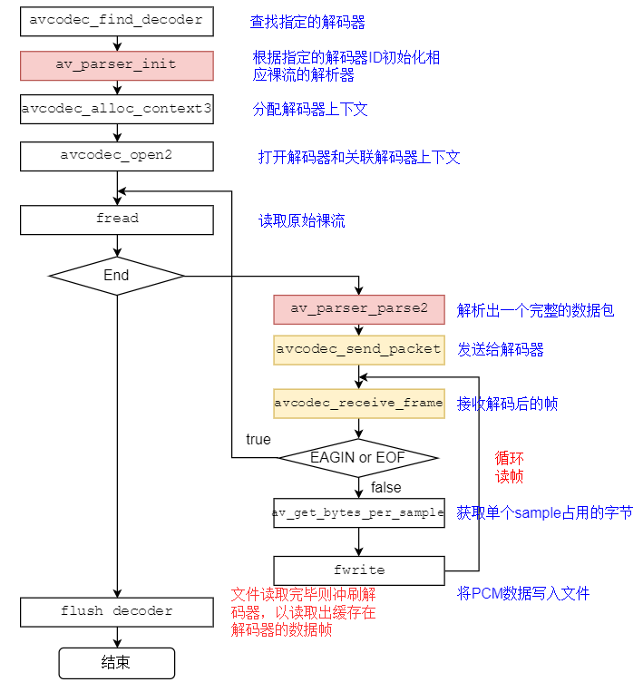

# 1. 音频解码过程

音频解码过程如下图所示 : 

 

# 2. FFmpeg流程

 

# 3. 关键函数

* `avcodec_find_decoder(...)` : 根据指定的AVCodecID查找注册的解码器。
* `av_parser_init(...) `: 初始化AVCodecParserContext。
* `avcodec_alloc_context3(...)` : 为AVCodecContext分配内存。
* `avcodec_open2(...)` : 打开解码器。
* `av_parser_parse2(...)` : 解析获得⼀个Packet。
* `avcodec_send_packet(...)` : 将AVPacket压缩数据给解码器。
* `avcodec_receive_frame(...)` : 获取到解码后的AVFrame数据。
* `av_get_bytes_per_sample(...)` : 获取每个sample中的字节数  

# 4. 关键数据结构

关键数据结构说明 : 
`AVCodecParser` : ⽤于解析输⼊的数据流并把它分成⼀帧⼀帧的压缩编码数据。比较形象的说法就是把长长的⼀段连续的数据"切割"成⼀段段的数据

比如AAC aac_parser 

ffmpeg-4.2.1\libavcodec\aac_parser.c  

> ```c++
> const AVCodecParser ff_aac_parser = {
>     .codec_ids      = { AV_CODEC_ID_AAC },
>     .priv_data_size = sizeof(AACAC3ParseContext),
>     .parser_init    = aac_parse_init,
>     .parser_parse   = ff_aac_ac3_parse,
>     .parser_close   = ff_parse_close,
> };
> ```

从AVCodecParser结构的实例化我们可以看出来 , 不同编码类型的parser是和CODE_ID进⾏绑定的。所以也就可以解释可以通过CODE_ID查找到对应的码流 parser  

> ```c++
> parser = av_parser_init(codec->id);
> ```

# 5. avcodec编解码API介绍

avcodec_send_packet、avcodec_receive_frame的API是FFmpeg3版本加入的。为了正确的使⽤它们 , 有必要阅读FFmpeg的⽂档说明

[[ffmpeg文档链接]](https://www.ffmpeg.org/doxygen/4.1/group__lavc__encdec.html#details)

FFmpeg提供了两组函数 , 分别⽤于编码和解码 : 

- 解码 : `avcodec_send_packet(...)` 、`avcodec_receive_frame(...)`
- 编码 : `avcodec_send_frame(...)` 、`avcodec_receive_packet(...)`

API的设计与编解码的流程非常贴切

建议的使用流程如下 : 

1. 打开AVCodecContext
2. 输入有效的数据
   - 解码 : 调用 `avcodec_send_packet(...)` 给解码器传入包含原始的 **$\color{red}{\mathbf{压缩数据}}$** 的 `AVPacket` 对象
   - 编码 : 调⽤ `avcodec_send_frame(...)` 给编码器传入包含 **$\color{red}{\mathbf{解压数据}}$** 的 `AVFrame` 对象
   - 两种情况下推荐 `AVPacket` 和 `AVFrame`都使用 `refcounted` (引⽤计数) 的模式 , 否则 `libavcodec` 可能不得不对输⼊的数据进行拷贝
   
3. 在⼀个 **循环体内** 去接收 codec 的输出 , 即周期性地调用 `avcodec_receive_xxx(...)` 来接收 codec 输出的数据
   - 解码 : 调⽤ `avcodec_receive_frame(...)` , 如果成功会返回⼀个包含 **$\color{red}{\mathbf{未压缩数据}}$** 的 `AVFrame`
   - 编码 : 调⽤ `avcodec_receive_packet(...)` , 如果成功会返回⼀个包含 **$\color{red}{\mathbf{压缩数据}}$** 的 `AVPacket`

反复地调用 `avcodec_receive_frame(...)` 或 `avcodec_receive_packet(...)` **$\color{red}{\mathbf直到返回{AVERROR(EAGAIN)}}$ 或其他错误** 返回 **$\color{red}{\mathbf{AVERROR(EAGAIN)}}$** 错误表示codec需要新的输入来输出更多的数据。对于每个输入的 packet 或 frame，codec ⼀般会输出⼀个 `frame` 或 `packet` , 但是也有可能输出0个或者多于1个

4. 流处理结束的时候需要flush (冲刷) codec。因为codec可能在内部缓冲多个 `frame` 或 `packet` , 出于性能或其他必要的情况(如考虑B帧的情况)  处理流程如下 : 
   - 调⽤ `avcodec_send_xxx(...)` 传入的 `AVFrame` 或 `AVPacket` 指针设置为 `nullptr` 这将进入draining mode (排水模式)
   - 反复地调用 `avcodec_receive_xxx(...)` 直到返回 `AVERROR_EOF`，该方法在 draining mode 时不会返回`AVERROR(EAGAIN)` 的错误，除非你没有进入 draining mode  
   - 当重新开启codec时 , 需要先调用 `avcodec_flush_buffers(...)` 来重置codec  

> ```tex
> 说明:
> 1.编码或者解码刚开始的时候,codec可能接收了多个输⼊的frame或packet后还没有输出数据,直到内部的buffer被填充满。上⾯的使⽤流程可以处理这种情况。
> 2.理论上,只有在输出数据没有被完全接收的情况调⽤avcodec_send_xxx()的时候才可能会发⽣AVERROR(EAGAIN)的错误。你可以依赖这个机制来实现区别于上⾯建议流程的处理⽅式 , ⽐如每次循环都调⽤avcodec_send_*(),在出现AVERROR(EAGAIN)错误的时候再去调⽤avcodec_receive_*()。
> 3.并不是所有的codec都遵循⼀个严格、可预测的数据处理流程,唯⼀可以保证的是 "调⽤avcodec_send_*()/ avcodec_receive_*()返回AVERROR(EAGAIN)的时候去avcodec_receive_*()/avcodec_send_*()会成功,否则不应该返回AVERROR(EAGAIN)的错误" ⼀般来说，任何codec都不允许⽆限制地缓存输⼊或者输出。
> 4.在同⼀个AVCodecContext上混合使⽤新旧API是不允许的,这将导致未定义的⾏为。
> ```

## 5.1 `avcodec_send_packet(...)`

- 函数 : `int avcodec_send_packet(AVCodecContext *avctx, const AVPacket *avpkt);`
- 作用 : 支持将裸流数据包送给解码器  
- 警告 : 
  - 输入的 `avpkt-data` 缓冲区必须大于 `AV_INPUT_PADDING_SIZE` , 因为优化的字节流读取器必须⼀次读取32或者64bit的数据
  - 不能跟之前的API (例如 `avcodec_decode_video2` )混⽤ , 否则会返回不可预知的错误 

- 备注 : 
  - 在将包发送给解码器的时候 , `AVCodecContext` 必须已经通过 `avcodec_open2` 打开  

- 参数 : 

  - avctx : 解码上下文

  - avpkt : 输⼊AVPakcet.通常情况下 , 输入数据是一个单一的视频帧或者几个完整的音频帧。调用者保留包的原有属性 , 解码器不会修改包的内容。解码器可能创建对包的引⽤。如果包没有引⽤计数将拷贝⼀份。跟以往的API不一样 , 输入的包的数据将被完全地消耗 , **$\color{red}{\mathbf{如果包含有多个帧 , 要求多次调⽤avcodec\\\_recvive\\\_frame(...),\\\ 直到avcodec\\\_recvive\\\_frame(...)返回}}$**

    **$\color{SkyBlue}{\mathbf{VERROR (EAGAIN) 或 AVERROR\_EOF}}$** 输入参数可以为 NULL , 或者 `AVPacket` 的 `data` 域设置为 NULL 或者 `size` 域设置为0 , 表示将刷新所有的包 , 意味着数据流已经结束了。第⼀次发送刷新会总会成功 , 第⼆次发送刷新包是没有必要的 , 并且返回AVERROR_EOF , 如果xxx缓存了一些帧 , 返回⼀个刷新包 , 将会返回所有的解码包  

- 返回值 : 
  - 0 : 表示成功
  - `AVERROR(EAGAIN)` : 当前状态不接受输入 , 用户必须先使用 `avcodec_receive_frame(...)` 读取数据帧
  - `AVERROR_EOF` : 解码器已刷新 , 不能再向其发送新包
  - `AVERROR(EINVAL)` : 没有打开解码器 , 或者这是⼀个编码器 , 或者要求刷新
  - `AVERRO(ENOMEN)` : ⽆法将数据包添加到内部队列

## 5.2 `avcodec_receive_frame(...)`

- 函数 : `int avcodec_receive_frame ( AVCodecContext * avctx, AVFrame * frame )`
- 作用 : 从解码器返回已解码的输出数据
- 参数 : 
  - `avctx` : 编解码器上下文
  - `frame` : 获取使用 reference-counted 机制的a udio或者video帧 (取决于解码器类型) 。请注意 , 在执⾏其他操作之前 , 函数内部将始终先调用 `av_frame_unref(frame)`

- 返回值 : 
  - 0 : 成功 , 返回一个帧
  - `AVERROR(EAGAIN)` : 该状态下没有帧输出 , 需要使用 `avcodec_send_packet` 发送新的 `packet` 到解码器
  - `AVERROR_EOF` : 解码器已经被完全刷新 , 不再有输出帧
  - `AVERROR(EINVAL)` : 编解码器没打开
  - 其他 <0 的值 : 具体查看对应的错误码

# 6. 编程实战

[[工程示例]](/code/win/2-FFmpeg/06-decode_audio)

> ```c++
> #include <iostream>
> #include <string>
> #include <fstream>
> 
> extern "C" {
> #include <libavutil/frame.h>
> #include <libavcodec/avcodec.h>
> #include <libavutil/error.h>
> }
> 
> using namespace std;
> 
> static inline constexpr auto AUDIO_INBUF_SIZE {20480};
> static inline constexpr auto AUDIO_REFILL_THRESH {4096};
> 
> static std::string av_get_err(const int errnum)
> {
>     char err_buf[1024]{};
>     av_strerror(errnum, err_buf, sizeof(err_buf));
>     return {err_buf};
> }
> 
> static void print_sample_format(const AVFrame *const frame)
> {
>     std::cout << "ar-samplerate: " << frame->sample_rate << "Hz\n";
>     std::cout << "ac-channel: "<< frame->ch_layout.nb_channels << "\n";
>     std::cout << "f-format: " << frame->format << " " << av_get_sample_fmt_name(static_cast<AVSampleFormat>(frame->format)) << "\n";
>     // 格式需要注意,实际存储到本地文件时已经改成交错模式
> }
> 
> static void decode(AVCodecContext *dec_ctx,const AVPacket *pkt, AVFrame *frame,
>                    ofstream &outfile)
> {
>     /* send the packet with the compressed data to the decoder */
>     auto ret {avcodec_send_packet(dec_ctx, pkt)};
> 
>     if(AVERROR(EAGAIN) == ret){
>         std::cerr << "Receive_frame and send_packet both returned EAGAIN, which is an API violation.\n";
>     }else if (ret < 0){
>         std::cout << "Error submitting the packet to the decoder, err: " << av_get_err(ret) << " , pkt_size: " << pkt->size << "\n";
>         return;
>     }
> 
>     /* read all the output frames (infile general there may be any number of them */
>     while (ret >= 0) {
>         // 对于frame, avcodec_receive_frame内部每次都先调用
>         ret = avcodec_receive_frame(dec_ctx, frame);
>         if (AVERROR(EAGAIN) == ret || ret == AVERROR_EOF){
>             return;
>         }else if (ret < 0){
>             std::cerr << "Error during decoding\n";
>             exit(ret);
>         }else{
> 
>         }
> 
>         const auto data_size {av_get_bytes_per_sample(dec_ctx->sample_fmt)};
>         if (data_size < 0){
>             /* This should not occur, checking just for paranoia */
>             std::cout << "Failed to calculate data size\n";
>             exit(-1);
>         }
> 
>         static bool s_print_format {s_print_format ? s_print_format : (print_sample_format(frame),true)};
>         //s_print_format = s_print_format ? s_print_format : (print_sample_format(frame),true);
> 
>         /**
>             P表示Planar(平面),其数据格式排列方式为:
>             LLLLLLRRRRRRLLLLLLRRRRRRLLLLLLRRRRRRL...(每个LLLLLLRRRRRR为一个音频帧)
>             而不带P的数据格式(即交错排列)排列方式为:
>             LRLRLRLRLRLRLRLRLRLRLRLRLRLRLRLRLRLRL...(每个LR为一个音频样本)
>             播放范例:ffplay -ar 48000 -ac 2 -f f32le believe.pcm
>           **/
> 
>         for (int i {}; i < frame->nb_samples; i++){
>             for (int ch {}; ch < dec_ctx->ch_layout.nb_channels; ++ch){
>                 //交错的方式写入,大部分float的格式输出
>                 outfile.write(reinterpret_cast<const char*>(frame->data[ch] + data_size * i),data_size);
>             }
>         }
>     }
> }
> 
> template<typename T>
> struct destory_ final{
>     explicit destory_(T&& f):f(std::move(f)){}
>     ~destory_(){std::cout << __FUNCTION__ << "\n"; f();}
> private:
>     T f;
> };
> 
> // 播放范例: ffplay -ar 48000 -ac 2 -f f32le believe.pcm
> int main(const int argc,const char* argv[])
> {
>     if (argc <= 2){
>         std::cerr << "Usage: " << argv[0] << " <input file> <output file>\n";
>         return -1;
>     }
> 
>     const auto filename {argv[1]};
>     const auto outfilename {argv[2]};
>     //AVPacket* pkt{};
>     //AVFrame *decoded_frame{};
>     AVCodecParserContext *parser{};
>     AVCodecContext *codec_ctx{};
> 
>     ifstream in_file(filename , ios::binary);
>     ofstream out_file(outfilename,ios::binary);
> 
>     auto destory{[&](){
>         in_file.close();
>         out_file.close();
>         av_parser_close(parser);
>         avcodec_free_context(&codec_ctx);
>         //av_frame_free(&decoded_frame);
>         //av_packet_free(&pkt);
>     }};
> 
>     destory_ d(std::move(destory));
> 
>     // pkt = av_packet_alloc();
>     // if (!pkt){
>     //     std::cerr << "av_packet_alloc faild\n";
>     //     return -1;
>     // }
> 
>     //     decoded_frame = av_frame_alloc();
>     //     if (!decoded_frame){
>     //         std::cerr << "Could not allocate audio frame\n";
>     //         return -1;
>     //     }
> 
>     auto audio_codec_id {AV_CODEC_ID_AAC};
> 
>     if (string(filename).find("aac") != std::string::npos){
>         audio_codec_id = AV_CODEC_ID_AAC;
>     }else if (string(filename).find("mp3") != std::string::npos){
>         audio_codec_id = AV_CODEC_ID_MP3;
>     }else{
>         std::cout << "default codec id:" << audio_codec_id << "\n";
>     }
> 
>     /*open input file*/
>     if (!in_file){
>         std::cerr << "open input file faild\n";
>         return -1;
>     }
>     /*open output file*/
>     if (!out_file){
>         std::cerr << "open output file faild\n";
>         return -1;
>     }
> 
>     // 查找解码器
>     const auto codec { avcodec_find_decoder(audio_codec_id)};  // AV_CODEC_ID_AAC
>     if (!codec) {
>         std::cerr << "Codec not found\n";
>         return -1;
>     }
> 
>     // 获取裸流的解析器 AVCodecParserContext(数据)  +  AVCodecParser(方法)
>     parser = av_parser_init(codec->id);
>     if (!parser) {
>         std::cerr << "Parser not found\n";
>         return -1;
>     }
> 
>     // 分配codec上下文
>     codec_ctx = avcodec_alloc_context3(codec);
>     if (!codec_ctx) {
>         std::cerr << "Could not allocate audio codec context\n";
>         return -1;
>     }
> 
>     if(avcodec_open2(codec_ctx,codec,nullptr) < 0){
>         std::cerr << "Could not open codec\n";
>         return -1;
>     }
> 
>     uint8_t inbuf[AUDIO_INBUF_SIZE + AV_INPUT_BUFFER_PADDING_SIZE]{};
>     auto data{inbuf};
> 
>     /*read file decoding*/
>     in_file.read(reinterpret_cast<char*>(inbuf),AUDIO_INBUF_SIZE);
>     auto read_data_size{in_file.gcount()};
> 
>     AVFrame decoded_frame{};
>     AVPacket pkt{};
> 
>     while (read_data_size > 0){
> 
>         const auto ret {av_parser_parse2(parser, codec_ctx, &pkt.data, &pkt.size,
>                                data, read_data_size,AV_NOPTS_VALUE, AV_NOPTS_VALUE, 0) };
>         if (ret < 0){
>             std::cerr << "Error while parsing\n";
>             return -1;
>         }
> 
>         data += ret; /*跳过已经解析的数据*/
>         read_data_size -= ret; /*对应的缓存大小也做相应的减少*/
> 
>         if (pkt.size){
>             decode(codec_ctx,&pkt,&decoded_frame,out_file);
>         }
> 
>         if (read_data_size < AUDIO_REFILL_THRESH){ /*数据不足则再次读取*/
>             std::move(data,data + read_data_size,inbuf); /*把之前剩的数据拷贝到inbuf的起始位置*/
>             //memmove(inbuf,data,read_data_size);
>             data = inbuf;   /*把指针更新到inbuf首地址*/
>             // 读取数据 长度: AUDIO_INBUF_SIZE - read_data_size
>             in_file.read(reinterpret_cast<char*>(data + read_data_size),AUDIO_INBUF_SIZE - read_data_size);
>             const auto len{in_file.gcount()};
>             if (len > 0){
>                 read_data_size += len;
>             }
>         }
>     }
> 
>     /*冲刷解码器*/
>     pkt.data = nullptr;
>     pkt.size = 0;
>     decode(codec_ctx,&pkt,&decoded_frame,out_file); /*进入drain mode*/
>     std::cout << "main finish, please enter Enter and exit\n";
>     return 0;
> }
> 
> ```

